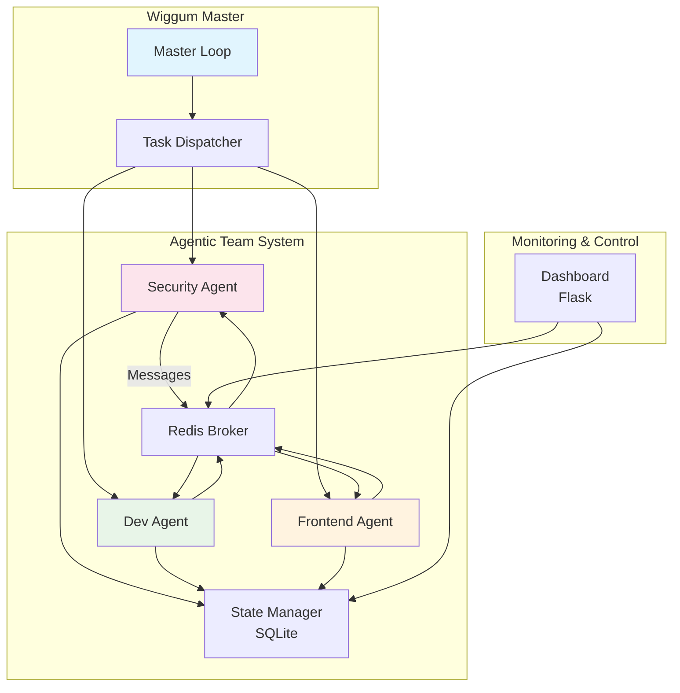
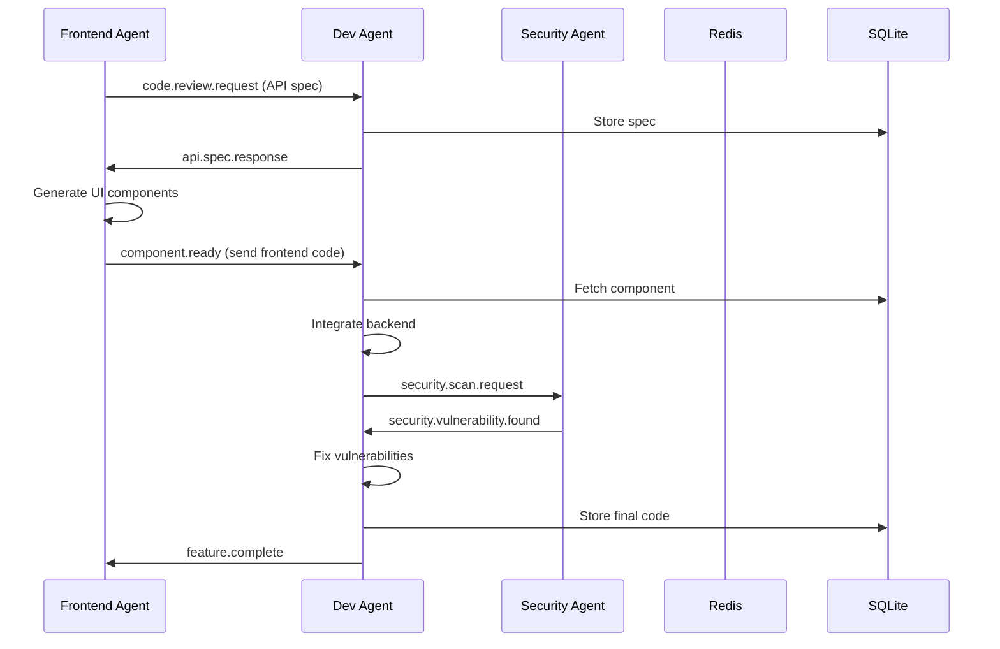

# agentic-team
**Mission:** Use the ideas of the wiggum loop and repeating agents to create and enhance the current structure. We have several workers with specific roles i.e security, sw dev, and frontend, and they all do A2A interaction. Create an outline of this and system plans via mermaid diagrams plan mds and some sample code

## Technology Stack
- **Python 3.12+**: Core runtime with asyncio
- **Redis**: Message broker for A2A communication
- **SQLite**: Shared state and task persistence
- **Flask**: Web dashboard for monitoring
- **OpenCode**: Agent framework integration
- **Pydantic**: Data validation and schemas
- **asyncio**: Concurrent agent execution

## Phase 1: Planning & Architecture Design

- [x] **Task 1.1**: Design system architecture and component diagram
  - **Deliverable**: `docs/architecture.md` with complete system design including:
    - Component diagram (use Mermaid)
    - Data flow between agents
    - Message protocol specification
    - API contracts for A2A communication
  - **Include**:
    ```mermaid
    graph TD
        A[Task Dispatcher] --> B[Security Agent]
        A --> C[SW Dev Agent]
        A --> D[Frontend Agent]
        B --> E[Redis Message Queue]
        C --> E
        D --> E
        E --> B
        E --> C
        E --> D
    ```
  - **Success**: Architecture document reviewed and approved (self-validated by agent)

- [x] **Task 1.2**: Define agent role specifications and protocols
  - **Deliverable**: `src/protocols/agent_specs.py` containing:
    - Pydantic models for AgentMessage, Task, Result
    - Role-specific capability definitions
    - Message schema validation
    - Protocol constants and enumerations
  - **Code snippet requirement**: Implemented with full specification including:
    - AgentRole enum (security, software_developer, frontend_developer)
    - AgentMessage model with validation
    - Task and Result models
    - MessageType enum with all message types
    - SecurityFinding and ApiSpec models
    - ProtocolConstants with capabilities, dependencies, and routing rules
    - Helper functions for channel naming and validation
  - **Success**: All agent specs defined with clear input/output contracts

- [x] **Task 1.3**: Create database schema for shared state
  - **Deliverable**: `src/state/schema.py` and migration script `src/state/migrate.py`
  - **Tables to create**:
    - `tasks` (id, description, role, status, created_at, assigned_to, completed_at)
    - `messages` (id, sender, recipient, content, timestamp, correlation_id)
    - `agent_states` (agent_id, role, current_task_id, health_status, last_heartbeat)
    - `shared_knowledge` (key, value, source_agent, updated_at)
  - **Success**: SQLite database initializes with all tables, migrations run successfully

- [x] **Task 1.4**: Setup project dependencies and environment configuration
  - **Deliverable**: Updated `requirements.txt` with:
    - redis==5.0.1
    - pydantic==2.6.1
    - flask==3.0.1
    - aiohttp==3.9.1 (for async HTTP)
  - **Deliverable**: `.env.example` with Redis and SQLite configuration
  - **Deliverable**: `src/config.py` for centralized configuration
  - **Success**: `pip install -r requirements.txt` completes without errors

## Phase 2: Core Infrastructure & Wiggum Loop Enhancement

- [x] **Task 2.1**: Implement the enhanced wiggum loop with role-based agent selection
  - **Deliverable**: `src/core/wiggum_loop.py` with class `EnhancedWiggumLoop`
  - **Features**:
    - Load TASKS.md and parse tasks by role using tags like `[SECURITY]`, `[SW_DEV]`, `[FRONTEND]`
    - Map tasks to appropriate agents based on role
    - Support round-robin or priority-based task dispatch
    - Track iteration count and agent performance metrics
  - **Code requirement**: Use asyncio for concurrent agent execution
  - **Success**: Loop correctly dispatches tasks to appropriate agent workers

- [x] **Task 2.2**: Build the message broker using Redis pub/sub
  - **Deliverable**: `src/messaging/redis_broker.py` with class `RedisMessageBroker`
  - **Methods to implement**:
    - `connect()` - establish Redis connection
    - `subscribe(channel)` - listen for messages
    - `publish(channel, message)` - send message to topic
    - `create_direct_queue(agent_role)` - dedicated queue per agent type
  - **Deliverable**: Unit tests in `tests/test_redis_broker.py`
  - **Success**: Two agents can exchange messages via Redis pub/sub

- [x] **Task 2.3**: Create agent base class and lifecycle manager
  - **Deliverable**: `src/agents/base_agent.py` with abstract `BaseAgent`
  - **Abstract methods**:
    - `initialize()` - setup agent resources
    - `process_task(task)` - main work method (must override)
    - `send_message(recipient, payload)` - A2A communication
    - `receive_message(message)` - handle incoming A2A messages
    - `health_check()` - return health status
  - **Deliverable**: `src/agents/lifecycle.py` for start/stop/reload controls
  - **Success**: Base agent can be extended with minimal code for new roles

- [x] **Task 2.4**: Implement shared state manager with SQLite
  - **Deliverable**: `src/state/state_manager.py` with class `StateManager`
  - **Features**:
    - `get_next_task(agent_role)` - fetch next unassigned task for role
    - `assign_task(task_id, agent_id)` - lock task to agent
    - `store_message(msg)` - persist A2A messages
    - `update_agent_heartbeat(agent_id)` - track liveness
    - `get_shared_knowledge(key)` / `set_shared_knowledge(key, value)`
  - **Deliverable**: `tests/test_state_manager.py` with mock SQLite
  - **Success**: Multiple agents can safely read/write shared state without conflicts

## Phase 3: Specialized Agent Workers

- [x] **Task 3.1**: Implement Security Agent with vulnerability scanning & code review
  - **Deliverable**: `src/agents/security_agent.py` class `SecurityAgent`
  - **Capabilities**:
    - Scan Python files for security anti-patterns (hardcoded secrets, SQL injection vectors)
    - Review dependencies for known CVEs using `safety` or `pip-audit`
    - Generate security recommendations for code changes
    - Send security alerts to other agents via A2A
  - **Sample code requirement**:
    ```python
    def scan_for_secrets(self, file_path: str) -> List[SecurityFinding]:
        patterns = {
            'AWS_KEY': r'AKIA[0-9A-Z]{16}',
            'GITHUB_TOKEN': r'ghp_[0-9a-zA-Z]{36}',
            'PASSWORD': r'password\s*=\s*["\'][^"\']+["\']',
        }
        # implementation
    ```
  - **Deliverable**: `tests/test_security_agent.py` with mock vulnerabilities
  - **Success**: Agent detects hardcoded API key in test file and sends alert to SW Dev agent

- [x] **Task 3.2**: Implement Software Development Agent for backend code generation
  - **Deliverable**: `src/agents/dev_agent.py` class `SoftwareDevAgent`
  - **Capabilities**:
    - Generate Python code from task specifications using OpenCode
    - Write unit tests using pytest framework
    - Refactor code based on Security Agent feedback
    - Perform code formatting (black) and linting (ruff)
  - **Integration**: Use OpenCode Python library programmatically
  - **Deliverable**: `tests/test_dev_agent.py` with sample task generation
  - **Success**: Agent completes a simple API endpoint task with tests

- [x] **Task 3.3**: Implement Frontend Agent for UI/UX development
  - **Deliverable**: `src/agents/frontend_agent.py` class `FrontendAgent`
  - **Capabilities**:
    - Generate HTML/CSS/JS components from specifications
    - Ensure responsive design and accessibility (WCAG)
    - Integrate frontend with backend APIs
    - Create component libraries and style guides
  - **Tech**: Use Tailwind CSS (via CDN) for rapid prototyping
  - **Deliverable**: `tests/test_frontend_agent.py` with component generation tests
  - **Success**: Agent creates a responsive web component that connects to dev agent's API

- [x] **Task 3.4**: Build agent worker orchestration with health monitoring
  - **Deliverable**: `src/orchestrator/worker_manager.py` with class `WorkerManager`
  - **Features**:
    - Spawn 3 agent workers (security, dev, frontend) as async tasks
    - Monitor agent heartbeats every 30 seconds
    - Restart crashed agents automatically
    - Report agent status to web dashboard
  - **Deliverable**: `src/orchestrator/main.py` - entry point to start all workers
  - **Deliverable**: Systemd service file `etc/wiggum-agentic-team.service` (optional)
  - **Success**: All 3 agents running concurrently, health checks passing

## Phase 4: A2A Communication & Integration Testing

- [ ] **Task 4.1**: Implement A2A message routing and handling
  - **Deliverable**: `src/messaging/router.py` with class `MessageRouter`
  - **Features**:
    - Route incoming messages to correct agent based on recipient
    - Support broadcast messages to all agents
    - Message queuing for offline agents
    - Correlate request/response using `correlation_id`
  - **Deliverable**: `src/messaging/protocol.py` with message handlers registry
  - **Example protocol**:
    ```python
    class MessageProtocol:
        SECURITY_ALERT = "security.alert"
        CODE_REVIEW_REQUEST = "code.review.request"
        API_CONTRACT_UPDATE = "api.contract.update"
        COMPONENT_READY = "component.ready"
    ```
  - **Success**: Frontend agent sends API spec to Dev agent, Dev agent responds with implementation

- [ ] **Task 4.2**: Build collaborative workflow: end-to-end feature development
  - **Deliverable**: `docs/workflow_example.md` documenting the full A2A flow
  - **Workflow steps**:
    1. Task: "Build user login feature" (from TASKS.md)
    2. Dispatcher assigns to Frontend Agent
    3. Frontend requests API spec from Dev Agent via message
    4. Dev Agent designs API, sends spec back
    5. Frontend builds UI components, sends to Dev for integration
    6. Dev implements backend, sends to Security for review
    7. Security scans, reports vulnerabilities
    8. Dev fixes issues, marks task complete
  - **Deliverable**: Integration test `tests/test_collaborative_workflow.py` simulating full flow
  - **Success**: Complete workflow executes with 3 agents collaborating autonomously

- [ ] **Task 4.3**: Create web dashboard for monitoring agent activity
  - **Deliverable**: `src/dashboard/app.py` Flask application
  - **Endpoints**:
    - `GET /` - Dashboard overview with agent status, message throughput
    - `GET /api/agents` - List all agents with health status
    - `GET /api/tasks` - Task queue by role
    - `GET /api/messages?limit=50` - Recent A2A messages
    - `GET /api/metrics` - System metrics (messages/sec, tasks completed)
  - **Deliverable**: `templates/dashboard.html` with real-time updates (use SSE or polling)
  - **Mermaid diagram requirement**: Include live system topology in dashboard
  - **Success**: Dashboard shows real-time agent states and message flow

- [ ] **Task 4.4**: Write comprehensive documentation and finalize TASKS.md
  - **Deliverable**: `docs/DESIGN.md` with detailed system design decisions
  - **Deliverable**: `docs/A2A_PROTOCOL.md` with message format specification
  - **Deliverable**: `docs/DEPLOYMENT.md` with setup instructions, Redis/SQLite config
  - **Deliverable**: `docs/EXAMPLE_USAGE.md` with sample task flows and expected outputs
  - **Update**: `README.md` with project overview, quick start, and architecture diagram
  - **Finalize**: Mark this TASKS.md with `[x] MISSION ACCOMPLISHED` after all deliverables exist
  - **Success**: New developer can understand system and deploy with docs alone

## Sample Task with Role Tag (How to use in TASKS.md)

```markdown
- [ ] [SECURITY] Implement OWASP Top 10 checklist validation
- [ ] [SW_DEV] Create authentication API endpoint with JWT
- [ ] [FRONTEND] Build responsive login form component
- [ ] [SECURITY] Add rate limiting to login endpoint
```

Each agent will only see and execute tasks matching its role, enabling true role-based concurrent development.

## Mermaid System Diagrams

### Complete System Architecture


### A2A Message Flow


## Success Criteria

After completing all tasks in this TASKS.md:
- ✅ 3 specialized agents (security, sw dev, frontend) running concurrently
- ✅ Wiggum loop enhanced with role-based task dispatch
- ✅ A2A communication working via Redis pub/sub
- ✅ Shared state persisted in SQLite with conflict-free access
- ✅ Web dashboard showing real-time agent activity
- ✅ Complete integration test demonstrating collaborative workflow
- ✅ Comprehensive documentation (architecture, protocol, deployment)
- ✅ All code tested, formatted, and ready for production
