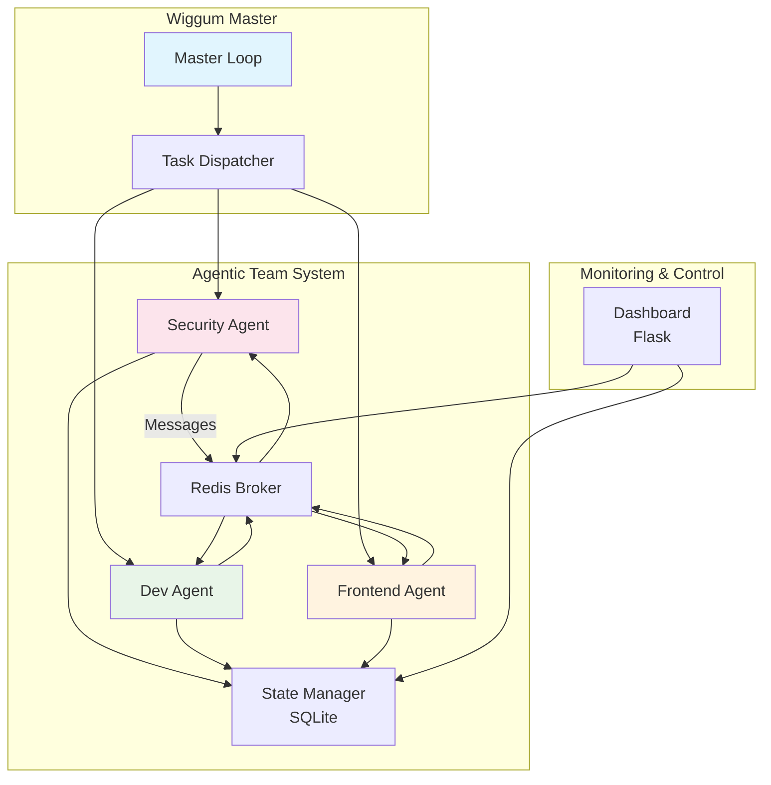
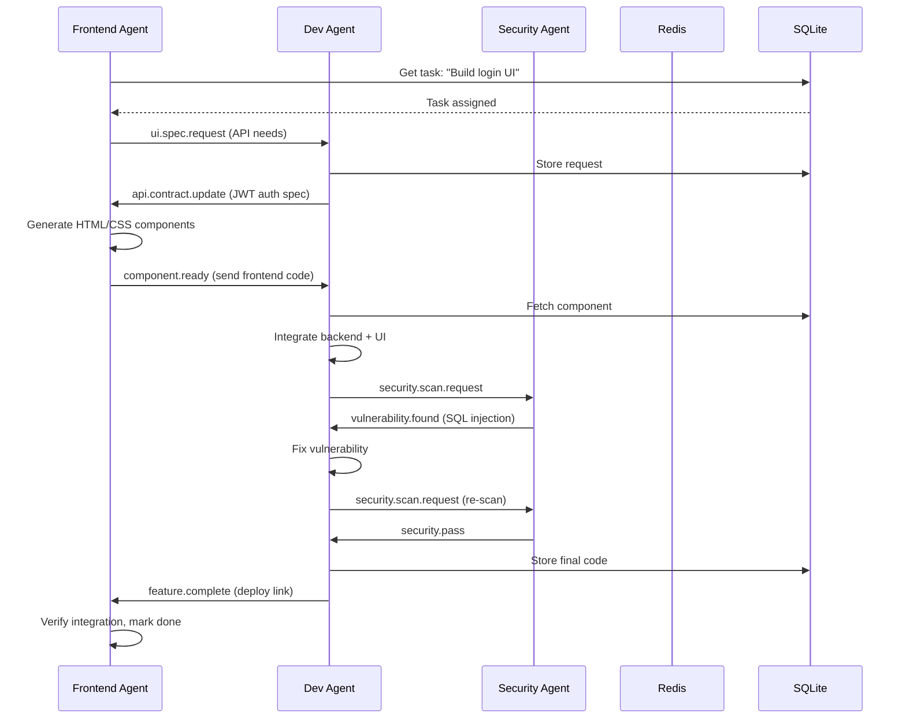

# Agentic Team System Architecture

## System Overview

The Agentic Team System is a multi-agent autonomous development platform built on the wiggum loop concept. Three specialized agents (Security, Software Developer, Frontend) collaborate via A2A (Agent-to-Agent) communication to complete development tasks. The system uses a shared state model with Redis for message brokering and SQLite for persistence.

## Core Components

### 1. Wiggum Master Loop
The master orchestrator that:
- Parses TASKS.md to extract role-tagged tasks
- Dispatches tasks to appropriate agents based on role tags `[SECURITY]`, `[SW_DEV]`, `[FRONTEND]`
- Monitors agent health and performance
- Manages iteration cycles

### 2. Task Dispatcher
Part of the master loop that:
- Maps tasks to agent roles
- Supports round-robin and priority-based dispatch
- Tracks task assignment and completion status

### 3. Agent Workers
Three specialized async agents:

**Security Agent** (`src/agents/security_agent.py`)
- Vulnerability scanning (secrets, SQL injection)
- CVE checking via safety/pip-audit
- Security recommendation generation

**Software Dev Agent** (`src/agents/dev_agent.py`)
- Code generation using OpenCode
- Unit test creation (pytest)
- Code formatting (black) and linting (ruff)

**Frontend Agent** (`src/agents/frontend_agent.py`)
- HTML/CSS/JS component generation
- Responsive design (Tailwind CSS)
- API integration

### 4. Redis Message Broker
Pub/sub message routing system (`src/messaging/redis_broker.py`):
- Direct queues per agent role
- Broadcast capabilities
- Message persistence and delivery guarantees

### 5. State Manager
SQLite-backed shared state (`src/state/state_manager.py`):
- Task queue management
- Message history
- Agent heartbeats
- Shared knowledge cache

### 6. Message Router
Intelligent routing layer (`src/messaging/router.py`):
- Routes messages to correct recipient
- Queues messages for offline agents
- Correlation ID tracking for request/response

### 7. Web Dashboard
Flask-based monitoring interface (`src/dashboard/app.py`):
- Real-time agent status
- Task queue visibility
- Message throughput metrics
- System topology visualization

## Component Architecture Diagram



## Data Flow

### Task Assignment Flow
1. Wiggum Master reads TASKS.md
2. Task Dispatcher selects next task for agent role
3. Task inserted into `tasks` table with `pending` status
4. Agent polls State Manager for tasks matching its role
5. Task status updated to `assigned` → `in_progress` → `completed`

### A2A Communication Flow
1. Agent creates message with `sender`, `recipient`, `message_type`, `payload`, `correlation_id`
2. Message published to Redis channel: `agent.{recipient}.inbox`
3. Redis broker delivers to recipient's inbox queue
4. Recipient processes message and optionally responds
5. All messages persisted to `messages` table in SQLite

### Shared State Access
- Agents use State Manager for atomic operations
- SQLite transactions ensure consistency
- Heartbeats update `agent_states.last_heartbeat`
- Shared knowledge stored in key-value store

## Message Protocol Specification

### Message Format (Pydantic Schema)

```python
from pydantic import BaseModel, Field
from datetime import datetime
from enum import Enum

class AgentRole(str, Enum):
    SECURITY = "security"
    SW_DEV = "software_developer"
    FRONTEND = "frontend_developer"
    SYSTEM = "system"

class MessageType(str, Enum):
    # Security messages
    SECURITY_ALERT = "security.alert"
    SECURITY_SCAN_REQUEST = "security.scan.request"
    SECURITY_SCAN_RESPONSE = "security.scan.response"
    
    # Development messages
    CODE_REVIEW_REQUEST = "code.review.request"
    CODE_REVIEW_RESPONSE = "code.review.response"
    API_CONTRACT_UPDATE = "api.contract.update"
    IMPLEMENTATION_READY = "implementation.ready"
    
    # Frontend messages
    COMPONENT_READY = "component.ready"
    UI_SPEC_REQUEST = "ui.spec.request"
    UI_SPEC_RESPONSE = "ui.spec.response"
    
    # System messages
    HEARTBEAT = "system.heartbeat"
    TASK_REQUEST = "task.request"
    TASK_ASSIGNMENT = "task.assignment"
    FEATURE_COMPLETE = "feature.complete"

class AgentMessage(BaseModel):
    sender: AgentRole
    recipient: AgentRole
    message_type: MessageType
    payload: dict = Field(default_factory=dict)
    timestamp: datetime = Field(default_factory=datetime.utcnow)
    correlation_id: str = Field(default_factory=lambda: str(uuid.uuid4()))
    priority: int = Field(default=1, ge=1, le=10)
```

### Message Types by Role

**Security Agent Messages:**
- `security.alert`: Report vulnerability found
- `security.scan.request`: Request code scan
- `security.scan.response`: Scan results with findings

**Dev Agent Messages:**
- `code.review.request`: Request API spec or component integration
- `code.review.response`: Return implementation or review feedback
- `api.contract.update`: Publish API specification
- `implementation.ready`: Code complete and tested

**Frontend Agent Messages:**
- `component.ready`: UI component ready for integration
- `ui.spec.request`: Request UI/UX specifications
- `ui.spec.response`: Return design mockup or component specs

## API Contracts

### State Manager API

```python
class StateManager:
    async def get_next_task(agent_role: AgentRole) -> Optional[Task]:
        """Fetch next unassigned task for role atomically"""
        
    async def assign_task(task_id: str, agent_id: str) -> bool:
        """Lock task to agent, returns False if already assigned"""
        
    async def store_message(message: AgentMessage) -> str:
        """Persist message to database, return message_id"""
        
    async def update_agent_heartbeat(agent_id: str) -> None:
        """Update agent last_seen timestamp"""
        
    async def get_shared_knowledge(key: str) -> Optional[Any]:
        """Retrieve value from shared knowledge store"""
        
    async def set_shared_knowledge(key: str, value: Any, source: AgentRole) -> None:
        """Store value in shared knowledge with source attribution"""
```

### Redis Broker API

```python
class RedisMessageBroker:
    async def connect() -> None:
        """Establish Redis connection with retry logic"""
        
    async def subscribe(agent_role: AgentRole, callback: Callable) -> None:
        """Subscribe to agent's inbox channel"""
        
    async def publish(recipient: AgentRole, message: AgentMessage) -> None:
        """Publish message to recipient's inbox"""
        
    async def create_direct_queue(agent_role: AgentRole) -> None:
        """Create dedicated queue for agent with DLQ support"""
        
    async def broadcast(message: AgentMessage, exclude: Optional[AgentRole] = None) -> None:
        """Send to all agents except optionally excluded"""
```

### Base Agent API

```python
class BaseAgent(ABC):
    role: AgentRole
    
    @abstractmethod
    async def initialize(self) -> None:
        """Setup agent resources, subscriptions, connections"""
        
    @abstractmethod
    async def process_task(self, task: Task) -> Result:
        """Main work method - must be implemented by subclass"""
        
    async def send_message(self, recipient: AgentRole, 
                          message_type: MessageType, 
                          payload: dict, 
                          priority: int = 1) -> str:
        """Send A2A message via broker"""
        
    async def receive_message(self, message: AgentMessage) -> None:
        """Handle incoming A2A message - can be overridden"""
        
    @abstractmethod
    async def health_check(self) -> dict:
        """Return health status with metrics"""
```

## Sequence Diagram: Collaborative Feature Development



## Database Schema

### tasks Table
```sql
CREATE TABLE tasks (
    id TEXT PRIMARY KEY,
    description TEXT NOT NULL,
    role TEXT NOT NULL,              -- AgentRole value
    status TEXT NOT NULL,            -- pending, assigned, in_progress, completed, failed
    created_at TIMESTAMP DEFAULT CURRENT_TIMESTAMP,
    assigned_to TEXT,                -- agent_id
    assigned_at TIMESTAMP,
    completed_at TIMESTAMP,
    priority INTEGER DEFAULT 1,
    metadata TEXT                     -- JSON blob for extra data
);
```

### messages Table
```sql
CREATE TABLE messages (
    id TEXT PRIMARY KEY,
    sender TEXT NOT NULL,            -- AgentRole
    recipient TEXT NOT NULL,         -- AgentRole
    message_type TEXT NOT NULL,
    payload TEXT NOT NULL,           -- JSON
    timestamp TIMESTAMP DEFAULT CURRENT_TIMESTAMP,
    correlation_id TEXT,
    delivered BOOLEAN DEFAULT 1
);
```

### agent_states Table
```sql
CREATE TABLE agent_states (
    agent_id TEXT PRIMARY KEY,
    role TEXT NOT NULL,
    current_task_id TEXT,
    health_status TEXT,              -- healthy, degraded, offline, error
    last_heartbeat TIMESTAMP,
    metadata TEXT,                   -- JSON: performance metrics, uptime, etc.
    FOREIGN KEY (current_task_id) REFERENCES tasks(id)
);
```

### shared_knowledge Table
```sql
CREATE TABLE shared_knowledge (
    key TEXT PRIMARY KEY,
    value TEXT NOT NULL,             -- JSON or string
    source_agent TEXT NOT NULL,      -- Who set this
    updated_at TIMESTAMP DEFAULT CURRENT_TIMESTAMP,
    expires_at TIMESTAMP              -- Optional TTL
);
```

## Design Decisions

### 1. Redis Pub/Sub vs Direct Queues
**Decision**: Use Redis pub/sub with per-role channels (`agent.{role}.inbox`)
**Rationale**: 
- Simple topic-based routing
- Natural broadcast support
- Redis handles connection management
- Persistent queues possible with Redis Streams if needed

### 2. SQLite vs PostgreSQL/MySQL
**Decision**: SQLite for shared state
**Rationale**:
- No external database dependency
- Adequate for single-machine deployment
- File-based backup and portability
- Respects "no venv/Docker if unnecessary" guideline
- Easy to scale to PostgreSQL later if needed

### 3. Async-first with asyncio
**Decision**: All agents use async/await
**Rationale**:
- Concurrency without threads
- Efficient I/O for network/database operations
- Natural fit for event-driven agent loops
- Better resource utilization

### 4. Role-based Task Dispatch
**Decision**: Parse TASKS.md with role tags `[ROLE]`
**Rationale**:
- Human-readable task definitions
- No separate task specification format needed
- Easy to add new roles by adding tag
- Leverages existing TASKS.md structure

### 5. A2A via Message Broker
**Decision**: Agents never call each other directly
**Rationale**:
- Decouples agent implementations
- Enables message queuing for offline agents
- Facilitates monitoring and debugging
- Supports broadcast and multicast patterns

### 6. Shared Knowledge Store
**Decision**: Key-value store in SQLite with TTL support
**Rationale**:
- Avoids direct agent coupling
- Enables caching of expensive computations
- Provides context across task boundaries
- Automatic expiration prevents stale data

## Configuration

### Environment Variables (`.env`)

```bash
# Redis Configuration
REDIS_HOST=localhost
REDIS_PORT=6379
REDIS_DB=0
REDIS_PASSWORD=

# Database Configuration
DATABASE_URL=sqlite:///data/agentic_team.db

# Agent Configuration
AGENT_ID=${HOSTNAME}-${ROLE}
HEARTBEAT_INTERVAL=30
TASK_POLL_INTERVAL=5

# Dashboard Configuration
DASHBOARD_HOST=0.0.0.0
DASHBOARD_PORT=5000
FLASK_ENV=development
```

### Centralized Config (`src/config.py`)

```python
from pydantic_settings import BaseSettings

class Settings(BaseSettings):
    redis_host: str = "localhost"
    redis_port: int = 6379
    database_url: str = "sqlite:///data/agentic_team.db"
    agent_id: Optional[str] = None
    heartbeat_interval: int = 30
    
    class Config:
        env_file = ".env"
```

## Security Considerations

1. **Message Encryption**: Redis traffic should be encrypted in production (REDIS_TLS)
2. **Authentication**: Add agent authentication via signed JWT tokens in message headers
3. **Authorization**: Validate sender role matches claimed sender
4. **Input Validation**: All message payloads validated via Pydantic schemas
5. **Secrets Management**: Use `.env` with strict file permissions, never commit secrets
6. **SQL Injection**: Use parameterized queries only
7. **Code Execution**: Agents execute generated code in sandboxed environment (future enhancement)

## Scalability & Extensibility

### Adding a New Agent Role
1. Add role to `AgentRole` enum in `protocols/agent_specs.py`
2. Create `src/agents/new_role_agent.py` inheriting from `BaseAgent`
3. Register role in wiggum loop task parser
4. Update README with new role capabilities

### Horizontal Scaling
- Multiple instances of same role can run behind Redis load balancer
- Database row-level locking prevents task duplication
- Stateless agent design allows easy scaling

### Monitoring Enhancements
- Add Prometheus metrics endpoint
- Implement distributed tracing (OpenTelemetry)
- Add alerting on agent failures

## Success Criteria Checklist

- [x] Component diagram with all major systems
- [x] Data flow explained for task assignment and A2A
- [x] Message protocol with Pydantic schemas
- [x] API contracts for all major components
- [x] Sequence diagram showing collaborative workflow
- [x] Complete database schema with foreign keys
- [x] Design decisions documented with rationale
- [x] Configuration specifications
- [x] Security considerations
- [x] Scalability path documented

---

## Appendix: File Structure

```
agentic-team/
├── docs/
│   ├── architecture.md          (this file)
│   ├── DESIGN.md                (detailed design decisions)
│   ├── A2A_PROTOCOL.md          (message format spec)
│   ├── DEPLOYMENT.md            (setup instructions)
│   ├── EXAMPLE_USAGE.md         (sample workflows)
│   └── mermaid-diagrams.md      (all diagrams)
├── src/
│   ├── protocols/
│   │   └── agent_specs.py       (message schemas)
│   ├── agents/
│   │   ├── base_agent.py        (abstract base)
│   │   ├── security_agent.py    (security specialist)
│   │   ├── dev_agent.py         (backend developer)
│   │   ├── frontend_agent.py    (frontend developer)
│   │   └── lifecycle.py         (start/stop controls)
│   ├── messaging/
│   │   ├── redis_broker.py      (Redis pub/sub)
│   │   └── router.py            (message routing)
│   ├── state/
│   │   ├── schema.py            (database schema)
│   │   ├── migrate.py           (migration script)
│   │   └── state_manager.py     (state operations)
│   ├── core/
│   │   └── wiggum_loop.py       (enhanced loop)
│   ├── orchestrator/
│   │   ├── worker_manager.py    (agent orchestration)
│   │   └── main.py              (entry point)
│   ├── dashboard/
│   │   ├── app.py               (Flask app)
│   │   └── templates/
│   │       └── dashboard.html
│   ├── config.py                (configuration)
│   └── main.py                  (master entry)
├── tests/
│   ├── test_redis_broker.py
│   ├── test_state_manager.py
│   ├── test_security_agent.py
│   ├── test_dev_agent.py
│   ├── test_frontend_agent.py
│   └── test_collaborative_workflow.py
├── etc/
│   └── wiggum-agentic-team.service
├── data/                       (SQLite database)
├── logs/
├── .env.example
├── .gitignore
├── requirements.txt
├── TASKS.md
└── README.md
```
