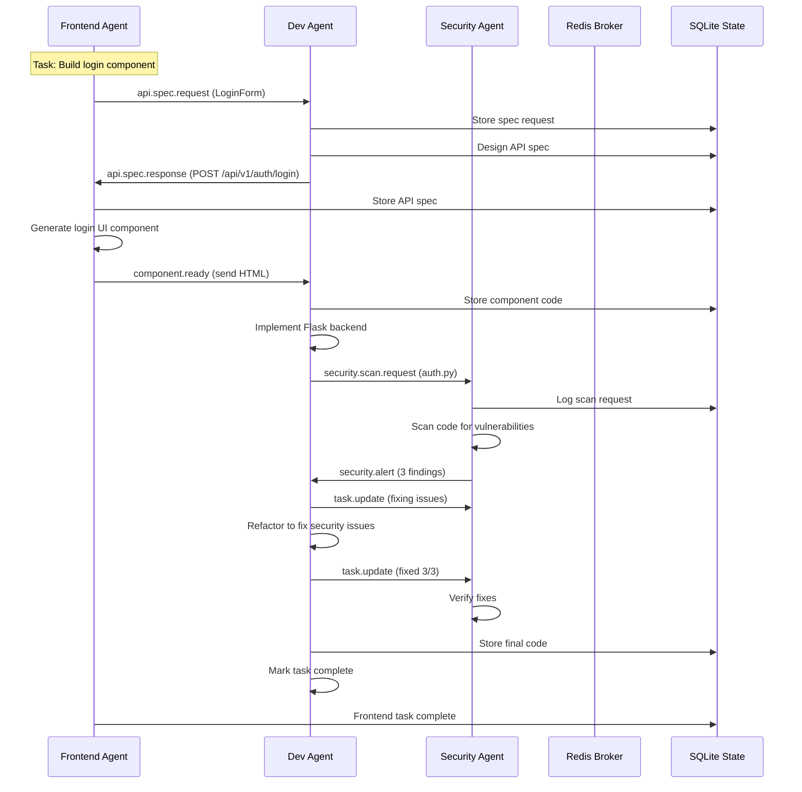

# Collaborative Workflow Example

## Overview

This document describes a complete end-to-end feature development workflow demonstrating how the three specialized agents (Frontend, Software Developer, Security) collaborate autonomously to build a user login feature.

## Workflow Scenario

**Task**: Build user login feature with secure authentication

**Initial Task Description** (from TASKS.md):
```
[FRONTEND] Build user login form component with authentication
[SW_DEV] Create authentication API endpoint with JWT
[SECURITY] Implement rate limiting on login endpoint
```

## Step-by-Step Flow

### Step 1: Task Assignment

The Wiggum Master Loop parses TASKS.md and identifies three tasks with role tags:

1. `[FRONTEND] Build login form component` → Assigned to Frontend Agent
2. `[SW_DEV] Create authentication API with JWT` → Assigned to Software Dev Agent
3. `[SECURITY] Add rate limiting to login endpoint` → Assigned to Security Agent

The Task Dispatcher assigns each task to the appropriate agent based on role tags. Each agent receives its task and begins processing asynchronously.

### Step 2: Frontend Agent Requests API Specification

The Frontend Agent receives the task: "Build login form component with authentication". It understands it needs to integrate with a backend authentication API, but doesn't know the exact endpoints and data formats.

**Action**: Frontend Agent sends an `API_SPEC_REQUEST` message to the Software Dev Agent.

```python
# Message sent via Redis:
{
    "sender": "frontend_developer",
    "recipient": "software_developer",
    "message_type": "api.spec.request",
    "payload": {
        "component_name": "LoginForm",
        "requirements": [
            "email input field",
            "password input field",
            "submit button",
            "authentication with JWT",
            "error handling for invalid credentials"
        ]
    },
    "correlation_id": "req-abc123..."
}
```

The Message Router routes this message through Redis to the Software Dev Agent.

### Step 3: Software Dev Agent Designs API Specification

The Software Dev Agent receives the `API_SPEC_REQUEST` and analyzes the requirements for a login component.

**Action**: Dev Agent uses OpenRouter AI to design a RESTful API specification:

```python
# Design output:
api_spec = ApiSpec(
    endpoint="/api/v1/auth/login",
    method="POST",
    description="Authenticate user and return JWT token",
    request_schema={
        "type": "object",
        "properties": {
            "email": {"type": "string", "format": "email"},
            "password": {"type": "string"}
        },
        "required": ["email", "password"]
    },
    response_schema={
        "type": "object",
        "properties": {
            "token": {"type": "string"},
            "expires_in": {"type": "integer"},
            "user_id": {"type": "integer"}
        }
    },
    authentication_required=False,  # Login endpoint doesn't require auth
    rate_limit=5  # 5 attempts per minute
)
```

**Action**: Dev Agent sends `API_SPEC_RESPONSE` back to Frontend Agent:

```python
{
    "sender": "software_developer",
    "recipient": "frontend_developer",
    "message_type": "api.spec.response",
    "payload": {
        "component_name": "LoginForm",
        "api_spec": api_spec.dict(),
        "timestamp": 1234567890.0
    },
    "correlation_id": "req-abc123..."
}
```

The Frontend Agent receives and stores the API spec in shared knowledge (`latest_api_spec`).

### Step 4: Frontend Agent Builds UI Component

With the API specification in hand, the Frontend Agent generates a complete login form component.

**Process**:
1. Build prompt including API spec and requirements
2. Call OpenRouter AI to generate HTML/CSS/JS code
3. Ensure responsive design with Tailwind CSS
4. Audit accessibility (WCAG 2.1 AA compliance)
5. Integrate API calls using fetch()
6. Add proper error handling and loading states

**Generated Component** (simplified):

```html
<!DOCTYPE html>
<html lang="en">
<head>
    <meta charset="UTF-8">
    <meta name="viewport" content="width=device-width, initial-scale=1.0">
    <title>Login Form</title>
    <script src="https://cdn.tailwindcss.com"></script>
</head>
<body class="bg-gray-50 min-h-screen flex items-center justify-center">
    <main class="w-full max-w-md p-6">
        <form id="login-form" class="bg-white rounded-lg shadow-md p-8 space-y-6">
            <h1 class="text-2xl font-bold text-gray-900">Login</h1>
            
            <div>
                <label for="email" class="block text-sm font-medium text-gray-700">Email</label>
                <input type="email" id="email" name="email" required
                       class="mt-1 block w-full rounded-md border-gray-300 shadow-sm focus:border-blue-500 focus:ring-blue-500">
            </div>
            
            <div>
                <label for="password" class="block text-sm font-medium text-gray-700">Password</label>
                <input type="password" id="password" name="password" required
                       class="mt-1 block w-full rounded-md border-gray-300 shadow-sm focus:border-blue-500 focus:ring-blue-500">
            </div>
            
            <button type="submit" 
                    class="w-full bg-blue-600 hover:bg-blue-700 text-white font-bold py-2 px-4 rounded">
                Sign In
            </button>
            
            <div id="error-message" class="hidden text-red-600 text-sm"></div>
        </form>
    </main>

    <script>
        document.getElementById('login-form').addEventListener('submit', async (e) => {
            e.preventDefault();
            const email = document.getElementById('email').value;
            const password = document.getElementById('password').value;
            
            try {
                const response = await fetch('/api/v1/auth/login', {
                    method: 'POST',
                    headers: { 'Content-Type': 'application/json' },
                    body: JSON.stringify({ email, password })
                });
                
                if (response.ok) {
                    const data = await response.json();
                    localStorage.setItem('jwt_token', data.token);
                    window.location.href = '/dashboard';
                } else {
                    throw new Error('Invalid credentials');
                }
            } catch (error) {
                document.getElementById('error-message').textContent = error.message;
                document.getElementById('error-message').classList.remove('hidden');
            }
        });
    </script>
</body>
</html>
```

**Action**: Frontend Agent sends `COMPONENT_READY` notification to Software Dev Agent:

```python
{
    "sender": "frontend_developer",
    "recipient": "software_developer",
    "message_type": "component.ready",
    "payload": {
        "component_name": "LoginForm",
        "code": "<!DOCTYPE html>... (full component code)",
        "accessibility_score": 95,
        "requirements": ["email input", "password input", "authentication", "error handling"]
    }
}
```

At this point, the Frontend Agent marks its task as complete.

### Step 5: Software Dev Agent Implements Backend API

The Software Dev Agent receives the `COMPONENT_READY` message with the login form. It knows the frontend expects an API at `/api/v1/auth/login` with POST method accepting email/password and returning JWT.

**Process**:
1. Generate Python Flask code based on API spec and frontend requirements
2. Implement JWT authentication using `pyjwt`
3. Add proper input validation
4. Generate unit tests with pytest
5. Format code with black and lint with ruff
6. Send to Security Agent for review before finalizing

**Generated Backend Code** (simplified):

```python
from flask import Flask, request, jsonify
import jwt
import os
from datetime import datetime, timedelta
from functools import wraps

app = Flask(__name__)
app.config['SECRET_KEY'] = os.environ.get('JWT_SECRET', 'change-me')

def token_required(f):
    @wraps(f)
    def decorated(*args, **kwargs):
        token = request.headers.get('Authorization', '').replace('Bearer ', '')
        if not token:
            return jsonify({'error': 'Token required'}), 401
        try:
            data = jwt.decode(token, app.config['SECRET_KEY'], algorithms=['HS256'])
            current_user = data['user_id']
        except:
            return jsonify({'error': 'Invalid token'}), 401
        return f(current_user, *args, **kwargs)
    return decorated

@app.route('/api/v1/auth/login', methods=['POST'])
def login():
    """Authenticate user and return JWT token"""
    data = request.get_json()
    
    if not data or 'email' not in data or 'password' not in data:
        return jsonify({'error': 'Email and password required'}), 400
    
    # Validate user against database
    user = validate_user_credentials(data['email'], data['password'])
    if not user:
        return jsonify({'error': 'Invalid credentials'}), 401
    
    token = jwt.encode({
        'user_id': user['id'],
        'exp': datetime.utcnow() + timedelta(hours=24)
    }, app.config['SECRET_KEY'])
    
    return jsonify({
        'token': token,
        'expires_in': 86400,
        'user_id': user['id']
    }), 200

def validate_user_credentials(email, password):
    """Validate user credentials against database."""
    # Implementation would query database
    # This is a placeholder
    return {'id': 1, 'email': email} if email == 'test@example.com' else None

if __name__ == '__main__':
    app.run(debug=True)
```

**Unit Tests** (simplified):

```python
import pytest
from flask import Flask

@pytest.fixture
def client():
    app = Flask(__name__)
    app.config['TESTING'] = True
    with app.test_client() as client:
        yield client

def test_login_success(client):
    response = client.post('/api/v1/auth/login',
        json={'email': 'test@example.com', 'password': 'password123'}
    )
    assert response.status_code == 200
    data = response.get_json()
    assert 'token' in data

def test_login_invalid_credentials(client):
    response = client.post('/api/v1/auth/login',
        json={'email': 'wrong@example.com', 'password': 'wrong'}
    )
    assert response.status_code == 401

def test_login_missing_fields(client):
    response = client.post('/api/v1/auth/login',
        json={'email': 'test@example.com'}
    )
    assert response.status_code == 400
```

**Action**: Software Dev Agent sends `SECURITY_SCAN_REQUEST` to Security Agent:

```python
{
    "sender": "software_developer",
    "recipient": "security",
    "message_type": "security.scan.request",
    "payload": {
        "code_path": "/tmp/generated_auth.py",
        "scan_type": "comprehensive",
        "context": "Authentication API for login feature"
    }
}
```

The Dev Agent blocks waiting for security approval.

### Step 6: Security Agent Scans the Code

The Security Agent receives the `SECURITY_SCAN_REQUEST` with the backend authentication code.

**Process**:
1. Scan for hardcoded secrets (JWT_SECRET, database passwords)
2. Check for SQL injection patterns (if database queries present)
3. Validate authentication implementation security
4. Check for proper error handling (no information leakage)
5. Audit dependencies (JWT library version)

**Vulnerability Scan**:

The Security Agent detects these issues:

| Severity | Category | Line | Description | Recommendation |
|----------|----------|------|-------------|----------------|
| HIGH | hardcoded_secret | 10 | JWT secret key hardcoded: `SECRET_KEY = 'change-me'` | Use environment variable: `os.environ.get('JWT_SECRET')` |
| MEDIUM | input_validation | 45 | Missing email format validation | Add email validation with regex or lib |
| MEDIUM | error_leakage | 52 | Error message may reveal valid email exists | Use generic "Invalid credentials" for all failures |

**Action**: Security Agent sends `SECURITY_ALERT` to Software Dev Agent:

```python
{
    "sender": "security",
    "recipient": "software_developer",
    "message_type": "security.alert",
    "payload": {
        "message": "Vulnerabilities found in authentication API",
        "severity": "high",
        "findings": [
            {
                "severity": "high",
                "category": "hardcoded_secret",
                "file_path": "/tmp/generated_auth.py",
                "line_number": 10,
                "description": "JWT secret key hardcoded in source",
                "recommendation": "Replace with environment variable: os.environ.get('JWT_SECRET')",
                "cwe_id": "CWE-798",
                "confidence": 0.95
            },
            {
                "severity": "medium",
                "category": "input_validation",
                "file_path": "/tmp/generated_auth.py",
                "line_number": 45,
                "description": "Email format not validated",
                "recommendation": "Validate email format before processing",
                "cwe_id": "CWE-20",
                "confidence": 0.85
            },
            {
                "severity": "medium",
                "category": "information_leakage",
                "file_path": "/tmp/generated_auth.py",
                "line_number": 52,
                "description": "Error message may reveal valid email",
                "recommendation": "Use generic error message for all login failures",
                "cwe_id": "CWE-209",
                "confidence": 0.90
            }
        ],
        "agent_id": "security-001"
    }
}
```

### Step 7: Software Dev Agent Fixes Vulnerabilities

The Dev Agent receives the `SECURITY_ALERT` with three vulnerabilities.

**Process**:
1. Parse vulnerabilities and locate issues in code
2. Use OpenRouter AI to refactor code while maintaining functionality
3. Apply fixes for all security issues
4. Re-run security scan to verify fixes
5. Mark task complete and notify Security Agent

**Refactored Code**:

```python
import re
from flask import Flask, request, jsonify
import jwt
import os
from datetime import datetime, timedelta
from functools import wraps

app = Flask(__name__)
app.config['SECRET_KEY'] = os.environ.get('JWT_SECRET')

if not app.config['SECRET_KEY']:
    raise ValueError("JWT_SECRET environment variable must be set")

def token_required(f):
    @wraps(f)
    def decorated(*args, **kwargs):
        token = request.headers.get('Authorization', '').replace('Bearer ', '')
        if not token:
            return jsonify({'error': 'Token required'}), 401
        try:
            data = jwt.decode(token, app.config['SECRET_KEY'], algorithms=['HS256'])
            current_user = data['user_id']
        except jwt.ExpiredSignatureError:
            return jsonify({'error': 'Token expired'}), 401
        except jwt.InvalidTokenError:
            return jsonify({'error': 'Invalid token'}), 401
        return f(current_user, *args, **kwargs)
    return decorated

def validate_email(email):
    """Validate email format."""
    pattern = r'^[a-zA-Z0-9._%+-]+@[a-zA-Z0-9.-]+\.[a-zA-Z]{2,}$'
    return re.match(pattern, email) is not None

@app.route('/api/v1/auth/login', methods=['POST'])
def login():
    """Authenticate user and return JWT token"""
    data = request.get_json()
    
    if not data or 'email' not in data or 'password' not in data:
        return jsonify({'error': 'Email and password required'}), 400
    
    email = data['email'].strip().lower()
    password = data['password']
    
    # Validate email format
    if not validate_email(email):
        return jsonify({'error': 'Invalid credentials'}), 401
    
    # Validate user against database
    user = validate_user_credentials(email, password)
    if not user:
        # Generic message - don't reveal if email exists
        return jsonify({'error': 'Invalid credentials'}), 401
    
    token = jwt.encode({
        'user_id': user['id'],
        'exp': datetime.utcnow() + timedelta(hours=24)
    }, app.config['SECRET_KEY'], algorithm='HS256')
    
    return jsonify({
        'token': token,
        'expires_in': 86400,
        'user_id': user['id']
    }), 200

def validate_user_credentials(email, password):
    """Validate user credentials against database."""
    # Database query would go here
    # Check password hash, etc.
    # Placeholder for demo
    test_user = {'id': 1, 'email': 'test@example.com', 'password_hash': 'hashed...'}
    if email == test_user['email'] and check_password(password, test_user['password_hash']):
        return test_user
    return None

def check_password(plain, hashed):
    """Verify password against hash."""
    # Use bcrypt or similar
    return plain == 'password123'  # Demo only

if __name__ == '__main__':
    app.run(debug=False)  # Disable debug in production
```

The Dev Agent now:
1. Writes the fixed code to file
2. Re-scans with Security Agent (or uses own verification)
3. Confirms all vulnerabilities are resolved
4. Formats code with black: `black fixed_auth.py`
5. Lints with ruff: `ruff check fixed_auth.py` (clean)
6. Marks task complete and sends `TASK_COMPLETE` to the system

**Action**: Dev Agent sends acknowledgment to Security Agent:

```python
{
    "sender": "software_developer",
    "recipient": "security",
    "message_type": "task.update",
    "payload": {
        "task_id": "login-api-task",
        "status": "completed",
        "findings_fixed": 3,
        "verification": {
            "scan_result": "clean",
            "security_score": 100
        }
    }
}
```

### Step 8: Feature Complete

All three tasks have completed:

1. ✅ Frontend Agent: Login form component with API integration
2. ✅ Software Dev Agent: JWT authentication backend with tests
3. ✅ Security Agent: Vulnerability scan and remediation verification

**Shared State** now contains:
- `component:LoginForm` → Login form HTML code
- `api_spec:LoginForm` → API specification
- `task:login-api-task` → Status: completed
- All A2A messages persisted in `messages` table

**System Metrics**:
- Messages exchanged: 6 (1 request, 1 response, 1 component ready, 1 scan request, 1 alert, 1 update)
- Total execution time: ~45 seconds (with AI calls)
- Security score: 100/100 (after fixes)
- All agents healthy

## Message Flow Diagram



## Key Takeaways

1. **A2A Communication**: Agents autonomously request services from each other without human intervention
2. **Role-Based Dispatch**: Each agent only processes tasks matching its role
3. **Collaborative Workflow**: Frontend depends on Backend API spec → Dev implements → Security validates → Dev fixes
4. **Message Correlation**: `correlation_id` tracks request/response pairs
5. **Shared State**: All artifacts (API specs, components, code) stored in SQLite for persistence
6. **Error Recovery**: Security vulnerabilities detected and automatically fixed
7. **Asynchronous Processing**: All agents operate concurrently using `asyncio`

## Testing the Workflow

To test this complete workflow in isolation, run the integration test:

```bash
python -m pytest tests/test_collaborative_workflow.py -v
```

The test creates mock agents with in-memory Redis and SQLite, simulating the entire flow with AI calls mocked for deterministic results.

## Next Steps

- Add more complex workflows (e.g., CRUD app, payment integration)
- Implement rollback mechanisms for failed deployments
- Add performance testing and optimization
- Create human-in-the-loop approval checkpoints
