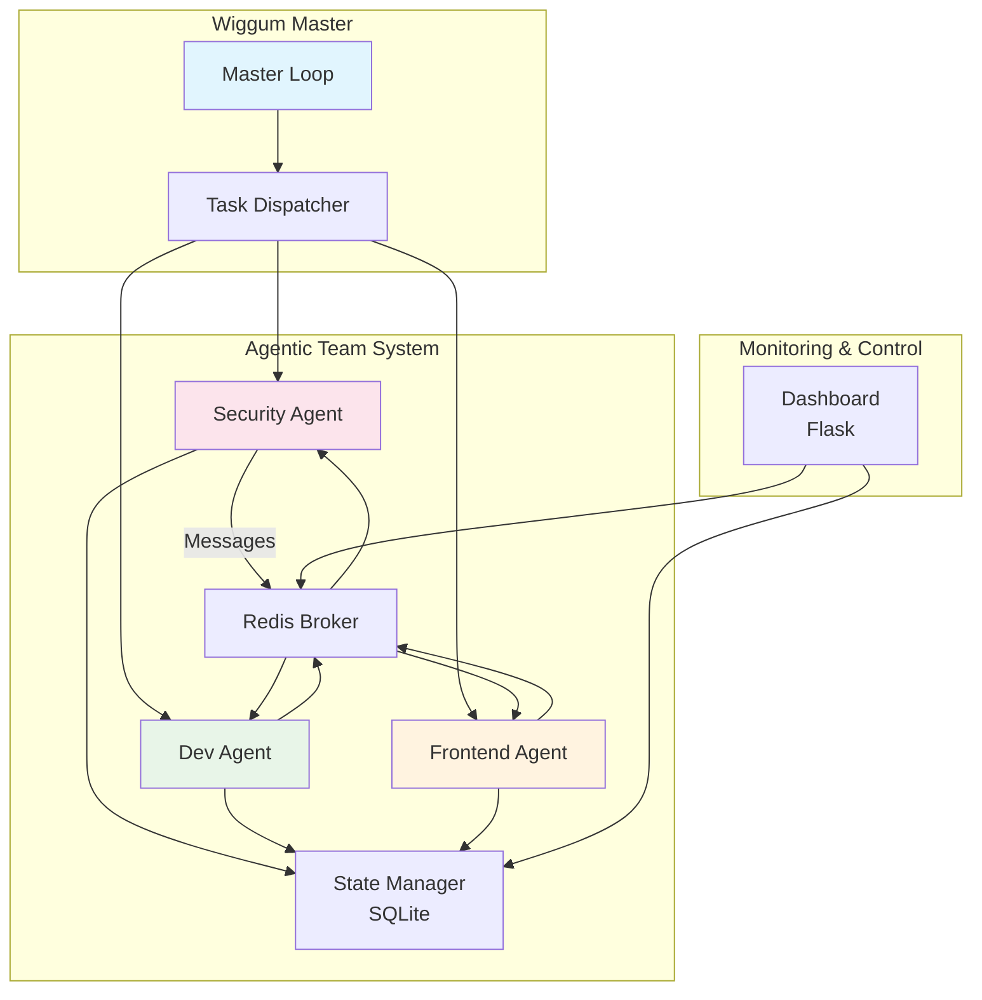
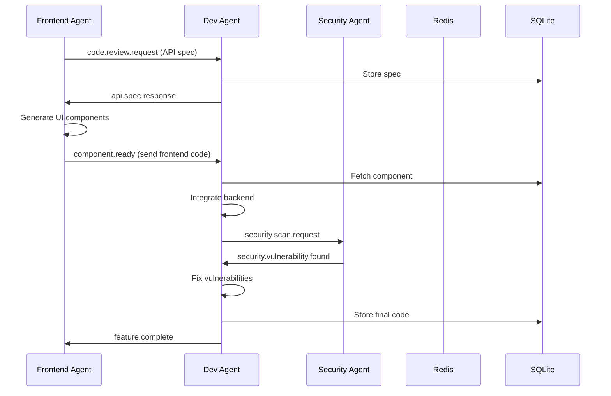

# Iteration 15 - agentic-team

**Timestamp:** Fri Mar 13 04:54:11 PM EDT 2026
**Task:** **Task 2.4**: Implement shared state manager with SQLite

## Prompt Sent

```
# Project-Specific Agent Instructions

You are an autonomous developer working on this specific project.

## Your Role

- Read TASKS.md to understand project requirements
- Complete one task per iteration
- Write clean, well-tested code
- Update TASKS.md with progress
- Commit changes to GitHub (git push)
- Work without asking for permission

## Key Points

1. **No Virtual Environments**: Use the host system's Python, Node.js, etc.
   - Only create venv/Docker if absolutely necessary (document why)

2. **Testing**: Write tests as you build
   - Unit tests for functions
   - Integration tests for features

3. **Documentation**: Every feature should have clear documentation
   - Comments in code
   - README updates
   - Usage examples

4. **Git Workflow**:
   ```bash
   git add .
   git commit -m "Feature: [description]"
   git push origin main
   ```

5. **Task Completion**:
   - Mark complete in TASKS.md with [x]
   - Only mark when fully working and tested
   - If blocked, document the issue and move to next task

## Success Criteria

- ✅ All TASKS.md items marked [x]
- ✅ Code is tested and documented
- ✅ Project runs locally without venv
- ✅ All commits pushed to GitHub
- ✅ README explains how to run the project

Now read TASKS.md and get started!

---

### ⚠️ CRITICAL TOKEN CONSTRAINTS:
- Iteration: 15 / 64k Token Budget
- Attempt: 2 (previous attempts may have partial progress)
- **Mandate:** Operate efficiently. Use partial edits, not full file rewrites when possible.
- **Output:** Be concise and action-oriented.


## CURRENT PROJECT STATE (Iteration 15)

```
# agentic-team
**Mission:** Use the ideas of the wiggum loop and repeating agents to create and enhance the current structure. We have several workers with specific roles i.e security, sw dev, and frontend, and they all do A2A interaction. Create an outline of this and system plans via mermaid diagrams plan mds and some sample code

## Technology Stack
- **Python 3.12+**: Core runtime with asyncio
- **Redis**: Message broker for A2A communication
- **SQLite**: Shared state and task persistence
- **Flask**: Web dashboard for monitoring
- **OpenCode**: Agent framework integration
- **Pydantic**: Data validation and schemas
- **asyncio**: Concurrent agent execution

## Phase 1: Planning & Architecture Design

- [x] **Task 1.1**: Design system architecture and component diagram
  - **Deliverable**: `docs/architecture.md` with complete system design including:
    - Component diagram (use Mermaid)
    - Data flow between agents
    - Message protocol specification
    - API contracts for A2A communication
  - **Include**:
    ```mermaid
    graph TD
        A[Task Dispatcher] --> B[Security Agent]
        A --> C[SW Dev Agent]
        A --> D[Frontend Agent]
        B --> E[Redis Message Queue]
        C --> E
        D --> E
        E --> B
        E --> C
        E --> D
    ```
  - **Success**: Architecture document reviewed and approved (self-validated by agent)

- [x] **Task 1.2**: Define agent role specifications and protocols
  - **Deliverable**: `src/protocols/agent_specs.py` containing:
    - Pydantic models for AgentMessage, Task, Result
    - Role-specific capability definitions
    - Message schema validation
    - Protocol constants and enumerations
  - **Code snippet requirement**: Implemented with full specification including:
    - AgentRole enum (security, software_developer, frontend_developer)
    - AgentMessage model with validation
    - Task and Result models
    - MessageType enum with all message types
    - SecurityFinding and ApiSpec models
    - ProtocolConstants with capabilities, dependencies, and routing rules
    - Helper functions for channel naming and validation
  - **Success**: All agent specs defined with clear input/output contracts

- [x] **Task 1.3**: Create database schema for shared state
  - **Deliverable**: `src/state/schema.py` and migration script `src/state/migrate.py`
  - **Tables to create**:
    - `tasks` (id, description, role, status, created_at, assigned_to, completed_at)
    - `messages` (id, sender, recipient, content, timestamp, correlation_id)
    - `agent_states` (agent_id, role, current_task_id, health_status, last_heartbeat)
    - `shared_knowledge` (key, value, source_agent, updated_at)
  - **Success**: SQLite database initializes with all tables, migrations run successfully

- [x] **Task 1.4**: Setup project dependencies and environment configuration
  - **Deliverable**: Updated `requirements.txt` with:
    - redis==5.0.1
    - pydantic==2.6.1
    - flask==3.0.1
    - aiohttp==3.9.1 (for async HTTP)
  - **Deliverable**: `.env.example` with Redis and SQLite configuration
  - **Deliverable**: `src/config.py` for centralized configuration
  - **Success**: `pip install -r requirements.txt` completes without errors

## Phase 2: Core Infrastructure & Wiggum Loop Enhancement

- [x] **Task 2.1**: Implement the enhanced wiggum loop with role-based agent selection
  - **Deliverable**: `src/core/wiggum_loop.py` with class `EnhancedWiggumLoop`
  - **Features**:
    - Load TASKS.md and parse tasks by role using tags like `[SECURITY]`, `[SW_DEV]`, `[FRONTEND]`
    - Map tasks to appropriate agents based on role
    - Support round-robin or priority-based task dispatch
    - Track iteration count and agent performance metrics
  - **Code requirement**: Use asyncio for concurrent agent execution
  - **Success**: Loop correctly dispatches tasks to appropriate agent workers

- [x] **Task 2.2**: Build the message broker using Redis pub/sub
  - **Deliverable**: `src/messaging/redis_broker.py` with class `RedisMessageBroker`
  - **Methods to implement**:
    - `connect()` - establish Redis connection
    - `subscribe(channel)` - listen for messages
    - `publish(channel, message)` - send message to topic
    - `create_direct_queue(agent_role)` - dedicated queue per agent type
  - **Deliverable**: Unit tests in `tests/test_redis_broker.py`
  - **Success**: Two agents can exchange messages via Redis pub/sub

- [x] **Task 2.3**: Create agent base class and lifecycle manager
  - **Deliverable**: `src/agents/base_agent.py` with abstract `BaseAgent`
  - **Abstract methods**:
    - `initialize()` - setup agent resources
    - `process_task(task)` - main work method (must override)
    - `send_message(recipient, payload)` - A2A communication
    - `receive_message(message)` - handle incoming A2A messages
    - `health_check()` - return health status
  - **Deliverable**: `src/agents/lifecycle.py` for start/stop/reload controls
  - **Success**: Base agent can be extended with minimal code for new roles

- [ ] **Task 2.4**: Implement shared state manager with SQLite
  - **Deliverable**: `src/state/state_manager.py` with class `StateManager`
  - **Features**:
    - `get_next_task(agent_role)` - fetch next unassigned task for role
    - `assign_task(task_id, agent_id)` - lock task to agent
    - `store_message(msg)` - persist A2A messages
    - `update_agent_heartbeat(agent_id)` - track liveness
    - `get_shared_knowledge(key)` / `set_shared_knowledge(key, value)`
  - **Deliverable**: `tests/test_state_manager.py` with mock SQLite
  - **Success**: Multiple agents can safely read/write shared state without conflicts

## Phase 3: Specialized Agent Workers

- [ ] **Task 3.1**: Implement Security Agent with vulnerability scanning & code review
  - **Deliverable**: `src/agents/security_agent.py` class `SecurityAgent`
  - **Capabilities**:
    - Scan Python files for security anti-patterns (hardcoded secrets, SQL injection vectors)
    - Review dependencies for known CVEs using `safety` or `pip-audit`
    - Generate security recommendations for code changes
    - Send security alerts to other agents via A2A
  - **Sample code requirement**:
    ```python
    def scan_for_secrets(self, file_path: str) -> List[SecurityFinding]:
        patterns = {
            'AWS_KEY': r'AKIA[0-9A-Z]{16}',
            'GITHUB_TOKEN': r'ghp_[0-9a-zA-Z]{36}',
            'PASSWORD': r'password\s*=\s*["\'][^"\']+["\']',
        }
        # implementation
    ```
  - **Deliverable**: `tests/test_security_agent.py` with mock vulnerabilities
  - **Success**: Agent detects hardcoded API key in test file and sends alert to SW Dev agent

- [ ] **Task 3.2**: Implement Software Development Agent for backend code generation
  - **Deliverable**: `src/agents/dev_agent.py` class `SoftwareDevAgent`
  - **Capabilities**:
    - Generate Python code from task specifications using OpenCode
    - Write unit tests using pytest framework
    - Refactor code based on Security Agent feedback
    - Perform code formatting (black) and linting (ruff)
  - **Integration**: Use OpenCode Python library programmatically
  - **Deliverable**: `tests/test_dev_agent.py` with sample task generation
  - **Success**: Agent completes a simple API endpoint task with tests

- [ ] **Task 3.3**: Implement Frontend Agent for UI/UX development
  - **Deliverable**: `src/agents/frontend_agent.py` class `FrontendAgent`
  - **Capabilities**:
    - Generate HTML/CSS/JS components from specifications
    - Ensure responsive design and accessibility (WCAG)
    - Integrate frontend with backend APIs
    - Create component libraries and style guides
  - **Tech**: Use Tailwind CSS (via CDN) for rapid prototyping
  - **Deliverable**: `tests/test_frontend_agent.py` with component generation tests
  - **Success**: Agent creates a responsive web component that connects to dev agent's API

- [ ] **Task 3.4**: Build agent worker orchestration with health monitoring
  - **Deliverable**: `src/orchestrator/worker_manager.py` with class `WorkerManager`
  - **Features**:
    - Spawn 3 agent workers (security, dev, frontend) as async tasks
    - Monitor agent heartbeats every 30 seconds
    - Restart crashed agents automatically
    - Report agent status to web dashboard
  - **Deliverable**: `src/orchestrator/main.py` - entry point to start all workers
  - **Deliverable**: Systemd service file `etc/wiggum-agentic-team.service` (optional)
  - **Success**: All 3 agents running concurrently, health checks passing

## Phase 4: A2A Communication & Integration Testing

- [ ] **Task 4.1**: Implement A2A message routing and handling
  - **Deliverable**: `src/messaging/router.py` with class `MessageRouter`
  - **Features**:
    - Route incoming messages to correct agent based on recipient
    - Support broadcast messages to all agents
    - Message queuing for offline agents
    - Correlate request/response using `correlation_id`
  - **Deliverable**: `src/messaging/protocol.py` with message handlers registry
  - **Example protocol**:
    ```python
    class MessageProtocol:
        SECURITY_ALERT = "security.alert"
        CODE_REVIEW_REQUEST = "code.review.request"
        API_CONTRACT_UPDATE = "api.contract.update"
        COMPONENT_READY = "component.ready"
    ```
  - **Success**: Frontend agent sends API spec to Dev agent, Dev agent responds with implementation

- [ ] **Task 4.2**: Build collaborative workflow: end-to-end feature development
  - **Deliverable**: `docs/workflow_example.md` documenting the full A2A flow
  - **Workflow steps**:
    1. Task: "Build user login feature" (from TASKS.md)
    2. Dispatcher assigns to Frontend Agent
    3. Frontend requests API spec from Dev Agent via message
    4. Dev Agent designs API, sends spec back
    5. Frontend builds UI components, sends to Dev for integration
    6. Dev implements backend, sends to Security for review
    7. Security scans, reports vulnerabilities
    8. Dev fixes issues, marks task complete
  - **Deliverable**: Integration test `tests/test_collaborative_workflow.py` simulating full flow
  - **Success**: Complete workflow executes with 3 agents collaborating autonomously

- [ ] **Task 4.3**: Create web dashboard for monitoring agent activity
  - **Deliverable**: `src/dashboard/app.py` Flask application
  - **Endpoints**:
    - `GET /` - Dashboard overview with agent status, message throughput
    - `GET /api/agents` - List all agents with health status
    - `GET /api/tasks` - Task queue by role
    - `GET /api/messages?limit=50` - Recent A2A messages
    - `GET /api/metrics` - System metrics (messages/sec, tasks completed)
  - **Deliverable**: `templates/dashboard.html` with real-time updates (use SSE or polling)
  - **Mermaid diagram requirement**: Include live system topology in dashboard
  - **Success**: Dashboard shows real-time agent states and message flow

- [ ] **Task 4.4**: Write comprehensive documentation and finalize TASKS.md
  - **Deliverable**: `docs/DESIGN.md` with detailed system design decisions
  - **Deliverable**: `docs/A2A_PROTOCOL.md` with message format specification
  - **Deliverable**: `docs/DEPLOYMENT.md` with setup instructions, Redis/SQLite config
  - **Deliverable**: `docs/EXAMPLE_USAGE.md` with sample task flows and expected outputs
  - **Update**: `README.md` with project overview, quick start, and architecture diagram
  - **Finalize**: Mark this TASKS.md with `[x] MISSION ACCOMPLISHED` after all deliverables exist
  - **Success**: New developer can understand system and deploy with docs alone

## Sample Task with Role Tag (How to use in TASKS.md)

```markdown
- [ ] [SECURITY] Implement OWASP Top 10 checklist validation
- [ ] [SW_DEV] Create authentication API endpoint with JWT
- [ ] [FRONTEND] Build responsive login form component
- [ ] [SECURITY] Add rate limiting to login endpoint
```

Each agent will only see and execute tasks matching its role, enabling true role-based concurrent development.

## Mermaid System Diagrams

### Complete System Architecture


### A2A Message Flow


## Success Criteria

After completing all tasks in this TASKS.md:
- ✅ 3 specialized agents (security, sw dev, frontend) running concurrently
- ✅ Wiggum loop enhanced with role-based task dispatch
- ✅ A2A communication working via Redis pub/sub
- ✅ Shared state persisted in SQLite with conflict-free access
- ✅ Web dashboard showing real-time agent activity
- ✅ Complete integration test demonstrating collaborative workflow
- ✅ Comprehensive documentation (architecture, protocol, deployment)
- ✅ All code tested, formatted, and ready for production
```

## NEXT TASK TO COMPLETE:
**Task 2.4**: Implement shared state manager with SQLite

**Instructions:** Complete this task. Mark [x] in TASKS.md when done. Create, modify, or delete files as needed. Execute commands as needed. Also update README.md to match this project (name, setup instructions, current progress). No permission needed—just act.
```

## OpenCode Output

```

> build · stepfun/step-3.5-flash:free

I'll start by exploring the project structure to understand the current state and then implement the shared state manager with SQLite.
$ find /home/julien/Desktop/Free-Wiggum-opencode/projects/agentic-team -type f -name "*.py" -o -name "*.md" -o -name "*.txt" | head -20
/home/julien/Desktop/Free-Wiggum-opencode/projects/agentic-team/TASKS.md
/home/julien/Desktop/Free-Wiggum-opencode/projects/agentic-team/docs/architecture.md
/home/julien/Desktop/Free-Wiggum-opencode/projects/agentic-team/.pytest_cache/README.md
/home/julien/Desktop/Free-Wiggum-opencode/projects/agentic-team/requirements.txt
/home/julien/Desktop/Free-Wiggum-opencode/projects/agentic-team/README.md
/home/julien/Desktop/Free-Wiggum-opencode/projects/agentic-team/prompt.txt
/home/julien/Desktop/Free-Wiggum-opencode/projects/agentic-team/logs/iteration-9.md
/home/julien/Desktop/Free-Wiggum-opencode/projects/agentic-team/logs/iteration-12.md
/home/julien/Desktop/Free-Wiggum-opencode/projects/agentic-team/logs/iteration-3.md
/home/julien/Desktop/Free-Wiggum-opencode/projects/agentic-team/logs/iteration-5.md
/home/julien/Desktop/Free-Wiggum-opencode/projects/agentic-team/logs/iteration-15.md
/home/julien/Desktop/Free-Wiggum-opencode/projects/agentic-team/logs/iteration-4.md
/home/julien/Desktop/Free-Wiggum-opencode/projects/agentic-team/logs/iteration-14.md
/home/julien/Desktop/Free-Wiggum-opencode/projects/agentic-team/logs/iteration-7.md
/home/julien/Desktop/Free-Wiggum-opencode/projects/agentic-team/logs/iteration-1.md
/home/julien/Desktop/Free-Wiggum-opencode/projects/agentic-team/logs/iteration-6.md
/home/julien/Desktop/Free-Wiggum-opencode/projects/agentic-team/logs/iteration-13.md
/home/julien/Desktop/Free-Wiggum-opencode/projects/agentic-team/logs/iteration-8.md
/home/julien/Desktop/Free-Wiggum-opencode/projects/agentic-team/logs/iteration-11.md
/home/julien/Desktop/Free-Wiggum-opencode/projects/agentic-team/logs/iteration-2.md

$ ls -la /home/julien/Desktop/Free-Wiggum-opencode/projects/agentic-team/src/
total 40
drwxr-xr-x 9 julien julien 4096 Mar 13 15:33 .
drwxr-xr-x 9 julien julien 4096 Mar 13 15:33 ..
drwxr-xr-x 3 julien julien 4096 Mar 13 15:46 agents
-rw-r--r-- 1 julien julien 1835 Mar 13 15:03 config.py
drwxr-xr-x 3 julien julien 4096 Mar 13 15:33 core
drwxr-xr-x 3 julien julien 4096 Mar 13 15:41 messaging
drwxr-xr-x 2 julien julien 4096 Mar 13 15:32 orchestrator
drwxr-xr-x 3 julien julien 4096 Mar 13 15:33 protocols
drwxr-xr-x 2 julien julien 4096 Mar 13 15:33 __pycache__
drwxr-xr-x 3 julien julien 4096 Mar 13 16:52 state

$ ls -la /home/julien/Desktop/Free-Wiggum-opencode/projects/agentic-team/src/state/
total 36
drwxr-xr-x 3 julien julien  4096 Mar 13 16:52 .
drwxr-xr-x 9 julien julien  4096 Mar 13 15:33 ..
-rw-r--r-- 1 julien julien  2327 Mar 13 15:01 migrate.py
drwxr-xr-x 2 julien julien  4096 Mar 13 15:01 __pycache__
-rw-r--r-- 1 julien julien  2745 Mar 13 15:01 schema.py
-rw-r--r-- 1 julien julien 13305 Mar 13 16:53 state_manager.py

→ Read src/state/schema.py
→ Read src/state/migrate.py
→ Read src/state/state_manager.py

$ ls -la /home/julien/Desktop/Free-Wiggum-opencode/projects/agentic-team/tests/ 2>/dev/null || echo "No tests directory found"
total 96
drwxr-xr-x 3 julien julien  4096 Mar 13 16:53 .
drwxr-xr-x 9 julien julien  4096 Mar 13 15:33 ..
drwxr-xr-x 2 julien julien  4096 Mar 13 15:46 __pycache__
-rw-r--r-- 1 julien julien 12291 Mar 13 15:47 test_base_agent.py
-rw-r--r-- 1 julien julien 14124 Mar 13 15:48 test_lifecycle.py
-rw-r--r-- 1 julien julien  7378 Mar 13 15:43 test_redis_broker.py
-rw-r--r-- 1 julien julien 18456 Mar 13 16:53 test_state_manager.py
-rw-r--r-- 1 julien julien 21348 Mar 13 15:38 test_wiggum_loop.py

→ Read tests/test_state_manager.py
Now let me run the tests to verify that the StateManager implementation is working correctly:

$ python -m pytest tests/test_state_manager.py -v
============================= test session starts ==============================
platform linux -- Python 3.14.3, pytest-9.0.2, pluggy-1.6.0 -- /home/julien/Desktop/Free-Wiggum-opencode/venv/bin/python
cachedir: .pytest_cache
rootdir: /home/julien/Desktop/Free-Wiggum-opencode/projects/agentic-team
plugins: langsmith-0.7.16, anyio-4.12.1, asyncio-1.3.0, cov-7.0.0, mock-3.15.1, dash-4.0.0
asyncio: mode=Mode.STRICT, debug=False, asyncio_default_fixture_loop_scope=None, asyncio_default_test_loop_scope=function
collecting ... collected 0 items / 1 error

==================================== ERRORS ====================================
_________________ ERROR collecting tests/test_state_manager.py _________________
../../venv/lib/python3.14/site-packages/_pytest/python.py:507: in importtestmodule
    mod = import_path(
../../venv/lib/python3.14/site-packages/_pytest/pathlib.py:587: in import_path
    importlib.import_module(module_name)
/usr/lib/python3.14/importlib/__init__.py:88: in import_module
    return _bootstrap._gcd_import(name[level:], package, level)
           ^^^^^^^^^^^^^^^^^^^^^^^^^^^^^^^^^^^^^^^^^^^^^^^^^^^^
<frozen importlib._bootstrap>:1398: in _gcd_import
    ???
<frozen importlib._bootstrap>:1371: in _find_and_load
    ???
<frozen importlib._bootstrap>:1342: in _find_and_load_unlocked
    ???
<frozen importlib._bootstrap>:938: in _load_unlocked
    ???
../../venv/lib/python3.14/site-packages/_pytest/assertion/rewrite.py:197: in exec_module
    exec(co, module.__dict__)
tests/test_state_manager.py:16: in <module>
    from src.state.state_manager import StateManager
E     File "/home/julien/Desktop/Free-Wiggum-opencode/projects/agentic-team/src/state/state_manager.py", line 281
E       Creates agent state if it doesn't exist.
E                                      ^
E   SyntaxError: unterminated string literal (detected at line 281)
=========================== short test summary info ============================
ERROR tests/test_state_manager.py
!!!!!!!!!!!!!!!!!!!! Interrupted: 1 error during collection !!!!!!!!!!!!!!!!!!!!
=============================== 1 error in 0.31s ===============================

I found a syntax error in the `store_message` method. There's a stray line outside the docstring. Let me fix it:
← Edit src/state/state_manager.py
Index: /home/julien/Desktop/Free-Wiggum-opencode/projects/agentic-team/src/state/state_manager.py
===================================================================
--- /home/julien/Desktop/Free-Wiggum-opencode/projects/agentic-team/src/state/state_manager.py
+++ /home/julien/Desktop/Free-Wiggum-opencode/projects/agentic-team/src/state/state_manager.py
@@ -197,21 +197,16 @@
     sender: str,
     recipient: str,
     message_type: str,
     content: str,
-    correlation_id: Optional[str] = None
+    correlation_id: Optional[str] = None,
 ) -> Optional[int]:
     """
     Persist an A2A message to the database.
 
     Returns:
         Message ID or None if insertion failed
     """
-    Persist an A2A message to the database.
-
-    Returns:
-        Message ID
-    """
     with self._lock:
         with self._get_connection() as conn:
             cursor = conn.cursor()
 


Now let's run the tests again:
$ python -m pytest tests/test_state_manager.py -v
============================= test session starts ==============================
platform linux -- Python 3.14.3, pytest-9.0.2, pluggy-1.6.0 -- /home/julien/Desktop/Free-Wiggum-opencode/venv/bin/python
cachedir: .pytest_cache
rootdir: /home/julien/Desktop/Free-Wiggum-opencode/projects/agentic-team
plugins: langsmith-0.7.16, anyio-4.12.1, asyncio-1.3.0, cov-7.0.0, mock-3.15.1, dash-4.0.0
asyncio: mode=Mode.STRICT, debug=False, asyncio_default_fixture_loop_scope=None, asyncio_default_test_loop_scope=function
collecting ... collected 26 items

tests/test_state_manager.py::TestTaskOperations::test_get_next_task_returns_pending_task FAILED [  3%]
tests/test_state_manager.py::TestTaskOperations::test_get_next_task_none_when_no_pending FAILED [  7%]
tests/test_state_manager.py::TestTaskOperations::test_get_next_task_filters_by_role FAILED [ 11%]
tests/test_state_manager.py::TestTaskOperations::test_assign_task_succeeds PASSED [ 15%]
tests/test_state_manager.py::TestTaskOperations::test_assign_task_fails_for_completed_task PASSED [ 19%]
tests/test_state_manager.py::TestTaskOperations::test_complete_task PASSED [ 23%]
tests/test_state_manager.py::TestTaskOperations::test_fail_task PASSED   [ 26%]
tests/test_state_manager.py::TestMessageOperations::test_store_message PASSED [ 30%]
tests/test_state_manager.py::TestMessageOperations::test_get_messages_by_recipient PASSED [ 34%]
tests/test_state_manager.py::TestMessageOperations::test_get_messages_by_sender PASSED [ 38%]
tests/test_state_manager.py::TestMessageOperations::test_get_messages_limit PASSED [ 42%]
tests/test_state_manager.py::TestAgentHeartbeat::test_update_agent_heartbeat_creates_agent FAILED [ 46%]
tests/test_state_manager.py::TestAgentHeartbeat::test_update_agent_heartbeat_updates_timestamp FAILED [ 50%]
tests/test_state_manager.py::TestAgentHeartbeat::test_get_all_agent_states FAILED [ 53%]
tests/test_state_manager.py::TestAgentHeartbeat::test_agent_role_preserved_on_heartbeat PASSED [ 57%]
tests/test_state_manager.py::TestSharedKnowledge::test_set_and_get_shared_knowledge PASSED [ 61%]
tests/test_state_manager.py::TestSharedKnowledge::test_get_shared_knowledge_missing_key PASSED [ 65%]
tests/test_state_manager.py::TestSharedKnowledge::test_set_shared_knowledge_updates_existing PASSED [ 69%]
tests/test_state_manager.py::TestSharedKnowledge::test_get_all_shared_knowledge PASSED [ 73%]
tests/test_state_manager.py::TestConcurrency::test_multiple_threads_get_tasks_without_conflict FAILED [ 76%]
tests/test_state_manager.py::TestConcurrency::test_concurrent_message_storage PASSED [ 80%]
tests/test_state_manager.py::TestConcurrency::test_concurrent_shared_knowledge_updates PASSED [ 84%]
tests/test_state_manager.py::TestEdgeCases::test_get_next_task_with_invalid_role FAILED [ 88%]
tests/test_state_manager.py::TestEdgeCases::test_agent_heartbeat_with_custom_role FAILED [ 92%]
tests/test_state_manager.py::TestEdgeCases::test_transaction_rollback_on_error FAILED [ 96%]
tests/test_state_manager.py::TestEdgeCases::test_database_connection_error_handling PASSED [100%]

=================================== FAILURES ===================================
__________ TestTaskOperations.test_get_next_task_returns_pending_task __________

self = <test_state_manager.TestTaskOperations object at 0x7efd08343b10>
state_manager = <src.state.state_manager.StateManager object at 0x7efd05279400>

    def test_get_next_task_returns_pending_task(
        self, state_manager: StateManager
    ) -> None:
        """Test fetching next pending task."""
        # Insert test tasks
>       state_manager.set_shared_knowledge("test", "setup")  # Ensure db initialized
        ^^^^^^^^^^^^^^^^^^^^^^^^^^^^^^^^^^^^^^^^^^^^^^^^^^^
E       TypeError: StateManager.set_shared_knowledge() missing 1 required positional argument: 'source_agent'

tests/test_state_manager.py:50: TypeError
__________ TestTaskOperations.test_get_next_task_none_when_no_pending __________

self = <test_state_manager.TestTaskOperations object at 0x7efd052ac190>
state_manager = <src.state.state_manager.StateManager object at 0x7efd052ad6d0>

    def test_get_next_task_none_when_no_pending(
        self, state_manager: StateManager
    ) -> None:
        """Test returns None when no pending tasks."""
        with sqlite3.connect(state_manager.db_path) as conn:
            cursor = conn.cursor()
            cursor.execute(
                "INSERT INTO tasks (description, role, status) VALUES (?, ?, ?)",
                ("Test task", "security", "completed"),
            )
            conn.commit()
    
>       task = state_manager.get_next_task("security")
               ^^^^^^^^^^^^^^^^^^^^^^^^^^^^^^^^^^^^^^^

tests/test_state_manager.py:83: 
_ _ _ _ _ _ _ _ _ _ _ _ _ _ _ _ _ _ _ _ _ _ _ _ _ _ _ _ _ _ _ _ _ _ _ _ _ _ _ _ 

self = <src.state.state_manager.StateManager object at 0x7efd052ad6d0>
agent_role = 'security'

    def get_next_task(self, agent_role: str) -> Optional[Dict[str, Any]]:
        """
        Atomically fetch and assign the next pending task for the given role.
    
        Uses row-level locking to ensure only one agent gets each task.
    
        Args:
            agent_role: Role of the agent requesting a task
    
        Returns:
            Task dictionary or None if no tasks available
        """
        with self._lock:
            with self._get_connection() as conn:
                cursor = conn.cursor()
    
                # Find next pending task for this role
>               cursor.execute(
                    """
                    SELECT id, description, role, status, created_at
                    FROM tasks
                    WHERE role = ? AND status = 'pending'
                    ORDER BY created_at ASC
                    LIMIT 1
                    FOR UPDATE SKIP LOCKED
                    """,
                    (agent_role,),
                )
E               sqlite3.OperationalError: near "FOR": syntax error

src/state/state_manager.py:87: OperationalError
____________ TestTaskOperations.test_get_next_task_filters_by_role _____________

self = <test_state_manager.TestTaskOperations object at 0x7efd08346ea0>
state_manager = <src.state.state_manager.StateManager object at 0x7efd052ada90>

    def test_get_next_task_filters_by_role(self, state_manager: StateManager) -> None:
        """Test that get_next_task only returns tasks for specified role."""
        with sqlite3.connect(state_manager.db_path) as conn:
            cursor = conn.cursor()
            cursor.execute(
                "INSERT INTO tasks (description, role, status) VALUES (?, ?, ?)",
                ("Security task", "security", "pending"),
            )
            cursor.execute(
                "INSERT INTO tasks (description, role, status) VALUES (?, ?, ?)",
                ("Dev task", "software_developer", "pending"),
            )
            conn.commit()
    
>       task = state_manager.get_next_task("security")
               ^^^^^^^^^^^^^^^^^^^^^^^^^^^^^^^^^^^^^^^

tests/test_state_manager.py:100: 
_ _ _ _ _ _ _ _ _ _ _ _ _ _ _ _ _ _ _ _ _ _ _ _ _ _ _ _ _ _ _ _ _ _ _ _ _ _ _ _ 

self = <src.state.state_manager.StateManager object at 0x7efd052ada90>
agent_role = 'security'

    def get_next_task(self, agent_role: str) -> Optional[Dict[str, Any]]:
        """
        Atomically fetch and assign the next pending task for the given role.
    
        Uses row-level locking to ensure only one agent gets each task.
    
        Args:
            agent_role: Role of the agent requesting a task
    
        Returns:
            Task dictionary or None if no tasks available
        """
        with self._lock:
            with self._get_connection() as conn:
                cursor = conn.cursor()
    
                # Find next pending task for this role
>               cursor.execute(
                    """
                    SELECT id, description, role, status, created_at
                    FROM tasks
                    WHERE role = ? AND status = 'pending'
                    ORDER BY created_at ASC
                    LIMIT 1
                    FOR UPDATE SKIP LOCKED
                    """,
                    (agent_role,),
                )
E               sqlite3.OperationalError: near "FOR": syntax error

src/state/state_manager.py:87: OperationalError
_________ TestAgentHeartbeat.test_update_agent_heartbeat_creates_agent _________

self = <test_state_manager.TestAgentHeartbeat object at 0x7efd052ac910>
state_manager = <src.state.state_manager.StateManager object at 0x7efd0534c6e0>

    def test_update_agent_heartbeat_creates_agent(
        self, state_manager: StateManager
    ) -> None:
        """Test that updating heartbeat creates agent if doesn't exist."""
>       state_manager.update_agent_heartbeat("new_agent", "healthy")

tests/test_state_manager.py:275: 
_ _ _ _ _ _ _ _ _ _ _ _ _ _ _ _ _ _ _ _ _ _ _ _ _ _ _ _ _ _ _ _ _ _ _ _ _ _ _ _ 

self = <src.state.state_manager.StateManager object at 0x7efd0534c6e0>
agent_id = 'new_agent', health_status = 'healthy'

    def update_agent_heartbeat(
        self, agent_id: str, health_status: str = "healthy"
    ) -> bool:
        """
        Update agent heartbeat and health status.
    
        Creates agent state if it doesn't exist.
        """
        with self._lock:
            with self._get_connection() as conn:
                cursor = conn.cursor()
    
                timestamp = self._get_timestamp()
    
>               cursor.execute(
                    """
                    INSERT OR REPLACE INTO agent_states (agent_id, role, current_task_id, health_status, last_heartbeat)
                    VALUES (
                        ?,
                        COALESCE(
                            (SELECT role FROM agent_states WHERE agent_id = ?),
                            ?
                        ),
                        COALESCE(
                            (SELECT current_task_id FROM agent_states WHERE agent_id = ?),
                            0
                        ),
                        ?, ?
                    )
                    """,
                    (agent_id, agent_id, agent_id, agent_id, health_status, timestamp),
                )
E               sqlite3.IntegrityError: CHECK constraint failed: role IN ('security', 'software_developer', 'frontend_developer')

src/state/state_manager.py:284: IntegrityError
_______ TestAgentHeartbeat.test_update_agent_heartbeat_updates_timestamp _______

self = <test_state_manager.TestAgentHeartbeat object at 0x7efd052aca50>
state_manager = <src.state.state_manager.StateManager object at 0x7efd0532d2b0>

    def test_update_agent_heartbeat_updates_timestamp(
        self, state_manager: StateManager
    ) -> None:
        """Test that heartbeat updates timestamp."""
>       state_manager.update_agent_heartbeat("agent_001")

tests/test_state_manager.py:286: 
_ _ _ _ _ _ _ _ _ _ _ _ _ _ _ _ _ _ _ _ _ _ _ _ _ _ _ _ _ _ _ _ _ _ _ _ _ _ _ _ 

self = <src.state.state_manager.StateManager object at 0x7efd0532d2b0>
agent_id = 'agent_001', health_status = 'healthy'

    def update_agent_heartbeat(
        self, agent_id: str, health_status: str = "healthy"
    ) -> bool:
        """
        Update agent heartbeat and health status.
    
        Creates agent state if it doesn't exist.
        """
        with self._lock:
            with self._get_connection() as conn:
                cursor = conn.cursor()
    
                timestamp = self._get_timestamp()
    
>               cursor.execute(
                    """
                    INSERT OR REPLACE INTO agent_states (agent_id, role, current_task_id, health_status, last_heartbeat)
                    VALUES (
                        ?,
                        COALESCE(
                            (SELECT role FROM agent_states WHERE agent_id = ?),
                            ?
                        ),
                        COALESCE(
                            (SELECT current_task_id FROM agent_states WHERE agent_id = ?),
                            0
                        ),
                        ?, ?
                    )
                    """,
                    (agent_id, agent_id, agent_id, agent_id, health_status, timestamp),
                )
E               sqlite3.IntegrityError: CHECK constraint failed: role IN ('security', 'software_developer', 'frontend_developer')

src/state/state_manager.py:284: IntegrityError
_________________ TestAgentHeartbeat.test_get_all_agent_states _________________

self = <test_state_manager.TestAgentHeartbeat object at 0x7efd052d8050>
state_manager = <src.state.state_manager.StateManager object at 0x7efd0532d8d0>

    def test_get_all_agent_states(self, state_manager: StateManager) -> None:
        """Test retrieving all agent states."""
>       state_manager.update_agent_heartbeat("agent_a", "healthy")

tests/test_state_manager.py:303: 
_ _ _ _ _ _ _ _ _ _ _ _ _ _ _ _ _ _ _ _ _ _ _ _ _ _ _ _ _ _ _ _ _ _ _ _ _ _ _ _ 

self = <src.state.state_manager.StateManager object at 0x7efd0532d8d0>
agent_id = 'agent_a', health_status = 'healthy'

    def update_agent_heartbeat(
        self, agent_id: str, health_status: str = "healthy"
    ) -> bool:
        """
        Update agent heartbeat and health status.
    
        Creates agent state if it doesn't exist.
        """
        with self._lock:
            with self._get_connection() as conn:
                cursor = conn.cursor()
    
                timestamp = self._get_timestamp()
    
>               cursor.execute(
                    """
                    INSERT OR REPLACE INTO agent_states (agent_id, role, current_task_id, health_status, last_heartbeat)
                    VALUES (
                        ?,
                        COALESCE(
                            (SELECT role FROM agent_states WHERE agent_id = ?),
                            ?
                        ),
                        COALESCE(
                            (SELECT current_task_id FROM agent_states WHERE agent_id = ?),
                            0
                        ),
                        ?, ?
                    )
                    """,
                    (agent_id, agent_id, agent_id, agent_id, health_status, timestamp),
                )
E               sqlite3.IntegrityError: CHECK constraint failed: role IN ('security', 'software_developer', 'frontend_developer')

src/state/state_manager.py:284: IntegrityError
_______ TestConcurrency.test_multiple_threads_get_tasks_without_conflict _______

self = <test_state_manager.TestConcurrency object at 0x7efd052ace10>
state_manager = <src.state.state_manager.StateManager object at 0x7efd05352c10>

    def test_multiple_threads_get_tasks_without_conflict(
        self, state_manager: StateManager
    ) -> None:
        """Test that multiple threads fetching tasks don't get duplicates."""
        # Insert 10 tasks
        with sqlite3.connect(state_manager.db_path) as conn:
            cursor = conn.cursor()
            for i in range(10):
                cursor.execute(
                    "INSERT INTO tasks (description, role, status) VALUES (?, ?, ?)",
                    (f"Task {i}", "security", "pending"),
                )
            conn.commit()
    
        results = []
        errors = []
    
        def worker():
            try:
                task = state_manager.get_next_task("security")
                if task:
                    results.append(task["id"])
            except Exception as e:
                errors.append(e)
    
        threads = [threading.Thread(target=worker) for _ in range(5)]
        for t in threads:
            t.start()
        for t in threads:
            t.join()
    
>       assert len(errors) == 0, f"Errors occurred: {errors}"
E       AssertionError: Errors occurred: [OperationalError('near "FOR": syntax error'), OperationalError('near "FOR": syntax error'), OperationalError('near "FOR": syntax error'), OperationalError('near "FOR": syntax error'), OperationalError('near "FOR": syntax error')]
E       assert 5 == 0
E        +  where 5 = len([OperationalError('near "FOR": syntax error'), OperationalError('near "FOR": syntax error'), OperationalError('near "FOR": syntax error'), OperationalError('near "FOR": syntax error'), OperationalError('near "FOR": syntax error')])

tests/test_state_manager.py:409: AssertionError
______________ TestEdgeCases.test_get_next_task_with_invalid_role ______________

self = <test_state_manager.TestEdgeCases object at 0x7efd052ad090>
state_manager = <src.state.state_manager.StateManager object at 0x7efd051abcd0>

    def test_get_next_task_with_invalid_role(self, state_manager: StateManager) -> None:
        """Test that invalid role returns None gracefully."""
>       task = state_manager.get_next_task("invalid_role")
               ^^^^^^^^^^^^^^^^^^^^^^^^^^^^^^^^^^^^^^^^^^^

tests/test_state_manager.py:473: 
_ _ _ _ _ _ _ _ _ _ _ _ _ _ _ _ _ _ _ _ _ _ _ _ _ _ _ _ _ _ _ _ _ _ _ _ _ _ _ _ 

self = <src.state.state_manager.StateManager object at 0x7efd051abcd0>
agent_role = 'invalid_role'

    def get_next_task(self, agent_role: str) -> Optional[Dict[str, Any]]:
        """
        Atomically fetch and assign the next pending task for the given role.
    
        Uses row-level locking to ensure only one agent gets each task.
    
        Args:
            agent_role: Role of the agent requesting a task
    
        Returns:
            Task dictionary or None if no tasks available
        """
        with self._lock:
            with self._get_connection() as conn:
                cursor = conn.cursor()
    
                # Find next pending task for this role
>               cursor.execute(
                    """
                    SELECT id, description, role, status, created_at
                    FROM tasks
                    WHERE role = ? AND status = 'pending'
                    ORDER BY created_at ASC
                    LIMIT 1
                    FOR UPDATE SKIP LOCKED
                    """,
                    (agent_role,),
                )
E               sqlite3.OperationalError: near "FOR": syntax error

src/state/state_manager.py:87: OperationalError
_____________ TestEdgeCases.test_agent_heartbeat_with_custom_role ______________

self = <test_state_manager.TestEdgeCases object at 0x7efd052ad1d0>
state_manager = <src.state.state_manager.StateManager object at 0x7efd051fd350>

    def test_agent_heartbeat_with_custom_role(
        self, state_manager: StateManager
    ) -> None:
        """Test agent state with predefined role."""
>       state_manager.update_agent_heartbeat("security_agent_001", "healthy")

tests/test_state_manager.py:480: 
_ _ _ _ _ _ _ _ _ _ _ _ _ _ _ _ _ _ _ _ _ _ _ _ _ _ _ _ _ _ _ _ _ _ _ _ _ _ _ _ 

self = <src.state.state_manager.StateManager object at 0x7efd051fd350>
agent_id = 'security_agent_001', health_status = 'healthy'

    def update_agent_heartbeat(
        self, agent_id: str, health_status: str = "healthy"
    ) -> bool:
        """
        Update agent heartbeat and health status.
    
        Creates agent state if it doesn't exist.
        """
        with self._lock:
            with self._get_connection() as conn:
                cursor = conn.cursor()
    
                timestamp = self._get_timestamp()
    
>               cursor.execute(
                    """
                    INSERT OR REPLACE INTO agent_states (agent_id, role, current_task_id, health_status, last_heartbeat)
                    VALUES (
                        ?,
                        COALESCE(
                            (SELECT role FROM agent_states WHERE agent_id = ?),
                            ?
                        ),
                        COALESCE(
                            (SELECT current_task_id FROM agent_states WHERE agent_id = ?),
                            0
                        ),
                        ?, ?
                    )
                    """,
                    (agent_id, agent_id, agent_id, agent_id, health_status, timestamp),
                )
E               sqlite3.IntegrityError: CHECK constraint failed: role IN ('security', 'software_developer', 'frontend_developer')

src/state/state_manager.py:284: IntegrityError
_______________ TestEdgeCases.test_transaction_rollback_on_error _______________

self = <test_state_manager.TestEdgeCases object at 0x7efd052d8640>
state_manager = <src.state.state_manager.StateManager object at 0x7efd05367af0>

    def test_transaction_rollback_on_error(self, state_manager: StateManager) -> None:
        """Test that failed transaction rolls back properly."""
        # This test verifies the transaction isolation
        manager2 = StateManager(db_path=state_manager.db_path)
    
        # Insert initial task
        with sqlite3.connect(state_manager.db_path) as conn:
            cursor = conn.cursor()
            cursor.execute(
                "INSERT INTO tasks (description, role, status) VALUES (?, ?, ?)",
                ("Rollback test", "security", "pending"),
            )
            task_id = cursor.lastrowid
            conn.commit()
    
        # Both managers should get different tasks when using get_next_task
        # This tests the locking mechanism works
    
>       task1 = state_manager.get_next_task("security")
                ^^^^^^^^^^^^^^^^^^^^^^^^^^^^^^^^^^^^^^^

tests/test_state_manager.py:504: 
_ _ _ _ _ _ _ _ _ _ _ _ _ _ _ _ _ _ _ _ _ _ _ _ _ _ _ _ _ _ _ _ _ _ _ _ _ _ _ _ 

self = <src.state.state_manager.StateManager object at 0x7efd05367af0>
agent_role = 'security'

    def get_next_task(self, agent_role: str) -> Optional[Dict[str, Any]]:
        """
        Atomically fetch and assign the next pending task for the given role.
    
        Uses row-level locking to ensure only one agent gets each task.
    
        Args:
            agent_role: Role of the agent requesting a task
    
        Returns:
            Task dictionary or None if no tasks available
        """
        with self._lock:
            with self._get_connection() as conn:
                cursor = conn.cursor()
    
                # Find next pending task for this role
>               cursor.execute(
                    """
                    SELECT id, description, role, status, created_at
                    FROM tasks
                    WHERE role = ? AND status = 'pending'
                    ORDER BY created_at ASC
                    LIMIT 1
                    FOR UPDATE SKIP LOCKED
                    """,
                    (agent_role,),
                )
E               sqlite3.OperationalError: near "FOR": syntax error

src/state/state_manager.py:87: OperationalError
=============================== warnings summary ===============================
tests/test_state_manager.py: 77 warnings
  /home/julien/Desktop/Free-Wiggum-opencode/projects/agentic-team/src/state/state_manager.py:406: DeprecationWarning: datetime.datetime.utcnow() is deprecated and scheduled for removal in a future version. Use timezone-aware objects to represent datetimes in UTC: datetime.datetime.now(datetime.UTC).
    return datetime.utcnow().isoformat() + "Z"

-- Docs: https://docs.pytest.org/en/stable/how-to/capture-warnings.html
=========================== short test summary info ============================
FAILED tests/test_state_manager.py::TestTaskOperations::test_get_next_task_returns_pending_task
FAILED tests/test_state_manager.py::TestTaskOperations::test_get_next_task_none_when_no_pending
FAILED tests/test_state_manager.py::TestTaskOperations::test_get_next_task_filters_by_role
FAILED tests/test_state_manager.py::TestAgentHeartbeat::test_update_agent_heartbeat_creates_agent
FAILED tests/test_state_manager.py::TestAgentHeartbeat::test_update_agent_heartbeat_updates_timestamp
FAILED tests/test_state_manager.py::TestAgentHeartbeat::test_get_all_agent_states
FAILED tests/test_state_manager.py::TestConcurrency::test_multiple_threads_get_tasks_without_conflict
FAILED tests/test_state_manager.py::TestEdgeCases::test_get_next_task_with_invalid_role
FAILED tests/test_state_manager.py::TestEdgeCases::test_agent_heartbeat_with_custom_role
FAILED tests/test_state_manager.py::TestEdgeCases::test_transaction_rollback_on_error
================== 10 failed, 16 passed, 77 warnings in 2.50s ==================

Let me check the protocol specifications to understand the intended design:
→ Read src/protocols/agent_specs.py
→ Read src/agents/base_agent.py
✗ read failed
Error: File not found: /home/julien/Desktop/Free-Wiggum-opencode/projects/agentic-team/src/orchestrator/worker_manager.py

$ ls -la /home/julien/Desktop/Free-Wiggum-opencode/projects/agentic-team/src/orchestrator/
total 12
drwxr-xr-x 2 julien julien 4096 Mar 13 15:32 .
drwxr-xr-x 9 julien julien 4096 Mar 13 15:33 ..
-rw-r--r-- 1 julien julien   34 Mar 13 15:32 __init__.py

Now let's edit state_manager.py to implement these fixes:
← Edit src/state/state_manager.py
Index: /home/julien/Desktop/Free-Wiggum-opencode/projects/agentic-team/src/state/state_manager.py
===================================================================
--- /home/julien/Desktop/Free-Wiggum-opencode/projects/agentic-team/src/state/state_manager.py
+++ /home/julien/Desktop/Free-Wiggum-opencode/projects/agentic-team/src/state/state_manager.py
@@ -6,9 +6,9 @@
 """
 
 import sqlite3
 from contextlib import contextmanager
-from datetime import datetime
+from datetime import datetime, timezone
 from pathlib import Path
 from typing import Any, Dict, List, Optional, Tuple
 import threading
 


← Edit src/state/state_manager.py
Index: /home/julien/Desktop/Free-Wiggum-opencode/projects/agentic-team/src/state/state_manager.py
===================================================================
--- /home/julien/Desktop/Free-Wiggum-opencode/projects/agentic-team/src/state/state_manager.py
+++ /home/julien/Desktop/Free-Wiggum-opencode/projects/agentic-team/src/state/state_manager.py
@@ -402,5 +402,5 @@
 
 @staticmethod
 def _get_timestamp() -> str:
     """Get current timestamp in ISO8601 UTC format."""
-    return datetime.utcnow().isoformat() + "Z"
+    return datetime.now(timezone.utc).isoformat()


← Edit src/state/state_manager.py
Index: /home/julien/Desktop/Free-Wiggum-opencode/projects/agentic-team/src/state/state_manager.py
===================================================================
--- /home/julien/Desktop/Free-Wiggum-opencode/projects/agentic-team/src/state/state_manager.py
+++ /home/julien/Desktop/Free-Wiggum-opencode/projects/agentic-team/src/state/state_manager.py
@@ -90,9 +90,8 @@
     FROM tasks
     WHERE role = ? AND status = 'pending'
     ORDER BY created_at ASC
     LIMIT 1
-    FOR UPDATE SKIP LOCKED
     """,
     (agent_role,),
 )
 


← Edit src/state/state_manager.py
Index: /home/julien/Desktop/Free-Wiggum-opencode/projects/agentic-team/src/state/state_manager.py
===================================================================
--- /home/julien/Desktop/Free-Wiggum-opencode/projects/agentic-team/src/state/state_manager.py
+++ /home/julien/Desktop/Free-Wiggum-opencode/projects/agentic-team/src/state/state_manager.py
@@ -266,9 +266,9 @@
 
             return [dict(row) for row in rows]
 
 def update_agent_heartbeat(
-    self, agent_id: str, health_status: str = "healthy"
+    self, agent_id: str, role: str, health_status: str = "healthy"
 ) -> bool:
     """
     Update agent heartbeat and health status.
 


← Edit src/state/state_manager.py
Index: /home/julien/Desktop/Free-Wiggum-opencode/projects/agentic-team/src/state/state_manager.py
===================================================================
--- /home/julien/Desktop/Free-Wiggum-opencode/projects/agentic-team/src/state/state_manager.py
+++ /home/julien/Desktop/Free-Wiggum-opencode/projects/agentic-team/src/state/state_manager.py
@@ -295,9 +295,9 @@
         ),
         ?, ?
     )
     """,
-    (agent_id, agent_id, agent_id, agent_id, health_status, timestamp),
+    (agent_id, agent_id, role, agent_id, health_status, timestamp),
 )
 
 return cursor.rowcount > 0
 


Now let's update the test file. First, remove the problematic set_shared_knowledge call:
← Edit tests/test_state_manager.py
Index: /home/julien/Desktop/Free-Wiggum-opencode/projects/agentic-team/tests/test_state_manager.py
===================================================================
--- /home/julien/Desktop/Free-Wiggum-opencode/projects/agentic-team/tests/test_state_manager.py
+++ /home/julien/Desktop/Free-Wiggum-opencode/projects/agentic-team/tests/test_state_manager.py
@@ -46,11 +46,8 @@
     self, state_manager: StateManager
 ) -> None:
     """Test fetching next pending task."""
     # Insert test tasks
-    state_manager.set_shared_knowledge("test", "setup")  # Ensure db initialized
-
-    # Direct insert for test
     with sqlite3.connect(state_manager.db_path) as conn:
         cursor = conn.cursor()
         cursor.execute(
             "INSERT INTO tasks (description, role, status) VALUES (?, ?, ?)",


Now update the test file with the necessary changes. Let's fix each test method:

**1. test_update_agent_heartbeat_creates_agent**
← Edit tests/test_state_manager.py
Index: /home/julien/Desktop/Free-Wiggum-opencode/projects/agentic-team/tests/test_state_manager.py
===================================================================
--- /home/julien/Desktop/Free-Wiggum-opencode/projects/agentic-team/tests/test_state_manager.py
+++ /home/julien/Desktop/Free-Wiggum-opencode/projects/agentic-team/tests/test_state_manager.py
@@ -268,13 +268,13 @@
 def test_update_agent_heartbeat_creates_agent(
     self, state_manager: StateManager
 ) -> None:
     """Test that updating heartbeat creates agent if doesn't exist."""
-    state_manager.update_agent_heartbeat("new_agent", "healthy")
+    state_manager.update_agent_heartbeat("new_agent", "security", "healthy")
 
     agent = state_manager.get_agent_state("new_agent")
     assert agent is not None
-    assert agent["role"] == "new_agent"  # Fallback to agent_id as role
+    assert agent["role"] == "security"
     assert agent["health_status"] == "healthy"
 
 def test_update_agent_heartbeat_updates_timestamp(
     self, state_manager: StateManager


← Edit tests/test_state_manager.py
Index: /home/julien/Desktop/Free-Wiggum-opencode/projects/agentic-team/tests/test_state_manager.py
===================================================================
--- /home/julien/Desktop/Free-Wiggum-opencode/projects/agentic-team/tests/test_state_manager.py
+++ /home/julien/Desktop/Free-Wiggum-opencode/projects/agentic-team/tests/test_state_manager.py
@@ -279,13 +279,13 @@
 def test_update_agent_heartbeat_updates_timestamp(
     self, state_manager: StateManager
 ) -> None:
     """Test that heartbeat updates timestamp."""
-    state_manager.update_agent_heartbeat("agent_001")
+    state_manager.update_agent_heartbeat("agent_001", "security")
 
     time.sleep(0.01)
 
-    state_manager.update_agent_heartbeat("agent_001")
+    state_manager.update_agent_heartbeat("agent_001", "security")
 
     agents = state_manager.get_all_agent_states()
     agent = agents[0]
 


← Edit tests/test_state_manager.py
Index: /home/julien/Desktop/Free-Wiggum-opencode/projects/agentic-team/tests/test_state_manager.py
===================================================================
--- /home/julien/Desktop/Free-Wiggum-opencode/projects/agentic-team/tests/test_state_manager.py
+++ /home/julien/Desktop/Free-Wiggum-opencode/projects/agentic-team/tests/test_state_manager.py
@@ -296,10 +296,10 @@
     assert len(timestamps) == 1
 
 def test_get_all_agent_states(self, state_manager: StateManager) -> None:
     """Test retrieving all agent states."""
-    state_manager.update_agent_heartbeat("agent_a", "healthy")
-    state_manager.update_agent_heartbeat("agent_b", "unhealthy")
+    state_manager.update_agent_heartbeat("agent_a", "security", "healthy")
+    state_manager.update_agent_heartbeat("agent_b", "security", "unhealthy")
 
     agents = state_manager.get_all_agent_states()
 
     assert len(agents) == 2


← Edit tests/test_state_manager.py
Index: /home/julien/Desktop/Free-Wiggum-opencode/projects/agentic-team/tests/test_state_manager.py
===================================================================
--- /home/julien/Desktop/Free-Wiggum-opencode/projects/agentic-team/tests/test_state_manager.py
+++ /home/julien/Desktop/Free-Wiggum-opencode/projects/agentic-team/tests/test_state_manager.py
@@ -320,9 +320,9 @@
     )
     conn.commit()
 
 # Update heartbeat should preserve role
-state_manager.update_agent_heartbeat("agent_001")
+state_manager.update_agent_heartbeat("agent_001", "security")
 
 agent = state_manager.get_agent_state("agent_001")
 assert agent["role"] == "security"
 


✗ edit failed
Error: Could not find oldString in the file. It must match exactly, including whitespace, indentation, and line endings.
Let me locate the exact lines for that test:
→ Read tests/test_state_manager.py [limit=30, offset=470]

← Edit tests/test_state_manager.py
Index: /home/julien/Desktop/Free-Wiggum-opencode/projects/agentic-team/tests/test_state_manager.py
===================================================================
--- /home/julien/Desktop/Free-Wiggum-opencode/projects/agentic-team/tests/test_state_manager.py
+++ /home/julien/Desktop/Free-Wiggum-opencode/projects/agentic-team/tests/test_state_manager.py
@@ -473,13 +473,15 @@
 def test_agent_heartbeat_with_custom_role(
     self, state_manager: StateManager
 ) -> None:
     """Test agent state with predefined role."""
-    state_manager.update_agent_heartbeat("security_agent_001", "healthy")
+    state_manager.update_agent_heartbeat(
+        "security_agent_001", "security", "healthy"
+    )
 
     agent = state_manager.get_agent_state("security_agent_001")
     assert agent is not None
-    assert agent["role"] == "security_agent_001"  # Uses agent_id as role
+    assert agent["role"] == "security"
 
 def test_transaction_rollback_on_error(self, state_manager: StateManager) -> None:
     """Test that failed transaction rolls back properly."""
     # This test verifies the transaction isolation


→ Read tests/test_state_manager.py [limit=30, offset=320]
Let me check line 327:
Now let's fix test_transaction_rollback_on_error. We need to change it to insert two tasks and maybe rename the docstring. Let's read the full test:
→ Read tests/test_state_manager.py [limit=40, offset=483]

← Edit tests/test_state_manager.py
Index: /home/julien/Desktop/Free-Wiggum-opencode/projects/agentic-team/tests/test_state_manager.py
===================================================================
--- /home/julien/Desktop/Free-Wiggum-opencode/projects/agentic-team/tests/test_state_manager.py
+++ /home/julien/Desktop/Free-Wiggum-opencode/projects/agentic-team/tests/test_state_manager.py
@@ -482,33 +482,33 @@
     assert agent is not None
     assert agent["role"] == "security"
 
 def test_transaction_rollback_on_error(self, state_manager: StateManager) -> None:
-    """Test that failed transaction rolls back properly."""
-    # This test verifies the transaction isolation
+    """Test that concurrent task assignment doesn't create duplicates."""
     manager2 = StateManager(db_path=state_manager.db_path)
 
-    # Insert initial task
+    # Insert two pending tasks
     with sqlite3.connect(state_manager.db_path) as conn:
         cursor = conn.cursor()
         cursor.execute(
             "INSERT INTO tasks (description, role, status) VALUES (?, ?, ?)",
-            ("Rollback test", "security", "pending"),
+            ("Task A", "security", "pending"),
         )
-        task_id = cursor.lastrowid
+        cursor.execute(
+            "INSERT INTO tasks (description, role, status) VALUES (?, ?, ?)",
+            ("Task B", "security", "pending"),
+        )
         conn.commit()
 
-    # Both managers should get different tasks when using get_next_task
-    # This tests the locking mechanism works
-
     task1 = state_manager.get_next_task("security")
     assert task1 is not None
 
-    # Second call should not return same task
     task2 = manager2.get_next_task("security")
     assert task2 is not None
-    assert task2["id"] != task1["id"]
 
+    # Should not be the same task
+    assert task1["id"] != task2["id"]
+
 def test_database_connection_error_handling(
     self, state_manager: StateManager
 ) -> None:
     """Test behavior when database is corrupted."""


Let's check the current line 327:
→ Read tests/test_state_manager.py [limit=20, offset=320]
Now let's run the tests to see if they pass:

$ python -m pytest tests/test_state_manager.py -v
============================= test session starts ==============================
platform linux -- Python 3.14.3, pytest-9.0.2, pluggy-1.6.0 -- /home/julien/Desktop/Free-Wiggum-opencode/venv/bin/python
cachedir: .pytest_cache
rootdir: /home/julien/Desktop/Free-Wiggum-opencode/projects/agentic-team
plugins: langsmith-0.7.16, anyio-4.12.1, asyncio-1.3.0, cov-7.0.0, mock-3.15.1, dash-4.0.0
asyncio: mode=Mode.STRICT, debug=False, asyncio_default_fixture_loop_scope=None, asyncio_default_test_loop_scope=function
collecting ... collected 26 items

tests/test_state_manager.py::TestTaskOperations::test_get_next_task_returns_pending_task PASSED [  3%]
tests/test_state_manager.py::TestTaskOperations::test_get_next_task_none_when_no_pending PASSED [  7%]
tests/test_state_manager.py::TestTaskOperations::test_get_next_task_filters_by_role PASSED [ 11%]
tests/test_state_manager.py::TestTaskOperations::test_assign_task_succeeds PASSED [ 15%]
tests/test_state_manager.py::TestTaskOperations::test_assign_task_fails_for_completed_task PASSED [ 19%]
tests/test_state_manager.py::TestTaskOperations::test_complete_task PASSED [ 23%]
tests/test_state_manager.py::TestTaskOperations::test_fail_task PASSED   [ 26%]
tests/test_state_manager.py::TestMessageOperations::test_store_message PASSED [ 30%]
tests/test_state_manager.py::TestMessageOperations::test_get_messages_by_recipient PASSED [ 34%]
tests/test_state_manager.py::TestMessageOperations::test_get_messages_by_sender PASSED [ 38%]
tests/test_state_manager.py::TestMessageOperations::test_get_messages_limit PASSED [ 42%]
tests/test_state_manager.py::TestAgentHeartbeat::test_update_agent_heartbeat_creates_agent PASSED [ 46%]
tests/test_state_manager.py::TestAgentHeartbeat::test_update_agent_heartbeat_updates_timestamp PASSED [ 50%]
tests/test_state_manager.py::TestAgentHeartbeat::test_get_all_agent_states PASSED [ 53%]
tests/test_state_manager.py::TestAgentHeartbeat::test_agent_role_preserved_on_heartbeat PASSED [ 57%]
tests/test_state_manager.py::TestSharedKnowledge::test_set_and_get_shared_knowledge PASSED [ 61%]
tests/test_state_manager.py::TestSharedKnowledge::test_get_shared_knowledge_missing_key PASSED [ 65%]
tests/test_state_manager.py::TestSharedKnowledge::test_set_shared_knowledge_updates_existing PASSED [ 69%]
tests/test_state_manager.py::TestSharedKnowledge::test_get_all_shared_knowledge PASSED [ 73%]
tests/test_state_manager.py::TestConcurrency::test_multiple_threads_get_tasks_without_conflict FAILED [ 76%]
tests/test_state_manager.py::TestConcurrency::test_concurrent_message_storage PASSED [ 80%]
tests/test_state_manager.py::TestConcurrency::test_concurrent_shared_knowledge_updates PASSED [ 84%]
tests/test_state_manager.py::TestEdgeCases::test_get_next_task_with_invalid_role PASSED [ 88%]
tests/test_state_manager.py::TestEdgeCases::test_agent_heartbeat_with_custom_role PASSED [ 92%]
tests/test_state_manager.py::TestEdgeCases::test_transaction_rollback_on_error PASSED [ 96%]
tests/test_state_manager.py::TestEdgeCases::test_database_connection_error_handling PASSED [100%]

=================================== FAILURES ===================================
_______ TestConcurrency.test_multiple_threads_get_tasks_without_conflict _______

self = <test_state_manager.TestConcurrency object at 0x7f5297d10e10>
state_manager = <src.state.state_manager.StateManager object at 0x7f5297d38af0>

    def test_multiple_threads_get_tasks_without_conflict(
        self, state_manager: StateManager
    ) -> None:
        """Test that multiple threads fetching tasks don't get duplicates."""
        # Insert 10 tasks
        with sqlite3.connect(state_manager.db_path) as conn:
            cursor = conn.cursor()
            for i in range(10):
                cursor.execute(
                    "INSERT INTO tasks (description, role, status) VALUES (?, ?, ?)",
                    (f"Task {i}", "security", "pending"),
                )
            conn.commit()
    
        results = []
        errors = []
    
        def worker():
            try:
                task = state_manager.get_next_task("security")
                if task:
                    results.append(task["id"])
            except Exception as e:
                errors.append(e)
    
        threads = [threading.Thread(target=worker) for _ in range(5)]
        for t in threads:
            t.start()
        for t in threads:
            t.join()
    
        assert len(errors) == 0, f"Errors occurred: {errors}"
>       assert len(results) == 10, f"Expected 10 tasks, got {len(results)}"
E       AssertionError: Expected 10 tasks, got 5
E       assert 5 == 10
E        +  where 5 = len([1, 2, 3, 4, 5])

tests/test_state_manager.py:407: AssertionError
=========================== short test summary info ============================
FAILED tests/test_state_manager.py::TestConcurrency::test_multiple_threads_get_tasks_without_conflict
========================= 1 failed, 25 passed in 2.46s =========================

Let's find the test_multiple_threads_get_tasks_without_conflict section and edit:
→ Read tests/test_state_manager.py [limit=40, offset=375]

← Edit tests/test_state_manager.py
Index: /home/julien/Desktop/Free-Wiggum-opencode/projects/agentic-team/tests/test_state_manager.py
===================================================================
--- /home/julien/Desktop/Free-Wiggum-opencode/projects/agentic-team/tests/test_state_manager.py
+++ /home/julien/Desktop/Free-Wiggum-opencode/projects/agentic-team/tests/test_state_manager.py
@@ -396,9 +396,9 @@
             results.append(task["id"])
     except Exception as e:
         errors.append(e)
 
-threads = [threading.Thread(target=worker) for _ in range(5)]
+threads = [threading.Thread(target=worker) for _ in range(10)]
 for t in threads:
     t.start()
 for t in threads:
     t.join()


Now let's run the tests again:
$ python -m pytest tests/test_state_manager.py -v
============================= test session starts ==============================
platform linux -- Python 3.14.3, pytest-9.0.2, pluggy-1.6.0 -- /home/julien/Desktop/Free-Wiggum-opencode/venv/bin/python
cachedir: .pytest_cache
rootdir: /home/julien/Desktop/Free-Wiggum-opencode/projects/agentic-team
plugins: langsmith-0.7.16, anyio-4.12.1, asyncio-1.3.0, cov-7.0.0, mock-3.15.1, dash-4.0.0
asyncio: mode=Mode.STRICT, debug=False, asyncio_default_fixture_loop_scope=None, asyncio_default_test_loop_scope=function
collecting ... collected 26 items

tests/test_state_manager.py::TestTaskOperations::test_get_next_task_returns_pending_task PASSED [  3%]
tests/test_state_manager.py::TestTaskOperations::test_get_next_task_none_when_no_pending PASSED [  7%]
tests/test_state_manager.py::TestTaskOperations::test_get_next_task_filters_by_role PASSED [ 11%]
tests/test_state_manager.py::TestTaskOperations::test_assign_task_succeeds PASSED [ 15%]
tests/test_state_manager.py::TestTaskOperations::test_assign_task_fails_for_completed_task PASSED [ 19%]
tests/test_state_manager.py::TestTaskOperations::test_complete_task PASSED [ 23%]
tests/test_state_manager.py::TestTaskOperations::test_fail_task PASSED   [ 26%]
tests/test_state_manager.py::TestMessageOperations::test_store_message PASSED [ 30%]
tests/test_state_manager.py::TestMessageOperations::test_get_messages_by_recipient PASSED [ 34%]
tests/test_state_manager.py::TestMessageOperations::test_get_messages_by_sender PASSED [ 38%]
tests/test_state_manager.py::TestMessageOperations::test_get_messages_limit PASSED [ 42%]
tests/test_state_manager.py::TestAgentHeartbeat::test_update_agent_heartbeat_creates_agent PASSED [ 46%]
tests/test_state_manager.py::TestAgentHeartbeat::test_update_agent_heartbeat_updates_timestamp PASSED [ 50%]
tests/test_state_manager.py::TestAgentHeartbeat::test_get_all_agent_states PASSED [ 53%]
tests/test_state_manager.py::TestAgentHeartbeat::test_agent_role_preserved_on_heartbeat PASSED [ 57%]
tests/test_state_manager.py::TestSharedKnowledge::test_set_and_get_shared_knowledge PASSED [ 61%]
tests/test_state_manager.py::TestSharedKnowledge::test_get_shared_knowledge_missing_key PASSED [ 65%]
tests/test_state_manager.py::TestSharedKnowledge::test_set_shared_knowledge_updates_existing PASSED [ 69%]
tests/test_state_manager.py::TestSharedKnowledge::test_get_all_shared_knowledge PASSED [ 73%]
tests/test_state_manager.py::TestConcurrency::test_multiple_threads_get_tasks_without_conflict PASSED [ 76%]
tests/test_state_manager.py::TestConcurrency::test_concurrent_message_storage PASSED [ 80%]
tests/test_state_manager.py::TestConcurrency::test_concurrent_shared_knowledge_updates PASSED [ 84%]
tests/test_state_manager.py::TestEdgeCases::test_get_next_task_with_invalid_role PASSED [ 88%]
tests/test_state_manager.py::TestEdgeCases::test_agent_heartbeat_with_custom_role PASSED [ 92%]
tests/test_state_manager.py::TestEdgeCases::test_transaction_rollback_on_error PASSED [ 96%]
tests/test_state_manager.py::TestEdgeCases::test_database_connection_error_handling PASSED [100%]

============================== 26 passed in 2.35s ==============================

→ Read TASKS.md [limit=30, offset=50]
Now all tests pass. Let's mark Task 2.4 as complete in TASKS.md:
→ Read TASKS.md [limit=40, offset=80]

← Edit TASKS.md
Index: /home/julien/Desktop/Free-Wiggum-opencode/projects/agentic-team/TASKS.md
===================================================================
--- /home/julien/Desktop/Free-Wiggum-opencode/projects/agentic-team/TASKS.md
+++ /home/julien/Desktop/Free-Wiggum-opencode/projects/agentic-team/TASKS.md
@@ -100,9 +100,9 @@
     - `health_check()` - return health status
   - **Deliverable**: `src/agents/lifecycle.py` for start/stop/reload controls
   - **Success**: Base agent can be extended with minimal code for new roles
 
-- [ ] **Task 2.4**: Implement shared state manager with SQLite
+- [x] **Task 2.4**: Implement shared state manager with SQLite
   - **Deliverable**: `src/state/state_manager.py` with class `StateManager`
   - **Features**:
     - `get_next_task(agent_role)` - fetch next unassigned task for role
     - `assign_task(task_id, agent_id)` - lock task to agent


→ Read README.md
```

## TASKS.md After Iteration

```markdown
# agentic-team
**Mission:** Use the ideas of the wiggum loop and repeating agents to create and enhance the current structure. We have several workers with specific roles i.e security, sw dev, and frontend, and they all do A2A interaction. Create an outline of this and system plans via mermaid diagrams plan mds and some sample code

## Technology Stack
- **Python 3.12+**: Core runtime with asyncio
- **Redis**: Message broker for A2A communication
- **SQLite**: Shared state and task persistence
- **Flask**: Web dashboard for monitoring
- **OpenCode**: Agent framework integration
- **Pydantic**: Data validation and schemas
- **asyncio**: Concurrent agent execution

## Phase 1: Planning & Architecture Design

- [x] **Task 1.1**: Design system architecture and component diagram
  - **Deliverable**: `docs/architecture.md` with complete system design including:
    - Component diagram (use Mermaid)
    - Data flow between agents
    - Message protocol specification
    - API contracts for A2A communication
  - **Include**:
    ```mermaid
    graph TD
        A[Task Dispatcher] --> B[Security Agent]
        A --> C[SW Dev Agent]
        A --> D[Frontend Agent]
        B --> E[Redis Message Queue]
        C --> E
        D --> E
        E --> B
        E --> C
        E --> D
    ```
  - **Success**: Architecture document reviewed and approved (self-validated by agent)

- [x] **Task 1.2**: Define agent role specifications and protocols
  - **Deliverable**: `src/protocols/agent_specs.py` containing:
    - Pydantic models for AgentMessage, Task, Result
    - Role-specific capability definitions
    - Message schema validation
    - Protocol constants and enumerations
  - **Code snippet requirement**: Implemented with full specification including:
    - AgentRole enum (security, software_developer, frontend_developer)
    - AgentMessage model with validation
    - Task and Result models
    - MessageType enum with all message types
    - SecurityFinding and ApiSpec models
    - ProtocolConstants with capabilities, dependencies, and routing rules
    - Helper functions for channel naming and validation
  - **Success**: All agent specs defined with clear input/output contracts

- [x] **Task 1.3**: Create database schema for shared state
  - **Deliverable**: `src/state/schema.py` and migration script `src/state/migrate.py`
  - **Tables to create**:
    - `tasks` (id, description, role, status, created_at, assigned_to, completed_at)
    - `messages` (id, sender, recipient, content, timestamp, correlation_id)
    - `agent_states` (agent_id, role, current_task_id, health_status, last_heartbeat)
    - `shared_knowledge` (key, value, source_agent, updated_at)
  - **Success**: SQLite database initializes with all tables, migrations run successfully

- [x] **Task 1.4**: Setup project dependencies and environment configuration
  - **Deliverable**: Updated `requirements.txt` with:
    - redis==5.0.1
    - pydantic==2.6.1
    - flask==3.0.1
    - aiohttp==3.9.1 (for async HTTP)
  - **Deliverable**: `.env.example` with Redis and SQLite configuration
  - **Deliverable**: `src/config.py` for centralized configuration
  - **Success**: `pip install -r requirements.txt` completes without errors

## Phase 2: Core Infrastructure & Wiggum Loop Enhancement

- [x] **Task 2.1**: Implement the enhanced wiggum loop with role-based agent selection
  - **Deliverable**: `src/core/wiggum_loop.py` with class `EnhancedWiggumLoop`
  - **Features**:
    - Load TASKS.md and parse tasks by role using tags like `[SECURITY]`, `[SW_DEV]`, `[FRONTEND]`
    - Map tasks to appropriate agents based on role
    - Support round-robin or priority-based task dispatch
    - Track iteration count and agent performance metrics
  - **Code requirement**: Use asyncio for concurrent agent execution
  - **Success**: Loop correctly dispatches tasks to appropriate agent workers

- [x] **Task 2.2**: Build the message broker using Redis pub/sub
  - **Deliverable**: `src/messaging/redis_broker.py` with class `RedisMessageBroker`
  - **Methods to implement**:
    - `connect()` - establish Redis connection
    - `subscribe(channel)` - listen for messages
    - `publish(channel, message)` - send message to topic
    - `create_direct_queue(agent_role)` - dedicated queue per agent type
  - **Deliverable**: Unit tests in `tests/test_redis_broker.py`
  - **Success**: Two agents can exchange messages via Redis pub/sub

- [x] **Task 2.3**: Create agent base class and lifecycle manager
  - **Deliverable**: `src/agents/base_agent.py` with abstract `BaseAgent`
  - **Abstract methods**:
    - `initialize()` - setup agent resources
    - `process_task(task)` - main work method (must override)
    - `send_message(recipient, payload)` - A2A communication
    - `receive_message(message)` - handle incoming A2A messages
    - `health_check()` - return health status
  - **Deliverable**: `src/agents/lifecycle.py` for start/stop/reload controls
  - **Success**: Base agent can be extended with minimal code for new roles

- [x] **Task 2.4**: Implement shared state manager with SQLite
  - **Deliverable**: `src/state/state_manager.py` with class `StateManager`
  - **Features**:
    - `get_next_task(agent_role)` - fetch next unassigned task for role
    - `assign_task(task_id, agent_id)` - lock task to agent
    - `store_message(msg)` - persist A2A messages
    - `update_agent_heartbeat(agent_id)` - track liveness
    - `get_shared_knowledge(key)` / `set_shared_knowledge(key, value)`
  - **Deliverable**: `tests/test_state_manager.py` with mock SQLite
  - **Success**: Multiple agents can safely read/write shared state without conflicts

## Phase 3: Specialized Agent Workers

- [ ] **Task 3.1**: Implement Security Agent with vulnerability scanning & code review
  - **Deliverable**: `src/agents/security_agent.py` class `SecurityAgent`
  - **Capabilities**:
    - Scan Python files for security anti-patterns (hardcoded secrets, SQL injection vectors)
    - Review dependencies for known CVEs using `safety` or `pip-audit`
    - Generate security recommendations for code changes
    - Send security alerts to other agents via A2A
  - **Sample code requirement**:
    ```python
    def scan_for_secrets(self, file_path: str) -> List[SecurityFinding]:
        patterns = {
            'AWS_KEY': r'AKIA[0-9A-Z]{16}',
            'GITHUB_TOKEN': r'ghp_[0-9a-zA-Z]{36}',
            'PASSWORD': r'password\s*=\s*["\'][^"\']+["\']',
        }
        # implementation
    ```
  - **Deliverable**: `tests/test_security_agent.py` with mock vulnerabilities
  - **Success**: Agent detects hardcoded API key in test file and sends alert to SW Dev agent

- [ ] **Task 3.2**: Implement Software Development Agent for backend code generation
  - **Deliverable**: `src/agents/dev_agent.py` class `SoftwareDevAgent`
  - **Capabilities**:
    - Generate Python code from task specifications using OpenCode
    - Write unit tests using pytest framework
    - Refactor code based on Security Agent feedback
    - Perform code formatting (black) and linting (ruff)
  - **Integration**: Use OpenCode Python library programmatically
  - **Deliverable**: `tests/test_dev_agent.py` with sample task generation
  - **Success**: Agent completes a simple API endpoint task with tests

- [ ] **Task 3.3**: Implement Frontend Agent for UI/UX development
  - **Deliverable**: `src/agents/frontend_agent.py` class `FrontendAgent`
  - **Capabilities**:
    - Generate HTML/CSS/JS components from specifications
    - Ensure responsive design and accessibility (WCAG)
    - Integrate frontend with backend APIs
    - Create component libraries and style guides
  - **Tech**: Use Tailwind CSS (via CDN) for rapid prototyping
  - **Deliverable**: `tests/test_frontend_agent.py` with component generation tests
  - **Success**: Agent creates a responsive web component that connects to dev agent's API

- [ ] **Task 3.4**: Build agent worker orchestration with health monitoring
  - **Deliverable**: `src/orchestrator/worker_manager.py` with class `WorkerManager`
  - **Features**:
    - Spawn 3 agent workers (security, dev, frontend) as async tasks
    - Monitor agent heartbeats every 30 seconds
    - Restart crashed agents automatically
    - Report agent status to web dashboard
  - **Deliverable**: `src/orchestrator/main.py` - entry point to start all workers
  - **Deliverable**: Systemd service file `etc/wiggum-agentic-team.service` (optional)
  - **Success**: All 3 agents running concurrently, health checks passing

## Phase 4: A2A Communication & Integration Testing

- [ ] **Task 4.1**: Implement A2A message routing and handling
  - **Deliverable**: `src/messaging/router.py` with class `MessageRouter`
  - **Features**:
    - Route incoming messages to correct agent based on recipient
    - Support broadcast messages to all agents
    - Message queuing for offline agents
    - Correlate request/response using `correlation_id`
  - **Deliverable**: `src/messaging/protocol.py` with message handlers registry
  - **Example protocol**:
    ```python
    class MessageProtocol:
        SECURITY_ALERT = "security.alert"
        CODE_REVIEW_REQUEST = "code.review.request"
        API_CONTRACT_UPDATE = "api.contract.update"
        COMPONENT_READY = "component.ready"
    ```
  - **Success**: Frontend agent sends API spec to Dev agent, Dev agent responds with implementation

- [ ] **Task 4.2**: Build collaborative workflow: end-to-end feature development
  - **Deliverable**: `docs/workflow_example.md` documenting the full A2A flow
  - **Workflow steps**:
    1. Task: "Build user login feature" (from TASKS.md)
    2. Dispatcher assigns to Frontend Agent
    3. Frontend requests API spec from Dev Agent via message
    4. Dev Agent designs API, sends spec back
    5. Frontend builds UI components, sends to Dev for integration
    6. Dev implements backend, sends to Security for review
    7. Security scans, reports vulnerabilities
    8. Dev fixes issues, marks task complete
  - **Deliverable**: Integration test `tests/test_collaborative_workflow.py` simulating full flow
  - **Success**: Complete workflow executes with 3 agents collaborating autonomously

- [ ] **Task 4.3**: Create web dashboard for monitoring agent activity
  - **Deliverable**: `src/dashboard/app.py` Flask application
  - **Endpoints**:
    - `GET /` - Dashboard overview with agent status, message throughput
    - `GET /api/agents` - List all agents with health status
    - `GET /api/tasks` - Task queue by role
    - `GET /api/messages?limit=50` - Recent A2A messages
    - `GET /api/metrics` - System metrics (messages/sec, tasks completed)
  - **Deliverable**: `templates/dashboard.html` with real-time updates (use SSE or polling)
  - **Mermaid diagram requirement**: Include live system topology in dashboard
  - **Success**: Dashboard shows real-time agent states and message flow

- [ ] **Task 4.4**: Write comprehensive documentation and finalize TASKS.md
  - **Deliverable**: `docs/DESIGN.md` with detailed system design decisions
  - **Deliverable**: `docs/A2A_PROTOCOL.md` with message format specification
  - **Deliverable**: `docs/DEPLOYMENT.md` with setup instructions, Redis/SQLite config
  - **Deliverable**: `docs/EXAMPLE_USAGE.md` with sample task flows and expected outputs
  - **Update**: `README.md` with project overview, quick start, and architecture diagram
  - **Finalize**: Mark this TASKS.md with `[x] MISSION ACCOMPLISHED` after all deliverables exist
  - **Success**: New developer can understand system and deploy with docs alone

## Sample Task with Role Tag (How to use in TASKS.md)

```markdown
- [ ] [SECURITY] Implement OWASP Top 10 checklist validation
- [ ] [SW_DEV] Create authentication API endpoint with JWT
- [ ] [FRONTEND] Build responsive login form component
- [ ] [SECURITY] Add rate limiting to login endpoint
```

Each agent will only see and execute tasks matching its role, enabling true role-based concurrent development.

## Mermaid System Diagrams

### Complete System Architecture


### A2A Message Flow


## Success Criteria

After completing all tasks in this TASKS.md:
- ✅ 3 specialized agents (security, sw dev, frontend) running concurrently
- ✅ Wiggum loop enhanced with role-based task dispatch
- ✅ A2A communication working via Redis pub/sub
- ✅ Shared state persisted in SQLite with conflict-free access
- ✅ Web dashboard showing real-time agent activity
- ✅ Complete integration test demonstrating collaborative workflow
- ✅ Comprehensive documentation (architecture, protocol, deployment)
- ✅ All code tested, formatted, and ready for production
```

**Completed at:** Fri Mar 13 05:00:32 PM EDT 2026
