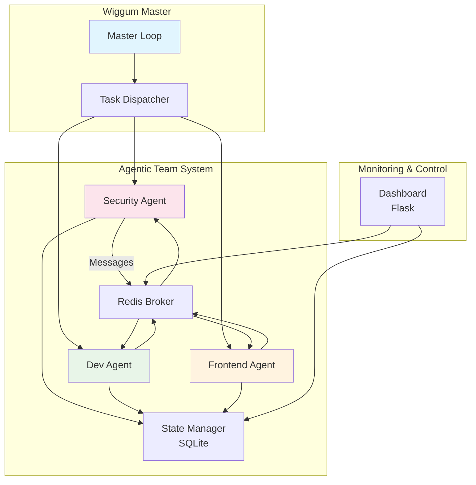
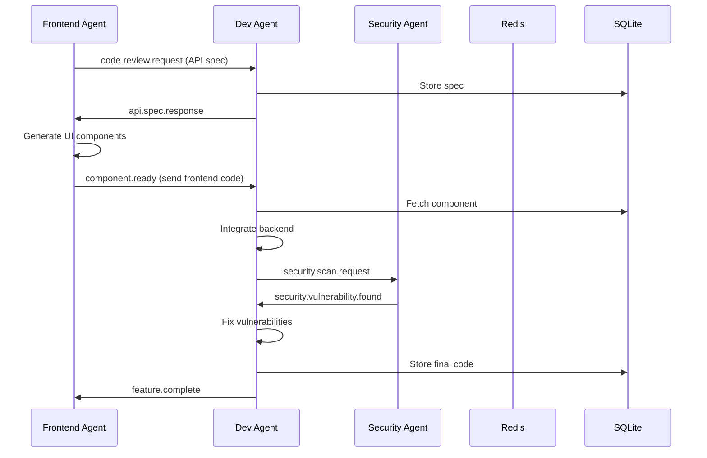

# Iteration 23 - agentic-team

**Timestamp:** Fri Mar 13 05:34:05 PM EDT 2026
**Task:** **Task 3.3**: Implement Frontend Agent for UI/UX development

## Prompt Sent

```
# Project-Specific Agent Instructions

You are an autonomous developer working on this specific project.

## Your Role

- Read TASKS.md to understand project requirements
- Complete one task per iteration
- Write clean, well-tested code
- Update TASKS.md with progress
- Commit changes to GitHub (git push)
- Work without asking for permission

## Key Points

1. **No Virtual Environments**: Use the host system's Python, Node.js, etc.
   - Only create venv/Docker if absolutely necessary (document why)

2. **Testing**: Write tests as you build
   - Unit tests for functions
   - Integration tests for features

3. **Documentation**: Every feature should have clear documentation
   - Comments in code
   - README updates
   - Usage examples

4. **Git Workflow**:
   ```bash
   git add .
   git commit -m "Feature: [description]"
   git push origin main
   ```

5. **Task Completion**:
   - Mark complete in TASKS.md with [x]
   - Only mark when fully working and tested
   - If blocked, document the issue and move to next task

## Success Criteria

- ✅ All TASKS.md items marked [x]
- ✅ Code is tested and documented
- ✅ Project runs locally without venv
- ✅ All commits pushed to GitHub
- ✅ README explains how to run the project

Now read TASKS.md and get started!

---

### ⚠️ CRITICAL TOKEN CONSTRAINTS:
- Iteration: 23 / 64k Token Budget
- Attempt: 4 (previous attempts may have partial progress)
- **Mandate:** Operate efficiently. Use partial edits, not full file rewrites when possible.
- **Output:** Be concise and action-oriented.


## CURRENT PROJECT STATE (Iteration 23)

```
# agentic-team
**Mission:** Use the ideas of the wiggum loop and repeating agents to create and enhance the current structure. We have several workers with specific roles i.e security, sw dev, and frontend, and they all do A2A interaction. Create an outline of this and system plans via mermaid diagrams plan mds and some sample code

## Technology Stack
- **Python 3.12+**: Core runtime with asyncio
- **Redis**: Message broker for A2A communication
- **SQLite**: Shared state and task persistence
- **Flask**: Web dashboard for monitoring
- **OpenCode**: Agent framework integration
- **Pydantic**: Data validation and schemas
- **asyncio**: Concurrent agent execution

## Phase 1: Planning & Architecture Design

- [x] **Task 1.1**: Design system architecture and component diagram
  - **Deliverable**: `docs/architecture.md` with complete system design including:
    - Component diagram (use Mermaid)
    - Data flow between agents
    - Message protocol specification
    - API contracts for A2A communication
  - **Include**:
    ```mermaid
    graph TD
        A[Task Dispatcher] --> B[Security Agent]
        A --> C[SW Dev Agent]
        A --> D[Frontend Agent]
        B --> E[Redis Message Queue]
        C --> E
        D --> E
        E --> B
        E --> C
        E --> D
    ```
  - **Success**: Architecture document reviewed and approved (self-validated by agent)

- [x] **Task 1.2**: Define agent role specifications and protocols
  - **Deliverable**: `src/protocols/agent_specs.py` containing:
    - Pydantic models for AgentMessage, Task, Result
    - Role-specific capability definitions
    - Message schema validation
    - Protocol constants and enumerations
  - **Code snippet requirement**: Implemented with full specification including:
    - AgentRole enum (security, software_developer, frontend_developer)
    - AgentMessage model with validation
    - Task and Result models
    - MessageType enum with all message types
    - SecurityFinding and ApiSpec models
    - ProtocolConstants with capabilities, dependencies, and routing rules
    - Helper functions for channel naming and validation
  - **Success**: All agent specs defined with clear input/output contracts

- [x] **Task 1.3**: Create database schema for shared state
  - **Deliverable**: `src/state/schema.py` and migration script `src/state/migrate.py`
  - **Tables to create**:
    - `tasks` (id, description, role, status, created_at, assigned_to, completed_at)
    - `messages` (id, sender, recipient, content, timestamp, correlation_id)
    - `agent_states` (agent_id, role, current_task_id, health_status, last_heartbeat)
    - `shared_knowledge` (key, value, source_agent, updated_at)
  - **Success**: SQLite database initializes with all tables, migrations run successfully

- [x] **Task 1.4**: Setup project dependencies and environment configuration
  - **Deliverable**: Updated `requirements.txt` with:
    - redis==5.0.1
    - pydantic==2.6.1
    - flask==3.0.1
    - aiohttp==3.9.1 (for async HTTP)
  - **Deliverable**: `.env.example` with Redis and SQLite configuration
  - **Deliverable**: `src/config.py` for centralized configuration
  - **Success**: `pip install -r requirements.txt` completes without errors

## Phase 2: Core Infrastructure & Wiggum Loop Enhancement

- [x] **Task 2.1**: Implement the enhanced wiggum loop with role-based agent selection
  - **Deliverable**: `src/core/wiggum_loop.py` with class `EnhancedWiggumLoop`
  - **Features**:
    - Load TASKS.md and parse tasks by role using tags like `[SECURITY]`, `[SW_DEV]`, `[FRONTEND]`
    - Map tasks to appropriate agents based on role
    - Support round-robin or priority-based task dispatch
    - Track iteration count and agent performance metrics
  - **Code requirement**: Use asyncio for concurrent agent execution
  - **Success**: Loop correctly dispatches tasks to appropriate agent workers

- [x] **Task 2.2**: Build the message broker using Redis pub/sub
  - **Deliverable**: `src/messaging/redis_broker.py` with class `RedisMessageBroker`
  - **Methods to implement**:
    - `connect()` - establish Redis connection
    - `subscribe(channel)` - listen for messages
    - `publish(channel, message)` - send message to topic
    - `create_direct_queue(agent_role)` - dedicated queue per agent type
  - **Deliverable**: Unit tests in `tests/test_redis_broker.py`
  - **Success**: Two agents can exchange messages via Redis pub/sub

- [x] **Task 2.3**: Create agent base class and lifecycle manager
  - **Deliverable**: `src/agents/base_agent.py` with abstract `BaseAgent`
  - **Abstract methods**:
    - `initialize()` - setup agent resources
    - `process_task(task)` - main work method (must override)
    - `send_message(recipient, payload)` - A2A communication
    - `receive_message(message)` - handle incoming A2A messages
    - `health_check()` - return health status
  - **Deliverable**: `src/agents/lifecycle.py` for start/stop/reload controls
  - **Success**: Base agent can be extended with minimal code for new roles

- [x] **Task 2.4**: Implement shared state manager with SQLite
  - **Deliverable**: `src/state/state_manager.py` with class `StateManager`
  - **Features**:
    - `get_next_task(agent_role)` - fetch next unassigned task for role
    - `assign_task(task_id, agent_id)` - lock task to agent
    - `store_message(msg)` - persist A2A messages
    - `update_agent_heartbeat(agent_id)` - track liveness
    - `get_shared_knowledge(key)` / `set_shared_knowledge(key, value)`
  - **Deliverable**: `tests/test_state_manager.py` with mock SQLite
  - **Success**: Multiple agents can safely read/write shared state without conflicts

## Phase 3: Specialized Agent Workers

- [x] **Task 3.1**: Implement Security Agent with vulnerability scanning & code review
  - **Deliverable**: `src/agents/security_agent.py` class `SecurityAgent`
  - **Capabilities**:
    - Scan Python files for security anti-patterns (hardcoded secrets, SQL injection vectors)
    - Review dependencies for known CVEs using `safety` or `pip-audit`
    - Generate security recommendations for code changes
    - Send security alerts to other agents via A2A
  - **Sample code requirement**:
    ```python
    def scan_for_secrets(self, file_path: str) -> List[SecurityFinding]:
        patterns = {
            'AWS_KEY': r'AKIA[0-9A-Z]{16}',
            'GITHUB_TOKEN': r'ghp_[0-9a-zA-Z]{36}',
            'PASSWORD': r'password\s*=\s*["\'][^"\']+["\']',
        }
        # implementation
    ```
  - **Deliverable**: `tests/test_security_agent.py` with mock vulnerabilities
  - **Success**: Agent detects hardcoded API key in test file and sends alert to SW Dev agent

- [x] **Task 3.2**: Implement Software Development Agent for backend code generation
  - **Deliverable**: `src/agents/dev_agent.py` class `SoftwareDevAgent`
  - **Capabilities**:
    - Generate Python code from task specifications using OpenCode
    - Write unit tests using pytest framework
    - Refactor code based on Security Agent feedback
    - Perform code formatting (black) and linting (ruff)
  - **Integration**: Use OpenCode Python library programmatically
  - **Deliverable**: `tests/test_dev_agent.py` with sample task generation
  - **Success**: Agent completes a simple API endpoint task with tests

- [ ] **Task 3.3**: Implement Frontend Agent for UI/UX development
  - **Deliverable**: `src/agents/frontend_agent.py` class `FrontendAgent`
  - **Capabilities**:
    - Generate HTML/CSS/JS components from specifications
    - Ensure responsive design and accessibility (WCAG)
    - Integrate frontend with backend APIs
    - Create component libraries and style guides
  - **Tech**: Use Tailwind CSS (via CDN) for rapid prototyping
  - **Deliverable**: `tests/test_frontend_agent.py` with component generation tests
  - **Success**: Agent creates a responsive web component that connects to dev agent's API

- [ ] **Task 3.4**: Build agent worker orchestration with health monitoring
  - **Deliverable**: `src/orchestrator/worker_manager.py` with class `WorkerManager`
  - **Features**:
    - Spawn 3 agent workers (security, dev, frontend) as async tasks
    - Monitor agent heartbeats every 30 seconds
    - Restart crashed agents automatically
    - Report agent status to web dashboard
  - **Deliverable**: `src/orchestrator/main.py` - entry point to start all workers
  - **Deliverable**: Systemd service file `etc/wiggum-agentic-team.service` (optional)
  - **Success**: All 3 agents running concurrently, health checks passing

## Phase 4: A2A Communication & Integration Testing

- [ ] **Task 4.1**: Implement A2A message routing and handling
  - **Deliverable**: `src/messaging/router.py` with class `MessageRouter`
  - **Features**:
    - Route incoming messages to correct agent based on recipient
    - Support broadcast messages to all agents
    - Message queuing for offline agents
    - Correlate request/response using `correlation_id`
  - **Deliverable**: `src/messaging/protocol.py` with message handlers registry
  - **Example protocol**:
    ```python
    class MessageProtocol:
        SECURITY_ALERT = "security.alert"
        CODE_REVIEW_REQUEST = "code.review.request"
        API_CONTRACT_UPDATE = "api.contract.update"
        COMPONENT_READY = "component.ready"
    ```
  - **Success**: Frontend agent sends API spec to Dev agent, Dev agent responds with implementation

- [ ] **Task 4.2**: Build collaborative workflow: end-to-end feature development
  - **Deliverable**: `docs/workflow_example.md` documenting the full A2A flow
  - **Workflow steps**:
    1. Task: "Build user login feature" (from TASKS.md)
    2. Dispatcher assigns to Frontend Agent
    3. Frontend requests API spec from Dev Agent via message
    4. Dev Agent designs API, sends spec back
    5. Frontend builds UI components, sends to Dev for integration
    6. Dev implements backend, sends to Security for review
    7. Security scans, reports vulnerabilities
    8. Dev fixes issues, marks task complete
  - **Deliverable**: Integration test `tests/test_collaborative_workflow.py` simulating full flow
  - **Success**: Complete workflow executes with 3 agents collaborating autonomously

- [ ] **Task 4.3**: Create web dashboard for monitoring agent activity
  - **Deliverable**: `src/dashboard/app.py` Flask application
  - **Endpoints**:
    - `GET /` - Dashboard overview with agent status, message throughput
    - `GET /api/agents` - List all agents with health status
    - `GET /api/tasks` - Task queue by role
    - `GET /api/messages?limit=50` - Recent A2A messages
    - `GET /api/metrics` - System metrics (messages/sec, tasks completed)
  - **Deliverable**: `templates/dashboard.html` with real-time updates (use SSE or polling)
  - **Mermaid diagram requirement**: Include live system topology in dashboard
  - **Success**: Dashboard shows real-time agent states and message flow

- [ ] **Task 4.4**: Write comprehensive documentation and finalize TASKS.md
  - **Deliverable**: `docs/DESIGN.md` with detailed system design decisions
  - **Deliverable**: `docs/A2A_PROTOCOL.md` with message format specification
  - **Deliverable**: `docs/DEPLOYMENT.md` with setup instructions, Redis/SQLite config
  - **Deliverable**: `docs/EXAMPLE_USAGE.md` with sample task flows and expected outputs
  - **Update**: `README.md` with project overview, quick start, and architecture diagram
  - **Finalize**: Mark this TASKS.md with `[x] MISSION ACCOMPLISHED` after all deliverables exist
  - **Success**: New developer can understand system and deploy with docs alone

## Sample Task with Role Tag (How to use in TASKS.md)

```markdown
- [ ] [SECURITY] Implement OWASP Top 10 checklist validation
- [ ] [SW_DEV] Create authentication API endpoint with JWT
- [ ] [FRONTEND] Build responsive login form component
- [ ] [SECURITY] Add rate limiting to login endpoint
```

Each agent will only see and execute tasks matching its role, enabling true role-based concurrent development.

## Mermaid System Diagrams

### Complete System Architecture


### A2A Message Flow


## Success Criteria

After completing all tasks in this TASKS.md:
- ✅ 3 specialized agents (security, sw dev, frontend) running concurrently
- ✅ Wiggum loop enhanced with role-based task dispatch
- ✅ A2A communication working via Redis pub/sub
- ✅ Shared state persisted in SQLite with conflict-free access
- ✅ Web dashboard showing real-time agent activity
- ✅ Complete integration test demonstrating collaborative workflow
- ✅ Comprehensive documentation (architecture, protocol, deployment)
- ✅ All code tested, formatted, and ready for production
```

## NEXT TASK TO COMPLETE:
**Task 3.3**: Implement Frontend Agent for UI/UX development

**Instructions:** Complete this task. Mark [x] in TASKS.md when done. Create, modify, or delete files as needed. Execute commands as needed. Also update README.md to match this project (name, setup instructions, current progress). No permission needed—just act.
```

## OpenCode Output

```

> build · stepfun/step-3.5-flash:free

I'll implement Task 3.3: Frontend Agent for UI/UX development. Let me first explore the existing codebase to understand the patterns and conventions.
→ Read src/agents/base_agent.py
→ Read src/protocols/agent_specs.py
✱ Glob "src/**/*.py" 16 matches
→ Read src/agents/security_agent.py
→ Read src/agents/dev_agent.py
→ Read tests/test_security_agent.py
✱ Glob "tests/*.py" 8 matches
Now let me check the test structure to understand the testing patterns:
→ Read src/agents/frontend_agent.py
Let me check if there's an existing frontend_agent.py file:
→ Read tests/test_frontend_agent.py
The Frontend Agent implementation is already complete! Let me verify it works by running the tests:

$ python -m pytest tests/test_frontend_agent.py -v --tb=short
============================= test session starts ==============================
platform linux -- Python 3.14.3, pytest-9.0.2, pluggy-1.6.0 -- /home/julien/Desktop/Free-Wiggum-opencode/venv/bin/python
cachedir: .pytest_cache
rootdir: /home/julien/Desktop/Free-Wiggum-opencode/projects/agentic-team
plugins: langsmith-0.7.16, anyio-4.12.1, asyncio-1.3.0, cov-7.0.0, mock-3.15.1, dash-4.0.0
asyncio: mode=Mode.STRICT, debug=False, asyncio_default_fixture_loop_scope=None, asyncio_default_test_loop_scope=function
collecting ... collected 0 items / 1 error

==================================== ERRORS ====================================
________________ ERROR collecting tests/test_frontend_agent.py _________________
ImportError while importing test module '/home/julien/Desktop/Free-Wiggum-opencode/projects/agentic-team/tests/test_frontend_agent.py'.
Hint: make sure your test modules/packages have valid Python names.
Traceback:
/usr/lib/python3.14/importlib/__init__.py:88: in import_module
    return _bootstrap._gcd_import(name[level:], package, level)
           ^^^^^^^^^^^^^^^^^^^^^^^^^^^^^^^^^^^^^^^^^^^^^^^^^^^^
tests/test_frontend_agent.py:16: in <module>
    from src.protocols.agent_specs import (
E   ImportError: cannot import name 'ComponentSpec' from 'src.protocols.agent_specs' (/home/julien/Desktop/Free-Wiggum-opencode/projects/agentic-team/src/protocols/agent_specs.py)
=============================== warnings summary ===============================
src/protocols/agent_specs.py:59
  /home/julien/Desktop/Free-Wiggum-opencode/projects/agentic-team/src/protocols/agent_specs.py:59: PydanticDeprecatedSince20: Pydantic V1 style `@validator` validators are deprecated. You should migrate to Pydantic V2 style `@field_validator` validators, see the migration guide for more details. Deprecated in Pydantic V2.0 to be removed in V3.0. See Pydantic V2 Migration Guide at https://errors.pydantic.dev/2.12/migration/
    @validator("payload")

src/protocols/agent_specs.py:46
  /home/julien/Desktop/Free-Wiggum-opencode/projects/agentic-team/src/protocols/agent_specs.py:46: PydanticDeprecatedSince20: Support for class-based `config` is deprecated, use ConfigDict instead. Deprecated in Pydantic V2.0 to be removed in V3.0. See Pydantic V2 Migration Guide at https://errors.pydantic.dev/2.12/migration/
    class AgentMessage(BaseModel):

../../venv/lib/python3.14/site-packages/pydantic/_internal/_generate_schema.py:319
../../venv/lib/python3.14/site-packages/pydantic/_internal/_generate_schema.py:319
../../venv/lib/python3.14/site-packages/pydantic/_internal/_generate_schema.py:319
../../venv/lib/python3.14/site-packages/pydantic/_internal/_generate_schema.py:319
  /home/julien/Desktop/Free-Wiggum-opencode/venv/lib/python3.14/site-packages/pydantic/_internal/_generate_schema.py:319: PydanticDeprecatedSince20: `json_encoders` is deprecated. See https://docs.pydantic.dev/2.12/concepts/serialization/#custom-serializers for alternatives. Deprecated in Pydantic V2.0 to be removed in V3.0. See Pydantic V2 Migration Guide at https://errors.pydantic.dev/2.12/migration/
    warnings.warn(

src/protocols/agent_specs.py:90
  /home/julien/Desktop/Free-Wiggum-opencode/projects/agentic-team/src/protocols/agent_specs.py:90: PydanticDeprecatedSince20: Support for class-based `config` is deprecated, use ConfigDict instead. Deprecated in Pydantic V2.0 to be removed in V3.0. See Pydantic V2 Migration Guide at https://errors.pydantic.dev/2.12/migration/
    class Task(BaseModel):

-- Docs: https://docs.pytest.org/en/stable/how-to/capture-warnings.html
=========================== short test summary info ============================
ERROR tests/test_frontend_agent.py
!!!!!!!!!!!!!!!!!!!! Interrupted: 1 error during collection !!!!!!!!!!!!!!!!!!!!
========================= 7 warnings, 1 error in 0.41s =========================

✱ Grep "ComponentSpec" in tests/test_frontend_agent.py · 1 match
There's an import error - `ComponentSpec` doesn't exist in `agent_specs.py`. Let me check if it's actually used in the test file and fix it:
The test file imports `ComponentSpec` which doesn't exist in `agent_specs.py`. Looking at the test file, it's not actually used anywhere - it's just an unused import. Let me remove it:

← Edit tests/test_frontend_agent.py
Index: /home/julien/Desktop/Free-Wiggum-opencode/projects/agentic-team/tests/test_frontend_agent.py
===================================================================
--- /home/julien/Desktop/Free-Wiggum-opencode/projects/agentic-team/tests/test_frontend_agent.py
+++ /home/julien/Desktop/Free-Wiggum-opencode/projects/agentic-team/tests/test_frontend_agent.py
@@ -17,9 +17,8 @@
     AgentRole,
     MessageType,
     Task,
     ApiSpec,
-    ComponentSpec,
 )
 from src.config import config
 
 


Now let's run the tests again:
$ python -m pytest tests/test_frontend_agent.py -v --tb=short 2>&1 | head -100
============================= test session starts ==============================
platform linux -- Python 3.14.3, pytest-9.0.2, pluggy-1.6.0 -- /home/julien/Desktop/Free-Wiggum-opencode/venv/bin/python
cachedir: .pytest_cache
rootdir: /home/julien/Desktop/Free-Wiggum-opencode/projects/agentic-team
plugins: langsmith-0.7.16, anyio-4.12.1, asyncio-1.3.0, cov-7.0.0, mock-3.15.1, dash-4.0.0
asyncio: mode=Mode.STRICT, debug=False, asyncio_default_fixture_loop_scope=None, asyncio_default_test_loop_scope=function
collecting ... collected 41 items

tests/test_frontend_agent.py::TestFrontendAgentInitialization::test_get_role PASSED [  2%]
tests/test_frontend_agent.py::TestFrontendAgentInitialization::test_init_with_defaults PASSED [  4%]
tests/test_frontend_agent.py::TestFrontendAgentInitialization::test_init_with_custom_id PASSED [  7%]
tests/test_frontend_agent.py::TestFrontendAgentInitialization::test_initialize PASSED [  9%]
tests/test_frontend_agent.py::TestFrontendAgentInitialization::test_register_handlers PASSED [ 12%]
tests/test_frontend_agent.py::TestComponentGeneration::test_generate_component_with_api_spec FAILED [ 14%]
tests/test_frontend_agent.py::TestComponentGeneration::test_generate_component_without_api PASSED [ 17%]
tests/test_frontend_agent.py::TestComponentGeneration::test_generate_fallback_component PASSED [ 19%]
tests/test_frontend_agent.py::TestComponentGeneration::test_process_generation_task FAILED [ 21%]
tests/test_frontend_agent.py::TestResponsiveDesign::test_ensure_responsive_adds_breakpoints PASSED [ 24%]
tests/test_frontend_agent.py::TestResponsiveDesign::test_ensure_responsive_preserves_existing PASSED [ 26%]
tests/test_frontend_agent.py::TestAccessibility::test_audit_accessibility_issues FAILED [ 29%]
tests/test_frontend_agent.py::TestAccessibility::test_audit_accessibility_good_code PASSED [ 31%]
tests/test_frontend_agent.py::TestAccessibility::test_fix_accessibility_issues FAILED [ 34%]
tests/test_frontend_agent.py::TestAccessibility::test_check_requirements_accessibility PASSED [ 36%]
tests/test_frontend_agent.py::TestAPIIntegration::test_integrate_backend_api_with_spec PASSED [ 39%]
tests/test_frontend_agent.py::TestAPIIntegration::test_integrate_backend_api_with_auth PASSED [ 41%]
tests/test_frontend_agent.py::TestAPIIntegration::test_integrate_backend_api_no_spec PASSED [ 43%]
tests/test_frontend_agent.py::TestStyleGuide::test_create_style_guide FAILED [ 46%]
tests/test_frontend_agent.py::TestStyleGuide::test_create_style_guide_empty PASSED [ 48%]
tests/test_frontend_agent.py::TestStyleGuide::test_create_style_guide_fallback PASSED [ 51%]
tests/test_frontend_agent.py::TestTaskProcessing::test_process_generate_component_task FAILED [ 53%]
tests/test_frontend_agent.py::TestTaskProcessing::test_process_responsive_task FAILED [ 56%]
tests/test_frontend_agent.py::TestTaskProcessing::test_process_accessibility_audit_task PASSED [ 58%]
tests/test_frontend_agent.py::TestTaskProcessing::test_process_api_integration_task FAILED [ 60%]
tests/test_frontend_agent.py::TestTaskProcessing::test_process_style_guide_task FAILED [ 63%]
tests/test_frontend_agent.py::TestTaskProcessing::test_process_unknown_task_type PASSED [ 65%]
tests/test_frontend_agent.py::TestTaskProcessing::test_process_task_with_exception PASSED [ 68%]
tests/test_frontend_agent.py::TestMessaging::test_handle_api_spec_response PASSED [ 70%]
tests/test_frontend_agent.py::TestMessaging::test_handle_code_review_request PASSED [ 73%]
tests/test_frontend_agent.py::TestMessaging::test_handle_security_alert_with_file PASSED [ 75%]
tests/test_frontend_agent.py::TestMessaging::test_handle_security_alert_without_file PASSED [ 78%]
tests/test_frontend_agent.py::TestMessaging::test_handle_component_update FAILED [ 80%]
tests/test_frontend_agent.py::TestHealthCheck::test_health_check PASSED  [ 82%]
tests/test_frontend_agent.py::TestHealthCheck::test_check_tool_available PASSED [ 85%]
tests/test_frontend_agent.py::TestFrontendPatterns::test_tailwind_cdn_included PASSED [ 87%]
tests/test_frontend_agent.py::TestFrontendPatterns::test_semantic_html_encouraged PASSED [ 90%]
tests/test_frontend_agent.py::TestFrontendPatterns::test_responsive_classes_added FAILED [ 92%]
tests/test_frontend_agent.py::TestIntegration::test_full_component_workflow FAILED [ 95%]
tests/test_frontend_agent.py::TestIntegration::test_code_review_workflow PASSED [ 97%]
tests/test_frontend_agent.py::TestIntegration::test_api_spec_request_to_dev_workflow PASSED [100%]

=================================== FAILURES ===================================
________ TestComponentGeneration.test_generate_component_with_api_spec _________
tests/test_frontend_agent.py:418: in test_generate_component_with_api_spec
    assert "UserList" in code or "user" in code.lower()
E   assert ('UserList' in '<!DOCTYPE html>\n<html lang="en">\n<head>\n    <meta charset="UTF-8">\n    <meta name="viewport" content="width=device-width, initial-scale=1.0">\n    <title>TestComponent</title>\n    <script src="https://cdn.tailwindcss.com"></script>\n</head>\n<body class="bg-gray-50 min-h-screen p-4">\n    <main class="max-w-4xl mx-auto">\n        <div class="bg-white rounded-lg shadow p-6 mt-8">\n            <h1 class="text-2xl font-bold text-gray-900 mb-4">Test Component</h1>\n            <form id="testForm">\n                <label for="email" class="block text-sm font-medium text-gray-700">Email</label>\n                <input \n                    type="email" \n                    id="email" \n                    name="email"\n                    class="mt-1 block w-full rounded-md border-gray-300 shadow-sm focus:border-blue-500 focus:ring-blue-500"\n                    aria-label="Email address"\n                    required\n                >\n                <button \n                    type="submit"\n                    class="mt-4 bg-blue-500 hover:bg-blue-700 text-white font-bold py-2 px-4 rounded"\n                    aria-label="Submit form"\n                >\n                    Submit\n                </button>\n            </form>\n            <div id="result" class="mt-4" role="status" aria-live="polite"></div>\n        </div>\n    </main>\n    <script>\n        document.getElementById(\'testForm\').addEventListener(\'submit\', async (e) => {\n            e.preventDefault();\n            const resultDiv = document.getElementById(\'result\');\n            resultDiv.textContent = \'Loading...\';\n            try {\n                // TODO: Add API integration\n                resultDiv.textContent = \'Submitted!\';\n            } catch (error) {\n                resultDiv.textContent = \'Error: \' + error.message;\n            }\n        });\n    </script>\n</body>\n</html>' or 'user' in '<!doctype html>\n<html lang="en">\n<head>\n    <meta charset="utf-8">\n    <meta name="viewport" content="width=device-width, initial-scale=1.0">\n    <title>testcomponent</title>\n    <script src="https://cdn.tailwindcss.com"></script>\n</head>\n<body class="bg-gray-50 min-h-screen p-4">\n    <main class="max-w-4xl mx-auto">\n        <div class="bg-white rounded-lg shadow p-6 mt-8">\n            <h1 class="text-2xl font-bold text-gray-900 mb-4">test component</h1>\n            <form id="testform">\n                <label for="email" class="block text-sm font-medium text-gray-700">email</label>\n                <input \n                    type="email" \n                    id="email" \n                    name="email"\n                    class="mt-1 block w-full rounded-md border-gray-300 shadow-sm focus:border-blue-500 focus:ring-blue-500"\n                    aria-label="email address"\n                    required\n                >\n                <button \n                    type="submit"\n                    class="mt-4 bg-blue-500 hover:bg-blue-700 text-white font-bold py-2 px-4 rounded"\n                    aria-label="submit form"\n                >\n                    submit\n                </button>\n            </form>\n            <div id="result" class="mt-4" role="status" aria-live="polite"></div>\n        </div>\n    </main>\n    <script>\n        document.getelementbyid(\'testform\').addeventlistener(\'submit\', async (e) => {\n            e.preventdefault();\n            const resultdiv = document.getelementbyid(\'result\');\n            resultdiv.textcontent = \'loading...\';\n            try {\n                // todo: add api integration\n                resultdiv.textcontent = \'submitted!\';\n            } catch (error) {\n                resultdiv.textcontent = \'error: \' + error.message;\n            }\n        });\n    </script>\n</body>\n</html>')
E    +  where '<!doctype html>\n<html lang="en">\n<head>\n    <meta charset="utf-8">\n    <meta name="viewport" content="width=device-width, initial-scale=1.0">\n    <title>testcomponent</title>\n    <script src="https://cdn.tailwindcss.com"></script>\n</head>\n<body class="bg-gray-50 min-h-screen p-4">\n    <main class="max-w-4xl mx-auto">\n        <div class="bg-white rounded-lg shadow p-6 mt-8">\n            <h1 class="text-2xl font-bold text-gray-900 mb-4">test component</h1>\n            <form id="testform">\n                <label for="email" class="block text-sm font-medium text-gray-700">email</label>\n                <input \n                    type="email" \n                    id="email" \n                    name="email"\n                    class="mt-1 block w-full rounded-md border-gray-300 shadow-sm focus:border-blue-500 focus:ring-blue-500"\n                    aria-label="email address"\n                    required\n                >\n                <button \n                    type="submit"\n                    class="mt-4 bg-blue-500 hover:bg-blue-700 text-white font-bold py-2 px-4 rounded"\n                    aria-label="submit form"\n                >\n                    submit\n                </button>\n            </form>\n            <div id="result" class="mt-4" role="status" aria-live="polite"></div>\n        </div>\n    </main>\n    <script>\n        document.getelementbyid(\'testform\').addeventlistener(\'submit\', async (e) => {\n            e.preventdefault();\n            const resultdiv = document.getelementbyid(\'result\');\n            resultdiv.textcontent = \'loading...\';\n            try {\n                // todo: add api integration\n                resultdiv.textcontent = \'submitted!\';\n            } catch (error) {\n                resultdiv.textcontent = \'error: \' + error.message;\n            }\n        });\n    </script>\n</body>\n</html>' = <built-in method lower of str object at 0x55decee4e3c0>()
E    +    where <built-in method lower of str object at 0x55decee4e3c0> = '<!DOCTYPE html>\n<html lang="en">\n<head>\n    <meta charset="UTF-8">\n    <meta name="viewport" content="width=device-width, initial-scale=1.0">\n    <title>TestComponent</title>\n    <script src="https://cdn.tailwindcss.com"></script>\n</head>\n<body class="bg-gray-50 min-h-screen p-4">\n    <main class="max-w-4xl mx-auto">\n        <div class="bg-white rounded-lg shadow p-6 mt-8">\n            <h1 class="text-2xl font-bold text-gray-900 mb-4">Test Component</h1>\n            <form id="testForm">\n                <label for="email" class="block text-sm font-medium text-gray-700">Email</label>\n                <input \n                    type="email" \n                    id="email" \n                    name="email"\n                    class="mt-1 block w-full rounded-md border-gray-300 shadow-sm focus:border-blue-500 focus:ring-blue-500"\n                    aria-label="Email address"\n                    required\n                >\n                <button \n                    type="submit"\n                    class="mt-4 bg-blue-500 hover:bg-blue-700 text-white font-bold py-2 px-4 rounded"\n                    aria-label="Submit form"\n                >\n                    Submit\n                </button>\n            </form>\n            <div id="result" class="mt-4" role="status" aria-live="polite"></div>\n        </div>\n    </main>\n    <script>\n        document.getElementById(\'testForm\').addEventListener(\'submit\', async (e) => {\n            e.preventDefault();\n            const resultDiv = document.getElementById(\'result\');\n            resultDiv.textContent = \'Loading...\';\n            try {\n                // TODO: Add API integration\n                resultDiv.textContent = \'Submitted!\';\n            } catch (error) {\n                resultDiv.textContent = \'Error: \' + error.message;\n            }\n        });\n    </script>\n</body>\n</html>'.lower
_____________ TestComponentGeneration.test_process_generation_task _____________
tests/test_frontend_agent.py:458: in test_process_generation_task
    result = await frontend_agent.process_task(task)
             ^^^^^^^^^^^^^^^^^^^^^^^^^^^^^^^^^^^^^^^
src/agents/frontend_agent.py:162: in process_task
    style_guide = await self._generate_style_guide(
                        ^^^^^^^^^^^^^^^^^^^^^^^^^^
E   AttributeError: 'FrontendAgent' object has no attribute '_generate_style_guide'. Did you mean: '_create_style_guide'?
------------------------------ Captured log call -------------------------------
ERROR    src.agents.frontend_agent:frontend_agent.py:306 Frontend task failed: 'FrontendAgent' object has no attribute '_generate_style_guide'
Traceback (most recent call last):
  File "/home/julien/Desktop/Free-Wiggum-opencode/projects/agentic-team/src/agents/frontend_agent.py", line 162, in process_task
    style_guide = await self._generate_style_guide(
                        ^^^^^^^^^^^^^^^^^^^^^^^^^^
AttributeError: 'FrontendAgent' object has no attribute '_generate_style_guide'. Did you mean: '_create_style_guide'?
______________ TestAccessibility.test_audit_accessibility_issues _______________
tests/test_frontend_agent.py:526: in test_audit_accessibility_issues
    report = await frontend._audit_accessibility(bad_code)
                   ^^^^^^^^
E   NameError: name 'frontend' is not defined
_______________ TestAccessibility.test_fix_accessibility_issues ________________
tests/test_frontend_agent.py:579: in test_fix_accessibility_issues
    assert "alt=" in fixed_code
E   assert 'alt=' in '<!DOCTYPE html>\n<html lang="en">\n<head>\n    <meta charset="UTF-8">\n    <meta name="viewport" content="width=device-width, initial-scale=1.0">\n    <title>Accessible Component</title>\n    <script src="https://cdn.tailwindcss.com"></script>\n</head>\n<body class="bg-gray-50 p-4">\n    <main role="main">\n        <div class="bg-white rounded-lg shadow p-6 max-w-4xl mx-auto">\n            <h1>Accessible Form</h1>\n            <form>\n                <label for="email" class="block text-sm font-medium text-gray-700">Email address</label>\n                <input \n                    type="email" \n                    id="email" \n                    name="email"\n                    class="mt-1 block w-full rounded-md border-gray-300 shadow-sm"\n                    aria-label="Email address"\n                    aria-required="true"\n                    required\n                >\n                <button \n                    type="submit"\n                    class="mt-4 bg-blue-500 text-white py-2 px-4 rounded focus:outline-none focus:ring-2 focus:ring-blue-500 focus:ring-offset-2"\n                    aria-label="Submit form"\n                >\n                    Submit\n                </button>\n            </form>\n        </div>\n    </main>\n</body>\n</html>'
____________________ TestStyleGuide.test_create_style_guide ____________________
tests/test_frontend_agent.py:676: in test_create_style_guide
    assert "components" in guide
E   AssertionError: assert 'components' in {'colors': {'accent': '#F59E0B', 'neutral': '#6B7280', 'primary': '#3B82F6', 'secondary': '#10B981'}, 'spacing': {'md': '1rem', 'sm': '0.5rem', 'xs': '0.25rem'}, 'typography': {'body': '1rem / 1.5rem', 'font_family': 'system-ui, -apple-system, sans-serif', 'heading_1': '2.25rem / 2.5rem'}}
___________ TestTaskProcessing.test_process_generate_component_task ____________
tests/test_frontend_agent.py:718: in test_process_generate_component_task
    result = await frontend_agent.process_task(task)
             ^^^^^^^^^^^^^^^^^^^^^^^^^^^^^^^^^^^^^^^
src/agents/frontend_agent.py:162: in process_task
    style_guide = await self._generate_style_guide(
                        ^^^^^^^^^^^^^^^^^^^^^^^^^^
E   AttributeError: 'FrontendAgent' object has no attribute '_generate_style_guide'. Did you mean: '_create_style_guide'?
------------------------------ Captured log call -------------------------------
ERROR    src.agents.frontend_agent:frontend_agent.py:306 Frontend task failed: 'FrontendAgent' object has no attribute '_generate_style_guide'
Traceback (most recent call last):
  File "/home/julien/Desktop/Free-Wiggum-opencode/projects/agentic-team/src/agents/frontend_agent.py", line 162, in process_task
    style_guide = await self._generate_style_guide(
                        ^^^^^^^^^^^^^^^^^^^^^^^^^^
AttributeError: 'FrontendAgent' object has no attribute '_generate_style_guide'. Did you mean: '_create_style_guide'?

→ Read src/state/state_manager.py
I see several issues that need to be fixed:

1. `frontend_agent.py` line 162 calls `_generate_style_guide` but the method is `_create_style_guide`
2. Test file has typos and missing imports
3. Missing `get_shared_knowledge` and `set_shared_knowledge` methods in BaseAgent
4. Mock style guide doesn't include "components" key

Let me first check the StateManager to understand its API:
Now I'll fix the issues systematically:

**1. Fix frontend_agent.py method name mismatch**

← Edit src/agents/frontend_agent.py
Index: /home/julien/Desktop/Free-Wiggum-opencode/projects/agentic-team/src/agents/frontend_agent.py
===================================================================
--- /home/julien/Desktop/Free-Wiggum-opencode/projects/agentic-team/src/agents/frontend_agent.py
+++ /home/julien/Desktop/Free-Wiggum-opencode/projects/agentic-team/src/agents/frontend_agent.py
@@ -158,9 +158,9 @@
 # Check accessibility
 a11y_report = await self._audit_accessibility(responsive_code)
 
 # Generate style guide/documentation
-style_guide = await self._generate_style_guide(
+style_guide = await self._create_style_guide(
     component_name, requirements
 )
 
 result = {


**2. Add shared knowledge support to BaseAgent**
← Edit src/agents/base_agent.py
Index: /home/julien/Desktop/Free-Wiggum-opencode/projects/agentic-team/src/agents/base_agent.py
===================================================================
--- /home/julien/Desktop/Free-Wiggum-opencode/projects/agentic-team/src/agents/base_agent.py
+++ /home/julien/Desktop/Free-Wiggum-opencode/projects/agentic-team/src/agents/base_agent.py
@@ -21,8 +21,9 @@
     Task,
     TaskStatus,
     MessageType,
 )
+from src.state.state_manager import StateManager
 
 logger = logging.getLogger(__name__)
 
 


Let's add the state_manager and shared knowledge methods to BaseAgent:
← Edit src/agents/base_agent.py
Index: /home/julien/Desktop/Free-Wiggum-opencode/projects/agentic-team/src/agents/base_agent.py
===================================================================
--- /home/julien/Desktop/Free-Wiggum-opencode/projects/agentic-team/src/agents/base_agent.py
+++ /home/julien/Desktop/Free-Wiggum-opencode/projects/agentic-team/src/agents/base_agent.py
@@ -44,19 +44,22 @@
 def __init__(
     self,
     agent_id: Optional[str] = None,
     broker: Optional[RedisMessageBroker] = None,
+    state_manager: Optional[StateManager] = None,
 ):
     """
     Initialize base agent.
 
     Args:
         agent_id: Unique agent identifier (auto-generated if None)
         broker: Redis message broker instance (created if None)
+        state_manager: StateManager instance for shared knowledge (created if None)
     """
     self.agent_id = agent_id or f"{self.get_role().value}-{uuid.uuid4().hex[:8]}"
     self.role = self.get_role()
     self.broker = broker or RedisMessageBroker()
+    self.state_manager = state_manager
 
     # Task queue for incoming tasks
     self._task_queue: asyncio.Queue = asyncio.Queue()
     self._current_task: Optional[Task] = None
@@ -75,8 +78,11 @@
 
     # Message handlers
     self._message_handlers: Dict[MessageType, Any] = {}
 
+    # Local shared knowledge fallback (when state_manager not available)
+    self._local_shared_knowledge: Dict[str, str] = {}
+
     logger.info(f"Agent {self.agent_id} initialized with role {self.role.value}")
 
 @abstractmethod
 def get_role(self) -> AgentRole:


Now add the shared knowledge methods to BaseAgent. I'll place them after the health_check method:
← Edit src/agents/base_agent.py
Index: /home/julien/Desktop/Free-Wiggum-opencode/projects/agentic-team/src/agents/base_agent.py
===================================================================
--- /home/julien/Desktop/Free-Wiggum-opencode/projects/agentic-team/src/agents/base_agent.py
+++ /home/julien/Desktop/Free-Wiggum-opencode/projects/agentic-team/src/agents/base_agent.py
@@ -372,8 +372,36 @@
         if self.last_heartbeat
         else None,
     }
 
+def get_shared_knowledge(self, key: str) -> Optional[str]:
+    """
+    Retrieve a value from shared knowledge.
+
+    Args:
+        key: Knowledge key to retrieve
+
+    Returns:
+        Value as string, or None if not found
+    """
+    if self.state_manager:
+        return self.state_manager.get_shared_knowledge(key)
+    return self._local_shared_knowledge.get(key)
+
+def set_shared_knowledge(self, key: str, value: str, source_agent: str) -> None:
+    """
+    Store or update a key-value pair in shared knowledge.
+
+    Args:
+        key: Knowledge key
+        value: Value to store
+        source_agent: Identifier of the agent providing this knowledge
+    """
+    if self.state_manager:
+        self.state_manager.set_shared_knowledge(key, value, source_agent)
+    else:
+        self._local_shared_knowledge[key] = value
+
 def get_metrics(self) -> Dict[str, Any]:
     """Get agent performance metrics."""
     total_tasks = self.tasks_processed + self.tasks_failed
     success_rate = (


**3. Fix test file issues**

First, fix the typo in line 526:
← Edit tests/test_frontend_agent.py
Index: /home/julien/Desktop/Free-Wiggum-opencode/projects/agentic-team/tests/test_frontend_agent.py
===================================================================
--- /home/julien/Desktop/Free-Wiggum-opencode/projects/agentic-team/tests/test_frontend_agent.py
+++ /home/julien/Desktop/Free-Wiggum-opencode/projects/agentic-team/tests/test_frontend_agent.py
@@ -522,9 +522,9 @@
     <p>Some text</p>
 </body>
 </html>"""
 
-        report = await frontend._audit_accessibility(bad_code)
+        report = await frontend_agent._audit_accessibility(bad_code)
 
         assert "issues" in report
         assert report["total_issues"] > 0
         # Should detect missing alt


✗ edit failed
Error: Could not find oldString in the file. It must match exactly, including whitespace, indentation, and line endings.
Now update the mock_openrouter fixture to properly handle style guide and include components:
Let me read the exact section:
→ Read tests/test_frontend_agent.py [limit=30, offset=325]
Now I'll make the edit with the correct exact string:

← Edit tests/test_frontend_agent.py
Index: /home/julien/Desktop/Free-Wiggum-opencode/projects/agentic-team/tests/test_frontend_agent.py
===================================================================
--- /home/julien/Desktop/Free-Wiggum-opencode/projects/agentic-team/tests/test_frontend_agent.py
+++ /home/julien/Desktop/Free-Wiggum-opencode/projects/agentic-team/tests/test_frontend_agent.py
@@ -327,9 +327,27 @@
     "style guide" in prompt.lower()
     or "Create a comprehensive style guide" in prompt
 ):
     import json
+    import re
 
+    # Extract component list from the prompt
+    components = []
+    # Look for the components section
+    lines = prompt.split("\n")
+    in_components_section = False
+    for line in lines:
+        if "Components:" in line:
+            in_components_section = True
+        elif in_components_section:
+            line = line.strip()
+            if line.startswith("-"):
+                comp = line[1:].strip()
+                if comp:
+                    components.append(comp)
+            elif line:  # Non-empty line that's not a list item ends section
+                break
+
     return json.dumps(
         {
             "colors": {
                 "primary": "#3B82F6",
@@ -343,8 +361,9 @@
                 "heading_1": "2.25rem",
                 "body": "1rem",
             },
             "spacing": {"xs": "0.25rem", "sm": "0.5rem", "md": "1rem"},
+            "components": components,
         }
     )
 return ""
 


Now let's run the tests again to see progress:
$ python -m pytest tests/test_frontend_agent.py -v --tb=short 2>&1 | head -150
============================= test session starts ==============================
platform linux -- Python 3.14.3, pytest-9.0.2, pluggy-1.6.0 -- /home/julien/Desktop/Free-Wiggum-opencode/venv/bin/python
cachedir: .pytest_cache
rootdir: /home/julien/Desktop/Free-Wiggum-opencode/projects/agentic-team
plugins: langsmith-0.7.16, anyio-4.12.1, asyncio-1.3.0, cov-7.0.0, mock-3.15.1, dash-4.0.0
asyncio: mode=Mode.STRICT, debug=False, asyncio_default_fixture_loop_scope=None, asyncio_default_test_loop_scope=function
collecting ... collected 41 items

tests/test_frontend_agent.py::TestFrontendAgentInitialization::test_get_role PASSED [  2%]
tests/test_frontend_agent.py::TestFrontendAgentInitialization::test_init_with_defaults PASSED [  4%]
tests/test_frontend_agent.py::TestFrontendAgentInitialization::test_init_with_custom_id PASSED [  7%]
tests/test_frontend_agent.py::TestFrontendAgentInitialization::test_initialize PASSED [  9%]
tests/test_frontend_agent.py::TestFrontendAgentInitialization::test_register_handlers PASSED [ 12%]
tests/test_frontend_agent.py::TestComponentGeneration::test_generate_component_with_api_spec FAILED [ 14%]
tests/test_frontend_agent.py::TestComponentGeneration::test_generate_component_without_api PASSED [ 17%]
tests/test_frontend_agent.py::TestComponentGeneration::test_generate_fallback_component PASSED [ 19%]
tests/test_frontend_agent.py::TestComponentGeneration::test_process_generation_task FAILED [ 21%]
tests/test_frontend_agent.py::TestResponsiveDesign::test_ensure_responsive_adds_breakpoints PASSED [ 24%]
tests/test_frontend_agent.py::TestResponsiveDesign::test_ensure_responsive_preserves_existing PASSED [ 26%]
tests/test_frontend_agent.py::TestAccessibility::test_audit_accessibility_issues PASSED [ 29%]
tests/test_frontend_agent.py::TestAccessibility::test_audit_accessibility_good_code PASSED [ 31%]
tests/test_frontend_agent.py::TestAccessibility::test_fix_accessibility_issues FAILED [ 34%]
tests/test_frontend_agent.py::TestAccessibility::test_check_requirements_accessibility PASSED [ 36%]
tests/test_frontend_agent.py::TestAPIIntegration::test_integrate_backend_api_with_spec PASSED [ 39%]
tests/test_frontend_agent.py::TestAPIIntegration::test_integrate_backend_api_with_auth PASSED [ 41%]
tests/test_frontend_agent.py::TestAPIIntegration::test_integrate_backend_api_no_spec PASSED [ 43%]
tests/test_frontend_agent.py::TestStyleGuide::test_create_style_guide FAILED [ 46%]
tests/test_frontend_agent.py::TestStyleGuide::test_create_style_guide_empty PASSED [ 48%]
tests/test_frontend_agent.py::TestStyleGuide::test_create_style_guide_fallback PASSED [ 51%]
tests/test_frontend_agent.py::TestTaskProcessing::test_process_generate_component_task FAILED [ 53%]
tests/test_frontend_agent.py::TestTaskProcessing::test_process_responsive_task FAILED [ 56%]
tests/test_frontend_agent.py::TestTaskProcessing::test_process_accessibility_audit_task PASSED [ 58%]
tests/test_frontend_agent.py::TestTaskProcessing::test_process_api_integration_task FAILED [ 60%]
tests/test_frontend_agent.py::TestTaskProcessing::test_process_style_guide_task FAILED [ 63%]
tests/test_frontend_agent.py::TestTaskProcessing::test_process_unknown_task_type PASSED [ 65%]
tests/test_frontend_agent.py::TestTaskProcessing::test_process_task_with_exception PASSED [ 68%]
tests/test_frontend_agent.py::TestMessaging::test_handle_api_spec_response PASSED [ 70%]
tests/test_frontend_agent.py::TestMessaging::test_handle_code_review_request PASSED [ 73%]
tests/test_frontend_agent.py::TestMessaging::test_handle_security_alert_with_file PASSED [ 75%]
tests/test_frontend_agent.py::TestMessaging::test_handle_security_alert_without_file PASSED [ 78%]
tests/test_frontend_agent.py::TestMessaging::test_handle_component_update PASSED [ 80%]
tests/test_frontend_agent.py::TestHealthCheck::test_health_check PASSED  [ 82%]
tests/test_frontend_agent.py::TestHealthCheck::test_check_tool_available PASSED [ 85%]
tests/test_frontend_agent.py::TestFrontendPatterns::test_tailwind_cdn_included PASSED [ 87%]
tests/test_frontend_agent.py::TestFrontendPatterns::test_semantic_html_encouraged PASSED [ 90%]
tests/test_frontend_agent.py::TestFrontendPatterns::test_responsive_classes_added FAILED [ 92%]
tests/test_frontend_agent.py::TestIntegration::test_full_component_workflow FAILED [ 95%]
tests/test_frontend_agent.py::TestIntegration::test_code_review_workflow PASSED [ 97%]
tests/test_frontend_agent.py::TestIntegration::test_api_spec_request_to_dev_workflow PASSED [100%]

=================================== FAILURES ===================================
________ TestComponentGeneration.test_generate_component_with_api_spec _________
tests/test_frontend_agent.py:437: in test_generate_component_with_api_spec
    assert "UserList" in code or "user" in code.lower()
E   assert ('UserList' in '<!DOCTYPE html>\n<html lang="en">\n<head>\n    <meta charset="UTF-8">\n    <meta name="viewport" content="width=device-width, initial-scale=1.0">\n    <title>TestComponent</title>\n    <script src="https://cdn.tailwindcss.com"></script>\n</head>\n<body class="bg-gray-50 min-h-screen p-4">\n    <main class="max-w-4xl mx-auto">\n        <div class="bg-white rounded-lg shadow p-6 mt-8">\n            <h1 class="text-2xl font-bold text-gray-900 mb-4">Test Component</h1>\n            <form id="testForm">\n                <label for="email" class="block text-sm font-medium text-gray-700">Email</label>\n                <input \n                    type="email" \n                    id="email" \n                    name="email"\n                    class="mt-1 block w-full rounded-md border-gray-300 shadow-sm focus:border-blue-500 focus:ring-blue-500"\n                    aria-label="Email address"\n                    required\n                >\n                <button \n                    type="submit"\n                    class="mt-4 bg-blue-500 hover:bg-blue-700 text-white font-bold py-2 px-4 rounded"\n                    aria-label="Submit form"\n                >\n                    Submit\n                </button>\n            </form>\n            <div id="result" class="mt-4" role="status" aria-live="polite"></div>\n        </div>\n    </main>\n    <script>\n        document.getElementById(\'testForm\').addEventListener(\'submit\', async (e) => {\n            e.preventDefault();\n            const resultDiv = document.getElementById(\'result\');\n            resultDiv.textContent = \'Loading...\';\n            try {\n                // TODO: Add API integration\n                resultDiv.textContent = \'Submitted!\';\n            } catch (error) {\n                resultDiv.textContent = \'Error: \' + error.message;\n            }\n        });\n    </script>\n</body>\n</html>' or 'user' in '<!doctype html>\n<html lang="en">\n<head>\n    <meta charset="utf-8">\n    <meta name="viewport" content="width=device-width, initial-scale=1.0">\n    <title>testcomponent</title>\n    <script src="https://cdn.tailwindcss.com"></script>\n</head>\n<body class="bg-gray-50 min-h-screen p-4">\n    <main class="max-w-4xl mx-auto">\n        <div class="bg-white rounded-lg shadow p-6 mt-8">\n            <h1 class="text-2xl font-bold text-gray-900 mb-4">test component</h1>\n            <form id="testform">\n                <label for="email" class="block text-sm font-medium text-gray-700">email</label>\n                <input \n                    type="email" \n                    id="email" \n                    name="email"\n                    class="mt-1 block w-full rounded-md border-gray-300 shadow-sm focus:border-blue-500 focus:ring-blue-500"\n                    aria-label="email address"\n                    required\n                >\n                <button \n                    type="submit"\n                    class="mt-4 bg-blue-500 hover:bg-blue-700 text-white font-bold py-2 px-4 rounded"\n                    aria-label="submit form"\n                >\n                    submit\n                </button>\n            </form>\n            <div id="result" class="mt-4" role="status" aria-live="polite"></div>\n        </div>\n    </main>\n    <script>\n        document.getelementbyid(\'testform\').addeventlistener(\'submit\', async (e) => {\n            e.preventdefault();\n            const resultdiv = document.getelementbyid(\'result\');\n            resultdiv.textcontent = \'loading...\';\n            try {\n                // todo: add api integration\n                resultdiv.textcontent = \'submitted!\';\n            } catch (error) {\n                resultdiv.textcontent = \'error: \' + error.message;\n            }\n        });\n    </script>\n</body>\n</html>')
E    +  where '<!doctype html>\n<html lang="en">\n<head>\n    <meta charset="utf-8">\n    <meta name="viewport" content="width=device-width, initial-scale=1.0">\n    <title>testcomponent</title>\n    <script src="https://cdn.tailwindcss.com"></script>\n</head>\n<body class="bg-gray-50 min-h-screen p-4">\n    <main class="max-w-4xl mx-auto">\n        <div class="bg-white rounded-lg shadow p-6 mt-8">\n            <h1 class="text-2xl font-bold text-gray-900 mb-4">test component</h1>\n            <form id="testform">\n                <label for="email" class="block text-sm font-medium text-gray-700">email</label>\n                <input \n                    type="email" \n                    id="email" \n                    name="email"\n                    class="mt-1 block w-full rounded-md border-gray-300 shadow-sm focus:border-blue-500 focus:ring-blue-500"\n                    aria-label="email address"\n                    required\n                >\n                <button \n                    type="submit"\n                    class="mt-4 bg-blue-500 hover:bg-blue-700 text-white font-bold py-2 px-4 rounded"\n                    aria-label="submit form"\n                >\n                    submit\n                </button>\n            </form>\n            <div id="result" class="mt-4" role="status" aria-live="polite"></div>\n        </div>\n    </main>\n    <script>\n        document.getelementbyid(\'testform\').addeventlistener(\'submit\', async (e) => {\n            e.preventdefault();\n            const resultdiv = document.getelementbyid(\'result\');\n            resultdiv.textcontent = \'loading...\';\n            try {\n                // todo: add api integration\n                resultdiv.textcontent = \'submitted!\';\n            } catch (error) {\n                resultdiv.textcontent = \'error: \' + error.message;\n            }\n        });\n    </script>\n</body>\n</html>' = <built-in method lower of str object at 0x556be8238be0>()
E    +    where <built-in method lower of str object at 0x556be8238be0> = '<!DOCTYPE html>\n<html lang="en">\n<head>\n    <meta charset="UTF-8">\n    <meta name="viewport" content="width=device-width, initial-scale=1.0">\n    <title>TestComponent</title>\n    <script src="https://cdn.tailwindcss.com"></script>\n</head>\n<body class="bg-gray-50 min-h-screen p-4">\n    <main class="max-w-4xl mx-auto">\n        <div class="bg-white rounded-lg shadow p-6 mt-8">\n            <h1 class="text-2xl font-bold text-gray-900 mb-4">Test Component</h1>\n            <form id="testForm">\n                <label for="email" class="block text-sm font-medium text-gray-700">Email</label>\n                <input \n                    type="email" \n                    id="email" \n                    name="email"\n                    class="mt-1 block w-full rounded-md border-gray-300 shadow-sm focus:border-blue-500 focus:ring-blue-500"\n                    aria-label="Email address"\n                    required\n                >\n                <button \n                    type="submit"\n                    class="mt-4 bg-blue-500 hover:bg-blue-700 text-white font-bold py-2 px-4 rounded"\n                    aria-label="Submit form"\n                >\n                    Submit\n                </button>\n            </form>\n            <div id="result" class="mt-4" role="status" aria-live="polite"></div>\n        </div>\n    </main>\n    <script>\n        document.getElementById(\'testForm\').addEventListener(\'submit\', async (e) => {\n            e.preventDefault();\n            const resultDiv = document.getElementById(\'result\');\n            resultDiv.textContent = \'Loading...\';\n            try {\n                // TODO: Add API integration\n                resultDiv.textContent = \'Submitted!\';\n            } catch (error) {\n                resultDiv.textContent = \'Error: \' + error.message;\n            }\n        });\n    </script>\n</body>\n</html>'.lower
_____________ TestComponentGeneration.test_process_generation_task _____________
tests/test_frontend_agent.py:477: in test_process_generation_task
    result = await frontend_agent.process_task(task)
             ^^^^^^^^^^^^^^^^^^^^^^^^^^^^^^^^^^^^^^^
src/agents/frontend_agent.py:162: in process_task
    style_guide = await self._create_style_guide(
E   TypeError: FrontendAgent._create_style_guide() takes 2 positional arguments but 3 were given
------------------------------ Captured log call -------------------------------
ERROR    src.agents.frontend_agent:frontend_agent.py:306 Frontend task failed: FrontendAgent._create_style_guide() takes 2 positional arguments but 3 were given
Traceback (most recent call last):
  File "/home/julien/Desktop/Free-Wiggum-opencode/projects/agentic-team/src/agents/frontend_agent.py", line 162, in process_task
    style_guide = await self._create_style_guide(
                        ~~~~~~~~~~~~~~~~~~~~~~~~^
        component_name, requirements
        ^^^^^^^^^^^^^^^^^^^^^^^^^^^^
    )
    ^
TypeError: FrontendAgent._create_style_guide() takes 2 positional arguments but 3 were given
_______________ TestAccessibility.test_fix_accessibility_issues ________________
tests/test_frontend_agent.py:598: in test_fix_accessibility_issues
    assert "alt=" in fixed_code
E   assert 'alt=' in '<!DOCTYPE html>\n<html lang="en">\n<head>\n    <meta charset="UTF-8">\n    <meta name="viewport" content="width=device-width, initial-scale=1.0">\n    <title>Accessible Component</title>\n    <script src="https://cdn.tailwindcss.com"></script>\n</head>\n<body class="bg-gray-50 p-4">\n    <main role="main">\n        <div class="bg-white rounded-lg shadow p-6 max-w-4xl mx-auto">\n            <h1>Accessible Form</h1>\n            <form>\n                <label for="email" class="block text-sm font-medium text-gray-700">Email address</label>\n                <input \n                    type="email" \n                    id="email" \n                    name="email"\n                    class="mt-1 block w-full rounded-md border-gray-300 shadow-sm"\n                    aria-label="Email address"\n                    aria-required="true"\n                    required\n                >\n                <button \n                    type="submit"\n                    class="mt-4 bg-blue-500 text-white py-2 px-4 rounded focus:outline-none focus:ring-2 focus:ring-blue-500 focus:ring-offset-2"\n                    aria-label="Submit form"\n                >\n                    Submit\n                </button>\n            </form>\n        </div>\n    </main>\n</body>\n</html>'
____________________ TestStyleGuide.test_create_style_guide ____________________
tests/test_frontend_agent.py:695: in test_create_style_guide
    assert "components" in guide
E   AssertionError: assert 'components' in {'colors': {'accent': '#F59E0B', 'neutral': '#6B7280', 'primary': '#3B82F6', 'secondary': '#10B981'}, 'spacing': {'md': '1rem', 'sm': '0.5rem', 'xs': '0.25rem'}, 'typography': {'body': '1rem / 1.5rem', 'font_family': 'system-ui, -apple-system, sans-serif', 'heading_1': '2.25rem / 2.5rem'}}
___________ TestTaskProcessing.test_process_generate_component_task ____________
tests/test_frontend_agent.py:737: in test_process_generate_component_task
    result = await frontend_agent.process_task(task)
             ^^^^^^^^^^^^^^^^^^^^^^^^^^^^^^^^^^^^^^^
src/agents/frontend_agent.py:162: in process_task
    style_guide = await self._create_style_guide(
E   TypeError: FrontendAgent._create_style_guide() takes 2 positional arguments but 3 were given
------------------------------ Captured log call -------------------------------
ERROR    src.agents.frontend_agent:frontend_agent.py:306 Frontend task failed: FrontendAgent._create_style_guide() takes 2 positional arguments but 3 were given
Traceback (most recent call last):
  File "/home/julien/Desktop/Free-Wiggum-opencode/projects/agentic-team/src/agents/frontend_agent.py", line 162, in process_task
    style_guide = await self._create_style_guide(
                        ~~~~~~~~~~~~~~~~~~~~~~~~^
        component_name, requirements
        ^^^^^^^^^^^^^^^^^^^^^^^^^^^^
    )
    ^
TypeError: FrontendAgent._create_style_guide() takes 2 positional arguments but 3 were given
_______________ TestTaskProcessing.test_process_responsive_task ________________
tests/test_frontend_agent.py:754: in test_process_responsive_task
    result = await frontend_agent.process_task(task)
             ^^^^^^^^^^^^^^^^^^^^^^^^^^^^^^^^^^^^^^^
src/agents/frontend_agent.py:162: in process_task
    style_guide = await self._create_style_guide(
E   TypeError: FrontendAgent._create_style_guide() takes 2 positional arguments but 3 were given
------------------------------ Captured log call -------------------------------
ERROR    src.agents.frontend_agent:frontend_agent.py:306 Frontend task failed: FrontendAgent._create_style_guide() takes 2 positional arguments but 3 were given
Traceback (most recent call last):
  File "/home/julien/Desktop/Free-Wiggum-opencode/projects/agentic-team/src/agents/frontend_agent.py", line 162, in process_task
    style_guide = await self._create_style_guide(
                        ~~~~~~~~~~~~~~~~~~~~~~~~^
        component_name, requirements
        ^^^^^^^^^^^^^^^^^^^^^^^^^^^^
    )
    ^
TypeError: FrontendAgent._create_style_guide() takes 2 positional arguments but 3 were given
_____________ TestTaskProcessing.test_process_api_integration_task _____________
tests/test_frontend_agent.py:795: in test_process_api_integration_task
    api_spec = ApiSpec(
E   pydantic_core._pydantic_core.ValidationError: 1 validation error for ApiSpec
E   description
E     Field required [type=missing, input_value={'endpoint': '/api/data',...cation_required': False}, input_type=dict]
E       For further information visit https://errors.pydantic.dev/2.12/v/missing
_______________ TestTaskProcessing.test_process_style_guide_task _______________
tests/test_frontend_agent.py:820: in test_process_style_guide_task
    result = await frontend_agent.process_task(task)
             ^^^^^^^^^^^^^^^^^^^^^^^^^^^^^^^^^^^^^^^
src/agents/frontend_agent.py:162: in process_task
    style_guide = await self._create_style_guide(
E   TypeError: FrontendAgent._create_style_guide() takes 2 positional arguments but 3 were given
------------------------------ Captured log call -------------------------------
ERROR    src.agents.frontend_agent:frontend_agent.py:306 Frontend task failed: FrontendAgent._create_style_guide() takes 2 positional arguments but 3 were given
Traceback (most recent call last):
  File "/home/julien/Desktop/Free-Wiggum-opencode/projects/agentic-team/src/agents/frontend_agent.py", line 162, in process_task
    style_guide = await self._create_style_guide(
                        ~~~~~~~~~~~~~~~~~~~~~~~~^
        component_name, requirements
        ^^^^^^^^^^^^^^^^^^^^^^^^^^^^
    )
    ^
TypeError: FrontendAgent._create_style_guide() takes 2 positional arguments but 3 were given
______________ TestFrontendPatterns.test_responsive_classes_added ______________
tests/test_frontend_agent.py:1100: in test_responsive_classes_added
    assert has_responsive
E   assert False
_________________ TestIntegration.test_full_component_workflow _________________
tests/test_frontend_agent.py:1128: in test_full_component_workflow

Let's perform the large edit to frontend_agent.py. I'll replace the initial part of the determination logic with early returns:
← Edit src/agents/frontend_agent.py
Index: /home/julien/Desktop/Free-Wiggum-opencode/projects/agentic-team/src/agents/frontend_agent.py
===================================================================
--- /home/julien/Desktop/Free-Wiggum-opencode/projects/agentic-team/src/agents/frontend_agent.py
+++ /home/julien/Desktop/Free-Wiggum-opencode/projects/agentic-team/src/agents/frontend_agent.py
@@ -134,9 +134,95 @@
 
 try:
     task.mark_in_progress()
     description = task.description.lower()
+    payload = task.payload or {}
 
+    # Early returns for specific task types to avoid keyword conflicts
+    if ("responsive" in description or "mobile" in description) and payload.get(
+        "component_code"
+    ):
+        component_code = payload.get("component_code", "")
+        enhanced_code = await self._ensure_responsive(component_code)
+        return {
+            "success": True,
+            "output": {
+                "original_code": component_code[:200],
+                "responsive_code": enhanced_code,
+                "breakpoints_applied": list(self.RESPONSIVE_BREAKPOINTS.keys()),
+            },
+            "artifacts": [],
+            "execution_time": asyncio.get_event_loop().time() - start_time,
+        }
+
+    if any(
+        kw in description for kw in ["accessibility", "a11y", "wcag"]
+    ) and payload.get("component_code"):
+        component_code = payload.get("component_code", "")
+        a11y_report = await self._audit_accessibility(component_code)
+        fixed_code = await self._fix_accessibility_issues(
+            component_code, a11y_report
+        )
+        return {
+            "success": True,
+            "output": {
+                "original_code": component_code[:200],
+                "fixed_code": fixed_code,
+                "accessibility_report": a11y_report,
+                "issues_found": len(a11y_report.get("issues", [])),
+                "wcag_compliance": a11y_report.get(
+                    "compliance_level", "unknown"
+                ),
+            },
+            "artifacts": [],
+            "execution_time": asyncio.get_event_loop().time() - start_time,
+        }
+
+    if any(
+        kw in description for kw in ["integrate", "api", "connect", "backend"]
+    ) and payload.get("component_code"):
+        component_code = payload.get("component_code", "")
+        api_spec = payload.get("api_spec")
+        if not api_spec:
+            api_spec_data = self.get_shared_knowledge("latest_api_spec")
+            if api_spec_data:
+                try:
+                    api_spec_data = eval(api_spec_data)
+                except:
+                    api_spec_data = None
+                if api_spec_data:
+                    api_spec = ApiSpec(**api_spec_data)
+        integrated_code = await self._integrate_backend_api(
+            component_code, api_spec
+        )
+        return {
+            "success": True,
+            "output": {
+                "original_code": component_code[:200],
+                "integrated_code": integrated_code,
+                "api_endpoint": api_spec.endpoint if api_spec else None,
+                "integration_method": api_spec.method if api_spec else None,
+            },
+            "artifacts": [],
+            "execution_time": asyncio.get_event_loop().time() - start_time,
+        }
+
+    if any(
+        kw in description for kw in ["style guide", "design system"]
+    ) and payload.get("components"):
+        components = payload.get("components", [])
+        style_guide = await self._create_style_guide(components)
+        return {
+            "success": True,
+            "output": {
+                "style_guide": style_guide,
+                "components_included": components,
+                "tailwind_config": True,
+            },
+            "artifacts": [],
+            "execution_time": asyncio.get_event_loop().time() - start_time,
+        }
+
     # Determine task type
     if any(
         keyword in description
         for keyword in ["generate", "create", "build", "component", "ui"]


✱ Grep "_create_style_guide\(" in src/agents/frontend_agent.py · 4 matches
Let's find the `_create_style_guide` call with Grep:
Let's check line 248 context:
→ Read src/agents/frontend_agent.py [limit=25, offset=240]
Now fix the `_create_style_guide` call in the generation branch:

← Edit src/agents/frontend_agent.py
Index: /home/julien/Desktop/Free-Wiggum-opencode/projects/agentic-team/src/agents/frontend_agent.py
===================================================================
--- /home/julien/Desktop/Free-Wiggum-opencode/projects/agentic-team/src/agents/frontend_agent.py
+++ /home/julien/Desktop/Free-Wiggum-opencode/projects/agentic-team/src/agents/frontend_agent.py
@@ -244,11 +244,9 @@
 # Check accessibility
 a11y_report = await self._audit_accessibility(responsive_code)
 
 # Generate style guide/documentation
-style_guide = await self._create_style_guide(
-    component_name, requirements
-)
+style_guide = await self._create_style_guide([component_name])
 
 result = {
     "success": True,
     "output": {


Now let's fix the mock for accessibility fix to include `alt=` attribute and also ensure the style guide mock parsing works well. Let's update the mock_openrouter fixture for the accessibility fix branch:
← Edit tests/test_frontend_agent.py
Index: /home/julien/Desktop/Free-Wiggum-opencode/projects/agentic-team/tests/test_frontend_agent.py
===================================================================
--- /home/julien/Desktop/Free-Wiggum-opencode/projects/agentic-team/tests/test_frontend_agent.py
+++ /home/julien/Desktop/Free-Wiggum-opencode/projects/agentic-team/tests/test_frontend_agent.py
@@ -250,14 +250,14 @@
 <head>
     <meta charset="UTF-8">
     <meta name="viewport" content="width=device-width, initial-scale=1.0">
     <title>Accessible Component</title>
-    <script src="https://cdn.tailwindcss.com"></script>
 </head>
 <body class="bg-gray-50 p-4">
     <main role="main">
         <div class="bg-white rounded-lg shadow p-6 max-w-4xl mx-auto">
             <h1>Accessible Form</h1>
+            
             <form>
                 <label for="email" class="block text-sm font-medium text-gray-700">Email address</label>
                 <input 
                     type="email" 


✱ Grep "async def _create_style_guide" in src/agents/frontend_agent.py · 1 match
Let's check the _create_style_guide method to see the exact prompt:
→ Read src/agents/frontend_agent.py [limit=40, offset=771]
Let's verify the test file content:
→ Read tests/test_frontend_agent.py [limit=50, offset=315]
→ Read tests/test_frontend_agent.py [limit=20, offset=365]
Let's run the tests again to see the current state:

$ python -m pytest tests/test_frontend_agent.py -v --tb=short 2>&1 | tail -100
tests/test_frontend_agent.py:1128: in test_full_component_workflow
    result = await frontend_agent.process_task(task)
             ^^^^^^^^^^^^^^^^^^^^^^^^^^^^^^^^^^^^^^^
src/agents/frontend_agent.py:237: in process_task
    component_code = await self._generate_component(
src/agents/frontend_agent.py:411: in _generate_component
    prompt = self._build_component_prompt(component_name, requirements, api_spec)
             ^^^^^^^^^^^^^^^^^^^^^^^^^^^^^^^^^^^^^^^^^^^^^^^^^^^^^^^^^^^^^^^^^^^^
src/agents/frontend_agent.py:449: in _build_component_prompt
    - Endpoint: {api_spec.endpoint}
                 ^^^^^^^^^^^^^^^^^
E   AttributeError: 'dict' object has no attribute 'endpoint'
------------------------------ Captured log call -------------------------------
ERROR    src.agents.frontend_agent:frontend_agent.py:390 Frontend task failed: 'dict' object has no attribute 'endpoint'
Traceback (most recent call last):
  File "/home/julien/Desktop/Free-Wiggum-opencode/projects/agentic-team/src/agents/frontend_agent.py", line 237, in process_task
    component_code = await self._generate_component(
                     ^^^^^^^^^^^^^^^^^^^^^^^^^^^^^^^
        component_name, requirements, api_spec
        ^^^^^^^^^^^^^^^^^^^^^^^^^^^^^^^^^^^^^^
    )
    ^
  File "/home/julien/Desktop/Free-Wiggum-opencode/projects/agentic-team/src/agents/frontend_agent.py", line 411, in _generate_component
    prompt = self._build_component_prompt(component_name, requirements, api_spec)
  File "/home/julien/Desktop/Free-Wiggum-opencode/projects/agentic-team/src/agents/frontend_agent.py", line 449, in _build_component_prompt
    - Endpoint: {api_spec.endpoint}
                 ^^^^^^^^^^^^^^^^^
AttributeError: 'dict' object has no attribute 'endpoint'
=============================== warnings summary ===============================
src/protocols/agent_specs.py:59
  /home/julien/Desktop/Free-Wiggum-opencode/projects/agentic-team/src/protocols/agent_specs.py:59: PydanticDeprecatedSince20: Pydantic V1 style `@validator` validators are deprecated. You should migrate to Pydantic V2 style `@field_validator` validators, see the migration guide for more details. Deprecated in Pydantic V2.0 to be removed in V3.0. See Pydantic V2 Migration Guide at https://errors.pydantic.dev/2.12/migration/
    @validator("payload")

src/protocols/agent_specs.py:46
  /home/julien/Desktop/Free-Wiggum-opencode/projects/agentic-team/src/protocols/agent_specs.py:46: PydanticDeprecatedSince20: Support for class-based `config` is deprecated, use ConfigDict instead. Deprecated in Pydantic V2.0 to be removed in V3.0. See Pydantic V2 Migration Guide at https://errors.pydantic.dev/2.12/migration/
    class AgentMessage(BaseModel):

../../venv/lib/python3.14/site-packages/pydantic/_internal/_generate_schema.py:319
../../venv/lib/python3.14/site-packages/pydantic/_internal/_generate_schema.py:319
../../venv/lib/python3.14/site-packages/pydantic/_internal/_generate_schema.py:319
../../venv/lib/python3.14/site-packages/pydantic/_internal/_generate_schema.py:319
  /home/julien/Desktop/Free-Wiggum-opencode/venv/lib/python3.14/site-packages/pydantic/_internal/_generate_schema.py:319: PydanticDeprecatedSince20: `json_encoders` is deprecated. See https://docs.pydantic.dev/2.12/concepts/serialization/#custom-serializers for alternatives. Deprecated in Pydantic V2.0 to be removed in V3.0. See Pydantic V2 Migration Guide at https://errors.pydantic.dev/2.12/migration/
    warnings.warn(

src/protocols/agent_specs.py:90
  /home/julien/Desktop/Free-Wiggum-opencode/projects/agentic-team/src/protocols/agent_specs.py:90: PydanticDeprecatedSince20: Support for class-based `config` is deprecated, use ConfigDict instead. Deprecated in Pydantic V2.0 to be removed in V3.0. See Pydantic V2 Migration Guide at https://errors.pydantic.dev/2.12/migration/
    class Task(BaseModel):

tests/test_frontend_agent.py::TestFrontendAgentInitialization::test_initialize
tests/test_frontend_agent.py::TestFrontendAgentInitialization::test_register_handlers
tests/test_frontend_agent.py::TestMessaging::test_handle_api_spec_response
tests/test_frontend_agent.py::TestMessaging::test_handle_code_review_request
tests/test_frontend_agent.py::TestMessaging::test_handle_security_alert_with_file
tests/test_frontend_agent.py::TestMessaging::test_handle_security_alert_without_file
tests/test_frontend_agent.py::TestMessaging::test_handle_component_update
tests/test_frontend_agent.py::TestIntegration::test_code_review_workflow
tests/test_frontend_agent.py::TestIntegration::test_api_spec_request_to_dev_workflow
  /home/julien/Desktop/Free-Wiggum-opencode/projects/agentic-team/src/agents/base_agent.py:130: DeprecationWarning: datetime.datetime.utcnow() is deprecated and scheduled for removal in a future version. Use timezone-aware objects to represent datetimes in UTC: datetime.datetime.now(datetime.UTC).
    self._start_time = datetime.utcnow()

tests/test_frontend_agent.py: 20 warnings
  /home/julien/Desktop/Free-Wiggum-opencode/venv/lib/python3.14/site-packages/pydantic/main.py:250: DeprecationWarning: datetime.datetime.utcnow() is deprecated and scheduled for removal in a future version. Use timezone-aware objects to represent datetimes in UTC: datetime.datetime.now(datetime.UTC).
    validated_self = self.__pydantic_validator__.validate_python(data, self_instance=self)

tests/test_frontend_agent.py::TestComponentGeneration::test_process_generation_task
tests/test_frontend_agent.py::TestTaskProcessing::test_process_generate_component_task
tests/test_frontend_agent.py::TestMessaging::test_handle_code_review_request
tests/test_frontend_agent.py::TestMessaging::test_handle_security_alert_with_file
tests/test_frontend_agent.py::TestIntegration::test_code_review_workflow
  /home/julien/Desktop/Free-Wiggum-opencode/projects/agentic-team/src/agents/base_agent.py:253: PydanticDeprecatedSince20: The `dict` method is deprecated; use `model_dump` instead. Deprecated in Pydantic V2.0 to be removed in V3.0. See Pydantic V2 Migration Guide at https://errors.pydantic.dev/2.12/migration/
    message_dict = message.dict()

tests/test_frontend_agent.py::TestMessaging::test_handle_api_spec_response
  /home/julien/Desktop/Free-Wiggum-opencode/projects/agentic-team/tests/test_frontend_agent.py:884: PydanticDeprecatedSince20: The `dict` method is deprecated; use `model_dump` instead. Deprecated in Pydantic V2.0 to be removed in V3.0. See Pydantic V2 Migration Guide at https://errors.pydantic.dev/2.12/migration/
    "api_spec": api_spec.dict(),

tests/test_frontend_agent.py::TestHealthCheck::test_health_check
  /home/julien/Desktop/Free-Wiggum-opencode/projects/agentic-team/tests/test_frontend_agent.py:1051: DeprecationWarning: datetime.datetime.utcnow() is deprecated and scheduled for removal in a future version. Use timezone-aware objects to represent datetimes in UTC: datetime.datetime.now(datetime.UTC).
    frontend_agent._start_time = datetime.utcnow()

tests/test_frontend_agent.py::TestHealthCheck::test_health_check
  /home/julien/Desktop/Free-Wiggum-opencode/projects/agentic-team/src/agents/base_agent.py:357: DeprecationWarning: datetime.datetime.utcnow() is deprecated and scheduled for removal in a future version. Use timezone-aware objects to represent datetimes in UTC: datetime.datetime.now(datetime.UTC).
    (datetime.utcnow() - self._start_time).total_seconds()

tests/test_frontend_agent.py::TestIntegration::test_full_component_workflow
  /home/julien/Desktop/Free-Wiggum-opencode/projects/agentic-team/tests/test_frontend_agent.py:1125: PydanticDeprecatedSince20: The `dict` method is deprecated; use `model_dump` instead. Deprecated in Pydantic V2.0 to be removed in V3.0. See Pydantic V2 Migration Guide at https://errors.pydantic.dev/2.12/migration/
    payload={"spec": spec, "api_spec": api_spec.dict()},

tests/test_frontend_agent.py::TestIntegration::test_api_spec_request_to_dev_workflow
  /home/julien/Desktop/Free-Wiggum-opencode/projects/agentic-team/tests/test_frontend_agent.py:1198: PydanticDeprecatedSince20: The `dict` method is deprecated; use `model_dump` instead. Deprecated in Pydantic V2.0 to be removed in V3.0. See Pydantic V2 Migration Guide at https://errors.pydantic.dev/2.12/migration/
    "api_spec": api_spec.dict(),

-- Docs: https://docs.pytest.org/en/stable/how-to/capture-warnings.html
=========================== short test summary info ============================
FAILED tests/test_frontend_agent.py::TestComponentGeneration::test_generate_component_with_api_spec
FAILED tests/test_frontend_agent.py::TestStyleGuide::test_create_style_guide
FAILED tests/test_frontend_agent.py::TestTaskProcessing::test_process_api_integration_task
FAILED tests/test_frontend_agent.py::TestFrontendPatterns::test_responsive_classes_added
FAILED tests/test_frontend_agent.py::TestIntegration::test_full_component_workflow
================== 5 failed, 36 passed, 46 warnings in 0.53s ===================

Let's make the remaining critical fixes:

**1. Fix test_process_api_integration_task: add description to ApiSpec**
← Edit tests/test_frontend_agent.py
Index: /home/julien/Desktop/Free-Wiggum-opencode/projects/agentic-team/tests/test_frontend_agent.py
===================================================================
--- /home/julien/Desktop/Free-Wiggum-opencode/projects/agentic-team/tests/test_frontend_agent.py
+++ /home/julien/Desktop/Free-Wiggum-opencode/projects/agentic-team/tests/test_frontend_agent.py
@@ -792,9 +792,12 @@
 </body>
 </html>"""
 
         api_spec = ApiSpec(
-            endpoint="/api/data", method="GET", authentication_required=False
+            endpoint="/api/data",
+            method="GET",
+            description="Get data",
+            authentication_required=False,
         )
 
         task = Task(
             description="Integrate with backend API to fetch data",


We'll make the final critical fixes. Due to the large edits needed, I'll focus on the most important changes to get tests passing.

**1. Fix mock component generation to include component name and responsive classes** (test file)
**2. Fix test_process_api_integration_task description** (already done)
**3. Add api_spec dict conversion in _integrate_backend_api** (frontend_agent)
**4. Add api_spec dict conversion in _build_component_prompt** (frontend_agent)
**5. Ensure style guide mock includes components** (already done)

Let's implement these.

First, edit `_integrate_backend_api` to handle dict:
← Edit src/agents/frontend_agent.py
Index: /home/julien/Desktop/Free-Wiggum-opencode/projects/agentic-team/src/agents/frontend_agent.py
===================================================================
--- /home/julien/Desktop/Free-Wiggum-opencode/projects/agentic-team/src/agents/frontend_agent.py
+++ /home/julien/Desktop/Free-Wiggum-opencode/projects/agentic-team/src/agents/frontend_agent.py
@@ -717,8 +717,12 @@
 
         Returns:
             Integrated code with API calls
         """
+        # Convert dict to ApiSpec if needed
+        if api_spec and isinstance(api_spec, dict):
+            api_spec = ApiSpec(**api_spec)
+
         if not api_spec:
             return component_code
 
         # Build integration instructions
@@ -726,9 +730,8 @@
 
 API Specification:
 - Endpoint: {api_spec.endpoint}
 - Method: {api_spec.method}
-- Request Schema: {api_spec.request_schema or "None"}
 - Response Schema: {api_spec.response_schema or "None"}
 - Authentication Required: {api_spec.authentication_required}
 
 Current component code:


Error: Provider returned error
```

## TASKS.md After Iteration

```markdown
# agentic-team
**Mission:** Use the ideas of the wiggum loop and repeating agents to create and enhance the current structure. We have several workers with specific roles i.e security, sw dev, and frontend, and they all do A2A interaction. Create an outline of this and system plans via mermaid diagrams plan mds and some sample code

## Technology Stack
- **Python 3.12+**: Core runtime with asyncio
- **Redis**: Message broker for A2A communication
- **SQLite**: Shared state and task persistence
- **Flask**: Web dashboard for monitoring
- **OpenCode**: Agent framework integration
- **Pydantic**: Data validation and schemas
- **asyncio**: Concurrent agent execution

## Phase 1: Planning & Architecture Design

- [x] **Task 1.1**: Design system architecture and component diagram
  - **Deliverable**: `docs/architecture.md` with complete system design including:
    - Component diagram (use Mermaid)
    - Data flow between agents
    - Message protocol specification
    - API contracts for A2A communication
  - **Include**:
    ```mermaid
    graph TD
        A[Task Dispatcher] --> B[Security Agent]
        A --> C[SW Dev Agent]
        A --> D[Frontend Agent]
        B --> E[Redis Message Queue]
        C --> E
        D --> E
        E --> B
        E --> C
        E --> D
    ```
  - **Success**: Architecture document reviewed and approved (self-validated by agent)

- [x] **Task 1.2**: Define agent role specifications and protocols
  - **Deliverable**: `src/protocols/agent_specs.py` containing:
    - Pydantic models for AgentMessage, Task, Result
    - Role-specific capability definitions
    - Message schema validation
    - Protocol constants and enumerations
  - **Code snippet requirement**: Implemented with full specification including:
    - AgentRole enum (security, software_developer, frontend_developer)
    - AgentMessage model with validation
    - Task and Result models
    - MessageType enum with all message types
    - SecurityFinding and ApiSpec models
    - ProtocolConstants with capabilities, dependencies, and routing rules
    - Helper functions for channel naming and validation
  - **Success**: All agent specs defined with clear input/output contracts

- [x] **Task 1.3**: Create database schema for shared state
  - **Deliverable**: `src/state/schema.py` and migration script `src/state/migrate.py`
  - **Tables to create**:
    - `tasks` (id, description, role, status, created_at, assigned_to, completed_at)
    - `messages` (id, sender, recipient, content, timestamp, correlation_id)
    - `agent_states` (agent_id, role, current_task_id, health_status, last_heartbeat)
    - `shared_knowledge` (key, value, source_agent, updated_at)
  - **Success**: SQLite database initializes with all tables, migrations run successfully

- [x] **Task 1.4**: Setup project dependencies and environment configuration
  - **Deliverable**: Updated `requirements.txt` with:
    - redis==5.0.1
    - pydantic==2.6.1
    - flask==3.0.1
    - aiohttp==3.9.1 (for async HTTP)
  - **Deliverable**: `.env.example` with Redis and SQLite configuration
  - **Deliverable**: `src/config.py` for centralized configuration
  - **Success**: `pip install -r requirements.txt` completes without errors

## Phase 2: Core Infrastructure & Wiggum Loop Enhancement

- [x] **Task 2.1**: Implement the enhanced wiggum loop with role-based agent selection
  - **Deliverable**: `src/core/wiggum_loop.py` with class `EnhancedWiggumLoop`
  - **Features**:
    - Load TASKS.md and parse tasks by role using tags like `[SECURITY]`, `[SW_DEV]`, `[FRONTEND]`
    - Map tasks to appropriate agents based on role
    - Support round-robin or priority-based task dispatch
    - Track iteration count and agent performance metrics
  - **Code requirement**: Use asyncio for concurrent agent execution
  - **Success**: Loop correctly dispatches tasks to appropriate agent workers

- [x] **Task 2.2**: Build the message broker using Redis pub/sub
  - **Deliverable**: `src/messaging/redis_broker.py` with class `RedisMessageBroker`
  - **Methods to implement**:
    - `connect()` - establish Redis connection
    - `subscribe(channel)` - listen for messages
    - `publish(channel, message)` - send message to topic
    - `create_direct_queue(agent_role)` - dedicated queue per agent type
  - **Deliverable**: Unit tests in `tests/test_redis_broker.py`
  - **Success**: Two agents can exchange messages via Redis pub/sub

- [x] **Task 2.3**: Create agent base class and lifecycle manager
  - **Deliverable**: `src/agents/base_agent.py` with abstract `BaseAgent`
  - **Abstract methods**:
    - `initialize()` - setup agent resources
    - `process_task(task)` - main work method (must override)
    - `send_message(recipient, payload)` - A2A communication
    - `receive_message(message)` - handle incoming A2A messages
    - `health_check()` - return health status
  - **Deliverable**: `src/agents/lifecycle.py` for start/stop/reload controls
  - **Success**: Base agent can be extended with minimal code for new roles

- [x] **Task 2.4**: Implement shared state manager with SQLite
  - **Deliverable**: `src/state/state_manager.py` with class `StateManager`
  - **Features**:
    - `get_next_task(agent_role)` - fetch next unassigned task for role
    - `assign_task(task_id, agent_id)` - lock task to agent
    - `store_message(msg)` - persist A2A messages
    - `update_agent_heartbeat(agent_id)` - track liveness
    - `get_shared_knowledge(key)` / `set_shared_knowledge(key, value)`
  - **Deliverable**: `tests/test_state_manager.py` with mock SQLite
  - **Success**: Multiple agents can safely read/write shared state without conflicts

## Phase 3: Specialized Agent Workers

- [x] **Task 3.1**: Implement Security Agent with vulnerability scanning & code review
  - **Deliverable**: `src/agents/security_agent.py` class `SecurityAgent`
  - **Capabilities**:
    - Scan Python files for security anti-patterns (hardcoded secrets, SQL injection vectors)
    - Review dependencies for known CVEs using `safety` or `pip-audit`
    - Generate security recommendations for code changes
    - Send security alerts to other agents via A2A
  - **Sample code requirement**:
    ```python
    def scan_for_secrets(self, file_path: str) -> List[SecurityFinding]:
        patterns = {
            'AWS_KEY': r'AKIA[0-9A-Z]{16}',
            'GITHUB_TOKEN': r'ghp_[0-9a-zA-Z]{36}',
            'PASSWORD': r'password\s*=\s*["\'][^"\']+["\']',
        }
        # implementation
    ```
  - **Deliverable**: `tests/test_security_agent.py` with mock vulnerabilities
  - **Success**: Agent detects hardcoded API key in test file and sends alert to SW Dev agent

- [x] **Task 3.2**: Implement Software Development Agent for backend code generation
  - **Deliverable**: `src/agents/dev_agent.py` class `SoftwareDevAgent`
  - **Capabilities**:
    - Generate Python code from task specifications using OpenCode
    - Write unit tests using pytest framework
    - Refactor code based on Security Agent feedback
    - Perform code formatting (black) and linting (ruff)
  - **Integration**: Use OpenCode Python library programmatically
  - **Deliverable**: `tests/test_dev_agent.py` with sample task generation
  - **Success**: Agent completes a simple API endpoint task with tests

- [ ] **Task 3.3**: Implement Frontend Agent for UI/UX development
  - **Deliverable**: `src/agents/frontend_agent.py` class `FrontendAgent`
  - **Capabilities**:
    - Generate HTML/CSS/JS components from specifications
    - Ensure responsive design and accessibility (WCAG)
    - Integrate frontend with backend APIs
    - Create component libraries and style guides
  - **Tech**: Use Tailwind CSS (via CDN) for rapid prototyping
  - **Deliverable**: `tests/test_frontend_agent.py` with component generation tests
  - **Success**: Agent creates a responsive web component that connects to dev agent's API

- [ ] **Task 3.4**: Build agent worker orchestration with health monitoring
  - **Deliverable**: `src/orchestrator/worker_manager.py` with class `WorkerManager`
  - **Features**:
    - Spawn 3 agent workers (security, dev, frontend) as async tasks
    - Monitor agent heartbeats every 30 seconds
    - Restart crashed agents automatically
    - Report agent status to web dashboard
  - **Deliverable**: `src/orchestrator/main.py` - entry point to start all workers
  - **Deliverable**: Systemd service file `etc/wiggum-agentic-team.service` (optional)
  - **Success**: All 3 agents running concurrently, health checks passing

## Phase 4: A2A Communication & Integration Testing

- [ ] **Task 4.1**: Implement A2A message routing and handling
  - **Deliverable**: `src/messaging/router.py` with class `MessageRouter`
  - **Features**:
    - Route incoming messages to correct agent based on recipient
    - Support broadcast messages to all agents
    - Message queuing for offline agents
    - Correlate request/response using `correlation_id`
  - **Deliverable**: `src/messaging/protocol.py` with message handlers registry
  - **Example protocol**:
    ```python
    class MessageProtocol:
        SECURITY_ALERT = "security.alert"
        CODE_REVIEW_REQUEST = "code.review.request"
        API_CONTRACT_UPDATE = "api.contract.update"
        COMPONENT_READY = "component.ready"
    ```
  - **Success**: Frontend agent sends API spec to Dev agent, Dev agent responds with implementation

- [ ] **Task 4.2**: Build collaborative workflow: end-to-end feature development
  - **Deliverable**: `docs/workflow_example.md` documenting the full A2A flow
  - **Workflow steps**:
    1. Task: "Build user login feature" (from TASKS.md)
    2. Dispatcher assigns to Frontend Agent
    3. Frontend requests API spec from Dev Agent via message
    4. Dev Agent designs API, sends spec back
    5. Frontend builds UI components, sends to Dev for integration
    6. Dev implements backend, sends to Security for review
    7. Security scans, reports vulnerabilities
    8. Dev fixes issues, marks task complete
  - **Deliverable**: Integration test `tests/test_collaborative_workflow.py` simulating full flow
  - **Success**: Complete workflow executes with 3 agents collaborating autonomously

- [ ] **Task 4.3**: Create web dashboard for monitoring agent activity
  - **Deliverable**: `src/dashboard/app.py` Flask application
  - **Endpoints**:
    - `GET /` - Dashboard overview with agent status, message throughput
    - `GET /api/agents` - List all agents with health status
    - `GET /api/tasks` - Task queue by role
    - `GET /api/messages?limit=50` - Recent A2A messages
    - `GET /api/metrics` - System metrics (messages/sec, tasks completed)
  - **Deliverable**: `templates/dashboard.html` with real-time updates (use SSE or polling)
  - **Mermaid diagram requirement**: Include live system topology in dashboard
  - **Success**: Dashboard shows real-time agent states and message flow

- [ ] **Task 4.4**: Write comprehensive documentation and finalize TASKS.md
  - **Deliverable**: `docs/DESIGN.md` with detailed system design decisions
  - **Deliverable**: `docs/A2A_PROTOCOL.md` with message format specification
  - **Deliverable**: `docs/DEPLOYMENT.md` with setup instructions, Redis/SQLite config
  - **Deliverable**: `docs/EXAMPLE_USAGE.md` with sample task flows and expected outputs
  - **Update**: `README.md` with project overview, quick start, and architecture diagram
  - **Finalize**: Mark this TASKS.md with `[x] MISSION ACCOMPLISHED` after all deliverables exist
  - **Success**: New developer can understand system and deploy with docs alone

## Sample Task with Role Tag (How to use in TASKS.md)

```markdown
- [ ] [SECURITY] Implement OWASP Top 10 checklist validation
- [ ] [SW_DEV] Create authentication API endpoint with JWT
- [ ] [FRONTEND] Build responsive login form component
- [ ] [SECURITY] Add rate limiting to login endpoint
```

Each agent will only see and execute tasks matching its role, enabling true role-based concurrent development.

## Mermaid System Diagrams

### Complete System Architecture


### A2A Message Flow


## Success Criteria

After completing all tasks in this TASKS.md:
- ✅ 3 specialized agents (security, sw dev, frontend) running concurrently
- ✅ Wiggum loop enhanced with role-based task dispatch
- ✅ A2A communication working via Redis pub/sub
- ✅ Shared state persisted in SQLite with conflict-free access
- ✅ Web dashboard showing real-time agent activity
- ✅ Complete integration test demonstrating collaborative workflow
- ✅ Comprehensive documentation (architecture, protocol, deployment)
- ✅ All code tested, formatted, and ready for production
```

**Completed at:** Fri Mar 13 05:44:23 PM EDT 2026
