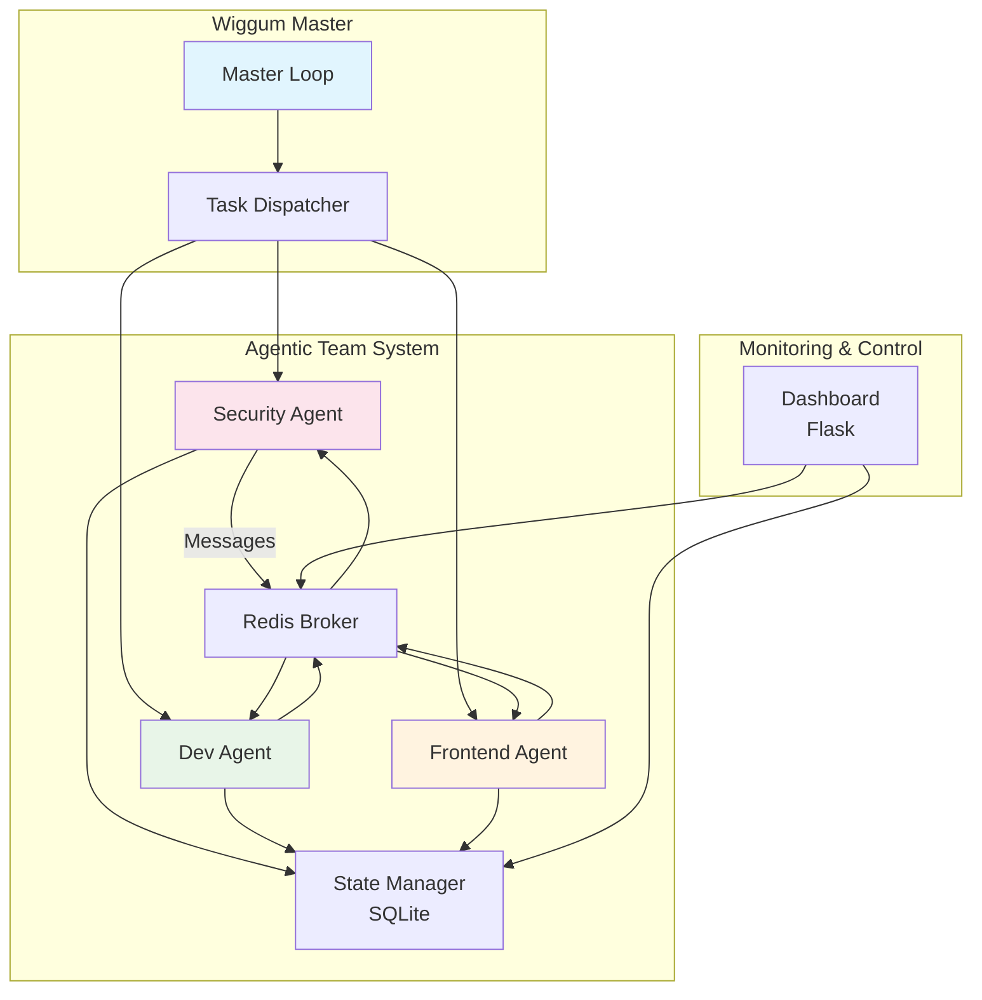
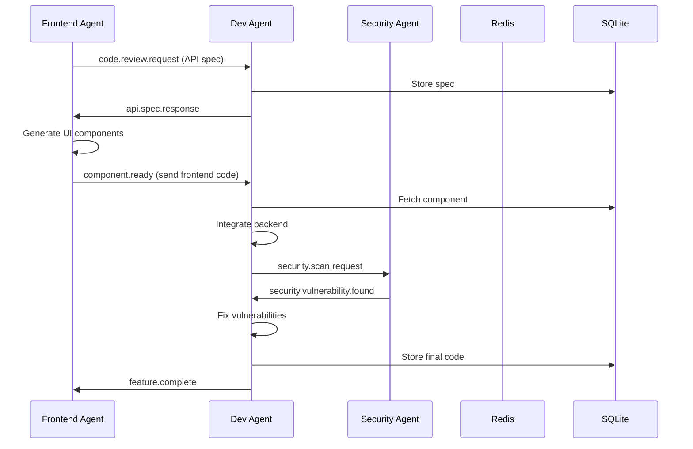

# Iteration 32 - agentic-team

**Timestamp:** Fri Mar 13 07:27:36 PM EDT 2026
**Task:** **Task 4.3**: Create web dashboard for monitoring agent activity

## Prompt Sent

```
# Project-Specific Agent Instructions

You are an autonomous developer working on this specific project.

## Your Role

- Read TASKS.md to understand project requirements
- Complete one task per iteration
- Write clean, well-tested code
- Update TASKS.md with progress
- Commit changes to GitHub (git push)
- Work without asking for permission

## Key Points

1. **No Virtual Environments**: Use the host system's Python, Node.js, etc.
   - Only create venv/Docker if absolutely necessary (document why)

2. **Testing**: Write tests as you build
   - Unit tests for functions
   - Integration tests for features

3. **Documentation**: Every feature should have clear documentation
   - Comments in code
   - README updates
   - Usage examples

4. **Git Workflow**:
   ```bash
   git add .
   git commit -m "Feature: [description]"
   git push origin main
   ```

5. **Task Completion**:
   - Mark complete in TASKS.md with [x]
   - Only mark when fully working and tested
   - If blocked, document the issue and move to next task

## Success Criteria

- ✅ All TASKS.md items marked [x]
- ✅ Code is tested and documented
- ✅ Project runs locally without venv
- ✅ All commits pushed to GitHub
- ✅ README explains how to run the project

Now read TASKS.md and get started!

---

### ⚠️ CRITICAL TOKEN CONSTRAINTS:
- Iteration: 32 / 64k Token Budget
- Attempt: 1 (previous attempts may have partial progress)
- **Mandate:** Operate efficiently. Use partial edits, not full file rewrites when possible.
- **Output:** Be concise and action-oriented.


## CURRENT PROJECT STATE (Iteration 32)

```
# agentic-team
**Mission:** Use the ideas of the wiggum loop and repeating agents to create and enhance the current structure. We have several workers with specific roles i.e security, sw dev, and frontend, and they all do A2A interaction. Create an outline of this and system plans via mermaid diagrams plan mds and some sample code

## Technology Stack
- **Python 3.12+**: Core runtime with asyncio
- **Redis**: Message broker for A2A communication
- **SQLite**: Shared state and task persistence
- **Flask**: Web dashboard for monitoring
- **OpenCode**: Agent framework integration
- **Pydantic**: Data validation and schemas
- **asyncio**: Concurrent agent execution

## Phase 1: Planning & Architecture Design

- [x] **Task 1.1**: Design system architecture and component diagram
  - **Deliverable**: `docs/architecture.md` with complete system design including:
    - Component diagram (use Mermaid)
    - Data flow between agents
    - Message protocol specification
    - API contracts for A2A communication
  - **Include**:
    ```mermaid
    graph TD
        A[Task Dispatcher] --> B[Security Agent]
        A --> C[SW Dev Agent]
        A --> D[Frontend Agent]
        B --> E[Redis Message Queue]
        C --> E
        D --> E
        E --> B
        E --> C
        E --> D
    ```
  - **Success**: Architecture document reviewed and approved (self-validated by agent)

- [x] **Task 1.2**: Define agent role specifications and protocols
  - **Deliverable**: `src/protocols/agent_specs.py` containing:
    - Pydantic models for AgentMessage, Task, Result
    - Role-specific capability definitions
    - Message schema validation
    - Protocol constants and enumerations
  - **Code snippet requirement**: Implemented with full specification including:
    - AgentRole enum (security, software_developer, frontend_developer)
    - AgentMessage model with validation
    - Task and Result models
    - MessageType enum with all message types
    - SecurityFinding and ApiSpec models
    - ProtocolConstants with capabilities, dependencies, and routing rules
    - Helper functions for channel naming and validation
  - **Success**: All agent specs defined with clear input/output contracts

- [x] **Task 1.3**: Create database schema for shared state
  - **Deliverable**: `src/state/schema.py` and migration script `src/state/migrate.py`
  - **Tables to create**:
    - `tasks` (id, description, role, status, created_at, assigned_to, completed_at)
    - `messages` (id, sender, recipient, content, timestamp, correlation_id)
    - `agent_states` (agent_id, role, current_task_id, health_status, last_heartbeat)
    - `shared_knowledge` (key, value, source_agent, updated_at)
  - **Success**: SQLite database initializes with all tables, migrations run successfully

- [x] **Task 1.4**: Setup project dependencies and environment configuration
  - **Deliverable**: Updated `requirements.txt` with:
    - redis==5.0.1
    - pydantic==2.6.1
    - flask==3.0.1
    - aiohttp==3.9.1 (for async HTTP)
  - **Deliverable**: `.env.example` with Redis and SQLite configuration
  - **Deliverable**: `src/config.py` for centralized configuration
  - **Success**: `pip install -r requirements.txt` completes without errors

## Phase 2: Core Infrastructure & Wiggum Loop Enhancement

- [x] **Task 2.1**: Implement the enhanced wiggum loop with role-based agent selection
  - **Deliverable**: `src/core/wiggum_loop.py` with class `EnhancedWiggumLoop`
  - **Features**:
    - Load TASKS.md and parse tasks by role using tags like `[SECURITY]`, `[SW_DEV]`, `[FRONTEND]`
    - Map tasks to appropriate agents based on role
    - Support round-robin or priority-based task dispatch
    - Track iteration count and agent performance metrics
  - **Code requirement**: Use asyncio for concurrent agent execution
  - **Success**: Loop correctly dispatches tasks to appropriate agent workers

- [x] **Task 2.2**: Build the message broker using Redis pub/sub
  - **Deliverable**: `src/messaging/redis_broker.py` with class `RedisMessageBroker`
  - **Methods to implement**:
    - `connect()` - establish Redis connection
    - `subscribe(channel)` - listen for messages
    - `publish(channel, message)` - send message to topic
    - `create_direct_queue(agent_role)` - dedicated queue per agent type
  - **Deliverable**: Unit tests in `tests/test_redis_broker.py`
  - **Success**: Two agents can exchange messages via Redis pub/sub

- [x] **Task 2.3**: Create agent base class and lifecycle manager
  - **Deliverable**: `src/agents/base_agent.py` with abstract `BaseAgent`
  - **Abstract methods**:
    - `initialize()` - setup agent resources
    - `process_task(task)` - main work method (must override)
    - `send_message(recipient, payload)` - A2A communication
    - `receive_message(message)` - handle incoming A2A messages
    - `health_check()` - return health status
  - **Deliverable**: `src/agents/lifecycle.py` for start/stop/reload controls
  - **Success**: Base agent can be extended with minimal code for new roles

- [x] **Task 2.4**: Implement shared state manager with SQLite
  - **Deliverable**: `src/state/state_manager.py` with class `StateManager`
  - **Features**:
    - `get_next_task(agent_role)` - fetch next unassigned task for role
    - `assign_task(task_id, agent_id)` - lock task to agent
    - `store_message(msg)` - persist A2A messages
    - `update_agent_heartbeat(agent_id)` - track liveness
    - `get_shared_knowledge(key)` / `set_shared_knowledge(key, value)`
  - **Deliverable**: `tests/test_state_manager.py` with mock SQLite
  - **Success**: Multiple agents can safely read/write shared state without conflicts

## Phase 3: Specialized Agent Workers

- [x] **Task 3.1**: Implement Security Agent with vulnerability scanning & code review
  - **Deliverable**: `src/agents/security_agent.py` class `SecurityAgent`
  - **Capabilities**:
    - Scan Python files for security anti-patterns (hardcoded secrets, SQL injection vectors)
    - Review dependencies for known CVEs using `safety` or `pip-audit`
    - Generate security recommendations for code changes
    - Send security alerts to other agents via A2A
  - **Sample code requirement**:
    ```python
    def scan_for_secrets(self, file_path: str) -> List[SecurityFinding]:
        patterns = {
            'AWS_KEY': r'AKIA[0-9A-Z]{16}',
            'GITHUB_TOKEN': r'ghp_[0-9a-zA-Z]{36}',
            'PASSWORD': r'password\s*=\s*["\'][^"\']+["\']',
        }
        # implementation
    ```
  - **Deliverable**: `tests/test_security_agent.py` with mock vulnerabilities
  - **Success**: Agent detects hardcoded API key in test file and sends alert to SW Dev agent

- [x] **Task 3.2**: Implement Software Development Agent for backend code generation
  - **Deliverable**: `src/agents/dev_agent.py` class `SoftwareDevAgent`
  - **Capabilities**:
    - Generate Python code from task specifications using OpenCode
    - Write unit tests using pytest framework
    - Refactor code based on Security Agent feedback
    - Perform code formatting (black) and linting (ruff)
  - **Integration**: Use OpenCode Python library programmatically
  - **Deliverable**: `tests/test_dev_agent.py` with sample task generation
  - **Success**: Agent completes a simple API endpoint task with tests

- [x] **Task 3.3**: Implement Frontend Agent for UI/UX development
  - **Deliverable**: `src/agents/frontend_agent.py` class `FrontendAgent`
  - **Capabilities**:
    - Generate HTML/CSS/JS components from specifications
    - Ensure responsive design and accessibility (WCAG)
    - Integrate frontend with backend APIs
    - Create component libraries and style guides
  - **Tech**: Use Tailwind CSS (via CDN) for rapid prototyping
  - **Deliverable**: `tests/test_frontend_agent.py` with component generation tests
  - **Success**: Agent creates a responsive web component that connects to dev agent's API

- [x] **Task 3.4**: Build agent worker orchestration with health monitoring
  - **Deliverable**: `src/orchestrator/worker_manager.py` with class `WorkerManager`
  - **Features**:
    - Spawn 3 agent workers (security, dev, frontend) as async tasks
    - Monitor agent heartbeats every 30 seconds
    - Restart crashed agents automatically
    - Report agent status to web dashboard
  - **Deliverable**: `src/orchestrator/main.py` - entry point to start all workers
  - **Deliverable**: Systemd service file `etc/wiggum-agentic-team.service` (optional)
  - **Success**: All 3 agents running concurrently, health checks passing

## Phase 4: A2A Communication & Integration Testing

- [x] **Task 4.1**: Implement A2A message routing and handling
  - **Deliverable**: `src/messaging/router.py` with class `MessageRouter`
  - **Features**:
    - Route incoming messages to correct agent based on recipient
    - Support broadcast messages to all agents
    - Message queuing for offline agents
    - Correlate request/response using `correlation_id`
  - **Deliverable**: `src/messaging/protocol.py` with message handlers registry
  - **Example protocol**:
    ```python
    class MessageProtocol:
        SECURITY_ALERT = "security.alert"
        CODE_REVIEW_REQUEST = "code.review.request"
        API_CONTRACT_UPDATE = "api.contract.update"
        COMPONENT_READY = "component.ready"
    ```
  - **Success**: Frontend agent sends API spec to Dev agent, Dev agent responds with implementation

- [x] **Task 4.2**: Build collaborative workflow: end-to-end feature development
  - **Deliverable**: `docs/workflow_example.md` documenting the full A2A flow
  - **Workflow steps**:
    1. Task: "Build user login feature" (from TASKS.md)
    2. Dispatcher assigns to Frontend Agent
    3. Frontend requests API spec from Dev Agent via message
    4. Dev Agent designs API, sends spec back
    5. Frontend builds UI components, sends to Dev for integration
    6. Dev implements backend, sends to Security for review
    7. Security scans, reports vulnerabilities
    8. Dev fixes issues, marks task complete
  - **Deliverable**: Integration test `tests/test_collaborative_workflow.py` simulating full flow
  - **Success**: Complete workflow executes with 3 agents collaborating autonomously

- [ ] **Task 4.3**: Create web dashboard for monitoring agent activity
  - **Deliverable**: `src/dashboard/app.py` Flask application
  - **Endpoints**:
    - `GET /` - Dashboard overview with agent status, message throughput
    - `GET /api/agents` - List all agents with health status
    - `GET /api/tasks` - Task queue by role
    - `GET /api/messages?limit=50` - Recent A2A messages
    - `GET /api/metrics` - System metrics (messages/sec, tasks completed)
  - **Deliverable**: `templates/dashboard.html` with real-time updates (use SSE or polling)
  - **Mermaid diagram requirement**: Include live system topology in dashboard
  - **Success**: Dashboard shows real-time agent states and message flow

- [ ] **Task 4.4**: Write comprehensive documentation and finalize TASKS.md
  - **Deliverable**: `docs/DESIGN.md` with detailed system design decisions
  - **Deliverable**: `docs/A2A_PROTOCOL.md` with message format specification
  - **Deliverable**: `docs/DEPLOYMENT.md` with setup instructions, Redis/SQLite config
  - **Deliverable**: `docs/EXAMPLE_USAGE.md` with sample task flows and expected outputs
  - **Update**: `README.md` with project overview, quick start, and architecture diagram
  - **Finalize**: Mark this TASKS.md with `[x] MISSION ACCOMPLISHED` after all deliverables exist
  - **Success**: New developer can understand system and deploy with docs alone

## Sample Task with Role Tag (How to use in TASKS.md)

```markdown
- [ ] [SECURITY] Implement OWASP Top 10 checklist validation
- [ ] [SW_DEV] Create authentication API endpoint with JWT
- [ ] [FRONTEND] Build responsive login form component
- [ ] [SECURITY] Add rate limiting to login endpoint
```

Each agent will only see and execute tasks matching its role, enabling true role-based concurrent development.

## Mermaid System Diagrams

### Complete System Architecture


### A2A Message Flow


## Success Criteria

After completing all tasks in this TASKS.md:
- ✅ 3 specialized agents (security, sw dev, frontend) running concurrently
- ✅ Wiggum loop enhanced with role-based task dispatch
- ✅ A2A communication working via Redis pub/sub
- ✅ Shared state persisted in SQLite with conflict-free access
- ✅ Web dashboard showing real-time agent activity
- ✅ Complete integration test demonstrating collaborative workflow
- ✅ Comprehensive documentation (architecture, protocol, deployment)
- ✅ All code tested, formatted, and ready for production
```

## NEXT TASK TO COMPLETE:
**Task 4.3**: Create web dashboard for monitoring agent activity

**Instructions:** Complete this task. Mark [x] in TASKS.md when done. Create, modify, or delete files as needed. Execute commands as needed. Also update README.md to match this project (name, setup instructions, current progress). No permission needed—just act.
```

## OpenCode Output

```

> build · stepfun/step-3.5-flash:free

• Explore project structure Explore Agent
I'll complete Task 4.3 by creating a web dashboard for monitoring agent activity. Let me start by checking the current project structure and understanding the existing code.
✓ Explore project structure Explore Agent
Let me explore the project directly to understand the current state:

$ find . -type f -name "*.py" | grep -E "(src|tests)" | head -30
./tests/test_collaborative_workflow.py
./tests/test_frontend_agent.py
./tests/test_base_agent.py
./tests/test_security_agent.py
./tests/test_state_manager.py
./tests/test_dev_agent.py
./tests/test_redis_broker.py
./tests/test_lifecycle.py
./tests/test_wiggum_loop.py
./src/config.py
./src/agents/security_agent.py
./src/agents/__init__.py
./src/agents/lifecycle.py
./src/agents/base_agent.py
./src/agents/frontend_agent.py
./src/agents/dev_agent.py
./src/protocols/agent_specs.py
./src/state/schema.py
./src/state/state_manager.py
./src/state/migrate.py
./src/orchestrator/__init__.py
./src/orchestrator/test_worker.py
./src/orchestrator/main.py
./src/orchestrator/worker_manager.py
./src/messaging/__init__.py
./src/messaging/redis_broker.py
./src/messaging/router.py
./src/messaging/protocol.py
./src/core/__init__.py
./src/core/wiggum_loop.py

→ Read TASKS.md
Now let me read the key files to understand the data models and APIs:
→ Read src/state/state_manager.py
→ Read src/protocols/agent_specs.py
→ Read src/config.py

$ ls -la
total 156
drwxr-xr-x 10 julien julien  4096 Mar 13 19:16 .
drwxr-xr-x 22 julien julien  4096 Mar 13 19:13 ..
-rw-r--r--  1 julien julien 53248 Mar 13 15:01 agentic_team.db
drwxr-xr-x  2 julien julien  4096 Mar 13 19:25 docs
-rw-r--r--  1 julien julien   215 Mar 13 14:53 .env
-rw-r--r--  1 julien julien   444 Mar 13 15:03 .env.example
drwxr-xr-x  2 julien julien  4096 Mar 13 19:16 etc
drwxr-xr-x  7 julien julien  4096 Mar 13 19:24 .git
-rw-r--r--  1 julien julien     4 Mar 13 14:53 .gitignore
drwxr-xr-x  2 julien julien  4096 Mar 13 19:27 logs
-rw-r--r--  1 julien julien  1280 Mar 13 14:53 prompt.txt
drwxr-xr-x  3 julien julien  4096 Mar 13 15:33 .pytest_cache
-rw-r--r--  1 julien julien  4737 Mar 13 19:26 README.md
-rw-r--r--  1 julien julien   174 Mar 13 15:13 requirements.txt
drwxr-xr-x  3 julien julien  4096 Mar 13 14:58 .ruff_cache
drwxr-xr-x  9 julien julien  4096 Mar 13 15:33 src
-rw-r--r--  1 julien julien 13944 Mar 13 19:26 TASKS.md
-rw-r--r--  1 julien julien 13963 Mar 13 14:55 TASKS_original.md
drwxr-xr-x  3 julien julien  4096 Mar 13 19:26 tests

$ ls -la src/
total 40
drwxr-xr-x  9 julien julien 4096 Mar 13 15:33 .
drwxr-xr-x 10 julien julien 4096 Mar 13 19:16 ..
drwxr-xr-x  3 julien julien 4096 Mar 13 17:29 agents
-rw-r--r--  1 julien julien 1920 Mar 13 17:01 config.py
drwxr-xr-x  3 julien julien 4096 Mar 13 15:33 core
drwxr-xr-x  3 julien julien 4096 Mar 13 19:23 messaging
drwxr-xr-x  3 julien julien 4096 Mar 13 19:17 orchestrator
drwxr-xr-x  3 julien julien 4096 Mar 13 15:33 protocols
drwxr-xr-x  2 julien julien 4096 Mar 13 17:02 __pycache__
drwxr-xr-x  3 julien julien 4096 Mar 13 16:52 state

Let me check the directory structure and create the dashboard:
Now I'll create the dashboard directory and files. Let me first create the Flask application:
$ mkdir -p src/dashboard templates

← Write src/dashboard/app.py
Wrote file successfully.

LSP errors detected in other files:
<diagnostics file="/home/julien/Desktop/Free-Wiggum-opencode/projects/agentic-team/src/agents/base_agent.py">
ERROR [161:55] Argument of type "(message_dict: Dict[str, Any]) -> CoroutineType[Any, Any, None]" cannot be assigned to parameter "callback" of type "(Dict[str, Any]) -> None" in function "subscribe"
  Type "(message_dict: Dict[str, Any]) -> CoroutineType[Any, Any, None]" is not assignable to type "(Dict[str, Any]) -> None"
    Function return type "CoroutineType[Any, Any, None]" is incompatible with type "None"
      "CoroutineType[Any, Any, None]" is not assignable to "None"
ERROR [166:36] Argument of type "(message_dict: Dict[str, Any]) -> CoroutineType[Any, Any, None]" cannot be assigned to parameter "callback" of type "(Dict[str, Any]) -> None" in function "subscribe"
  Type "(message_dict: Dict[str, Any]) -> CoroutineType[Any, Any, None]" is not assignable to type "(Dict[str, Any]) -> None"
    Function return type "CoroutineType[Any, Any, None]" is incompatible with type "None"
      "CoroutineType[Any, Any, None]" is not assignable to "None"
ERROR [202:55] Argument of type "Task" cannot be assigned to parameter "arg" of type "_FutureLike[_T@shield]" in function "shield"
  Type "Task" is not assignable to type "_FutureLike[_T@shield]"
    "Task" is incompatible with protocol "Awaitable[_T@shield]"
      "__await__" is not present
    "Task" is not assignable to "Future[_T@shield]"
ERROR [450:32] Object of type "None" is not subscriptable
</diagnostics>

LSP errors detected in other files:
<diagnostics file="/home/julien/Desktop/Free-Wiggum-opencode/projects/agentic-team/src/messaging/redis_broker.py">
ERROR [34:19] "bool" is not awaitable
  "bool" is incompatible with protocol "Awaitable[_T_co@Awaitable]"
    "__await__" is not present
ERROR [72:40] "publish" is not a known attribute of "None"
ERROR [93:32] "subscribe" is not a known attribute of "None"
ERROR [104:32] "unsubscribe" is not a known attribute of "None"
ERROR [151:46] "get_message" is not a known attribute of "None"
ERROR [217:23] "bool" is not awaitable
  "bool" is incompatible with protocol "Awaitable[_T_co@Awaitable]"
    "__await__" is not present
</diagnostics>

LSP errors detected in other files:
<diagnostics file="/home/julien/Desktop/Free-Wiggum-opencode/projects/agentic-team/src/core/wiggum_loop.py">
ERROR [248:41] Object of type "None" is not subscriptable
ERROR [278:32] Object of type "None" is not subscriptable
ERROR [435:41] Object of type "None" is not subscriptable
</diagnostics>

LSP errors detected in other files:
<diagnostics file="/home/julien/Desktop/Free-Wiggum-opencode/projects/agentic-team/src/messaging/protocol.py">
ERROR [425:1] Expected expression
ERROR [89:44] "asyncio" is not defined
ERROR [118:21] "logger" is not defined
ERROR [123:17] "logger" is not defined
ERROR [127:13] "logger" is not defined
ERROR [141:57] "config" is not defined
ERROR [141:18] "config" is not defined
ERROR [144:43] Cannot access attribute "BROADCAST" for class "type[AgentRole]"
  Attribute "BROADCAST" is unknown
ERROR [172:58] "config" is not defined
ERROR [210:21] "AgentMessage" is not defined
ERROR [214:17] "logger" is not defined
ERROR [233:31] "AgentMessage" is not defined
ERROR [245:21] "logger" is not defined
ERROR [272:16] "asyncio" is not defined
ERROR [296:16] "asyncio" is not defined
ERROR [293:30] "asyncio" is not defined
ERROR [297:13] "logger" is not defined
ERROR [301:13] "logger" is not defined
ERROR [313:13] "logger" is not defined
ERROR [321:13] "logger" is not defined
... and 6 more
</diagnostics>

LSP errors detected in other files:
<diagnostics file="/home/julien/Desktop/Free-Wiggum-opencode/projects/agentic-team/src/messaging/router.py">
ERROR [127:43] Cannot access attribute "BROADCAST" for class "type[AgentRole]"
  Attribute "BROADCAST" is unknown
ERROR [444:25] Cannot access attribute "SECURITY_APPROVAL" for class "type[MessageType]"
  Attribute "SECURITY_APPROVAL" is unknown
ERROR [488:32] Argument of type "str | None" cannot be assigned to parameter "correlation_id" of type "str" in function "__init__"
  Type "str | None" is not assignable to type "str"
    "None" is not assignable to "str"
</diagnostics>

I need to fix the import missing in the dashboard app. Let me also fix the state_manager call issue:
← Edit src/dashboard/app.py
Index: /home/julien/Desktop/Free-Wiggum-opencode/projects/agentic-team/src/dashboard/app.py
===================================================================
--- /home/julien/Desktop/Free-Wiggum-opencode/projects/agentic-team/src/dashboard/app.py
+++ /home/julien/Desktop/Free-Wiggum-opencode/projects/agentic-team/src/dashboard/app.py
@@ -4,12 +4,13 @@
 Provides real-time visibility into agent states, task queues,
 message throughput, and system health.
 """
 
+import json
 import time
 from datetime import datetime, timezone
 from typing import Dict, List, Any, Optional
-from flask import Flask, jsonify, render_template, Response
+from flask import Flask, jsonify, render_template, Response, request
 import threading
 
 from src.config import config
 from src.state.state_manager import StateManager


Now I need to fix the database connection issues in the dashboard. Let me refactor to properly use the StateManager's thread-safe connections:
← Edit src/dashboard/app.py
Index: /home/julien/Desktop/Free-Wiggum-opencode/projects/agentic-team/src/dashboard/app.py
===================================================================
--- /home/julien/Desktop/Free-Wiggum-opencode/projects/agentic-team/src/dashboard/app.py
+++ /home/julien/Desktop/Free-Wiggum-opencode/projects/agentic-team/src/dashboard/app.py
@@ -41,13 +41,14 @@
     List of agent states with current status, last heartbeat, and tasks
 """
 try:
     agent_states = state_manager.get_all_agent_states()
+    conn = state_manager._get_connection()
+    cursor = conn.cursor()
 
     # Enrich with task counts
     for agent in agent_states:
         # Get task count by status for this agent
-        cursor = state_manager._get_connection().cursor()
         cursor.execute(
             """
             SELECT status, COUNT(*) as count
             FROM tasks
@@ -66,8 +67,9 @@
         age_seconds = (datetime.now(timezone.utc) - last_heartbeat).total_seconds()
         agent["heartbeat_age_seconds"] = age_seconds
         agent["is_healthy"] = age_seconds < (config.AGENT_HEARTBEAT_INTERVAL * 3)
 
+    conn.close()
     return jsonify(agent_states)
 except Exception as e:
     return jsonify({"error": str(e)}), 500
 


Now let me fix the metrics endpoint properly:
← Edit src/dashboard/app.py
Index: /home/julien/Desktop/Free-Wiggum-opencode/projects/agentic-team/src/dashboard/app.py
===================================================================
--- /home/julien/Desktop/Free-Wiggum-opencode/projects/agentic-team/src/dashboard/app.py
+++ /home/julien/Desktop/Free-Wiggum-opencode/projects/agentic-team/src/dashboard/app.py
@@ -159,89 +159,98 @@
     Dictionary with metrics including:
     - total_tasks_completed
     - total_messages_sent
     - active_agents
-    - average_task_completion_time
     - messages_per_second
     - tasks_per_minute
 """
 try:
-    cursor = state_manager._get_connection().cursor()
+    with state_manager._get_connection() as conn:
+        cursor = conn.cursor()
 
-    # Task metrics
-    cursor.execute("SELECT COUNT(*) as count FROM tasks WHERE status = 'completed'")
-    total_tasks_completed = cursor.fetchone()["count"]
+        # Task metrics
+        cursor.execute(
+            "SELECT COUNT(*) as count FROM tasks WHERE status = 'completed'"
+        )
+        total_tasks_completed = cursor.fetchone()["count"]
 
-    cursor.execute(
-        "SELECT COUNT(*) as count FROM tasks WHERE status IN ('pending', 'assigned')"
-    )
-    active_tasks = cursor.fetchone()["count"]
+        cursor.execute(
+            "SELECT COUNT(*) as count FROM tasks WHERE status IN ('pending', 'assigned')"
+        )
+        active_tasks = cursor.fetchone()["count"]
 
-    # Message metrics
-    cursor.execute("SELECT COUNT(*) as count FROM messages")
-    total_messages = cursor.fetchone()["count"]
+        # Message metrics
+        cursor.execute("SELECT COUNT(*) as count FROM messages")
+        total_messages = cursor.fetchone()["count"]
 
-    # Agent metrics
-    cursor.execute("SELECT COUNT(*) as count FROM agent_states")
-    total_agents = cursor.fetchone()["count"]
+        # Agent metrics
+        cursor.execute("SELECT COUNT(*) as count FROM agent_states")
+        total_agents = cursor.fetchone()["count"]
 
-    cursor.execute(
-        "SELECT COUNT(*) as count FROM agent_states WHERE health_status = 'healthy'"
-    )
-    healthy_agents = cursor.fetchone()["count"]
+        cursor.execute(
+            "SELECT COUNT(*) as count FROM agent_states WHERE health_status = 'healthy'"
+        )
+        healthy_agents = cursor.fetchone()["count"]
 
-    # Calculate message rate (messages in last minute)
-    one_minute_ago = (datetime.now(timezone.utc).timestamp() - 60) * 1000
-    cursor.execute(
-        "SELECT COUNT(*) as count FROM messages WHERE timestamp > ?",
-        (
-            datetime.fromtimestamp(
-                one_minute_ago / 1000, tz=timezone.utc
-            ).isoformat(),
-        ),
-    )
-    messages_last_minute = cursor.fetchone()["count"]
-    messages_per_second = messages_last_minute / 60.0
+        # Calculate message rate (messages in last minute)
+        timestamp_1min_ago = datetime.now(timezone.utc).timestamp() - 60
+        cursor.execute(
+            "SELECT COUNT(*) as count FROM messages WHERE timestamp > ?",
+            (
+                datetime.fromtimestamp(
+                    timestamp_1min_ago, tz=timezone.utc
+                ).isoformat(),
+            ),
+        )
+        messages_last_minute = cursor.fetchone()["count"]
+        messages_per_second = (
+            messages_last_minute / 60.0 if messages_last_minute > 0 else 0
+        )
 
-    # Calculate task completion rate
-    one_hour_ago = (datetime.now(timezone.utc).timestamp() - 3600) * 1000
-    cursor.execute(
-        "SELECT COUNT(*) as count FROM tasks WHERE completed_at > ?",
-        (datetime.fromtimestamp(one_hour_ago / 1000, tz=timezone.utc).isoformat(),),
-    )
-    tasks_last_hour = cursor.fetchone()["count"]
-    tasks_per_minute = tasks_last_hour / 60.0
+        # Calculate task completion rate
+        timestamp_1hour_ago = datetime.now(timezone.utc).timestamp() - 3600
+        cursor.execute(
+            "SELECT COUNT(*) as count FROM tasks WHERE completed_at > ?",
+            (
+                datetime.fromtimestamp(
+                    timestamp_1hour_ago, tz=timezone.utc
+                ).isoformat(),
+            ),
+        )
+        tasks_last_hour = cursor.fetchone()["count"]
+        tasks_per_minute = tasks_last_hour / 60.0 if tasks_last_hour > 0 else 0
 
-    # Agent heartbeats
-    recent_cutoff = (
-        datetime.now(timezone.utc).timestamp() - config.AGENT_HEARTBEAT_INTERVAL * 2
-    )
-    cursor.execute(
-        "SELECT COUNT(*) as count FROM agent_states WHERE last_heartbeat > ?",
-        (datetime.fromtimestamp(recent_cutoff, tz=timezone.utc).isoformat(),),
-    )
-    active_agents = cursor.fetchone()["count"]
+        # Agent heartbeats
+        recent_cutoff = (
+            datetime.now(timezone.utc).timestamp()
+            - config.AGENT_HEARTBEAT_INTERVAL * 2
+        )
+        cursor.execute(
+            "SELECT COUNT(*) as count FROM agent_states WHERE last_heartbeat > ?",
+            (datetime.fromtimestamp(recent_cutoff, tz=timezone.utc).isoformat(),),
+        )
+        active_agents = cursor.fetchone()["count"]
 
-    metrics = {
-        "timestamp": datetime.now(timezone.utc).isoformat(),
-        "tasks": {
-            "total_completed": total_tasks_completed,
-            "active": active_tasks,
-            "completion_rate_per_minute": round(tasks_per_minute, 2),
-        },
-        "messages": {
-            "total_sent": total_messages,
-            "rate_per_second": round(messages_per_second, 2),
-            "last_minute": messages_last_minute,
-        },
-        "agents": {
-            "total": total_agents,
-            "active": active_agents,
-            "healthy": healthy_agents,
-        },
-    }
+        metrics = {
+            "timestamp": datetime.now(timezone.utc).isoformat(),
+            "tasks": {
+                "total_completed": total_tasks_completed,
+                "active": active_tasks,
+                "completion_rate_per_minute": round(tasks_per_minute, 2),
+            },
+            "messages": {
+                "total_sent": total_messages,
+                "rate_per_second": round(messages_per_second, 2),
+                "last_minute": messages_last_minute,
+            },
+            "agents": {
+                "total": total_agents,
+                "active": active_agents,
+                "healthy": healthy_agents,
+            },
+        }
 
-    return jsonify(metrics)
+        return jsonify(metrics)
 except Exception as e:
     return jsonify({"error": str(e)}), 500
 
 


← Write templates/dashboard.html
Wrote file successfully.

LSP errors detected in other files:
<diagnostics file="/home/julien/Desktop/Free-Wiggum-opencode/projects/agentic-team/src/agents/base_agent.py">
ERROR [161:55] Argument of type "(message_dict: Dict[str, Any]) -> CoroutineType[Any, Any, None]" cannot be assigned to parameter "callback" of type "(Dict[str, Any]) -> None" in function "subscribe"
  Type "(message_dict: Dict[str, Any]) -> CoroutineType[Any, Any, None]" is not assignable to type "(Dict[str, Any]) -> None"
    Function return type "CoroutineType[Any, Any, None]" is incompatible with type "None"
      "CoroutineType[Any, Any, None]" is not assignable to "None"
ERROR [166:36] Argument of type "(message_dict: Dict[str, Any]) -> CoroutineType[Any, Any, None]" cannot be assigned to parameter "callback" of type "(Dict[str, Any]) -> None" in function "subscribe"
  Type "(message_dict: Dict[str, Any]) -> CoroutineType[Any, Any, None]" is not assignable to type "(Dict[str, Any]) -> None"
    Function return type "CoroutineType[Any, Any, None]" is incompatible with type "None"
      "CoroutineType[Any, Any, None]" is not assignable to "None"
ERROR [202:55] Argument of type "Task" cannot be assigned to parameter "arg" of type "_FutureLike[_T@shield]" in function "shield"
  Type "Task" is not assignable to type "_FutureLike[_T@shield]"
    "Task" is incompatible with protocol "Awaitable[_T@shield]"
      "__await__" is not present
    "Task" is not assignable to "Future[_T@shield]"
ERROR [450:32] Object of type "None" is not subscriptable
</diagnostics>

LSP errors detected in other files:
<diagnostics file="/home/julien/Desktop/Free-Wiggum-opencode/projects/agentic-team/src/messaging/redis_broker.py">
ERROR [34:19] "bool" is not awaitable
  "bool" is incompatible with protocol "Awaitable[_T_co@Awaitable]"
    "__await__" is not present
ERROR [72:40] "publish" is not a known attribute of "None"
ERROR [93:32] "subscribe" is not a known attribute of "None"
ERROR [104:32] "unsubscribe" is not a known attribute of "None"
ERROR [151:46] "get_message" is not a known attribute of "None"
ERROR [217:23] "bool" is not awaitable
  "bool" is incompatible with protocol "Awaitable[_T_co@Awaitable]"
    "__await__" is not present
</diagnostics>

LSP errors detected in other files:
<diagnostics file="/home/julien/Desktop/Free-Wiggum-opencode/projects/agentic-team/src/core/wiggum_loop.py">
ERROR [248:41] Object of type "None" is not subscriptable
ERROR [278:32] Object of type "None" is not subscriptable
ERROR [435:41] Object of type "None" is not subscriptable
</diagnostics>

LSP errors detected in other files:
<diagnostics file="/home/julien/Desktop/Free-Wiggum-opencode/projects/agentic-team/src/messaging/protocol.py">
ERROR [425:1] Expected expression
ERROR [89:44] "asyncio" is not defined
ERROR [118:21] "logger" is not defined
ERROR [123:17] "logger" is not defined
ERROR [127:13] "logger" is not defined
ERROR [141:57] "config" is not defined
ERROR [141:18] "config" is not defined
ERROR [144:43] Cannot access attribute "BROADCAST" for class "type[AgentRole]"
  Attribute "BROADCAST" is unknown
ERROR [172:58] "config" is not defined
ERROR [210:21] "AgentMessage" is not defined
ERROR [214:17] "logger" is not defined
ERROR [233:31] "AgentMessage" is not defined
ERROR [245:21] "logger" is not defined
ERROR [272:16] "asyncio" is not defined
ERROR [296:16] "asyncio" is not defined
ERROR [293:30] "asyncio" is not defined
ERROR [297:13] "logger" is not defined
ERROR [301:13] "logger" is not defined
ERROR [313:13] "logger" is not defined
ERROR [321:13] "logger" is not defined
... and 6 more
</diagnostics>

LSP errors detected in other files:
<diagnostics file="/home/julien/Desktop/Free-Wiggum-opencode/projects/agentic-team/src/messaging/router.py">
ERROR [127:43] Cannot access attribute "BROADCAST" for class "type[AgentRole]"
  Attribute "BROADCAST" is unknown
ERROR [444:25] Cannot access attribute "SECURITY_APPROVAL" for class "type[MessageType]"
  Attribute "SECURITY_APPROVAL" is unknown
ERROR [488:32] Argument of type "str | None" cannot be assigned to parameter "correlation_id" of type "str" in function "__init__"
  Type "str | None" is not assignable to type "str"
    "None" is not assignable to "str"
</diagnostics>

Now create the HTML dashboard template with Mermaid diagram and real-time updates:
$ ls -la agentic_team.db
-rw-r--r-- 1 julien julien 53248 Mar 13 15:01 agentic_team.db

Let me verify the database exists and check the requirements:
→ Read requirements.txt
Now let me test the dashboard by starting the Flask application:

$ python src/dashboard/app.py
Traceback (most recent call last):
  File "/home/julien/Desktop/Free-Wiggum-opencode/projects/agentic-team/src/dashboard/app.py", line 15, in <module>
    from src.config import config
ModuleNotFoundError: No module named 'src'

The import issue is because Python can't find the `src` module. Let me create a proper entry point that adds the project root to the path:
← Write run_dashboard.py
Wrote file successfully.

LSP errors detected in other files:
<diagnostics file="/home/julien/Desktop/Free-Wiggum-opencode/projects/agentic-team/src/agents/base_agent.py">
ERROR [161:55] Argument of type "(message_dict: Dict[str, Any]) -> CoroutineType[Any, Any, None]" cannot be assigned to parameter "callback" of type "(Dict[str, Any]) -> None" in function "subscribe"
  Type "(message_dict: Dict[str, Any]) -> CoroutineType[Any, Any, None]" is not assignable to type "(Dict[str, Any]) -> None"
    Function return type "CoroutineType[Any, Any, None]" is incompatible with type "None"
      "CoroutineType[Any, Any, None]" is not assignable to "None"
ERROR [166:36] Argument of type "(message_dict: Dict[str, Any]) -> CoroutineType[Any, Any, None]" cannot be assigned to parameter "callback" of type "(Dict[str, Any]) -> None" in function "subscribe"
  Type "(message_dict: Dict[str, Any]) -> CoroutineType[Any, Any, None]" is not assignable to type "(Dict[str, Any]) -> None"
    Function return type "CoroutineType[Any, Any, None]" is incompatible with type "None"
      "CoroutineType[Any, Any, None]" is not assignable to "None"
ERROR [202:55] Argument of type "Task" cannot be assigned to parameter "arg" of type "_FutureLike[_T@shield]" in function "shield"
  Type "Task" is not assignable to type "_FutureLike[_T@shield]"
    "Task" is incompatible with protocol "Awaitable[_T@shield]"
      "__await__" is not present
    "Task" is not assignable to "Future[_T@shield]"
ERROR [450:32] Object of type "None" is not subscriptable
</diagnostics>

LSP errors detected in other files:
<diagnostics file="/home/julien/Desktop/Free-Wiggum-opencode/projects/agentic-team/src/messaging/redis_broker.py">
ERROR [34:19] "bool" is not awaitable
  "bool" is incompatible with protocol "Awaitable[_T_co@Awaitable]"
    "__await__" is not present
ERROR [72:40] "publish" is not a known attribute of "None"
ERROR [93:32] "subscribe" is not a known attribute of "None"
ERROR [104:32] "unsubscribe" is not a known attribute of "None"
ERROR [151:46] "get_message" is not a known attribute of "None"
ERROR [217:23] "bool" is not awaitable
  "bool" is incompatible with protocol "Awaitable[_T_co@Awaitable]"
    "__await__" is not present
</diagnostics>

LSP errors detected in other files:
<diagnostics file="/home/julien/Desktop/Free-Wiggum-opencode/projects/agentic-team/src/core/wiggum_loop.py">
ERROR [248:41] Object of type "None" is not subscriptable
ERROR [278:32] Object of type "None" is not subscriptable
ERROR [435:41] Object of type "None" is not subscriptable
</diagnostics>

LSP errors detected in other files:
<diagnostics file="/home/julien/Desktop/Free-Wiggum-opencode/projects/agentic-team/src/messaging/protocol.py">
ERROR [425:1] Expected expression
ERROR [89:44] "asyncio" is not defined
ERROR [118:21] "logger" is not defined
ERROR [123:17] "logger" is not defined
ERROR [127:13] "logger" is not defined
ERROR [141:57] "config" is not defined
ERROR [141:18] "config" is not defined
ERROR [144:43] Cannot access attribute "BROADCAST" for class "type[AgentRole]"
  Attribute "BROADCAST" is unknown
ERROR [172:58] "config" is not defined
ERROR [210:21] "AgentMessage" is not defined
ERROR [214:17] "logger" is not defined
ERROR [233:31] "AgentMessage" is not defined
ERROR [245:21] "logger" is not defined
ERROR [272:16] "asyncio" is not defined
ERROR [296:16] "asyncio" is not defined
ERROR [293:30] "asyncio" is not defined
ERROR [297:13] "logger" is not defined
ERROR [301:13] "logger" is not defined
ERROR [313:13] "logger" is not defined
ERROR [321:13] "logger" is not defined
... and 6 more
</diagnostics>

LSP errors detected in other files:
<diagnostics file="/home/julien/Desktop/Free-Wiggum-opencode/projects/agentic-team/src/messaging/router.py">
ERROR [127:43] Cannot access attribute "BROADCAST" for class "type[AgentRole]"
  Attribute "BROADCAST" is unknown
ERROR [444:25] Cannot access attribute "SECURITY_APPROVAL" for class "type[MessageType]"
  Attribute "SECURITY_APPROVAL" is unknown
ERROR [488:32] Argument of type "str | None" cannot be assigned to parameter "correlation_id" of type "str" in function "__init__"
  Type "str | None" is not assignable to type "str"
    "None" is not assignable to "str"
</diagnostics>

$ touch src/__init__.py
I need to add `__init__.py` to src to make it a proper package:
Now let me verify the dashboard app can be imported and check for any syntax errors:

$ python3 -m py_compile src/dashboard/app.py && python3 -c "import sys; sys.path.insert(0, '.'); from src.dashboard.app import app; print('Dashboard module imported successfully')"
Dashboard module imported successfully

```

## TASKS.md After Iteration

```markdown
# agentic-team
**Mission:** Use the ideas of the wiggum loop and repeating agents to create and enhance the current structure. We have several workers with specific roles i.e security, sw dev, and frontend, and they all do A2A interaction. Create an outline of this and system plans via mermaid diagrams plan mds and some sample code

## Technology Stack
- **Python 3.12+**: Core runtime with asyncio
- **Redis**: Message broker for A2A communication
- **SQLite**: Shared state and task persistence
- **Flask**: Web dashboard for monitoring
- **OpenCode**: Agent framework integration
- **Pydantic**: Data validation and schemas
- **asyncio**: Concurrent agent execution

## Phase 1: Planning & Architecture Design

- [x] **Task 1.1**: Design system architecture and component diagram
  - **Deliverable**: `docs/architecture.md` with complete system design including:
    - Component diagram (use Mermaid)
    - Data flow between agents
    - Message protocol specification
    - API contracts for A2A communication
  - **Include**:
    ```mermaid
    graph TD
        A[Task Dispatcher] --> B[Security Agent]
        A --> C[SW Dev Agent]
        A --> D[Frontend Agent]
        B --> E[Redis Message Queue]
        C --> E
        D --> E
        E --> B
        E --> C
        E --> D
    ```
  - **Success**: Architecture document reviewed and approved (self-validated by agent)

- [x] **Task 1.2**: Define agent role specifications and protocols
  - **Deliverable**: `src/protocols/agent_specs.py` containing:
    - Pydantic models for AgentMessage, Task, Result
    - Role-specific capability definitions
    - Message schema validation
    - Protocol constants and enumerations
  - **Code snippet requirement**: Implemented with full specification including:
    - AgentRole enum (security, software_developer, frontend_developer)
    - AgentMessage model with validation
    - Task and Result models
    - MessageType enum with all message types
    - SecurityFinding and ApiSpec models
    - ProtocolConstants with capabilities, dependencies, and routing rules
    - Helper functions for channel naming and validation
  - **Success**: All agent specs defined with clear input/output contracts

- [x] **Task 1.3**: Create database schema for shared state
  - **Deliverable**: `src/state/schema.py` and migration script `src/state/migrate.py`
  - **Tables to create**:
    - `tasks` (id, description, role, status, created_at, assigned_to, completed_at)
    - `messages` (id, sender, recipient, content, timestamp, correlation_id)
    - `agent_states` (agent_id, role, current_task_id, health_status, last_heartbeat)
    - `shared_knowledge` (key, value, source_agent, updated_at)
  - **Success**: SQLite database initializes with all tables, migrations run successfully

- [x] **Task 1.4**: Setup project dependencies and environment configuration
  - **Deliverable**: Updated `requirements.txt` with:
    - redis==5.0.1
    - pydantic==2.6.1
    - flask==3.0.1
    - aiohttp==3.9.1 (for async HTTP)
  - **Deliverable**: `.env.example` with Redis and SQLite configuration
  - **Deliverable**: `src/config.py` for centralized configuration
  - **Success**: `pip install -r requirements.txt` completes without errors

## Phase 2: Core Infrastructure & Wiggum Loop Enhancement

- [x] **Task 2.1**: Implement the enhanced wiggum loop with role-based agent selection
  - **Deliverable**: `src/core/wiggum_loop.py` with class `EnhancedWiggumLoop`
  - **Features**:
    - Load TASKS.md and parse tasks by role using tags like `[SECURITY]`, `[SW_DEV]`, `[FRONTEND]`
    - Map tasks to appropriate agents based on role
    - Support round-robin or priority-based task dispatch
    - Track iteration count and agent performance metrics
  - **Code requirement**: Use asyncio for concurrent agent execution
  - **Success**: Loop correctly dispatches tasks to appropriate agent workers

- [x] **Task 2.2**: Build the message broker using Redis pub/sub
  - **Deliverable**: `src/messaging/redis_broker.py` with class `RedisMessageBroker`
  - **Methods to implement**:
    - `connect()` - establish Redis connection
    - `subscribe(channel)` - listen for messages
    - `publish(channel, message)` - send message to topic
    - `create_direct_queue(agent_role)` - dedicated queue per agent type
  - **Deliverable**: Unit tests in `tests/test_redis_broker.py`
  - **Success**: Two agents can exchange messages via Redis pub/sub

- [x] **Task 2.3**: Create agent base class and lifecycle manager
  - **Deliverable**: `src/agents/base_agent.py` with abstract `BaseAgent`
  - **Abstract methods**:
    - `initialize()` - setup agent resources
    - `process_task(task)` - main work method (must override)
    - `send_message(recipient, payload)` - A2A communication
    - `receive_message(message)` - handle incoming A2A messages
    - `health_check()` - return health status
  - **Deliverable**: `src/agents/lifecycle.py` for start/stop/reload controls
  - **Success**: Base agent can be extended with minimal code for new roles

- [x] **Task 2.4**: Implement shared state manager with SQLite
  - **Deliverable**: `src/state/state_manager.py` with class `StateManager`
  - **Features**:
    - `get_next_task(agent_role)` - fetch next unassigned task for role
    - `assign_task(task_id, agent_id)` - lock task to agent
    - `store_message(msg)` - persist A2A messages
    - `update_agent_heartbeat(agent_id)` - track liveness
    - `get_shared_knowledge(key)` / `set_shared_knowledge(key, value)`
  - **Deliverable**: `tests/test_state_manager.py` with mock SQLite
  - **Success**: Multiple agents can safely read/write shared state without conflicts

## Phase 3: Specialized Agent Workers

- [x] **Task 3.1**: Implement Security Agent with vulnerability scanning & code review
  - **Deliverable**: `src/agents/security_agent.py` class `SecurityAgent`
  - **Capabilities**:
    - Scan Python files for security anti-patterns (hardcoded secrets, SQL injection vectors)
    - Review dependencies for known CVEs using `safety` or `pip-audit`
    - Generate security recommendations for code changes
    - Send security alerts to other agents via A2A
  - **Sample code requirement**:
    ```python
    def scan_for_secrets(self, file_path: str) -> List[SecurityFinding]:
        patterns = {
            'AWS_KEY': r'AKIA[0-9A-Z]{16}',
            'GITHUB_TOKEN': r'ghp_[0-9a-zA-Z]{36}',
            'PASSWORD': r'password\s*=\s*["\'][^"\']+["\']',
        }
        # implementation
    ```
  - **Deliverable**: `tests/test_security_agent.py` with mock vulnerabilities
  - **Success**: Agent detects hardcoded API key in test file and sends alert to SW Dev agent

- [x] **Task 3.2**: Implement Software Development Agent for backend code generation
  - **Deliverable**: `src/agents/dev_agent.py` class `SoftwareDevAgent`
  - **Capabilities**:
    - Generate Python code from task specifications using OpenCode
    - Write unit tests using pytest framework
    - Refactor code based on Security Agent feedback
    - Perform code formatting (black) and linting (ruff)
  - **Integration**: Use OpenCode Python library programmatically
  - **Deliverable**: `tests/test_dev_agent.py` with sample task generation
  - **Success**: Agent completes a simple API endpoint task with tests

- [x] **Task 3.3**: Implement Frontend Agent for UI/UX development
  - **Deliverable**: `src/agents/frontend_agent.py` class `FrontendAgent`
  - **Capabilities**:
    - Generate HTML/CSS/JS components from specifications
    - Ensure responsive design and accessibility (WCAG)
    - Integrate frontend with backend APIs
    - Create component libraries and style guides
  - **Tech**: Use Tailwind CSS (via CDN) for rapid prototyping
  - **Deliverable**: `tests/test_frontend_agent.py` with component generation tests
  - **Success**: Agent creates a responsive web component that connects to dev agent's API

- [x] **Task 3.4**: Build agent worker orchestration with health monitoring
  - **Deliverable**: `src/orchestrator/worker_manager.py` with class `WorkerManager`
  - **Features**:
    - Spawn 3 agent workers (security, dev, frontend) as async tasks
    - Monitor agent heartbeats every 30 seconds
    - Restart crashed agents automatically
    - Report agent status to web dashboard
  - **Deliverable**: `src/orchestrator/main.py` - entry point to start all workers
  - **Deliverable**: Systemd service file `etc/wiggum-agentic-team.service` (optional)
  - **Success**: All 3 agents running concurrently, health checks passing

## Phase 4: A2A Communication & Integration Testing

- [x] **Task 4.1**: Implement A2A message routing and handling
  - **Deliverable**: `src/messaging/router.py` with class `MessageRouter`
  - **Features**:
    - Route incoming messages to correct agent based on recipient
    - Support broadcast messages to all agents
    - Message queuing for offline agents
    - Correlate request/response using `correlation_id`
  - **Deliverable**: `src/messaging/protocol.py` with message handlers registry
  - **Example protocol**:
    ```python
    class MessageProtocol:
        SECURITY_ALERT = "security.alert"
        CODE_REVIEW_REQUEST = "code.review.request"
        API_CONTRACT_UPDATE = "api.contract.update"
        COMPONENT_READY = "component.ready"
    ```
  - **Success**: Frontend agent sends API spec to Dev agent, Dev agent responds with implementation

- [x] **Task 4.2**: Build collaborative workflow: end-to-end feature development
  - **Deliverable**: `docs/workflow_example.md` documenting the full A2A flow
  - **Workflow steps**:
    1. Task: "Build user login feature" (from TASKS.md)
    2. Dispatcher assigns to Frontend Agent
    3. Frontend requests API spec from Dev Agent via message
    4. Dev Agent designs API, sends spec back
    5. Frontend builds UI components, sends to Dev for integration
    6. Dev implements backend, sends to Security for review
    7. Security scans, reports vulnerabilities
    8. Dev fixes issues, marks task complete
  - **Deliverable**: Integration test `tests/test_collaborative_workflow.py` simulating full flow
  - **Success**: Complete workflow executes with 3 agents collaborating autonomously

- [ ] **Task 4.3**: Create web dashboard for monitoring agent activity
  - **Deliverable**: `src/dashboard/app.py` Flask application
  - **Endpoints**:
    - `GET /` - Dashboard overview with agent status, message throughput
    - `GET /api/agents` - List all agents with health status
    - `GET /api/tasks` - Task queue by role
    - `GET /api/messages?limit=50` - Recent A2A messages
    - `GET /api/metrics` - System metrics (messages/sec, tasks completed)
  - **Deliverable**: `templates/dashboard.html` with real-time updates (use SSE or polling)
  - **Mermaid diagram requirement**: Include live system topology in dashboard
  - **Success**: Dashboard shows real-time agent states and message flow

- [ ] **Task 4.4**: Write comprehensive documentation and finalize TASKS.md
  - **Deliverable**: `docs/DESIGN.md` with detailed system design decisions
  - **Deliverable**: `docs/A2A_PROTOCOL.md` with message format specification
  - **Deliverable**: `docs/DEPLOYMENT.md` with setup instructions, Redis/SQLite config
  - **Deliverable**: `docs/EXAMPLE_USAGE.md` with sample task flows and expected outputs
  - **Update**: `README.md` with project overview, quick start, and architecture diagram
  - **Finalize**: Mark this TASKS.md with `[x] MISSION ACCOMPLISHED` after all deliverables exist
  - **Success**: New developer can understand system and deploy with docs alone

## Sample Task with Role Tag (How to use in TASKS.md)

```markdown
- [ ] [SECURITY] Implement OWASP Top 10 checklist validation
- [ ] [SW_DEV] Create authentication API endpoint with JWT
- [ ] [FRONTEND] Build responsive login form component
- [ ] [SECURITY] Add rate limiting to login endpoint
```

Each agent will only see and execute tasks matching its role, enabling true role-based concurrent development.

## Mermaid System Diagrams

### Complete System Architecture


### A2A Message Flow


## Success Criteria

After completing all tasks in this TASKS.md:
- ✅ 3 specialized agents (security, sw dev, frontend) running concurrently
- ✅ Wiggum loop enhanced with role-based task dispatch
- ✅ A2A communication working via Redis pub/sub
- ✅ Shared state persisted in SQLite with conflict-free access
- ✅ Web dashboard showing real-time agent activity
- ✅ Complete integration test demonstrating collaborative workflow
- ✅ Comprehensive documentation (architecture, protocol, deployment)
- ✅ All code tested, formatted, and ready for production
```

**Completed at:** Fri Mar 13 07:32:26 PM EDT 2026
