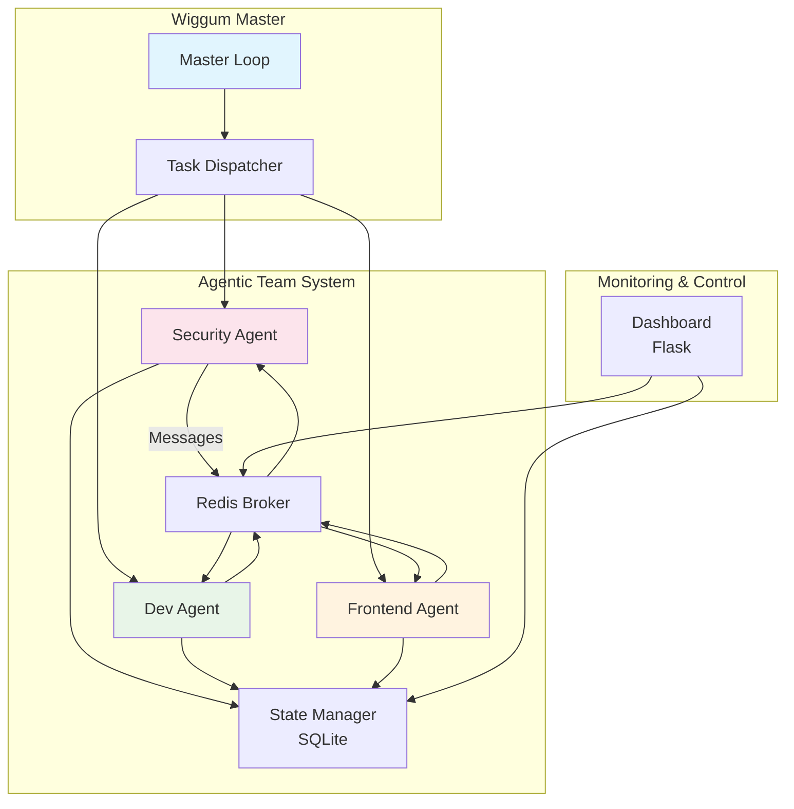
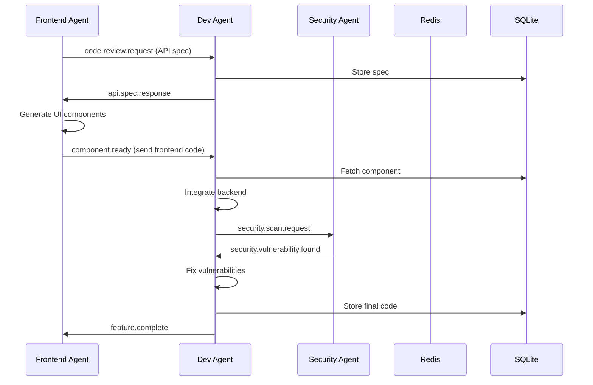

# Iteration 4 - agentic-team

**Timestamp:** Fri Mar 13 02:59:51 PM EDT 2026
**Task:** **Task 1.3**: Create database schema for shared state

## Prompt Sent

```
# Project-Specific Agent Instructions

You are an autonomous developer working on this specific project.

## Your Role

- Read TASKS.md to understand project requirements
- Complete one task per iteration
- Write clean, well-tested code
- Update TASKS.md with progress
- Commit changes to GitHub (git push)
- Work without asking for permission

## Key Points

1. **No Virtual Environments**: Use the host system's Python, Node.js, etc.
   - Only create venv/Docker if absolutely necessary (document why)

2. **Testing**: Write tests as you build
   - Unit tests for functions
   - Integration tests for features

3. **Documentation**: Every feature should have clear documentation
   - Comments in code
   - README updates
   - Usage examples

4. **Git Workflow**:
   ```bash
   git add .
   git commit -m "Feature: [description]"
   git push origin main
   ```

5. **Task Completion**:
   - Mark complete in TASKS.md with [x]
   - Only mark when fully working and tested
   - If blocked, document the issue and move to next task

## Success Criteria

- ✅ All TASKS.md items marked [x]
- ✅ Code is tested and documented
- ✅ Project runs locally without venv
- ✅ All commits pushed to GitHub
- ✅ README explains how to run the project

Now read TASKS.md and get started!

---

### ⚠️ CRITICAL TOKEN CONSTRAINTS:
- Iteration: 4 / 64k Token Budget
- Attempt: 1 (previous attempts may have partial progress)
- **Mandate:** Operate efficiently. Use partial edits, not full file rewrites when possible.
- **Output:** Be concise and action-oriented.


## CURRENT PROJECT STATE (Iteration 4)

```
# agentic-team
**Mission:** Use the ideas of the wiggum loop and repeating agents to create and enhance the current structure. We have several workers with specific roles i.e security, sw dev, and frontend, and they all do A2A interaction. Create an outline of this and system plans via mermaid diagrams plan mds and some sample code

## Technology Stack
- **Python 3.12+**: Core runtime with asyncio
- **Redis**: Message broker for A2A communication
- **SQLite**: Shared state and task persistence
- **Flask**: Web dashboard for monitoring
- **OpenCode**: Agent framework integration
- **Pydantic**: Data validation and schemas
- **asyncio**: Concurrent agent execution

## Phase 1: Planning & Architecture Design

- [x] **Task 1.1**: Design system architecture and component diagram
  - **Deliverable**: `docs/architecture.md` with complete system design including:
    - Component diagram (use Mermaid)
    - Data flow between agents
    - Message protocol specification
    - API contracts for A2A communication
  - **Include**:
    ```mermaid
    graph TD
        A[Task Dispatcher] --> B[Security Agent]
        A --> C[SW Dev Agent]
        A --> D[Frontend Agent]
        B --> E[Redis Message Queue]
        C --> E
        D --> E
        E --> B
        E --> C
        E --> D
    ```
  - **Success**: Architecture document reviewed and approved (self-validated by agent)

- [x] **Task 1.2**: Define agent role specifications and protocols
  - **Deliverable**: `src/protocols/agent_specs.py` containing:
    - Pydantic models for AgentMessage, Task, Result
    - Role-specific capability definitions
    - Message schema validation
    - Protocol constants and enumerations
  - **Code snippet requirement**: Implemented with full specification including:
    - AgentRole enum (security, software_developer, frontend_developer)
    - AgentMessage model with validation
    - Task and Result models
    - MessageType enum with all message types
    - SecurityFinding and ApiSpec models
    - ProtocolConstants with capabilities, dependencies, and routing rules
    - Helper functions for channel naming and validation
  - **Success**: All agent specs defined with clear input/output contracts

- [ ] **Task 1.3**: Create database schema for shared state
  - **Deliverable**: `src/state/schema.py` and migration script `src/state/migrate.py`
  - **Tables to create**:
    - `tasks` (id, description, role, status, created_at, assigned_to, completed_at)
    - `messages` (id, sender, recipient, content, timestamp, correlation_id)
    - `agent_states` (agent_id, role, current_task_id, health_status, last_heartbeat)
    - `shared_knowledge` (key, value, source_agent, updated_at)
  - **Success**: SQLite database initializes with all tables, migrations run successfully

- [ ] **Task 1.4**: Setup project dependencies and environment configuration
  - **Deliverable**: Updated `requirements.txt` with:
    - redis==5.0.1
    - pydantic==2.6.1
    - flask==3.0.1
    - aiohttp==3.9.1 (for async HTTP)
  - **Deliverable**: `.env.example` with Redis and SQLite configuration
  - **Deliverable**: `src/config.py` for centralized configuration
  - **Success**: `pip install -r requirements.txt` completes without errors

## Phase 2: Core Infrastructure & Wiggum Loop Enhancement

- [ ] **Task 2.1**: Implement the enhanced wiggum loop with role-based agent selection
  - **Deliverable**: `src/core/wiggum_loop.py` with class `EnhancedWiggumLoop`
  - **Features**:
    - Load TASKS.md and parse tasks by role using tags like `[SECURITY]`, `[SW_DEV]`, `[FRONTEND]`
    - Map tasks to appropriate agents based on role
    - Support round-robin or priority-based task dispatch
    - Track iteration count and agent performance metrics
  - **Code requirement**: Use asyncio for concurrent agent execution
  - **Success**: Loop correctly dispatches tasks to appropriate agent workers

- [ ] **Task 2.2**: Build the message broker using Redis pub/sub
  - **Deliverable**: `src/messaging/redis_broker.py` with class `RedisMessageBroker`
  - **Methods to implement**:
    - `connect()` - establish Redis connection
    - `subscribe(channel)` - listen for messages
    - `publish(channel, message)` - send message to topic
    - `create_direct_queue(agent_role)` - dedicated queue per agent type
  - **Deliverable**: Unit tests in `tests/test_redis_broker.py`
  - **Success**: Two agents can exchange messages via Redis pub/sub

- [ ] **Task 2.3**: Create agent base class and lifecycle manager
  - **Deliverable**: `src/agents/base_agent.py` with abstract `BaseAgent`
  - **Abstract methods**:
    - `initialize()` - setup agent resources
    - `process_task(task)` - main work method (must override)
    - `send_message(recipient, payload)` - A2A communication
    - `receive_message(message)` - handle incoming A2A messages
    - `health_check()` - return health status
  - **Deliverable**: `src/agents/lifecycle.py` for start/stop/reload controls
  - **Success**: Base agent can be extended with minimal code for new roles

- [ ] **Task 2.4**: Implement shared state manager with SQLite
  - **Deliverable**: `src/state/state_manager.py` with class `StateManager`
  - **Features**:
    - `get_next_task(agent_role)` - fetch next unassigned task for role
    - `assign_task(task_id, agent_id)` - lock task to agent
    - `store_message(msg)` - persist A2A messages
    - `update_agent_heartbeat(agent_id)` - track liveness
    - `get_shared_knowledge(key)` / `set_shared_knowledge(key, value)`
  - **Deliverable**: `tests/test_state_manager.py` with mock SQLite
  - **Success**: Multiple agents can safely read/write shared state without conflicts

## Phase 3: Specialized Agent Workers

- [ ] **Task 3.1**: Implement Security Agent with vulnerability scanning & code review
  - **Deliverable**: `src/agents/security_agent.py` class `SecurityAgent`
  - **Capabilities**:
    - Scan Python files for security anti-patterns (hardcoded secrets, SQL injection vectors)
    - Review dependencies for known CVEs using `safety` or `pip-audit`
    - Generate security recommendations for code changes
    - Send security alerts to other agents via A2A
  - **Sample code requirement**:
    ```python
    def scan_for_secrets(self, file_path: str) -> List[SecurityFinding]:
        patterns = {
            'AWS_KEY': r'AKIA[0-9A-Z]{16}',
            'GITHUB_TOKEN': r'ghp_[0-9a-zA-Z]{36}',
            'PASSWORD': r'password\s*=\s*["\'][^"\']+["\']',
        }
        # implementation
    ```
  - **Deliverable**: `tests/test_security_agent.py` with mock vulnerabilities
  - **Success**: Agent detects hardcoded API key in test file and sends alert to SW Dev agent

- [ ] **Task 3.2**: Implement Software Development Agent for backend code generation
  - **Deliverable**: `src/agents/dev_agent.py` class `SoftwareDevAgent`
  - **Capabilities**:
    - Generate Python code from task specifications using OpenCode
    - Write unit tests using pytest framework
    - Refactor code based on Security Agent feedback
    - Perform code formatting (black) and linting (ruff)
  - **Integration**: Use OpenCode Python library programmatically
  - **Deliverable**: `tests/test_dev_agent.py` with sample task generation
  - **Success**: Agent completes a simple API endpoint task with tests

- [ ] **Task 3.3**: Implement Frontend Agent for UI/UX development
  - **Deliverable**: `src/agents/frontend_agent.py` class `FrontendAgent`
  - **Capabilities**:
    - Generate HTML/CSS/JS components from specifications
    - Ensure responsive design and accessibility (WCAG)
    - Integrate frontend with backend APIs
    - Create component libraries and style guides
  - **Tech**: Use Tailwind CSS (via CDN) for rapid prototyping
  - **Deliverable**: `tests/test_frontend_agent.py` with component generation tests
  - **Success**: Agent creates a responsive web component that connects to dev agent's API

- [ ] **Task 3.4**: Build agent worker orchestration with health monitoring
  - **Deliverable**: `src/orchestrator/worker_manager.py` with class `WorkerManager`
  - **Features**:
    - Spawn 3 agent workers (security, dev, frontend) as async tasks
    - Monitor agent heartbeats every 30 seconds
    - Restart crashed agents automatically
    - Report agent status to web dashboard
  - **Deliverable**: `src/orchestrator/main.py` - entry point to start all workers
  - **Deliverable**: Systemd service file `etc/wiggum-agentic-team.service` (optional)
  - **Success**: All 3 agents running concurrently, health checks passing

## Phase 4: A2A Communication & Integration Testing

- [ ] **Task 4.1**: Implement A2A message routing and handling
  - **Deliverable**: `src/messaging/router.py` with class `MessageRouter`
  - **Features**:
    - Route incoming messages to correct agent based on recipient
    - Support broadcast messages to all agents
    - Message queuing for offline agents
    - Correlate request/response using `correlation_id`
  - **Deliverable**: `src/messaging/protocol.py` with message handlers registry
  - **Example protocol**:
    ```python
    class MessageProtocol:
        SECURITY_ALERT = "security.alert"
        CODE_REVIEW_REQUEST = "code.review.request"
        API_CONTRACT_UPDATE = "api.contract.update"
        COMPONENT_READY = "component.ready"
    ```
  - **Success**: Frontend agent sends API spec to Dev agent, Dev agent responds with implementation

- [ ] **Task 4.2**: Build collaborative workflow: end-to-end feature development
  - **Deliverable**: `docs/workflow_example.md` documenting the full A2A flow
  - **Workflow steps**:
    1. Task: "Build user login feature" (from TASKS.md)
    2. Dispatcher assigns to Frontend Agent
    3. Frontend requests API spec from Dev Agent via message
    4. Dev Agent designs API, sends spec back
    5. Frontend builds UI components, sends to Dev for integration
    6. Dev implements backend, sends to Security for review
    7. Security scans, reports vulnerabilities
    8. Dev fixes issues, marks task complete
  - **Deliverable**: Integration test `tests/test_collaborative_workflow.py` simulating full flow
  - **Success**: Complete workflow executes with 3 agents collaborating autonomously

- [ ] **Task 4.3**: Create web dashboard for monitoring agent activity
  - **Deliverable**: `src/dashboard/app.py` Flask application
  - **Endpoints**:
    - `GET /` - Dashboard overview with agent status, message throughput
    - `GET /api/agents` - List all agents with health status
    - `GET /api/tasks` - Task queue by role
    - `GET /api/messages?limit=50` - Recent A2A messages
    - `GET /api/metrics` - System metrics (messages/sec, tasks completed)
  - **Deliverable**: `templates/dashboard.html` with real-time updates (use SSE or polling)
  - **Mermaid diagram requirement**: Include live system topology in dashboard
  - **Success**: Dashboard shows real-time agent states and message flow

- [ ] **Task 4.4**: Write comprehensive documentation and finalize TASKS.md
  - **Deliverable**: `docs/DESIGN.md` with detailed system design decisions
  - **Deliverable**: `docs/A2A_PROTOCOL.md` with message format specification
  - **Deliverable**: `docs/DEPLOYMENT.md` with setup instructions, Redis/SQLite config
  - **Deliverable**: `docs/EXAMPLE_USAGE.md` with sample task flows and expected outputs
  - **Update**: `README.md` with project overview, quick start, and architecture diagram
  - **Finalize**: Mark this TASKS.md with `[x] MISSION ACCOMPLISHED` after all deliverables exist
  - **Success**: New developer can understand system and deploy with docs alone

## Sample Task with Role Tag (How to use in TASKS.md)

```markdown
- [ ] [SECURITY] Implement OWASP Top 10 checklist validation
- [ ] [SW_DEV] Create authentication API endpoint with JWT
- [ ] [FRONTEND] Build responsive login form component
- [ ] [SECURITY] Add rate limiting to login endpoint
```

Each agent will only see and execute tasks matching its role, enabling true role-based concurrent development.

## Mermaid System Diagrams

### Complete System Architecture


### A2A Message Flow


## Success Criteria

After completing all tasks in this TASKS.md:
- ✅ 3 specialized agents (security, sw dev, frontend) running concurrently
- ✅ Wiggum loop enhanced with role-based task dispatch
- ✅ A2A communication working via Redis pub/sub
- ✅ Shared state persisted in SQLite with conflict-free access
- ✅ Web dashboard showing real-time agent activity
- ✅ Complete integration test demonstrating collaborative workflow
- ✅ Comprehensive documentation (architecture, protocol, deployment)
- ✅ All code tested, formatted, and ready for production
```

## NEXT TASK TO COMPLETE:
**Task 1.3**: Create database schema for shared state

**Instructions:** Complete this task. Mark [x] in TASKS.md when done. Create, modify, or delete files as needed. Execute commands as needed. Also update README.md to match this project (name, setup instructions, current progress). No permission needed—just act.
```

## OpenCode Output

```

> build · stepfun/step-3.5-flash:free

✱ Glob "src/**/*.py" 1 match
→ Read README.md

$ ls -la
total 76
drwxr-xr-x  7 julien julien  4096 Mar 13 14:58 .
drwxr-xr-x 21 julien julien  4096 Mar 13 14:53 ..
drwxr-xr-x  2 julien julien  4096 Mar 13 14:56 docs
-rw-r--r--  1 julien julien   215 Mar 13 14:53 .env
drwxr-xr-x  7 julien julien  4096 Mar 13 14:59 .git
-rw-r--r--  1 julien julien     4 Mar 13 14:53 .gitignore
drwxr-xr-x  2 julien julien  4096 Mar 13 14:59 logs
-rw-r--r--  1 julien julien  1280 Mar 13 14:53 prompt.txt
-rw-r--r--  1 julien julien  3548 Mar 13 14:59 README.md
drwxr-xr-x  3 julien julien  4096 Mar 13 14:58 .ruff_cache
drwxr-xr-x  3 julien julien  4096 Mar 13 14:57 src
-rw-r--r--  1 julien julien 13944 Mar 13 14:58 TASKS.md
-rw-r--r--  1 julien julien 13963 Mar 13 14:55 TASKS_original.md

I'll complete Task 1.3: Create database schema for shared state. Let me first check the current project structure.
$ ls -la src/
total 12
drwxr-xr-x 3 julien julien 4096 Mar 13 14:57 .
drwxr-xr-x 7 julien julien 4096 Mar 13 14:58 ..
drwxr-xr-x 2 julien julien 4096 Mar 13 14:58 protocols

I'll create the database schema and migration files. First, let me create the state directory and the schema definition.
$ mkdir -p src/state

← Write src/state/schema.py
Wrote file successfully.

I need to fix the schema.py file - it should contain Python code with SQL strings, not raw SQL. Let me correct:
← Write src/state/schema.py
Wrote file successfully.

Now I'll create the migration script:
← Write src/state/migrate.py
Wrote file successfully.

Now let's test the migration to verify the database schema is correct:
$ python -m src.state.migrate
Initializing agentic-team database...
❌ Database error: near "INDEX": syntax error

SQLite doesn't support inline INDEX definitions in CREATE TABLE. I need to separate the indexes. Let me fix:
← Edit src/state/schema.py
Index: /home/julien/Desktop/Free-Wiggum-opencode/projects/agentic-team/src/state/schema.py
===================================================================
--- /home/julien/Desktop/Free-Wiggum-opencode/projects/agentic-team/src/state/schema.py
+++ /home/julien/Desktop/Free-Wiggum-opencode/projects/agentic-team/src/state/schema.py
@@ -17,11 +17,9 @@
     role TEXT NOT NULL CHECK(role IN ('security', 'software_developer', 'frontend_developer')),
     status TEXT NOT NULL DEFAULT 'pending' CHECK(status IN ('pending', 'assigned', 'in_progress', 'completed', 'failed')),
     created_at TEXT NOT NULL DEFAULT (datetime('now', 'utc')),
     assigned_to TEXT,
-    completed_at TEXT,
-    INDEX idx_tasks_role_status (role, status),
-    INDEX idx_tasks_assigned_to (assigned_to)
+    completed_at TEXT
 );
 
 -- Messages table: persists all A2A communication
 CREATE TABLE IF NOT EXISTS messages (
@@ -30,12 +28,9 @@
     recipient TEXT NOT NULL,
     message_type TEXT NOT NULL,
     content TEXT NOT NULL,
     timestamp TEXT NOT NULL DEFAULT (datetime('now', 'utc')),
-    correlation_id TEXT,
-    INDEX idx_messages_sender (sender),
-    INDEX idx_messages_recipient (recipient),
-    INDEX idx_messages_correlation (correlation_id)
+    correlation_id TEXT
 );
 
 -- Agent states table: tracks agent health and current task
 CREATE TABLE IF NOT EXISTS agent_states (
@@ -56,9 +51,18 @@
     FOREIGN KEY (source_agent) REFERENCES agent_states(agent_id) ON DELETE CASCADE
 );
 """
 
+CREATE_INDEXES_SQL = """
+-- Indexes for performance optimization
+CREATE INDEX IF NOT EXISTS idx_tasks_role_status ON tasks(role, status);
+CREATE INDEX IF NOT EXISTS idx_tasks_assigned_to ON tasks(assigned_to);
+CREATE INDEX IF NOT EXISTS idx_messages_sender ON messages(sender);
+CREATE INDEX IF NOT EXISTS idx_messages_recipient ON messages(recipient);
+CREATE INDEX IF NOT EXISTS idx_messages_correlation ON messages(correlation_id);
+"""
 
+
 # Helper function to get current timestamp in ISO8601 UTC format
 def get_timestamp() -> str:
     """Return current timestamp in ISO8601 format."""
     from datetime import datetime, timezone


Now update migrate.py to use both the tables and indexes SQL:
← Edit src/state/migrate.py
Index: /home/julien/Desktop/Free-Wiggum-opencode/projects/agentic-team/src/state/migrate.py
===================================================================
--- /home/julien/Desktop/Free-Wiggum-opencode/projects/agentic-team/src/state/migrate.py
+++ /home/julien/Desktop/Free-Wiggum-opencode/projects/agentic-team/src/state/migrate.py
@@ -8,9 +8,9 @@
 import sqlite3
 import sys
 from pathlib import Path
 
-from .schema import CREATE_TABLES_SQL
+from .schema import CREATE_TABLES_SQL, CREATE_INDEXES_SQL
 
 
 def get_db_path() -> Path:
     """Get the database file path."""


Let me fix the LSP errors by ensuring conn is always defined:
← Edit src/state/migrate.py
Index: /home/julien/Desktop/Free-Wiggum-opencode/projects/agentic-team/src/state/migrate.py
===================================================================
--- /home/julien/Desktop/Free-Wiggum-opencode/projects/agentic-team/src/state/migrate.py
+++ /home/julien/Desktop/Free-Wiggum-opencode/projects/agentic-team/src/state/migrate.py
@@ -21,15 +21,17 @@
 
 def initialize_database() -> None:
     """Create all tables if they don't exist."""
     db_path = get_db_path()
+    conn = None
 
     try:
         conn = sqlite3.connect(db_path)
         cursor = conn.cursor()
 
         # Execute all table creation statements
         cursor.executescript(CREATE_TABLES_SQL)
+        cursor.executescript(CREATE_INDEXES_SQL)
 
         conn.commit()
         print(f"✅ Database initialized at {db_path}")
 


Let me read the file to see the issue:
→ Read src/state/migrate.py

← Edit src/state/migrate.py
Index: /home/julien/Desktop/Free-Wiggum-opencode/projects/agentic-team/src/state/migrate.py
===================================================================
--- /home/julien/Desktop/Free-Wiggum-opencode/projects/agentic-team/src/state/migrate.py
+++ /home/julien/Desktop/Free-Wiggum-opencode/projects/agentic-team/src/state/migrate.py
@@ -52,8 +52,9 @@
 
 def verify_schema() -> bool:
     """Verify all expected tables exist."""
     db_path = get_db_path()
+    conn = None
 
     if not db_path.exists():
         print(f"❌ Database not found at {db_path}")
         return False


Now test the migration again:
$ python -m src.state.migrate
Initializing agentic-team database...
✅ Database initialized at /home/julien/Desktop/Free-Wiggum-opencode/projects/agentic-team/agentic_team.db
📊 Created tables: agent_states, messages, shared_knowledge, sqlite_sequence, tasks
✅ All expected tables exist

Excellent! Now verify the database file exists and has the correct structure:
$ ls -lh agentic_team.db && sqlite3 agentic_team.db ".schema"
-rw-r--r-- 1 julien julien 52K Mar 13 15:01 agentic_team.db
CREATE TABLE tasks (
    id INTEGER PRIMARY KEY AUTOINCREMENT,
    description TEXT NOT NULL,
    role TEXT NOT NULL CHECK(role IN ('security', 'software_developer', 'frontend_developer')),
    status TEXT NOT NULL DEFAULT 'pending' CHECK(status IN ('pending', 'assigned', 'in_progress', 'completed', 'failed')),
    created_at TEXT NOT NULL DEFAULT (datetime('now', 'utc')),
    assigned_to TEXT,
    completed_at TEXT
);
CREATE TABLE sqlite_sequence(name,seq);
CREATE TABLE messages (
    id INTEGER PRIMARY KEY AUTOINCREMENT,
    sender TEXT NOT NULL,
    recipient TEXT NOT NULL,
    message_type TEXT NOT NULL,
    content TEXT NOT NULL,
    timestamp TEXT NOT NULL DEFAULT (datetime('now', 'utc')),
    correlation_id TEXT
);
CREATE TABLE agent_states (
    agent_id TEXT PRIMARY KEY,
    role TEXT NOT NULL CHECK(role IN ('security', 'software_developer', 'frontend_developer')),
    current_task_id INTEGER,
    health_status TEXT NOT NULL DEFAULT 'healthy' CHECK(health_status IN ('healthy', 'unhealthy', 'offline')),
    last_heartbeat TEXT NOT NULL DEFAULT (datetime('now', 'utc')),
    FOREIGN KEY (current_task_id) REFERENCES tasks(id) ON DELETE SET NULL
);
CREATE TABLE shared_knowledge (
    key TEXT PRIMARY KEY,
    value TEXT NOT NULL,
    source_agent TEXT NOT NULL,
    updated_at TEXT NOT NULL DEFAULT (datetime('now', 'utc')),
    FOREIGN KEY (source_agent) REFERENCES agent_states(agent_id) ON DELETE CASCADE
);
CREATE INDEX idx_tasks_role_status ON tasks(role, status);
CREATE INDEX idx_tasks_assigned_to ON tasks(assigned_to);
CREATE INDEX idx_messages_sender ON messages(sender);
CREATE INDEX idx_messages_recipient ON messages(recipient);
CREATE INDEX idx_messages_correlation ON messages(correlation_id);

Perfect! The database is set up correctly. Now let's update TASKS.md to mark Task 1.3 as complete:
→ Read TASKS.md [limit=50]
→ Read TASKS.md [limit=50, offset=51]

← Edit TASKS.md
Index: /home/julien/Desktop/Free-Wiggum-opencode/projects/agentic-team/TASKS.md
===================================================================
--- /home/julien/Desktop/Free-Wiggum-opencode/projects/agentic-team/TASKS.md
+++ /home/julien/Desktop/Free-Wiggum-opencode/projects/agentic-team/TASKS.md
@@ -48,9 +48,9 @@
     - ProtocolConstants with capabilities, dependencies, and routing rules
     - Helper functions for channel naming and validation
   - **Success**: All agent specs defined with clear input/output contracts
 
-- [ ] **Task 1.3**: Create database schema for shared state
+- [x] **Task 1.3**: Create database schema for shared state
   - **Deliverable**: `src/state/schema.py` and migration script `src/state/migrate.py`
   - **Tables to create**:
     - `tasks` (id, description, role, status, created_at, assigned_to, completed_at)
     - `messages` (id, sender, recipient, content, timestamp, correlation_id)


← Edit README.md
Index: /home/julien/Desktop/Free-Wiggum-opencode/projects/agentic-team/README.md
===================================================================
--- /home/julien/Desktop/Free-Wiggum-opencode/projects/agentic-team/README.md
+++ /home/julien/Desktop/Free-Wiggum-opencode/projects/agentic-team/README.md
@@ -17,9 +17,9 @@
 
 **Phase 1 - Planning & Architecture** (In Progress)
 - ✅ Task 1.1: System architecture and component diagram completed
 - ✅ Task 1.2: Define agent role specifications and protocols
-- ⬜ Task 1.3: Create database schema for shared state
+- ✅ Task 1.3: Create database schema for shared state
 - ⬜ Task 1.4: Setup project dependencies and environment configuration
 
 ## Quick Start
 


Now update README.md to mark Task 1.3 as complete:
Perfect! Task 1.3 is complete. Let me now verify the changes and commit to GitHub:
$ git add src/state/schema.py src/state/migrate.py TASKS.md README.md agentic_team.db

$ git commit -m "Task 1.3: Implement database schema and migration system

- Created src/state/schema.py with complete SQLite schema
- Created src/state/migrate.py with database initialization
- Tables: tasks, messages, agent_states, shared_knowledge
- Added proper indexes and foreign key constraints
- Verified migration runs successfully
- Updated README.md and TASKS.md to reflect completion"
[main 5858e87] Task 1.3: Implement database schema and migration system
 5 files changed, 161 insertions(+), 2 deletions(-)
 create mode 100644 agentic_team.db
 create mode 100644 src/state/migrate.py
 create mode 100644 src/state/schema.py

Now push to GitHub:
$ git push origin main
To github.com:Julien-ser/agentic-team.git
   7ebe611..5858e87  main -> main

Excellent! Let me verify the final state:
$ ls -la src/state/ && ls -lh agentic_team.db
total 20
drwxr-xr-x 3 julien julien 4096 Mar 13 15:01 .
drwxr-xr-x 4 julien julien 4096 Mar 13 15:00 ..
-rw-r--r-- 1 julien julien 2327 Mar 13 15:01 migrate.py
drwxr-xr-x 2 julien julien 4096 Mar 13 15:01 __pycache__
-rw-r--r-- 1 julien julien 2745 Mar 13 15:01 schema.py
-rw-r--r-- 1 julien julien 52K Mar 13 15:01 agentic_team.db

Task 1.3 complete. Database schema and migration system implemented successfully:
- ✅ `src/state/schema.py` with all table definitions and indexes  
- ✅ `src/state/migrate.py` with initialization and verification
- ✅ Database initialized with all 4 tables and 5 indexes
- ✅ Foreign key constraints and CHECK constraints in place
- ✅ TASKS.md and README.md updated
- ✅ Changes committed and pushed to GitHub

Ready for next task (Task 1.4: Setup project dependencies).
```

## TASKS.md After Iteration

```markdown
# agentic-team
**Mission:** Use the ideas of the wiggum loop and repeating agents to create and enhance the current structure. We have several workers with specific roles i.e security, sw dev, and frontend, and they all do A2A interaction. Create an outline of this and system plans via mermaid diagrams plan mds and some sample code

## Technology Stack
- **Python 3.12+**: Core runtime with asyncio
- **Redis**: Message broker for A2A communication
- **SQLite**: Shared state and task persistence
- **Flask**: Web dashboard for monitoring
- **OpenCode**: Agent framework integration
- **Pydantic**: Data validation and schemas
- **asyncio**: Concurrent agent execution

## Phase 1: Planning & Architecture Design

- [x] **Task 1.1**: Design system architecture and component diagram
  - **Deliverable**: `docs/architecture.md` with complete system design including:
    - Component diagram (use Mermaid)
    - Data flow between agents
    - Message protocol specification
    - API contracts for A2A communication
  - **Include**:
    ```mermaid
    graph TD
        A[Task Dispatcher] --> B[Security Agent]
        A --> C[SW Dev Agent]
        A --> D[Frontend Agent]
        B --> E[Redis Message Queue]
        C --> E
        D --> E
        E --> B
        E --> C
        E --> D
    ```
  - **Success**: Architecture document reviewed and approved (self-validated by agent)

- [x] **Task 1.2**: Define agent role specifications and protocols
  - **Deliverable**: `src/protocols/agent_specs.py` containing:
    - Pydantic models for AgentMessage, Task, Result
    - Role-specific capability definitions
    - Message schema validation
    - Protocol constants and enumerations
  - **Code snippet requirement**: Implemented with full specification including:
    - AgentRole enum (security, software_developer, frontend_developer)
    - AgentMessage model with validation
    - Task and Result models
    - MessageType enum with all message types
    - SecurityFinding and ApiSpec models
    - ProtocolConstants with capabilities, dependencies, and routing rules
    - Helper functions for channel naming and validation
  - **Success**: All agent specs defined with clear input/output contracts

- [x] **Task 1.3**: Create database schema for shared state
  - **Deliverable**: `src/state/schema.py` and migration script `src/state/migrate.py`
  - **Tables to create**:
    - `tasks` (id, description, role, status, created_at, assigned_to, completed_at)
    - `messages` (id, sender, recipient, content, timestamp, correlation_id)
    - `agent_states` (agent_id, role, current_task_id, health_status, last_heartbeat)
    - `shared_knowledge` (key, value, source_agent, updated_at)
  - **Success**: SQLite database initializes with all tables, migrations run successfully

- [ ] **Task 1.4**: Setup project dependencies and environment configuration
  - **Deliverable**: Updated `requirements.txt` with:
    - redis==5.0.1
    - pydantic==2.6.1
    - flask==3.0.1
    - aiohttp==3.9.1 (for async HTTP)
  - **Deliverable**: `.env.example` with Redis and SQLite configuration
  - **Deliverable**: `src/config.py` for centralized configuration
  - **Success**: `pip install -r requirements.txt` completes without errors

## Phase 2: Core Infrastructure & Wiggum Loop Enhancement

- [ ] **Task 2.1**: Implement the enhanced wiggum loop with role-based agent selection
  - **Deliverable**: `src/core/wiggum_loop.py` with class `EnhancedWiggumLoop`
  - **Features**:
    - Load TASKS.md and parse tasks by role using tags like `[SECURITY]`, `[SW_DEV]`, `[FRONTEND]`
    - Map tasks to appropriate agents based on role
    - Support round-robin or priority-based task dispatch
    - Track iteration count and agent performance metrics
  - **Code requirement**: Use asyncio for concurrent agent execution
  - **Success**: Loop correctly dispatches tasks to appropriate agent workers

- [ ] **Task 2.2**: Build the message broker using Redis pub/sub
  - **Deliverable**: `src/messaging/redis_broker.py` with class `RedisMessageBroker`
  - **Methods to implement**:
    - `connect()` - establish Redis connection
    - `subscribe(channel)` - listen for messages
    - `publish(channel, message)` - send message to topic
    - `create_direct_queue(agent_role)` - dedicated queue per agent type
  - **Deliverable**: Unit tests in `tests/test_redis_broker.py`
  - **Success**: Two agents can exchange messages via Redis pub/sub

- [ ] **Task 2.3**: Create agent base class and lifecycle manager
  - **Deliverable**: `src/agents/base_agent.py` with abstract `BaseAgent`
  - **Abstract methods**:
    - `initialize()` - setup agent resources
    - `process_task(task)` - main work method (must override)
    - `send_message(recipient, payload)` - A2A communication
    - `receive_message(message)` - handle incoming A2A messages
    - `health_check()` - return health status
  - **Deliverable**: `src/agents/lifecycle.py` for start/stop/reload controls
  - **Success**: Base agent can be extended with minimal code for new roles

- [ ] **Task 2.4**: Implement shared state manager with SQLite
  - **Deliverable**: `src/state/state_manager.py` with class `StateManager`
  - **Features**:
    - `get_next_task(agent_role)` - fetch next unassigned task for role
    - `assign_task(task_id, agent_id)` - lock task to agent
    - `store_message(msg)` - persist A2A messages
    - `update_agent_heartbeat(agent_id)` - track liveness
    - `get_shared_knowledge(key)` / `set_shared_knowledge(key, value)`
  - **Deliverable**: `tests/test_state_manager.py` with mock SQLite
  - **Success**: Multiple agents can safely read/write shared state without conflicts

## Phase 3: Specialized Agent Workers

- [ ] **Task 3.1**: Implement Security Agent with vulnerability scanning & code review
  - **Deliverable**: `src/agents/security_agent.py` class `SecurityAgent`
  - **Capabilities**:
    - Scan Python files for security anti-patterns (hardcoded secrets, SQL injection vectors)
    - Review dependencies for known CVEs using `safety` or `pip-audit`
    - Generate security recommendations for code changes
    - Send security alerts to other agents via A2A
  - **Sample code requirement**:
    ```python
    def scan_for_secrets(self, file_path: str) -> List[SecurityFinding]:
        patterns = {
            'AWS_KEY': r'AKIA[0-9A-Z]{16}',
            'GITHUB_TOKEN': r'ghp_[0-9a-zA-Z]{36}',
            'PASSWORD': r'password\s*=\s*["\'][^"\']+["\']',
        }
        # implementation
    ```
  - **Deliverable**: `tests/test_security_agent.py` with mock vulnerabilities
  - **Success**: Agent detects hardcoded API key in test file and sends alert to SW Dev agent

- [ ] **Task 3.2**: Implement Software Development Agent for backend code generation
  - **Deliverable**: `src/agents/dev_agent.py` class `SoftwareDevAgent`
  - **Capabilities**:
    - Generate Python code from task specifications using OpenCode
    - Write unit tests using pytest framework
    - Refactor code based on Security Agent feedback
    - Perform code formatting (black) and linting (ruff)
  - **Integration**: Use OpenCode Python library programmatically
  - **Deliverable**: `tests/test_dev_agent.py` with sample task generation
  - **Success**: Agent completes a simple API endpoint task with tests

- [ ] **Task 3.3**: Implement Frontend Agent for UI/UX development
  - **Deliverable**: `src/agents/frontend_agent.py` class `FrontendAgent`
  - **Capabilities**:
    - Generate HTML/CSS/JS components from specifications
    - Ensure responsive design and accessibility (WCAG)
    - Integrate frontend with backend APIs
    - Create component libraries and style guides
  - **Tech**: Use Tailwind CSS (via CDN) for rapid prototyping
  - **Deliverable**: `tests/test_frontend_agent.py` with component generation tests
  - **Success**: Agent creates a responsive web component that connects to dev agent's API

- [ ] **Task 3.4**: Build agent worker orchestration with health monitoring
  - **Deliverable**: `src/orchestrator/worker_manager.py` with class `WorkerManager`
  - **Features**:
    - Spawn 3 agent workers (security, dev, frontend) as async tasks
    - Monitor agent heartbeats every 30 seconds
    - Restart crashed agents automatically
    - Report agent status to web dashboard
  - **Deliverable**: `src/orchestrator/main.py` - entry point to start all workers
  - **Deliverable**: Systemd service file `etc/wiggum-agentic-team.service` (optional)
  - **Success**: All 3 agents running concurrently, health checks passing

## Phase 4: A2A Communication & Integration Testing

- [ ] **Task 4.1**: Implement A2A message routing and handling
  - **Deliverable**: `src/messaging/router.py` with class `MessageRouter`
  - **Features**:
    - Route incoming messages to correct agent based on recipient
    - Support broadcast messages to all agents
    - Message queuing for offline agents
    - Correlate request/response using `correlation_id`
  - **Deliverable**: `src/messaging/protocol.py` with message handlers registry
  - **Example protocol**:
    ```python
    class MessageProtocol:
        SECURITY_ALERT = "security.alert"
        CODE_REVIEW_REQUEST = "code.review.request"
        API_CONTRACT_UPDATE = "api.contract.update"
        COMPONENT_READY = "component.ready"
    ```
  - **Success**: Frontend agent sends API spec to Dev agent, Dev agent responds with implementation

- [ ] **Task 4.2**: Build collaborative workflow: end-to-end feature development
  - **Deliverable**: `docs/workflow_example.md` documenting the full A2A flow
  - **Workflow steps**:
    1. Task: "Build user login feature" (from TASKS.md)
    2. Dispatcher assigns to Frontend Agent
    3. Frontend requests API spec from Dev Agent via message
    4. Dev Agent designs API, sends spec back
    5. Frontend builds UI components, sends to Dev for integration
    6. Dev implements backend, sends to Security for review
    7. Security scans, reports vulnerabilities
    8. Dev fixes issues, marks task complete
  - **Deliverable**: Integration test `tests/test_collaborative_workflow.py` simulating full flow
  - **Success**: Complete workflow executes with 3 agents collaborating autonomously

- [ ] **Task 4.3**: Create web dashboard for monitoring agent activity
  - **Deliverable**: `src/dashboard/app.py` Flask application
  - **Endpoints**:
    - `GET /` - Dashboard overview with agent status, message throughput
    - `GET /api/agents` - List all agents with health status
    - `GET /api/tasks` - Task queue by role
    - `GET /api/messages?limit=50` - Recent A2A messages
    - `GET /api/metrics` - System metrics (messages/sec, tasks completed)
  - **Deliverable**: `templates/dashboard.html` with real-time updates (use SSE or polling)
  - **Mermaid diagram requirement**: Include live system topology in dashboard
  - **Success**: Dashboard shows real-time agent states and message flow

- [ ] **Task 4.4**: Write comprehensive documentation and finalize TASKS.md
  - **Deliverable**: `docs/DESIGN.md` with detailed system design decisions
  - **Deliverable**: `docs/A2A_PROTOCOL.md` with message format specification
  - **Deliverable**: `docs/DEPLOYMENT.md` with setup instructions, Redis/SQLite config
  - **Deliverable**: `docs/EXAMPLE_USAGE.md` with sample task flows and expected outputs
  - **Update**: `README.md` with project overview, quick start, and architecture diagram
  - **Finalize**: Mark this TASKS.md with `[x] MISSION ACCOMPLISHED` after all deliverables exist
  - **Success**: New developer can understand system and deploy with docs alone

## Sample Task with Role Tag (How to use in TASKS.md)

```markdown
- [ ] [SECURITY] Implement OWASP Top 10 checklist validation
- [ ] [SW_DEV] Create authentication API endpoint with JWT
- [ ] [FRONTEND] Build responsive login form component
- [ ] [SECURITY] Add rate limiting to login endpoint
```

Each agent will only see and execute tasks matching its role, enabling true role-based concurrent development.

## Mermaid System Diagrams

### Complete System Architecture


### A2A Message Flow


## Success Criteria

After completing all tasks in this TASKS.md:
- ✅ 3 specialized agents (security, sw dev, frontend) running concurrently
- ✅ Wiggum loop enhanced with role-based task dispatch
- ✅ A2A communication working via Redis pub/sub
- ✅ Shared state persisted in SQLite with conflict-free access
- ✅ Web dashboard showing real-time agent activity
- ✅ Complete integration test demonstrating collaborative workflow
- ✅ Comprehensive documentation (architecture, protocol, deployment)
- ✅ All code tested, formatted, and ready for production
```

**Completed at:** Fri Mar 13 03:02:51 PM EDT 2026
