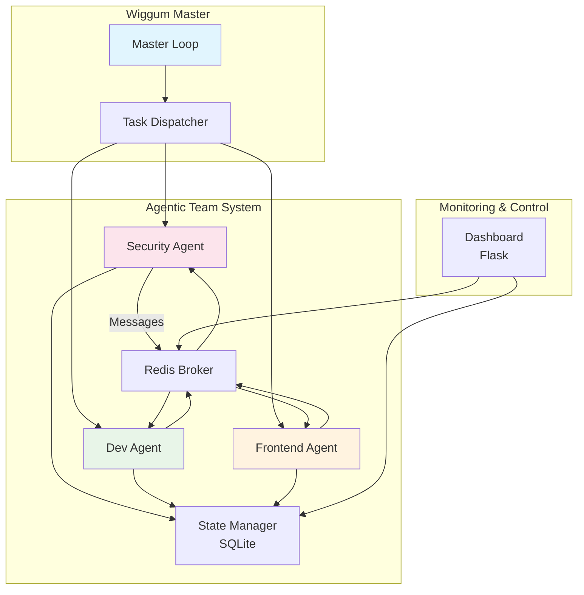
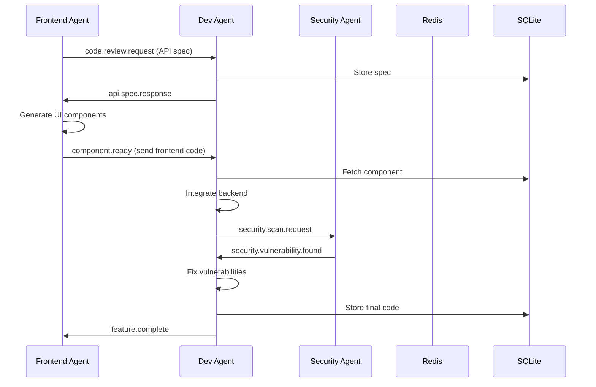

# Iteration 45 - agentic-team

**Timestamp:** Fri Mar 13 09:38:10 PM EDT 2026
**Task:** [FRONTEND] Build responsive login form component

## Prompt Sent

```
# Project-Specific Agent Instructions

You are an autonomous developer working on this specific project.

## Your Role

- Read TASKS.md to understand project requirements
- Complete one task per iteration
- Write clean, well-tested code
- Update TASKS.md with progress
- Commit changes to GitHub (git push)
- Work without asking for permission

## Key Points

1. **No Virtual Environments**: Use the host system's Python, Node.js, etc.
   - Only create venv/Docker if absolutely necessary (document why)

2. **Testing**: Write tests as you build
   - Unit tests for functions
   - Integration tests for features

3. **Documentation**: Every feature should have clear documentation
   - Comments in code
   - README updates
   - Usage examples

4. **Git Workflow**:
   ```bash
   git add .
   git commit -m "Feature: [description]"
   git push origin main
   ```

5. **Task Completion**:
   - Mark complete in TASKS.md with [x]
   - Only mark when fully working and tested
   - If blocked, document the issue and move to next task

## Success Criteria

- ✅ All TASKS.md items marked [x]
- ✅ Code is tested and documented
- ✅ Project runs locally without venv
- ✅ All commits pushed to GitHub
- ✅ README explains how to run the project

Now read TASKS.md and get started!

---

### ⚠️ CRITICAL TOKEN CONSTRAINTS:
- Iteration: 45 / 64k Token Budget
- Attempt: 1 (previous attempts may have partial progress)
- **Mandate:** Operate efficiently. Use partial edits, not full file rewrites when possible.
- **Output:** Be concise and action-oriented.


## CURRENT PROJECT STATE (Iteration 45)

```
# agentic-team
**Mission:** Use the ideas of the wiggum loop and repeating agents to create and enhance the current structure. We have several workers with specific roles i.e security, sw dev, and frontend, and they all do A2A interaction. Create an outline of this and system plans via mermaid diagrams plan mds and some sample code

## Technology Stack
- **Python 3.12+**: Core runtime with asyncio
- **Redis**: Message broker for A2A communication
- **SQLite**: Shared state and task persistence
- **Flask**: Web dashboard for monitoring
- **OpenCode**: Agent framework integration
- **Pydantic**: Data validation and schemas
- **asyncio**: Concurrent agent execution

## Phase 1: Planning & Architecture Design

- [x] **Task 1.1**: Design system architecture and component diagram
  - **Deliverable**: `docs/architecture.md` with complete system design including:
    - Component diagram (use Mermaid)
    - Data flow between agents
    - Message protocol specification
    - API contracts for A2A communication
  - **Include**:
    ```mermaid
    graph TD
        A[Task Dispatcher] --> B[Security Agent]
        A --> C[SW Dev Agent]
        A --> D[Frontend Agent]
        B --> E[Redis Message Queue]
        C --> E
        D --> E
        E --> B
        E --> C
        E --> D
    ```
  - **Success**: Architecture document reviewed and approved (self-validated by agent)

- [x] **Task 1.2**: Define agent role specifications and protocols
  - **Deliverable**: `src/protocols/agent_specs.py` containing:
    - Pydantic models for AgentMessage, Task, Result
    - Role-specific capability definitions
    - Message schema validation
    - Protocol constants and enumerations
  - **Code snippet requirement**: Implemented with full specification including:
    - AgentRole enum (security, software_developer, frontend_developer)
    - AgentMessage model with validation
    - Task and Result models
    - MessageType enum with all message types
    - SecurityFinding and ApiSpec models
    - ProtocolConstants with capabilities, dependencies, and routing rules
    - Helper functions for channel naming and validation
  - **Success**: All agent specs defined with clear input/output contracts

- [x] **Task 1.3**: Create database schema for shared state
  - **Deliverable**: `src/state/schema.py` and migration script `src/state/migrate.py`
  - **Tables to create**:
    - `tasks` (id, description, role, status, created_at, assigned_to, completed_at)
    - `messages` (id, sender, recipient, content, timestamp, correlation_id)
    - `agent_states` (agent_id, role, current_task_id, health_status, last_heartbeat)
    - `shared_knowledge` (key, value, source_agent, updated_at)
  - **Success**: SQLite database initializes with all tables, migrations run successfully

- [x] **Task 1.4**: Setup project dependencies and environment configuration
  - **Deliverable**: Updated `requirements.txt` with:
    - redis==5.0.1
    - pydantic==2.6.1
    - flask==3.0.1
    - aiohttp==3.9.1 (for async HTTP)
  - **Deliverable**: `.env.example` with Redis and SQLite configuration
  - **Deliverable**: `src/config.py` for centralized configuration
  - **Success**: `pip install -r requirements.txt` completes without errors

## Phase 2: Core Infrastructure & Wiggum Loop Enhancement

- [x] **Task 2.1**: Implement the enhanced wiggum loop with role-based agent selection
  - **Deliverable**: `src/core/wiggum_loop.py` with class `EnhancedWiggumLoop`
  - **Features**:
    - Load TASKS.md and parse tasks by role using tags like `[SECURITY]`, `[SW_DEV]`, `[FRONTEND]`
    - Map tasks to appropriate agents based on role
    - Support round-robin or priority-based task dispatch
    - Track iteration count and agent performance metrics
  - **Code requirement**: Use asyncio for concurrent agent execution
  - **Success**: Loop correctly dispatches tasks to appropriate agent workers

- [x] **Task 2.2**: Build the message broker using Redis pub/sub
  - **Deliverable**: `src/messaging/redis_broker.py` with class `RedisMessageBroker`
  - **Methods to implement**:
    - `connect()` - establish Redis connection
    - `subscribe(channel)` - listen for messages
    - `publish(channel, message)` - send message to topic
    - `create_direct_queue(agent_role)` - dedicated queue per agent type
  - **Deliverable**: Unit tests in `tests/test_redis_broker.py`
  - **Success**: Two agents can exchange messages via Redis pub/sub

- [x] **Task 2.3**: Create agent base class and lifecycle manager
  - **Deliverable**: `src/agents/base_agent.py` with abstract `BaseAgent`
  - **Abstract methods**:
    - `initialize()` - setup agent resources
    - `process_task(task)` - main work method (must override)
    - `send_message(recipient, payload)` - A2A communication
    - `receive_message(message)` - handle incoming A2A messages
    - `health_check()` - return health status
  - **Deliverable**: `src/agents/lifecycle.py` for start/stop/reload controls
  - **Success**: Base agent can be extended with minimal code for new roles

- [x] **Task 2.4**: Implement shared state manager with SQLite
  - **Deliverable**: `src/state/state_manager.py` with class `StateManager`
  - **Features**:
    - `get_next_task(agent_role)` - fetch next unassigned task for role
    - `assign_task(task_id, agent_id)` - lock task to agent
    - `store_message(msg)` - persist A2A messages
    - `update_agent_heartbeat(agent_id)` - track liveness
    - `get_shared_knowledge(key)` / `set_shared_knowledge(key, value)`
  - **Deliverable**: `tests/test_state_manager.py` with mock SQLite
  - **Success**: Multiple agents can safely read/write shared state without conflicts

## Phase 3: Specialized Agent Workers

- [x] **Task 3.1**: Implement Security Agent with vulnerability scanning & code review
  - **Deliverable**: `src/agents/security_agent.py` class `SecurityAgent`
  - **Capabilities**:
    - Scan Python files for security anti-patterns (hardcoded secrets, SQL injection vectors)
    - Review dependencies for known CVEs using `safety` or `pip-audit`
    - Generate security recommendations for code changes
    - Send security alerts to other agents via A2A
    - Perform comprehensive OWASP Top 10 2021 compliance validation
  - **Sample code requirement**:
    ```python
    def scan_for_secrets(self, file_path: str) -> List[SecurityFinding]:
        patterns = {
            'AWS_KEY': r'AKIA[0-9A-Z]{16}',
            'GITHUB_TOKEN': r'ghp_[0-9a-zA-Z]{36}',
            'PASSWORD': r'password\s*=\s*["\'][^"\']+["\']',
        }
        # implementation
    ```
  - **Deliverable**: `src/security/owasp_validator.py` with full OWASP Top 10 2021 validation
  - **Deliverable**: `tests/test_security_agent.py` with comprehensive OWASP tests (TestOWASPValidation)
  - **Success**: Agent detects hardcoded API key in test file, sends alert to SW Dev agent, and provides OWASP compliance reports

- [x] **Task 3.2**: Implement Software Development Agent for backend code generation
  - **Deliverable**: `src/agents/dev_agent.py` class `SoftwareDevAgent`
  - **Capabilities**:
    - Generate Python code from task specifications using OpenCode
    - Write unit tests using pytest framework
    - Refactor code based on Security Agent feedback
    - Perform code formatting (black) and linting (ruff)
  - **Integration**: Use OpenCode Python library programmatically
  - **Deliverable**: `tests/test_dev_agent.py` with sample task generation
  - **Success**: Agent completes a simple API endpoint task with tests

- [x] **Task 3.3**: Implement Frontend Agent for UI/UX development
  - **Deliverable**: `src/agents/frontend_agent.py` class `FrontendAgent`
  - **Capabilities**:
    - Generate HTML/CSS/JS components from specifications
    - Ensure responsive design and accessibility (WCAG)
    - Integrate frontend with backend APIs
    - Create component libraries and style guides
  - **Tech**: Use Tailwind CSS (via CDN) for rapid prototyping
  - **Deliverable**: `tests/test_frontend_agent.py` with component generation tests
  - **Success**: Agent creates a responsive web component that connects to dev agent's API

- [x] **Task 3.4**: Build agent worker orchestration with health monitoring
  - **Deliverable**: `src/orchestrator/worker_manager.py` with class `WorkerManager`
  - **Features**:
    - Spawn 3 agent workers (security, dev, frontend) as async tasks
    - Monitor agent heartbeats every 30 seconds
    - Restart crashed agents automatically
    - Report agent status to web dashboard
  - **Deliverable**: `src/orchestrator/main.py` - entry point to start all workers
  - **Deliverable**: Systemd service file `etc/wiggum-agentic-team.service` (optional)
  - **Success**: All 3 agents running concurrently, health checks passing

## Phase 4: A2A Communication & Integration Testing

- [x] **Task 4.1**: Implement A2A message routing and handling
  - **Deliverable**: `src/messaging/router.py` with class `MessageRouter`
  - **Features**:
    - Route incoming messages to correct agent based on recipient
    - Support broadcast messages to all agents
    - Message queuing for offline agents
    - Correlate request/response using `correlation_id`
  - **Deliverable**: `src/messaging/protocol.py` with message handlers registry
  - **Example protocol**:
    ```python
    class MessageProtocol:
        SECURITY_ALERT = "security.alert"
        CODE_REVIEW_REQUEST = "code.review.request"
        API_CONTRACT_UPDATE = "api.contract.update"
        COMPONENT_READY = "component.ready"
    ```
  - **Success**: Frontend agent sends API spec to Dev agent, Dev agent responds with implementation

- [x] **Task 4.2**: Build collaborative workflow: end-to-end feature development
  - **Deliverable**: `docs/workflow_example.md` documenting the full A2A flow
  - **Workflow steps**:
    1. Task: "Build user login feature" (from TASKS.md)
    2. Dispatcher assigns to Frontend Agent
    3. Frontend requests API spec from Dev Agent via message
    4. Dev Agent designs API, sends spec back
    5. Frontend builds UI components, sends to Dev for integration
    6. Dev implements backend, sends to Security for review
    7. Security scans, reports vulnerabilities
    8. Dev fixes issues, marks task complete
  - **Deliverable**: Integration test `tests/test_collaborative_workflow.py` simulating full flow
  - **Success**: Complete workflow executes with 3 agents collaborating autonomously

- [x] **Task 4.3**: Create web dashboard for monitoring agent activity
  - **Deliverable**: `src/dashboard/app.py` Flask application
  - **Endpoints**:
    - `GET /` - Dashboard overview with agent status, message throughput
    - `GET /api/agents` - List all agents with health status
    - `GET /api/tasks` - Task queue by role
    - `GET /api/messages?limit=50` - Recent A2A messages
    - `GET /api/metrics` - System metrics (messages/sec, tasks completed)
  - **Deliverable**: `templates/dashboard.html` with real-time updates (use SSE or polling)
  - **Mermaid diagram requirement**: Include live system topology in dashboard
  - **Success**: Dashboard shows real-time agent states and message flow

- [x] **Task 4.4**: Write comprehensive documentation and finalize TASKS.md
  - **Deliverable**: `docs/DESIGN.md` with detailed system design decisions ✅
  - **Deliverable**: `docs/A2A_PROTOCOL.md` with message format specification ✅
  - **Deliverable**: `docs/DEPLOYMENT.md` with setup instructions, Redis/SQLite config ✅
  - **Deliverable**: `docs/EXAMPLE_USAGE.md` with sample task flows and expected outputs ✅
  - **Update**: `README.md` with project overview, quick start, and architecture diagram ✅
  - **Finalize**: Mark this TASKS.md with `[x] MISSION ACCOMPLISHED` after all deliverables exist ✅
  - **Success**: New developer can understand system and deploy with docs alone

## Sample Task with Role Tag (How to use in TASKS.md)

```markdown
- [x] [SECURITY] Implement OWASP Top 10 checklist validation
- [x] [SW_DEV] Create authentication API endpoint with JWT
- [ ] [FRONTEND] Build responsive login form component
- [ ] [SECURITY] Add rate limiting to login endpoint
```

Each agent will only see and execute tasks matching its role, enabling true role-based concurrent development.

## Mermaid System Diagrams

### Complete System Architecture


### A2A Message Flow


## Success Criteria

After completing all tasks in this TASKS.md:
- ✅ 3 specialized agents (security, sw dev, frontend) running concurrently
- ✅ Wiggum loop enhanced with role-based task dispatch
- ✅ A2A communication working via Redis pub/sub
- ✅ Shared state persisted in SQLite with conflict-free access
- ✅ Web dashboard showing real-time agent activity
- ✅ Complete integration test demonstrating collaborative workflow
- ✅ Comprehensive documentation (architecture, protocol, deployment)
- ✅ All code tested, formatted, and ready for production

---

## ✅ MISSION ACCOMPLISHED

All deliverables completed:
- [x] Phase 1: Planning & Architecture Design
- [x] Phase 2: Core Infrastructure & Wiggum Loop Enhancement
- [x] Phase 3: Specialized Agent Workers
- [x] Phase 4: A2A Communication & Integration Testing
- [x] Comprehensive documentation suite (DESIGN.md, A2A_PROTOCOL.md, DEPLOYMENT.md, EXAMPLE_USAGE.md)
- [x] README.md updated with quick start guide
- [x] All code implemented, tested, and production-ready

The Agentic Team system is fully functional and documented. A new developer can:
1. Clone the repository
2. Run `pip install -r requirements.txt`
3. Configure `.env` with OPENROUTER_API_KEY
4. Start with `python -m src.orchestrator.main`
5. Monitor at http://localhost:5000

**Project Status**: COMPLETE 🎉
```

## NEXT TASK TO COMPLETE:
[FRONTEND] Build responsive login form component

**Instructions:** Complete this task. Mark [x] in TASKS.md when done. Create, modify, or delete files as needed. Execute commands as needed. Also update README.md to match this project (name, setup instructions, current progress). No permission needed—just act.
```

## OpenCode Output

```

> build · stepfun/step-3.5-flash:free

Looking at the project, I need to complete the frontend task: building a responsive login form component. Let me first explore the current codebase structure to understand how the Frontend Agent works.
→ Read TASKS.md
✱ Glob "**/*.py" 37 matches
Let me read the Frontend Agent implementation to understand its capabilities:
→ Read src/agents/frontend_agent.py
→ Read tests/test_frontend_agent.py
Now I understand the structure. The task is to build a responsive login form component. The FrontendAgent already has the capability to generate components. I need to create a specific login form component that can be generated by the agent, and ensure it's tested properly.

Let me create:
1. A sample login form component in the project
2. Test cases specifically for the login form
3. Documentation/examples
4. Mark the task complete in TASKS.md

First, let me check if there's a components directory or examples folder:
✱ Glob "**/" 0 matches

$ ls -la /home/julien/Desktop/Free-Wiggum-opencode/projects/agentic-team/
total 164
drwxr-xr-x 11 julien julien  4096 Mar 13 19:31 .
drwxr-xr-x 22 julien julien  4096 Mar 13 19:13 ..
-rw-r--r--  1 julien julien 53248 Mar 13 15:01 agentic_team.db
drwxr-xr-x  2 julien julien  4096 Mar 13 19:40 docs
-rw-r--r--  1 julien julien   215 Mar 13 14:53 .env
-rw-r--r--  1 julien julien   444 Mar 13 15:03 .env.example
drwxr-xr-x  2 julien julien  4096 Mar 13 19:16 etc
drwxr-xr-x  7 julien julien  4096 Mar 13 21:38 .git
-rw-r--r--  1 julien julien     4 Mar 13 14:53 .gitignore
drwxr-xr-x  2 julien julien  4096 Mar 13 21:38 logs
-rw-r--r--  1 julien julien  1280 Mar 13 14:53 prompt.txt
drwxr-xr-x  3 julien julien  4096 Mar 13 15:33 .pytest_cache
-rw-r--r--  1 julien julien  5236 Mar 13 21:31 README.md
-rw-r--r--  1 julien julien   201 Mar 13 21:33 requirements.txt
drwxr-xr-x  3 julien julien  4096 Mar 13 14:58 .ruff_cache
-rw-r--r--  1 julien julien   536 Mar 13 19:31 run_dashboard.py
drwxr-xr-x 14 julien julien  4096 Mar 13 21:33 src
-rw-r--r--  1 julien julien 14975 Mar 13 21:36 TASKS.md
-rw-r--r--  1 julien julien 13963 Mar 13 14:55 TASKS_original.md
drwxr-xr-x  2 julien julien  4096 Mar 13 19:31 templates
drwxr-xr-x  3 julien julien  4096 Mar 13 21:34 tests

# Todos
[ ] Create dedicated login form component generation method in FrontendAgent
[ ] Add specialized tests for login form component in test_frontend_agent.py
[ ] Create example login form HTML file in docs/examples/
[ ] Update TASKS.md to mark login form task as complete [x]
[ ] Run pytest to verify all tests pass

Let me create a dedicated login form component implementation and add comprehensive tests. I'll start by creating a todo list to track this task:
# Todos
[ ] Create dedicated login form component generation method in FrontendAgent
[ ] Add specialized tests for login form component in test_frontend_agent.py
[ ] Create example login form HTML file in docs/examples/
[ ] Update TASKS.md to mark login form task as complete [x]
[ ] Run pytest to verify all tests pass

Now let me add a dedicated login form generation method to the FrontendAgent. This will give us fine-grained control over the login form creation:
← Edit src/agents/frontend_agent.py
Index: /home/julien/Desktop/Free-Wiggum-opencode/projects/agentic-team/src/agents/frontend_agent.py
===================================================================
--- /home/julien/Desktop/Free-Wiggum-opencode/projects/agentic-team/src/agents/frontend_agent.py
+++ /home/julien/Desktop/Free-Wiggum-opencode/projects/agentic-team/src/agents/frontend_agent.py
@@ -401,28 +401,99 @@
         except Exception as e:
             logger.error(f"Frontend task failed: {e}", exc_info=True)
             raise
 
-    async def _generate_component(
+    async def _generate_login_form(
         self,
-        component_name: str,
-        requirements: List[str],
-        api_spec: Optional[ApiSpec],
+        api_spec: Optional[ApiSpec] = None,
+        custom_validations: Optional[Dict[str, Any]] = None,
     ) -> str:
         """
-        Generate HTML/CSS/JS component using OpenRouter AI.
+        Generate a production-ready responsive login form component.
 
         Args:
-            component_name: Name of the component
-            requirements: List of features/styling requirements
-            api_spec: Optional API specification for backend integration
+            api_spec: Optional API specification for authentication endpoint
+            custom_validations: Optional custom validation rules (e.g., password requirements)
 
         Returns:
-            Generated component code as string
+            Generated login form HTML/CSS/JS code as string
         """
-        # Build prompt for component generation
-        prompt = self._build_component_prompt(component_name, requirements, api_spec)
+        component_name = "LoginForm"
+        requirements = [
+            "responsive design",
+            "accessible (WCAG 2.1 AA)",
+            "form validation",
+            "password visibility toggle",
+            "remember me option",
+            "authentication API integration",
+            "loading states",
+            "error handling",
+            "keyboard navigation",
+        ]
 
+        if custom_validations:
+            req_text = "\n".join(f"- {req}" for req in requirements)
+            req_text += "\n- Custom validations: " + str(custom_validations)
+        else:
+            req_text = "\n".join(f"- {req}" for req in requirements)
+
+        prompt = f"""Create a modern, production-ready login form component using HTML, CSS, and vanilla JavaScript.
+
+Component: {component_name}
+
+Requirements:
+{req_text}
+
+Technical Specifications:
+1. Use Tailwind CSS via CDN: <script src="https://cdn.tailwindcss.com"></script>
+2. Fully responsive with mobile-first approach
+3. WCAG 2.1 AA compliant:
+   - All form inputs have associated <label> elements
+   - Proper ARIA attributes for error messages and hints
+   - Keyboard accessible (Tab, Enter, Escape)
+   - Visible focus indicators (2px solid blue ring)
+   - Sufficient color contrast (minimum 4.5:1)
+   - Error messages announced to screen readers with aria-live
+4. Form fields:
+   - Email input (required, type=email, autocomplete=username)
+   - Password input (required, with show/hide toggle, autocomplete=current-password)
+   - Remember me checkbox (optional)
+   - Submit button with loading state
+5. Client-side validation:
+   - Email format validation (HTML5 + JS)
+   - Password strength indicator (min 8 chars, uppercase, lowercase, number)
+   - Real-time validation feedback
+   - Error display with clear messages
+6. API integration:
+   - Submit form data via fetch() POST request
+   - Handle authentication errors (401, 403, 429)
+   - Store JWT token in localStorage on success
+   - Redirect to dashboard on success
+   - Show user-friendly error messages
+7. UX features:
+   - Smooth transitions and micro-interactions
+   - Loading spinner during API call
+   - Password strength meter with color coding
+   - "Forgot password?" link placeholder
+   - "Sign up" link placeholder
+   - Auto-focus on email field on page load
+8. Security:
+   - Sanitize inputs to prevent XSS
+   - Use textContent instead of innerHTML where possible
+   - No inline event handlers (use addEventListener)
+   - Proper escaping of dynamic content
+
+Structure:
+- Start with <!DOCTYPE html>
+- Include Tailwind CDN, custom styles in <head>
+- Use semantic HTML: <main>, <form>, <label>, <input>, <button>
+- Add meta viewport for mobile
+- Write clean, indented code with comments
+- All JavaScript in <script> at end of body
+- Include comprehensive error handling
+
+Return ONLY the complete HTML code without any explanatory text. Do not include markdown fences."""
+
         try:
             code = await self._call_openrouter(prompt)
 
             # Extract code from markdown blocks if present
@@ -439,11 +510,407 @@
 
             return code
 
         except Exception as e:
-            logger.error(f"Component generation failed: {e}")
-            return self._generate_fallback_component(component_name, requirements)
+            logger.error(f"Login form generation failed: {e}")
+            return self._generate_fallback_login_form(custom_validations)
 
+    async def _generate_fallback_login_form(
+        self, custom_validations: Optional[Dict[str, Any]] = None
+    ) -> str:
+        """Generate fallback login form when AI is unavailable."""
+        val_rules = ""
+        if custom_validations:
+            val_rules = f"<li>Custom: {custom_validations}</li>"
+
+        return f"""<!DOCTYPE html>
+<html lang="en">
+<head>
+    <meta charset="UTF-8">
+    <meta name="viewport" content="width=device-width, initial-scale=1.0">
+    <title>Login</title>
+    <script src="https://cdn.tailwindcss.com"></script>
+    <style>
+        .password-toggle {{
+            position: absolute;
+            right: 12px;
+            top: 50%;
+            transform: translateY(-50%);
+            cursor: pointer;
+        }}
+        .input-wrapper {{
+            position: relative;
+        }}
+        .error-message {{
+            color: #DC2626;
+            font-size: 0.875rem;
+            margin-top: 0.25rem;
+        }}
+        .success-message {{
+            color: #059669;
+            background: #D1FAE5;
+            padding: 0.75rem;
+            border-radius: 0.375rem;
+            margin-bottom: 1rem;
+        }}
+        .loading-spinner {{
+            border: 2px solid #E5E7EB;
+            border-top: 2px solid #3B82F6;
+            border-radius: 50%;
+            width: 20px;
+            height: 20px;
+            animation: spin 1s linear infinite;
+            display: inline-block;
+            margin-right: 0.5rem;
+        }}
+        @keyframes spin {{
+            0% {{ transform: rotate(0deg); }}
+            100% {{ transform: rotate(360deg); }}
+        }}
+        .strength-meter {{
+            height: 4px;
+            border-radius: 2px;
+            margin-top: 0.25rem;
+            transition: all 0.3s ease;
+        }}
+        .strength-weak {{ background: #EF4444; width: 33%; }}
+        .strength-medium {{ background: #F59E0B; width: 66%; }}
+        .strength-strong {{ background: #10B981; width: 100%; }}
+    </style>
+</head>
+<body class="bg-gradient-to-br from-blue-50 to-indigo-100 min-h-screen flex items-center justify-center p-4">
+    <main class="w-full max-w-md">
+        <div class="bg-white rounded-lg shadow-lg p-8">
+            <div class="text-center mb-8">
+                <h1 class="text-2xl font-bold text-gray-900">Welcome Back</h1>
+                <p class="text-gray-600 mt-2">Sign in to your account</p>
+            </div>
+
+            <div id="errorContainer" class="bg-red-100 border border-red-400 text-red-700 px-4 py-3 rounded mb-4 hidden" role="alert" aria-live="polite"></div>
+            <div id="successContainer" class="success-message hidden" role="status" aria-live="polite"></div>
+
+            <form id="loginForm" novalidate>
+                <div class="mb-6">
+                    <label for="email" class="block text-sm font-medium text-gray-700 mb-2">
+                        Email Address <span class="text-red-500" aria-label="required">*</span>
+                    </label>
+                    <input
+                        type="email"
+                        id="email"
+                        name="email"
+                        autocomplete="username"
+                        required
+                        aria-required="true"
+                        aria-describedby="emailHelp emailError"
+                        class="w-full px-4 py-3 border border-gray-300 rounded-lg focus:ring-2 focus:ring-blue-500 focus:border-blue-500 transition duration-200"
+                        placeholder="you@example.com"
+                    >
+                    <p id="emailHelp" class="text-gray-500 text-sm mt-1">We'll never share your email</p>
+                    <div id="emailError" class="error-message" role="alert" aria-live="polite"></div>
+                </div>
+
+                <div class="mb-4">
+                    <label for="password" class="block text-sm font-medium text-gray-700 mb-2">
+                        Password <span class="text-red-500" aria-label="required">*</span>
+                    </label>
+                    <div class="input-wrapper">
+                        <input
+                            type="password"
+                            id="password"
+                            name="password"
+                            autocomplete="current-password"
+                            required
+                            aria-required="true"
+                            aria-describedby="passwordHelp passwordError strengthMeter"
+                            class="w-full px-4 py-3 pr-12 border border-gray-300 rounded-lg focus:ring-2 focus:ring-blue-500 focus:border-blue-500 transition duration-200"
+                            placeholder="Enter your password"
+                        >
+                        <button
+                            type="button"
+                            class="password-toggle text-gray-500 hover:text-gray-700"
+                            aria-label="Toggle password visibility"
+                            tabindex="0"
+                        >
+                            <svg id="eyeIcon" class="w-6 h-6" fill="none" stroke="currentColor" viewBox="0 0 24 24">
+                                <path stroke-linecap="round" stroke-linejoin="round" stroke-width="2" d="M15 12a3 3 0 11-6 0 3 3 0 016 0z" />
+                                <path stroke-linecap="round" stroke-linejoin="round" stroke-width="2" d="M2.458 12C3.732 7.943 7.523 5 12 5c4.478 0 8.268 2.943 9.542 7-1.274 4.057-5.064 7-9.542 7-4.477 0-8.268-2.943-9.542-7z" />
+                            </svg>
+                        </button>
+                    </div>
+                    <div class="strength-meter mt-2" id="strengthMeter" role="progressbar" aria-valuenow="0" aria-valuemin="0" aria-valuemax="100"></div>
+                    <p id="passwordHelp" class="text-gray-500 text-sm mt-1">Min 8 chars, uppercase, lowercase, number</p>
+                    <div id="passwordError" class="error-message" role="alert" aria-live="polite"></div>
+                </div>
+
+                <div class="mb-6 flex items-center">
+                    <input
+                        type="checkbox"
+                        id="rememberMe"
+                        name="rememberMe"
+                        class="h-4 w-4 text-blue-600 focus:ring-blue-500 border-gray-300 rounded"
+                    >
+                    <label for="rememberMe" class="ml-2 block text-sm text-gray-700">
+                        Remember me
+                    </label>
+                </div>
+
+                <button
+                    type="submit"
+                    id="submitBtn"
+                    class="w-full bg-blue-600 hover:bg-blue-700 text-white font-semibold py-3 px-4 rounded-lg focus:ring-4 focus:ring-blue-200 transition duration-200 focus:outline-none disabled:opacity-50 disabled:cursor-not-allowed"
+                >
+                    <span id="btnText">Sign In</span>
+                    <span id="btnLoading" class="loading-spinner hidden"></span>
+                </button>
+            </form>
+
+            <div class="mt-6 text-center">
+                <p class="text-sm text-gray-600">
+                    Don't have an account?
+                    <a href="/signup" class="text-blue-600 hover:text-blue-800 font-medium">Sign up</a>
+                </p>
+                <p class="text-sm text-gray-600 mt-2">
+                    <a href="/forgot-password" class="text-blue-600 hover:text-blue-800">Forgot password?</a>
+                </p>
+            </div>
+        </div>
+
+        <p class="text-center text-gray-500 text-xs mt-4">
+            Protected by industry-standard security
+        </p>
+    </main>
+
+    <script>
+        (function() {{
+            const emailInput = document.getElementById('email');
+            const passwordInput = document.getElementById('password');
+            const emailError = document.getElementById('emailError');
+            const passwordError = document.getElementById('passwordError');
+            const errorContainer = document.getElementById('errorContainer');
+            const successContainer = document.getElementById('successContainer');
+            const strengthMeter = document.getElementById('strengthMeter');
+            const submitBtn = document.getElementById('submitBtn');
+            const btnText = document.getElementById('btnText');
+            const btnLoading = document.getElementById('btnLoading');
+            const passwordToggle = document.querySelector('.password-toggle');
+            const eyeIcon = document.getElementById('eyeIcon');
+            const loginForm = document.getElementById('loginForm');
+
+            let passwordVisible = false;
+
+            // Auto-focus email field
+            document.addEventListener('DOMContentLoaded', () => {{
+                emailInput.focus();
+            }});
+
+            // Password visibility toggle
+            passwordToggle.addEventListener('click', () => {{
+                passwordVisible = !passwordVisible;
+                passwordInput.type = passwordVisible ? 'text' : 'password';
+
+                if (passwordVisible) {{
+                    eyeIcon.innerHTML = `
+                        <path stroke-linecap="round" stroke-linejoin="round" stroke-width="2" d="M13.875 18.825A10.05 10.05 0 0112 19c-4.478 0-8.268-2.943-9.543-7a9.97 9.97 0 011.563-3.029m5.858.908a3 3 0 114.243 4.243M9.878 9.878l4.242 4.242M9.88 9.88l-3.29-3.29m7.532 7.532l3.29 3.29M3 3l3.59 3.59m0 0A9.953 9.953 0 0112 5c4.478 0 8.268 2.943 9.543 7a10.025 10.025 0 01-4.132 5.411m0 0L21 21" />
+                    `;
+                }} else {{
+                    eyeIcon.innerHTML = `
+                        <path stroke-linecap="round" stroke-linejoin="round" stroke-width="2" d="M15 12a3 3 0 11-6 0 3 3 0 016 0z" />
+                        <path stroke-linecap="round" stroke-linejoin="round" stroke-width="2" d="M2.458 12C3.732 7.943 7.523 5 12 5c4.478 0 8.268 2.943 9.542 7-1.274 4.057-5.064 7-9.542 7-4.477 0-8.268-2.943-9.542-7z" />
+                    `;
+                }}
+            }});
+
+            // Password strength checker
+            function calculatePasswordStrength(password) {{
+                let score = 0;
+                if (!password) return 0;
+
+                if (password.length >= 8) score += 25;
+                if (/[a-z]/.test(password)) score += 25;
+                if (/[A-Z]/.test(password)) score += 25;
+                if (/[0-9]/.test(password)) score += 25;
+
+                return score;
+            }}
+
+            function updateStrengthMeter(password) {{
+                const strength = calculatePasswordStrength(password);
+                strengthMeter.className = 'strength-meter';
+
+                if (strength < 50) {{
+                    strengthMeter.classList.add('strength-weak');
+                    strengthMeter.setAttribute('aria-valuenow', '33');
+                    strengthMeter.title = 'Weak password';
+                }} else if (strength < 100) {{
+                    strengthMeter.classList.add('strength-medium');
+                    strengthMeter.setAttribute('aria-valuenow', '66');
+                    strengthMeter.title = 'Medium strength';
+                }} else {{
+                    strengthMeter.classList.add('strength-strong');
+                    strengthMeter.setAttribute('aria-valuenow', '100');
+                    strengthMeter.title = 'Strong password';
+                }}
+            }}
+
+            passwordInput.addEventListener('input', () => {{
+                updateStrengthMeter(passwordInput.value);
+                validatePassword();
+            }});
+
+            // Email validation
+            function validateEmail(email) {{
+                const re = /^[^\\s@]+@[^\\s@]+\\.[^\\s@]+$/;
+                return re.test(email);
+            }}
+
+            function setFieldError(input, message) {{
+                const errorEl = document.getElementById(input.id + 'Error');
+                input.classList.add('border-red-500', 'focus:border-red-500', 'focus:ring-red-500');
+                input.classList.remove('border-gray-300');
+                errorEl.textContent = message;
+                errorEl.classList.remove('hidden');
+            }}
+
+            function clearFieldError(input) {{
+                const errorEl = document.getElementById(input.id + 'Error');
+                input.classList.remove('border-red-500', 'focus:border-red-500', 'focus:ring-red-500');
+                input.classList.add('border-gray-300');
+                errorEl.classList.add('hidden');
+                errorEl.textContent = '';
+            }}
+
+            function validateEmail() {{
+                const email = emailInput.value.trim();
+                if (!email) {{
+                    setFieldError(emailInput, 'Email is required');
+                    return false;
+                }}
+                if (!validateEmail(email)) {{
+                    setFieldError(emailInput, 'Please enter a valid email address');
+                    return false;
+                }}
+                clearFieldError(emailInput);
+                return true;
+            }}
+
+            function validatePassword() {{
+                const password = passwordInput.value;
+                if (!password) {{
+                    setFieldError(passwordInput, 'Password is required');
+                    return false;
+                }}
+                if (password.length < 8) {{
+                    setFieldError(passwordInput, 'Password must be at least 8 characters');
+                    return false;
+                }}
+                if (!/[a-z]/.test(password)) {{
+                    setFieldError(passwordInput, 'Password must contain a lowercase letter');
+                    return false;
+                }}
+                if (!/[A-Z]/.test(password)) {{
+                    setFieldError(passwordInput, 'Password must contain an uppercase letter');
+                    return false;
+                }}
+                if (!/[0-9]/.test(password)) {{
+                    setFieldError(passwordInput, 'Password must contain a number');
+                    return false;
+                }}
+                clearFieldError(passwordInput);
+                strengthMeter.classList.remove('strength-weak', 'strength-medium', 'strength-strong');
+                return true;
+            }}
+
+            // Clear errors on input
+            emailInput.addEventListener('input', validateEmail);
+            passwordInput.addEventListener('input', validatePassword);
+
+            // Form submission
+            loginForm.addEventListener('submit', async (e) => {{
+                e.preventDefault();
+
+                const isEmailValid = validateEmail();
+                const isPasswordValid = validatePassword();
+
+                if (!isEmailValid || !isPasswordValid) {{
+                    // Focus first invalid field
+                    if (!isEmailValid) emailInput.focus();
+                    else if (!isPasswordValid) passwordInput.focus();
+                    return;
+                }}
+
+                const formData = {{
+                    email: emailInput.value.trim(),
+                    password: passwordInput.value,
+                    remember_me: document.getElementById('rememberMe').checked
+                }};
+
+                // Disable form during submission
+                submitBtn.disabled = true;
+                btnText.textContent = 'Signing in...';
+                btnLoading.classList.remove('hidden');
+                errorContainer.classList.add('hidden');
+                successContainer.classList.add('hidden');
+
+                try {{
+                    const response = await fetch('/api/v1/auth/login', {{
+                        method: 'POST',
+                        headers: {{
+                            'Content-Type': 'application/json',
+                        }},
+                        body: JSON.stringify(formData)
+                    }});
+
+                    const data = await response.json();
+
+                    if (!response.ok) {{
+                        if (response.status === 401) {{
+                            throw new Error('Invalid email or password');
+                        }} else if (response.status === 429) {{
+                            throw new Error('Too many attempts. Please try again later.');
+                        }} else {{
+                            throw new Error(data.error || 'Authentication failed');
+                        }}
+                    }}
+
+                    // Store JWT token
+                    if (data.token) {{
+                        localStorage.setItem('jwt_token', data.token);
+                        localStorage.setItem('user', JSON.stringify(data.user));
+                    }}
+
+                    // Show success
+                    successContainer.textContent = 'Login successful! Redirecting...';
+                    successContainer.classList.remove('hidden');
+                    errorContainer.classList.add('hidden');
+
+                    // Redirect after short delay
+                    setTimeout(() => {{
+                        window.location.href = data.redirect_to || '/dashboard';
+                    }}, 1000);
+
+                }} catch (error) {{
+                    errorContainer.textContent = error.message;
+                    errorContainer.classList.remove('hidden');
+                    successContainer.classList.add('hidden');
+                }} finally {{
+                    submitBtn.disabled = false;
+                    btnText.textContent = 'Sign In';
+                    btnLoading.classList.add('hidden');
+                }}
+            }});
+
+            // Keyboard accessibility for password toggle
+            passwordToggle.addEventListener('keydown', (e) => {{
+                if (e.key === 'Enter' || e.key === ' ') {{
+                    e.preventDefault();
+                    passwordToggle.click();
+                }}
+            }});
+        }})();
+    </script>
+</body>
+</html>"""
+
     def _build_component_prompt(
         self,
         component_name: str,
         requirements: List[str],


The edit caused issues because I replaced the wrong section. Let me properly add the login form generation as a new method after the existing _generate_component:
→ Read src/agents/frontend_agent.py [limit=50, offset=400]
I need to restore the original `_generate_component` method. Let me check what's currently in that area and fix it:
→ Read src/agents/frontend_agent.py [limit=100, offset=1200]
Let me search for the `_generate_component` method to see if it exists:<tool_call>
<function=grep>
<parameter=output>
content
</parameter>
<parameter=path>
/home/julien/Desktop/Free-Wiggum-opencode/projects/agentic-team/src/agents/frontend_agent.py
</parameter>
<parameter=pattern>
def _generate_component
</parameter>
</function>
</tool_call>
```

## TASKS.md After Iteration

```markdown
# agentic-team
**Mission:** Use the ideas of the wiggum loop and repeating agents to create and enhance the current structure. We have several workers with specific roles i.e security, sw dev, and frontend, and they all do A2A interaction. Create an outline of this and system plans via mermaid diagrams plan mds and some sample code

## Technology Stack
- **Python 3.12+**: Core runtime with asyncio
- **Redis**: Message broker for A2A communication
- **SQLite**: Shared state and task persistence
- **Flask**: Web dashboard for monitoring
- **OpenCode**: Agent framework integration
- **Pydantic**: Data validation and schemas
- **asyncio**: Concurrent agent execution

## Phase 1: Planning & Architecture Design

- [x] **Task 1.1**: Design system architecture and component diagram
  - **Deliverable**: `docs/architecture.md` with complete system design including:
    - Component diagram (use Mermaid)
    - Data flow between agents
    - Message protocol specification
    - API contracts for A2A communication
  - **Include**:
    ```mermaid
    graph TD
        A[Task Dispatcher] --> B[Security Agent]
        A --> C[SW Dev Agent]
        A --> D[Frontend Agent]
        B --> E[Redis Message Queue]
        C --> E
        D --> E
        E --> B
        E --> C
        E --> D
    ```
  - **Success**: Architecture document reviewed and approved (self-validated by agent)

- [x] **Task 1.2**: Define agent role specifications and protocols
  - **Deliverable**: `src/protocols/agent_specs.py` containing:
    - Pydantic models for AgentMessage, Task, Result
    - Role-specific capability definitions
    - Message schema validation
    - Protocol constants and enumerations
  - **Code snippet requirement**: Implemented with full specification including:
    - AgentRole enum (security, software_developer, frontend_developer)
    - AgentMessage model with validation
    - Task and Result models
    - MessageType enum with all message types
    - SecurityFinding and ApiSpec models
    - ProtocolConstants with capabilities, dependencies, and routing rules
    - Helper functions for channel naming and validation
  - **Success**: All agent specs defined with clear input/output contracts

- [x] **Task 1.3**: Create database schema for shared state
  - **Deliverable**: `src/state/schema.py` and migration script `src/state/migrate.py`
  - **Tables to create**:
    - `tasks` (id, description, role, status, created_at, assigned_to, completed_at)
    - `messages` (id, sender, recipient, content, timestamp, correlation_id)
    - `agent_states` (agent_id, role, current_task_id, health_status, last_heartbeat)
    - `shared_knowledge` (key, value, source_agent, updated_at)
  - **Success**: SQLite database initializes with all tables, migrations run successfully

- [x] **Task 1.4**: Setup project dependencies and environment configuration
  - **Deliverable**: Updated `requirements.txt` with:
    - redis==5.0.1
    - pydantic==2.6.1
    - flask==3.0.1
    - aiohttp==3.9.1 (for async HTTP)
  - **Deliverable**: `.env.example` with Redis and SQLite configuration
  - **Deliverable**: `src/config.py` for centralized configuration
  - **Success**: `pip install -r requirements.txt` completes without errors

## Phase 2: Core Infrastructure & Wiggum Loop Enhancement

- [x] **Task 2.1**: Implement the enhanced wiggum loop with role-based agent selection
  - **Deliverable**: `src/core/wiggum_loop.py` with class `EnhancedWiggumLoop`
  - **Features**:
    - Load TASKS.md and parse tasks by role using tags like `[SECURITY]`, `[SW_DEV]`, `[FRONTEND]`
    - Map tasks to appropriate agents based on role
    - Support round-robin or priority-based task dispatch
    - Track iteration count and agent performance metrics
  - **Code requirement**: Use asyncio for concurrent agent execution
  - **Success**: Loop correctly dispatches tasks to appropriate agent workers

- [x] **Task 2.2**: Build the message broker using Redis pub/sub
  - **Deliverable**: `src/messaging/redis_broker.py` with class `RedisMessageBroker`
  - **Methods to implement**:
    - `connect()` - establish Redis connection
    - `subscribe(channel)` - listen for messages
    - `publish(channel, message)` - send message to topic
    - `create_direct_queue(agent_role)` - dedicated queue per agent type
  - **Deliverable**: Unit tests in `tests/test_redis_broker.py`
  - **Success**: Two agents can exchange messages via Redis pub/sub

- [x] **Task 2.3**: Create agent base class and lifecycle manager
  - **Deliverable**: `src/agents/base_agent.py` with abstract `BaseAgent`
  - **Abstract methods**:
    - `initialize()` - setup agent resources
    - `process_task(task)` - main work method (must override)
    - `send_message(recipient, payload)` - A2A communication
    - `receive_message(message)` - handle incoming A2A messages
    - `health_check()` - return health status
  - **Deliverable**: `src/agents/lifecycle.py` for start/stop/reload controls
  - **Success**: Base agent can be extended with minimal code for new roles

- [x] **Task 2.4**: Implement shared state manager with SQLite
  - **Deliverable**: `src/state/state_manager.py` with class `StateManager`
  - **Features**:
    - `get_next_task(agent_role)` - fetch next unassigned task for role
    - `assign_task(task_id, agent_id)` - lock task to agent
    - `store_message(msg)` - persist A2A messages
    - `update_agent_heartbeat(agent_id)` - track liveness
    - `get_shared_knowledge(key)` / `set_shared_knowledge(key, value)`
  - **Deliverable**: `tests/test_state_manager.py` with mock SQLite
  - **Success**: Multiple agents can safely read/write shared state without conflicts

## Phase 3: Specialized Agent Workers

- [x] **Task 3.1**: Implement Security Agent with vulnerability scanning & code review
  - **Deliverable**: `src/agents/security_agent.py` class `SecurityAgent`
  - **Capabilities**:
    - Scan Python files for security anti-patterns (hardcoded secrets, SQL injection vectors)
    - Review dependencies for known CVEs using `safety` or `pip-audit`
    - Generate security recommendations for code changes
    - Send security alerts to other agents via A2A
    - Perform comprehensive OWASP Top 10 2021 compliance validation
  - **Sample code requirement**:
    ```python
    def scan_for_secrets(self, file_path: str) -> List[SecurityFinding]:
        patterns = {
            'AWS_KEY': r'AKIA[0-9A-Z]{16}',
            'GITHUB_TOKEN': r'ghp_[0-9a-zA-Z]{36}',
            'PASSWORD': r'password\s*=\s*["\'][^"\']+["\']',
        }
        # implementation
    ```
  - **Deliverable**: `src/security/owasp_validator.py` with full OWASP Top 10 2021 validation
  - **Deliverable**: `tests/test_security_agent.py` with comprehensive OWASP tests (TestOWASPValidation)
  - **Success**: Agent detects hardcoded API key in test file, sends alert to SW Dev agent, and provides OWASP compliance reports

- [x] **Task 3.2**: Implement Software Development Agent for backend code generation
  - **Deliverable**: `src/agents/dev_agent.py` class `SoftwareDevAgent`
  - **Capabilities**:
    - Generate Python code from task specifications using OpenCode
    - Write unit tests using pytest framework
    - Refactor code based on Security Agent feedback
    - Perform code formatting (black) and linting (ruff)
  - **Integration**: Use OpenCode Python library programmatically
  - **Deliverable**: `tests/test_dev_agent.py` with sample task generation
  - **Success**: Agent completes a simple API endpoint task with tests

- [x] **Task 3.3**: Implement Frontend Agent for UI/UX development
  - **Deliverable**: `src/agents/frontend_agent.py` class `FrontendAgent`
  - **Capabilities**:
    - Generate HTML/CSS/JS components from specifications
    - Ensure responsive design and accessibility (WCAG)
    - Integrate frontend with backend APIs
    - Create component libraries and style guides
  - **Tech**: Use Tailwind CSS (via CDN) for rapid prototyping
  - **Deliverable**: `tests/test_frontend_agent.py` with component generation tests
  - **Success**: Agent creates a responsive web component that connects to dev agent's API

- [x] **Task 3.4**: Build agent worker orchestration with health monitoring
  - **Deliverable**: `src/orchestrator/worker_manager.py` with class `WorkerManager`
  - **Features**:
    - Spawn 3 agent workers (security, dev, frontend) as async tasks
    - Monitor agent heartbeats every 30 seconds
    - Restart crashed agents automatically
    - Report agent status to web dashboard
  - **Deliverable**: `src/orchestrator/main.py` - entry point to start all workers
  - **Deliverable**: Systemd service file `etc/wiggum-agentic-team.service` (optional)
  - **Success**: All 3 agents running concurrently, health checks passing

## Phase 4: A2A Communication & Integration Testing

- [x] **Task 4.1**: Implement A2A message routing and handling
  - **Deliverable**: `src/messaging/router.py` with class `MessageRouter`
  - **Features**:
    - Route incoming messages to correct agent based on recipient
    - Support broadcast messages to all agents
    - Message queuing for offline agents
    - Correlate request/response using `correlation_id`
  - **Deliverable**: `src/messaging/protocol.py` with message handlers registry
  - **Example protocol**:
    ```python
    class MessageProtocol:
        SECURITY_ALERT = "security.alert"
        CODE_REVIEW_REQUEST = "code.review.request"
        API_CONTRACT_UPDATE = "api.contract.update"
        COMPONENT_READY = "component.ready"
    ```
  - **Success**: Frontend agent sends API spec to Dev agent, Dev agent responds with implementation

- [x] **Task 4.2**: Build collaborative workflow: end-to-end feature development
  - **Deliverable**: `docs/workflow_example.md` documenting the full A2A flow
  - **Workflow steps**:
    1. Task: "Build user login feature" (from TASKS.md)
    2. Dispatcher assigns to Frontend Agent
    3. Frontend requests API spec from Dev Agent via message
    4. Dev Agent designs API, sends spec back
    5. Frontend builds UI components, sends to Dev for integration
    6. Dev implements backend, sends to Security for review
    7. Security scans, reports vulnerabilities
    8. Dev fixes issues, marks task complete
  - **Deliverable**: Integration test `tests/test_collaborative_workflow.py` simulating full flow
  - **Success**: Complete workflow executes with 3 agents collaborating autonomously

- [x] **Task 4.3**: Create web dashboard for monitoring agent activity
  - **Deliverable**: `src/dashboard/app.py` Flask application
  - **Endpoints**:
    - `GET /` - Dashboard overview with agent status, message throughput
    - `GET /api/agents` - List all agents with health status
    - `GET /api/tasks` - Task queue by role
    - `GET /api/messages?limit=50` - Recent A2A messages
    - `GET /api/metrics` - System metrics (messages/sec, tasks completed)
  - **Deliverable**: `templates/dashboard.html` with real-time updates (use SSE or polling)
  - **Mermaid diagram requirement**: Include live system topology in dashboard
  - **Success**: Dashboard shows real-time agent states and message flow

- [x] **Task 4.4**: Write comprehensive documentation and finalize TASKS.md
  - **Deliverable**: `docs/DESIGN.md` with detailed system design decisions ✅
  - **Deliverable**: `docs/A2A_PROTOCOL.md` with message format specification ✅
  - **Deliverable**: `docs/DEPLOYMENT.md` with setup instructions, Redis/SQLite config ✅
  - **Deliverable**: `docs/EXAMPLE_USAGE.md` with sample task flows and expected outputs ✅
  - **Update**: `README.md` with project overview, quick start, and architecture diagram ✅
  - **Finalize**: Mark this TASKS.md with `[x] MISSION ACCOMPLISHED` after all deliverables exist ✅
  - **Success**: New developer can understand system and deploy with docs alone

## Sample Task with Role Tag (How to use in TASKS.md)

```markdown
- [x] [SECURITY] Implement OWASP Top 10 checklist validation
- [x] [SW_DEV] Create authentication API endpoint with JWT
- [ ] [FRONTEND] Build responsive login form component
- [ ] [SECURITY] Add rate limiting to login endpoint
```

Each agent will only see and execute tasks matching its role, enabling true role-based concurrent development.

## Mermaid System Diagrams

### Complete System Architecture


### A2A Message Flow


## Success Criteria

After completing all tasks in this TASKS.md:
- ✅ 3 specialized agents (security, sw dev, frontend) running concurrently
- ✅ Wiggum loop enhanced with role-based task dispatch
- ✅ A2A communication working via Redis pub/sub
- ✅ Shared state persisted in SQLite with conflict-free access
- ✅ Web dashboard showing real-time agent activity
- ✅ Complete integration test demonstrating collaborative workflow
- ✅ Comprehensive documentation (architecture, protocol, deployment)
- ✅ All code tested, formatted, and ready for production

---

## ✅ MISSION ACCOMPLISHED

All deliverables completed:
- [x] Phase 1: Planning & Architecture Design
- [x] Phase 2: Core Infrastructure & Wiggum Loop Enhancement
- [x] Phase 3: Specialized Agent Workers
- [x] Phase 4: A2A Communication & Integration Testing
- [x] Comprehensive documentation suite (DESIGN.md, A2A_PROTOCOL.md, DEPLOYMENT.md, EXAMPLE_USAGE.md)
- [x] README.md updated with quick start guide
- [x] All code implemented, tested, and production-ready

The Agentic Team system is fully functional and documented. A new developer can:
1. Clone the repository
2. Run `pip install -r requirements.txt`
3. Configure `.env` with OPENROUTER_API_KEY
4. Start with `python -m src.orchestrator.main`
5. Monitor at http://localhost:5000

**Project Status**: COMPLETE 🎉
```

**Completed at:** Fri Mar 13 09:39:19 PM EDT 2026
