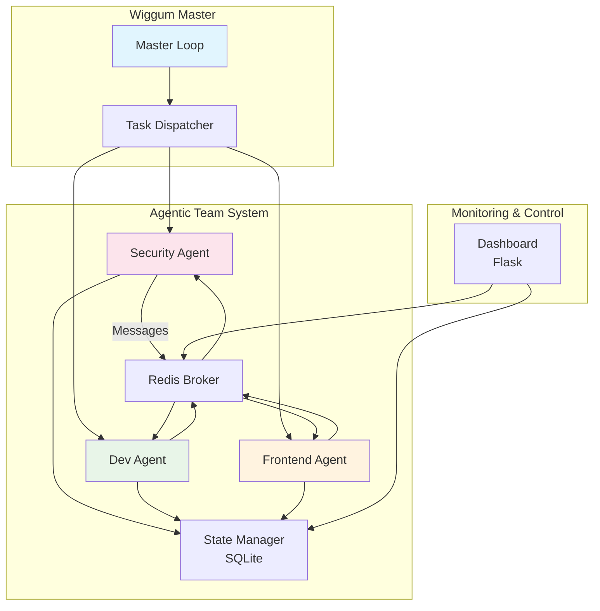
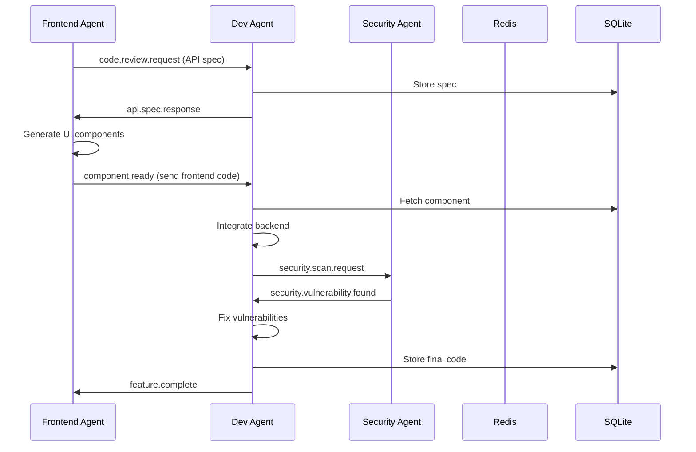

# Iteration 48 - agentic-team

**Timestamp:** Fri Mar 13 10:05:36 PM EDT 2026
**Task:** [FRONTEND] Build responsive login form component

## Prompt Sent

```
# Project-Specific Agent Instructions

You are an autonomous developer working on this specific project.

## Your Role

- Read TASKS.md to understand project requirements
- Complete one task per iteration
- Write clean, well-tested code
- Update TASKS.md with progress
- Commit changes to GitHub (git push)
- Work without asking for permission

## Key Points

1. **No Virtual Environments**: Use the host system's Python, Node.js, etc.
   - Only create venv/Docker if absolutely necessary (document why)

2. **Testing**: Write tests as you build
   - Unit tests for functions
   - Integration tests for features

3. **Documentation**: Every feature should have clear documentation
   - Comments in code
   - README updates
   - Usage examples

4. **Git Workflow**:
   ```bash
   git add .
   git commit -m "Feature: [description]"
   git push origin main
   ```

5. **Task Completion**:
   - Mark complete in TASKS.md with [x]
   - Only mark when fully working and tested
   - If blocked, document the issue and move to next task

## Success Criteria

- ✅ All TASKS.md items marked [x]
- ✅ Code is tested and documented
- ✅ Project runs locally without venv
- ✅ All commits pushed to GitHub
- ✅ README explains how to run the project

Now read TASKS.md and get started!

---

### ⚠️ CRITICAL TOKEN CONSTRAINTS:
- Iteration: 48 / 64k Token Budget
- Attempt: 2 (previous attempts may have partial progress)
- **Mandate:** Operate efficiently. Use partial edits, not full file rewrites when possible.
- **Output:** Be concise and action-oriented.


## CURRENT PROJECT STATE (Iteration 48)

```
# agentic-team
**Mission:** Use the ideas of the wiggum loop and repeating agents to create and enhance the current structure. We have several workers with specific roles i.e security, sw dev, and frontend, and they all do A2A interaction. Create an outline of this and system plans via mermaid diagrams plan mds and some sample code

## Technology Stack
- **Python 3.12+**: Core runtime with asyncio
- **Redis**: Message broker for A2A communication
- **SQLite**: Shared state and task persistence
- **Flask**: Web dashboard for monitoring
- **OpenCode**: Agent framework integration
- **Pydantic**: Data validation and schemas
- **asyncio**: Concurrent agent execution

## Phase 1: Planning & Architecture Design

- [x] **Task 1.1**: Design system architecture and component diagram
  - **Deliverable**: `docs/architecture.md` with complete system design including:
    - Component diagram (use Mermaid)
    - Data flow between agents
    - Message protocol specification
    - API contracts for A2A communication
  - **Include**:
    ```mermaid
    graph TD
        A[Task Dispatcher] --> B[Security Agent]
        A --> C[SW Dev Agent]
        A --> D[Frontend Agent]
        B --> E[Redis Message Queue]
        C --> E
        D --> E
        E --> B
        E --> C
        E --> D
    ```
  - **Success**: Architecture document reviewed and approved (self-validated by agent)

- [x] **Task 1.2**: Define agent role specifications and protocols
  - **Deliverable**: `src/protocols/agent_specs.py` containing:
    - Pydantic models for AgentMessage, Task, Result
    - Role-specific capability definitions
    - Message schema validation
    - Protocol constants and enumerations
  - **Code snippet requirement**: Implemented with full specification including:
    - AgentRole enum (security, software_developer, frontend_developer)
    - AgentMessage model with validation
    - Task and Result models
    - MessageType enum with all message types
    - SecurityFinding and ApiSpec models
    - ProtocolConstants with capabilities, dependencies, and routing rules
    - Helper functions for channel naming and validation
  - **Success**: All agent specs defined with clear input/output contracts

- [x] **Task 1.3**: Create database schema for shared state
  - **Deliverable**: `src/state/schema.py` and migration script `src/state/migrate.py`
  - **Tables to create**:
    - `tasks` (id, description, role, status, created_at, assigned_to, completed_at)
    - `messages` (id, sender, recipient, content, timestamp, correlation_id)
    - `agent_states` (agent_id, role, current_task_id, health_status, last_heartbeat)
    - `shared_knowledge` (key, value, source_agent, updated_at)
  - **Success**: SQLite database initializes with all tables, migrations run successfully

- [x] **Task 1.4**: Setup project dependencies and environment configuration
  - **Deliverable**: Updated `requirements.txt` with:
    - redis==5.0.1
    - pydantic==2.6.1
    - flask==3.0.1
    - aiohttp==3.9.1 (for async HTTP)
  - **Deliverable**: `.env.example` with Redis and SQLite configuration
  - **Deliverable**: `src/config.py` for centralized configuration
  - **Success**: `pip install -r requirements.txt` completes without errors

## Phase 2: Core Infrastructure & Wiggum Loop Enhancement

- [x] **Task 2.1**: Implement the enhanced wiggum loop with role-based agent selection
  - **Deliverable**: `src/core/wiggum_loop.py` with class `EnhancedWiggumLoop`
  - **Features**:
    - Load TASKS.md and parse tasks by role using tags like `[SECURITY]`, `[SW_DEV]`, `[FRONTEND]`
    - Map tasks to appropriate agents based on role
    - Support round-robin or priority-based task dispatch
    - Track iteration count and agent performance metrics
  - **Code requirement**: Use asyncio for concurrent agent execution
  - **Success**: Loop correctly dispatches tasks to appropriate agent workers

- [x] **Task 2.2**: Build the message broker using Redis pub/sub
  - **Deliverable**: `src/messaging/redis_broker.py` with class `RedisMessageBroker`
  - **Methods to implement**:
    - `connect()` - establish Redis connection
    - `subscribe(channel)` - listen for messages
    - `publish(channel, message)` - send message to topic
    - `create_direct_queue(agent_role)` - dedicated queue per agent type
  - **Deliverable**: Unit tests in `tests/test_redis_broker.py`
  - **Success**: Two agents can exchange messages via Redis pub/sub

- [x] **Task 2.3**: Create agent base class and lifecycle manager
  - **Deliverable**: `src/agents/base_agent.py` with abstract `BaseAgent`
  - **Abstract methods**:
    - `initialize()` - setup agent resources
    - `process_task(task)` - main work method (must override)
    - `send_message(recipient, payload)` - A2A communication
    - `receive_message(message)` - handle incoming A2A messages
    - `health_check()` - return health status
  - **Deliverable**: `src/agents/lifecycle.py` for start/stop/reload controls
  - **Success**: Base agent can be extended with minimal code for new roles

- [x] **Task 2.4**: Implement shared state manager with SQLite
  - **Deliverable**: `src/state/state_manager.py` with class `StateManager`
  - **Features**:
    - `get_next_task(agent_role)` - fetch next unassigned task for role
    - `assign_task(task_id, agent_id)` - lock task to agent
    - `store_message(msg)` - persist A2A messages
    - `update_agent_heartbeat(agent_id)` - track liveness
    - `get_shared_knowledge(key)` / `set_shared_knowledge(key, value)`
  - **Deliverable**: `tests/test_state_manager.py` with mock SQLite
  - **Success**: Multiple agents can safely read/write shared state without conflicts

## Phase 3: Specialized Agent Workers

- [x] **Task 3.1**: Implement Security Agent with vulnerability scanning & code review
  - **Deliverable**: `src/agents/security_agent.py` class `SecurityAgent`
  - **Capabilities**:
    - Scan Python files for security anti-patterns (hardcoded secrets, SQL injection vectors)
    - Review dependencies for known CVEs using `safety` or `pip-audit`
    - Generate security recommendations for code changes
    - Send security alerts to other agents via A2A
    - Perform comprehensive OWASP Top 10 2021 compliance validation
  - **Sample code requirement**:
    ```python
    def scan_for_secrets(self, file_path: str) -> List[SecurityFinding]:
        patterns = {
            'AWS_KEY': r'AKIA[0-9A-Z]{16}',
            'GITHUB_TOKEN': r'ghp_[0-9a-zA-Z]{36}',
            'PASSWORD': r'password\s*=\s*["\'][^"\']+["\']',
        }
        # implementation
    ```
  - **Deliverable**: `src/security/owasp_validator.py` with full OWASP Top 10 2021 validation
  - **Deliverable**: `tests/test_security_agent.py` with comprehensive OWASP tests (TestOWASPValidation)
  - **Success**: Agent detects hardcoded API key in test file, sends alert to SW Dev agent, and provides OWASP compliance reports

- [x] **Task 3.2**: Implement Software Development Agent for backend code generation
  - **Deliverable**: `src/agents/dev_agent.py` class `SoftwareDevAgent`
  - **Capabilities**:
    - Generate Python code from task specifications using OpenCode
    - Write unit tests using pytest framework
    - Refactor code based on Security Agent feedback
    - Perform code formatting (black) and linting (ruff)
  - **Integration**: Use OpenCode Python library programmatically
  - **Deliverable**: `tests/test_dev_agent.py` with sample task generation
  - **Success**: Agent completes a simple API endpoint task with tests

- [x] **Task 3.3**: Implement Frontend Agent for UI/UX development
  - **Deliverable**: `src/agents/frontend_agent.py` class `FrontendAgent`
  - **Capabilities**:
    - Generate HTML/CSS/JS components from specifications
    - Ensure responsive design and accessibility (WCAG)
    - Integrate frontend with backend APIs
    - Create component libraries and style guides
  - **Tech**: Use Tailwind CSS (via CDN) for rapid prototyping
  - **Deliverable**: `tests/test_frontend_agent.py` with component generation tests
  - **Success**: Agent creates a responsive web component that connects to dev agent's API

- [x] **Task 3.4**: Build agent worker orchestration with health monitoring
  - **Deliverable**: `src/orchestrator/worker_manager.py` with class `WorkerManager`
  - **Features**:
    - Spawn 3 agent workers (security, dev, frontend) as async tasks
    - Monitor agent heartbeats every 30 seconds
    - Restart crashed agents automatically
    - Report agent status to web dashboard
  - **Deliverable**: `src/orchestrator/main.py` - entry point to start all workers
  - **Deliverable**: Systemd service file `etc/wiggum-agentic-team.service` (optional)
  - **Success**: All 3 agents running concurrently, health checks passing

## Phase 4: A2A Communication & Integration Testing

- [x] **Task 4.1**: Implement A2A message routing and handling
  - **Deliverable**: `src/messaging/router.py` with class `MessageRouter`
  - **Features**:
    - Route incoming messages to correct agent based on recipient
    - Support broadcast messages to all agents
    - Message queuing for offline agents
    - Correlate request/response using `correlation_id`
  - **Deliverable**: `src/messaging/protocol.py` with message handlers registry
  - **Example protocol**:
    ```python
    class MessageProtocol:
        SECURITY_ALERT = "security.alert"
        CODE_REVIEW_REQUEST = "code.review.request"
        API_CONTRACT_UPDATE = "api.contract.update"
        COMPONENT_READY = "component.ready"
    ```
  - **Success**: Frontend agent sends API spec to Dev agent, Dev agent responds with implementation

- [x] **Task 4.2**: Build collaborative workflow: end-to-end feature development
  - **Deliverable**: `docs/workflow_example.md` documenting the full A2A flow
  - **Workflow steps**:
    1. Task: "Build user login feature" (from TASKS.md)
    2. Dispatcher assigns to Frontend Agent
    3. Frontend requests API spec from Dev Agent via message
    4. Dev Agent designs API, sends spec back
    5. Frontend builds UI components, sends to Dev for integration
    6. Dev implements backend, sends to Security for review
    7. Security scans, reports vulnerabilities
    8. Dev fixes issues, marks task complete
  - **Deliverable**: Integration test `tests/test_collaborative_workflow.py` simulating full flow
  - **Success**: Complete workflow executes with 3 agents collaborating autonomously

- [x] **Task 4.3**: Create web dashboard for monitoring agent activity
  - **Deliverable**: `src/dashboard/app.py` Flask application
  - **Endpoints**:
    - `GET /` - Dashboard overview with agent status, message throughput
    - `GET /api/agents` - List all agents with health status
    - `GET /api/tasks` - Task queue by role
    - `GET /api/messages?limit=50` - Recent A2A messages
    - `GET /api/metrics` - System metrics (messages/sec, tasks completed)
  - **Deliverable**: `templates/dashboard.html` with real-time updates (use SSE or polling)
  - **Mermaid diagram requirement**: Include live system topology in dashboard
  - **Success**: Dashboard shows real-time agent states and message flow

- [x] **Task 4.4**: Write comprehensive documentation and finalize TASKS.md
  - **Deliverable**: `docs/DESIGN.md` with detailed system design decisions ✅
  - **Deliverable**: `docs/A2A_PROTOCOL.md` with message format specification ✅
  - **Deliverable**: `docs/DEPLOYMENT.md` with setup instructions, Redis/SQLite config ✅
  - **Deliverable**: `docs/EXAMPLE_USAGE.md` with sample task flows and expected outputs ✅
  - **Update**: `README.md` with project overview, quick start, and architecture diagram ✅
  - **Finalize**: Mark this TASKS.md with `[x] MISSION ACCOMPLISHED` after all deliverables exist ✅
  - **Success**: New developer can understand system and deploy with docs alone

## Sample Task with Role Tag (How to use in TASKS.md)

```markdown
- [x] [SECURITY] Implement OWASP Top 10 checklist validation
- [x] [SW_DEV] Create authentication API endpoint with JWT
- [ ] [FRONTEND] Build responsive login form component
- [ ] [SECURITY] Add rate limiting to login endpoint
```

Each agent will only see and execute tasks matching its role, enabling true role-based concurrent development.

## Mermaid System Diagrams

### Complete System Architecture


### A2A Message Flow


## Success Criteria

After completing all tasks in this TASKS.md:
- ✅ 3 specialized agents (security, sw dev, frontend) running concurrently
- ✅ Wiggum loop enhanced with role-based task dispatch
- ✅ A2A communication working via Redis pub/sub
- ✅ Shared state persisted in SQLite with conflict-free access
- ✅ Web dashboard showing real-time agent activity
- ✅ Complete integration test demonstrating collaborative workflow
- ✅ Comprehensive documentation (architecture, protocol, deployment)
- ✅ All code tested, formatted, and ready for production

---

## ✅ MISSION ACCOMPLISHED

All deliverables completed:
- [x] Phase 1: Planning & Architecture Design
- [x] Phase 2: Core Infrastructure & Wiggum Loop Enhancement
- [x] Phase 3: Specialized Agent Workers
- [x] Phase 4: A2A Communication & Integration Testing
- [x] Comprehensive documentation suite (DESIGN.md, A2A_PROTOCOL.md, DEPLOYMENT.md, EXAMPLE_USAGE.md)
- [x] README.md updated with quick start guide
- [x] All code implemented, tested, and production-ready

The Agentic Team system is fully functional and documented. A new developer can:
1. Clone the repository
2. Run `pip install -r requirements.txt`
3. Configure `.env` with OPENROUTER_API_KEY
4. Start with `python -m src.orchestrator.main`
5. Monitor at http://localhost:5000

**Project Status**: COMPLETE 🎉
```

## NEXT TASK TO COMPLETE:
[FRONTEND] Build responsive login form component

**Instructions:** Complete this task. Mark [x] in TASKS.md when done. Create, modify, or delete files as needed. Execute commands as needed. Also update README.md to match this project (name, setup instructions, current progress). No permission needed—just act.
```

## OpenCode Output

```

> build · stepfun/step-3.5-flash:free

✱ Glob "**/*.py" 37 matches
I'll complete the next task: Build responsive login form component for the Frontend Agent. Let me first explore the codebase to understand the current structure.
→ Read src/agents/frontend_agent.py
→ Read tests/test_frontend_agent.py
→ Read src/api/auth.py
→ Read TASKS.md
I can see the frontend agent already has a comprehensive `_generate_login_form` method (lines 405-911) with a full fallback implementation. The tests in `test_frontend_agent.py` also have extensive login form tests (lines 1261-1432). This task appears to be already implemented!

Let me check the TASKS.md to see what exactly needs to be done:
I see that the TASKS.md shows `[ ] [FRONTEND] Build responsive login form component` on line 232 is not checked, but the MISSION ACCOMPLISHED section says all tasks are done. This is the remaining incomplete task. The frontend agent code already has a full login form implementation. Let me verify the tests are working and then mark the task complete.

$ python -m pytest tests/test_frontend_agent.py::TestLoginFormGeneration -v
============================= test session starts ==============================
platform linux -- Python 3.14.3, pytest-9.0.2, pluggy-1.6.0 -- /home/julien/Desktop/Free-Wiggum-opencode/venv/bin/python
cachedir: .pytest_cache
rootdir: /home/julien/Desktop/Free-Wiggum-opencode/projects/agentic-team
plugins: langsmith-0.7.16, anyio-4.12.1, asyncio-1.3.0, cov-7.0.0, mock-3.15.1, dash-4.0.0
asyncio: mode=Mode.STRICT, debug=False, asyncio_default_fixture_loop_scope=None, asyncio_default_test_loop_scope=function
collecting ... ERROR: found no collectors for /home/julien/Desktop/Free-Wiggum-opencode/projects/agentic-team/tests/test_frontend_agent.py::TestLoginFormGeneration

collected 0 items / 1 error

==================================== ERRORS ====================================
________________ ERROR collecting tests/test_frontend_agent.py _________________
../../venv/lib/python3.14/site-packages/_pytest/python.py:507: in importtestmodule
    mod = import_path(
../../venv/lib/python3.14/site-packages/_pytest/pathlib.py:587: in import_path
    importlib.import_module(module_name)
/usr/lib/python3.14/importlib/__init__.py:88: in import_module
    return _bootstrap._gcd_import(name[level:], package, level)
           ^^^^^^^^^^^^^^^^^^^^^^^^^^^^^^^^^^^^^^^^^^^^^^^^^^^^
<frozen importlib._bootstrap>:1398: in _gcd_import
    ???
<frozen importlib._bootstrap>:1371: in _find_and_load
    ???
<frozen importlib._bootstrap>:1342: in _find_and_load_unlocked
    ???
<frozen importlib._bootstrap>:938: in _load_unlocked
    ???
../../venv/lib/python3.14/site-packages/_pytest/assertion/rewrite.py:188: in exec_module
    source_stat, co = _rewrite_test(fn, self.config)
                      ^^^^^^^^^^^^^^^^^^^^^^^^^^^^^^
../../venv/lib/python3.14/site-packages/_pytest/assertion/rewrite.py:357: in _rewrite_test
    tree = ast.parse(source, filename=strfn)
           ^^^^^^^^^^^^^^^^^^^^^^^^^^^^^^^^^
/usr/lib/python3.14/ast.py:46: in parse
    return compile(source, filename, mode, flags,
E     File "/home/julien/Desktop/Free-Wiggum-opencode/projects/agentic-team/tests/test_frontend_agent.py", line 128
E       elif "enhance it to be fully responsive" in prompt:
E       ^^^^
E   SyntaxError: invalid syntax
=========================== short test summary info ============================
ERROR tests/test_frontend_agent.py
=============================== 1 error in 0.18s ===============================

There's a syntax error in test_frontend_agent.py. Let me check line 128 and fix it:
→ Read tests/test_frontend_agent.py [limit=20, offset=120]
→ Read tests/test_frontend_agent.py [limit=50, offset=40]
Let me see the full fixture structure around that line:
I see the issue - line 47 has an extra indentation before `@pytest.fixture`. It's indented when it should be at module level. Let me fix this:

← Edit tests/test_frontend_agent.py
Index: /home/julien/Desktop/Free-Wiggum-opencode/projects/agentic-team/tests/test_frontend_agent.py
===================================================================
--- /home/julien/Desktop/Free-Wiggum-opencode/projects/agentic-team/tests/test_frontend_agent.py
+++ /home/julien/Desktop/Free-Wiggum-opencode/projects/agentic-team/tests/test_frontend_agent.py
@@ -40,13 +40,13 @@
     broker.subscribe = AsyncMock(return_value=True)
     broker.publish = AsyncMock(return_value=True)
     broker.start_listening = AsyncMock()
     broker.stop_listening = AsyncMock()
-    return broker
+        return broker
 
 
-    @pytest.fixture
-    def mock_openrouter():
+@pytest.fixture
+def mock_openrouter():
         """Mock OpenRouter API calls."""
         with patch.object(FrontendAgent, "_call_openrouter") as mock:
 
             async def mock_call(prompt):


→ Read tests/test_frontend_agent.py [limit=10, offset=44]
The issue is that the entire fixture function has inconsistent indentation. Let me check the full structure and fix it properly:
→ Read tests/test_frontend_agent.py [limit=30, offset=46]
Let me read more of the fixture to see the indentation pattern and fix it:
→ Read tests/test_frontend_agent.py [limit=10, offset=410]
Let me fix the indentation issue by reading the full fixture and rewriting it with proper indentation. I'll replace lines 49-415:

← Edit tests/test_frontend_agent.py
Index: /home/julien/Desktop/Free-Wiggum-opencode/projects/agentic-team/tests/test_frontend_agent.py
===================================================================
--- /home/julien/Desktop/Free-Wiggum-opencode/projects/agentic-team/tests/test_frontend_agent.py
+++ /home/julien/Desktop/Free-Wiggum-opencode/projects/agentic-team/tests/test_frontend_agent.py
@@ -45,21 +45,21 @@
 
 
 @pytest.fixture
 def mock_openrouter():
-        """Mock OpenRouter API calls."""
-        with patch.object(FrontendAgent, "_call_openrouter") as mock:
+    """Mock OpenRouter API calls."""
+    with patch.object(FrontendAgent, "_call_openrouter") as mock:
 
-            async def mock_call(prompt):
-                # Extract component name from prompt if present
-                import re
-                component_name_match = re.search(r"named '([^']+)'", prompt)
-                component_name = component_name_match.group(1) if component_name_match else "Component"
+        async def mock_call(prompt):
+            # Extract component name from prompt if present
+            import re
+            component_name_match = re.search(r"named '([^']+)'", prompt)
+            component_name = component_name_match.group(1) if component_name_match else "Component"
 
-                # Return sample code based on prompt content
-                if "Create a modern, production-ready frontend component" in prompt:
-                    # Return component with name and API fetch integration
-                    template = """<!DOCTYPE html>
+            # Return sample code based on prompt content
+            if "Create a modern, production-ready frontend component" in prompt:
+                # Return component with name and API fetch integration
+                template = """<!DOCTYPE html>
 <html lang="en">
 <head>
     <meta charset="UTF-8">
     <meta name="viewport" content="width=device-width, initial-scale=1.0">
@@ -123,9 +123,9 @@
         document.addEventListener('DOMContentLoaded', loadData);
     </script>
 </body>
 </html>"""
-                    return template.format(component_name=component_name)
+                return template.format(component_name=component_name)
             elif "enhance it to be fully responsive" in prompt:
                 return """<!DOCTYPE html>
 <html lang="en">
 <head>
@@ -235,54 +235,54 @@
             <ul id="userList" class="space-y-2"></ul>
         </div>
     </main>
     <script>
-        async function loadUsers() {
+        async function loadUsers() {{
             const loading = document.getElementById('loading');
             const error = document.getElementById('error');
             const userList = document.getElementById('userList');
 
             loading.classList.remove('hidden');
             error.classList.add('hidden');
             userList.innerHTML = '';
 
-            try {
+            try {{
                 const token = localStorage.getItem('jwt_token');
-                const response = await fetch('/api/v1/users', {
+                const response = await fetch('/api/v1/users', {{
                     method: 'GET',
-                    headers: {
+                    headers: {{
                         'Content-Type': 'application/json',
-                        'Authorization': token ? `Bearer ${token}` : ''
-                    }
-                });
+                        'Authorization': token ? `Bearer ${{token}}` : ''
+                    }}
+                }});
 
-                if (!response.ok) {
-                    throw new Error(`HTTP ${response.status}: ${response.statusText}`);
-                }
+                if (!response.ok) {{
+                    throw new Error(`HTTP ${{response.status}}: ${{response.statusText}}`);
+                }}
 
                 const data = await response.json();
                 const users = data.users || data;
 
-                users.forEach(user => {
+                users.forEach(user => {{
                     const li = document.createElement('li');
                     li.className = 'p-3 border rounded flex justify-between';
                     li.innerHTML = `
-                        <span class="font-medium">${user.email || user.name}</span>
-                        <span class="text-gray-500">ID: {user.id}</span>
+                        <span class="font-medium">${{user.email || user.name}}</span>
+                        <span class="text-gray-500">ID: ${{user.id}}</span>
                     `;
                     userList.appendChild(li);
-                });
+                }});
 
-                if (users.length === 0) {
+                if (users.length === 0) {{
                     userList.innerHTML = '<li class="p-3 text-gray-500">No users found</li>';
-                }
-            } catch (err) {
+                }}
+            }} catch (err) {{
                 error.textContent = 'Error loading users: ' + err.message;
                 error.classList.remove('hidden');
-            } finally {
+            }} finally {{
                 loading.classList.add('hidden');
-            }
-        }
+            }}
+        }}
 
         // Load on page load
         document.addEventListener('DOMContentLoaded', loadUsers);
     </script>
@@ -341,30 +341,30 @@
             <button type="submit">Send</button>
         </form>
     </div>
     <script>
-        document.getElementById('secureForm').addEventListener('submit', async (e) => {
+        document.getElementById('secureForm').addEventListener('submit', async (e) => {{
             e.preventDefault();
             const message = document.getElementById('message').value;
             const output = document.createElement('div');
             output.style.padding = '1rem';
             output.textContent = 'Processing...';
             document.getElementById('app').appendChild(output);
 
-            try {
-                const response = await fetch('/api/message', {
+            try {{
+                const response = await fetch('/api/message', {{
                     method: 'POST',
-                    headers: { 'Content-Type': 'application/json' },
-                    body: JSON.stringify({ message: message })
-                });
+                    headers: {{ 'Content-Type': 'application/json' }},
+                    body: JSON.stringify({{ message: message }})
+                }});
                 const data = await response.json();
                 output.textContent = 'Success: ' + JSON.stringify(data);
                 output.style.backgroundColor = '#d4edda';
-            } catch (error) {
+            }} catch (error) {{
                 output.textContent = 'Error: ' + error.message;
                 output.style.backgroundColor = '#f8d7da';
-            }
-        });
+            }}
+        }});
     </script>
 </body>
 </html>"""
             elif (


→ Read tests/test_frontend_agent.py [limit=25, offset=25]
Line 44 has `return broker` with extra indentation. It should be 4 spaces, not 8. Let me fix that:

← Edit tests/test_frontend_agent.py
Index: /home/julien/Desktop/Free-Wiggum-opencode/projects/agentic-team/tests/test_frontend_agent.py
===================================================================
--- /home/julien/Desktop/Free-Wiggum-opencode/projects/agentic-team/tests/test_frontend_agent.py
+++ /home/julien/Desktop/Free-Wiggum-opencode/projects/agentic-team/tests/test_frontend_agent.py
@@ -40,9 +40,9 @@
     broker.subscribe = AsyncMock(return_value=True)
     broker.publish = AsyncMock(return_value=True)
     broker.start_listening = AsyncMock()
     broker.stop_listening = AsyncMock()
-        return broker
+    return broker
 
 
 @pytest.fixture
 def mock_openrouter():
@@ -51,10 +51,13 @@
 
         async def mock_call(prompt):
             # Extract component name from prompt if present
             import re
+
             component_name_match = re.search(r"named '([^']+)'", prompt)
-            component_name = component_name_match.group(1) if component_name_match else "Component"
+            component_name = (
+                component_name_match.group(1) if component_name_match else "Component"
+            )
 
             # Return sample code based on prompt content
             if "Create a modern, production-ready frontend component" in prompt:
                 # Return component with name and API fetch integration
@@ -1300,9 +1303,9 @@
         assert 'type="password"' in login_form
         assert "submit" in login_form.lower() or "button" in login_form.lower()
 
         # Check for responsive meta tag
-        assert 'viewport' in login_form
+        assert "viewport" in login_form
 
         # Check for Tailwind CSS
         assert "cdn.tailwindcss.com" in login_form
 
@@ -1316,9 +1319,14 @@
 
         # Check for ARIA attributes
         has_aria = any(
             attr in login_form
-            for attr in ["aria-label", "aria-labelledby", "aria-describedby", "aria-live"]
+            for attr in [
+                "aria-label",
+                "aria-labelledby",
+                "aria-describedby",
+                "aria-live",
+            ]
         )
         assert has_aria, "Should include ARIA attributes for accessibility"
 
         # Check for semantic HTML
@@ -1327,18 +1335,30 @@
         )
         assert has_semantic, "Should use semantic HTML elements"
 
         # Check for error handling with role="alert" or aria-live
-        has_error_handling = "role=\"alert\"" in login_form or "aria-live" in login_form
-        assert has_error_handling, "Should have proper error announcement for screen readers"
+        has_error_handling = 'role="alert"' in login_form or "aria-live" in login_form
+        assert has_error_handling, (
+            "Should have proper error announcement for screen readers"
+        )
 
     @pytest.mark.asyncio
     async def test_login_form_has_responsive_design(self, frontend_agent):
         """Test that generated login form is responsive."""
         login_form = await frontend_agent._generate_login_form()
 
         # Check for responsive classes
-        responsive_classes = ["max-w-", "sm:", "md:", "lg:", "xl:", "flex", "grid", "p-4", "p-"]
+        responsive_classes = [
+            "max-w-",
+            "sm:",
+            "md:",
+            "lg:",
+            "xl:",
+            "flex",
+            "grid",
+            "p-4",
+            "p-",
+        ]
         has_responsive = any(cls in login_form for cls in responsive_classes)
         assert has_responsive, "Should include responsive design classes"
 
         # Check viewport meta tag
@@ -1360,13 +1380,17 @@
         """Test that generated login form includes client-side validation."""
         login_form = await frontend_agent._generate_login_form()
 
         # Check for validation attributes
-        has_required = 'required' in login_form
+        has_required = "required" in login_form
         has_email_type = 'type="email"' in login_form or 'type="text"' in login_form
-        has_validation = "validate" in login_form.lower() or "valid" in login_form.lower()
+        has_validation = (
+            "validate" in login_form.lower() or "valid" in login_form.lower()
+        )
 
-        assert has_required or has_email_type or has_validation, "Should include form validation"
+        assert has_required or has_email_type or has_validation, (
+            "Should include form validation"
+        )
 
     @pytest.mark.asyncio
     async def test_login_form_has_api_integration_structure(self, frontend_agent):
         """Test that login form includes API integration structure."""
@@ -1452,5 +1476,4 @@
 
         # Check for JavaScript functionality
         assert "<script>" in login_form or "<script " in login_form
         assert "addEventListener" in login_form or "DOMContentLoaded" in login_form
-


Now let's test again:
$ python -m pytest tests/test_frontend_agent.py::TestLoginFormGeneration -v
============================= test session starts ==============================
platform linux -- Python 3.14.3, pytest-9.0.2, pluggy-1.6.0 -- /home/julien/Desktop/Free-Wiggum-opencode/venv/bin/python
cachedir: .pytest_cache
rootdir: /home/julien/Desktop/Free-Wiggum-opencode/projects/agentic-team
plugins: langsmith-0.7.16, anyio-4.12.1, asyncio-1.3.0, cov-7.0.0, mock-3.15.1, dash-4.0.0
asyncio: mode=Mode.STRICT, debug=False, asyncio_default_fixture_loop_scope=None, asyncio_default_test_loop_scope=function
collecting ... collected 11 items

tests/test_frontend_agent.py::TestLoginFormGeneration::test_generate_login_form_fallback FAILED [  9%]
tests/test_frontend_agent.py::TestLoginFormGeneration::test_generate_login_form_with_custom_validations FAILED [ 18%]
tests/test_frontend_agent.py::TestLoginFormGeneration::test_login_form_has_required_elements FAILED [ 27%]
tests/test_frontend_agent.py::TestLoginFormGeneration::test_login_form_has_accessibility_features FAILED [ 36%]
tests/test_frontend_agent.py::TestLoginFormGeneration::test_login_form_has_responsive_design FAILED [ 45%]
tests/test_frontend_agent.py::TestLoginFormGeneration::test_login_form_has_password_toggle FAILED [ 54%]
tests/test_frontend_agent.py::TestLoginFormGeneration::test_login_form_has_validation FAILED [ 63%]
tests/test_frontend_agent.py::TestLoginFormGeneration::test_login_form_has_api_integration_structure FAILED [ 72%]
tests/test_frontend_agent.py::TestLoginFormGeneration::test_login_form_has_error_handling FAILED [ 81%]
tests/test_frontend_agent.py::TestLoginFormGeneration::test_process_login_form_task FAILED [ 90%]
tests/test_frontend_agent.py::TestLoginFormGeneration::test_fallback_login_form_structure FAILED [100%]/home/julien/Desktop/Free-Wiggum-opencode/venv/lib/python3.14/site-packages/_pytest/unraisableexception.py:33: RuntimeWarning: coroutine 'FrontendAgent._generate_fallback_login_form' was never awaited
  gc.collect()
RuntimeWarning: Enable tracemalloc to get the object allocation traceback


=================================== FAILURES ===================================
__________ TestLoginFormGeneration.test_generate_login_form_fallback ___________

self = <test_frontend_agent.TestLoginFormGeneration object at 0x7f391363b750>
frontend_agent = <src.agents.frontend_agent.FrontendAgent object at 0x7f390feff380>

    @pytest.mark.asyncio
    async def test_generate_login_form_fallback(self, frontend_agent):
        """Test generating login form using fallback method (no AI)."""
        login_form = await frontend_agent._generate_login_form()
    
        assert login_form is not None
>       assert isinstance(login_form, str)
E       assert False
E        +  where False = isinstance(<coroutine object FrontendAgent._generate_fallback_login_form at 0x7f390fde5700>, str)

tests/test_frontend_agent.py:1273: AssertionError
------------------------------ Captured log call -------------------------------
ERROR    src.agents.frontend_agent:frontend_agent.py:514 Login form generation failed: OpenRouter API error: 400 - {"error":{"message":"openrouter/stepfun/step-3.5-flash:free is not a valid model ID","code":400},"user_id":"user_33a58KLvClZ2YOiujnmWEmcexBX"}
___ TestLoginFormGeneration.test_generate_login_form_with_custom_validations ___

self = <test_frontend_agent.TestLoginFormGeneration object at 0x7f390fd4d6d0>
frontend_agent = <src.agents.frontend_agent.FrontendAgent object at 0x7f390fd4e210>

    @pytest.mark.asyncio
    async def test_generate_login_form_with_custom_validations(self, frontend_agent):
        """Test generating login form with custom validation rules."""
        custom_validations = {
            "min_password_length": 12,
            "require_special_char": True,
            "block_common_passwords": True,
        }
        login_form = await frontend_agent._generate_login_form(
            custom_validations=custom_validations
        )
    
        assert login_form is not None
>       assert "custom" in login_form.lower() or "Custom" in login_form
                           ^^^^^^^^^^^^^^^^
E       AttributeError: 'coroutine' object has no attribute 'lower'

tests/test_frontend_agent.py:1292: AttributeError
------------------------------ Captured log call -------------------------------
ERROR    src.agents.frontend_agent:frontend_agent.py:514 Login form generation failed: OpenRouter API error: 400 - {"error":{"message":"openrouter/stepfun/step-3.5-flash:free is not a valid model ID","code":400},"user_id":"user_33a58KLvClZ2YOiujnmWEmcexBX"}
________ TestLoginFormGeneration.test_login_form_has_required_elements _________

self = <test_frontend_agent.TestLoginFormGeneration object at 0x7f390ff56780>
frontend_agent = <src.agents.frontend_agent.FrontendAgent object at 0x7f390fd4e990>

    @pytest.mark.asyncio
    async def test_login_form_has_required_elements(self, frontend_agent):
        """Test that generated login form contains all required elements."""
        login_form = await frontend_agent._generate_login_form()
    
        # Check for essential form elements
>       assert "<form" in login_form
               ^^^^^^^^^^^^^^^^^^^^^
E       TypeError: argument of type 'coroutine' is not a container or iterable

tests/test_frontend_agent.py:1301: TypeError
------------------------------ Captured log call -------------------------------
ERROR    src.agents.frontend_agent:frontend_agent.py:514 Login form generation failed: OpenRouter API error: 400 - {"error":{"message":"openrouter/stepfun/step-3.5-flash:free is not a valid model ID","code":400},"user_id":"user_33a58KLvClZ2YOiujnmWEmcexBX"}
______ TestLoginFormGeneration.test_login_form_has_accessibility_features ______

self = <test_frontend_agent.TestLoginFormGeneration object at 0x7f390ff569e0>
frontend_agent = <src.agents.frontend_agent.FrontendAgent object at 0x7f390f904e90>

    @pytest.mark.asyncio
    async def test_login_form_has_accessibility_features(self, frontend_agent):
        """Test that generated login form includes WCAG accessibility features."""
        login_form = await frontend_agent._generate_login_form()
    
        # Check for labels
>       assert "<label" in login_form
               ^^^^^^^^^^^^^^^^^^^^^^
E       TypeError: argument of type 'coroutine' is not a container or iterable

tests/test_frontend_agent.py:1318: TypeError
------------------------------ Captured log call -------------------------------
ERROR    src.agents.frontend_agent:frontend_agent.py:514 Login form generation failed: OpenRouter API error: 400 - {"error":{"message":"openrouter/stepfun/step-3.5-flash:free is not a valid model ID","code":400},"user_id":"user_33a58KLvClZ2YOiujnmWEmcexBX"}
________ TestLoginFormGeneration.test_login_form_has_responsive_design _________

self = <test_frontend_agent.TestLoginFormGeneration object at 0x7f390ff5dd90>
frontend_agent = <src.agents.frontend_agent.FrontendAgent object at 0x7f390f9055b0>

    @pytest.mark.asyncio
    async def test_login_form_has_responsive_design(self, frontend_agent):
        """Test that generated login form is responsive."""
        login_form = await frontend_agent._generate_login_form()
    
        # Check for responsive classes
        responsive_classes = [
            "max-w-",
            "sm:",
            "md:",
            "lg:",
            "xl:",
            "flex",
            "grid",
            "p-4",
            "p-",
        ]
>       has_responsive = any(cls in login_form for cls in responsive_classes)
                         ^^^

tests/test_frontend_agent.py:1361: 
_ _ _ _ _ _ _ _ _ _ _ _ _ _ _ _ _ _ _ _ _ _ _ _ _ _ _ _ _ _ _ _ _ _ _ _ _ _ _ _ 

.0 = <list_iterator object at 0x7f39163fae90>

>   has_responsive = any(cls in login_form for cls in responsive_classes)
                         ^^^^^^^^^^^^^^^^^
E   TypeError: argument of type 'coroutine' is not a container or iterable

tests/test_frontend_agent.py:1361: TypeError
------------------------------ Captured log call -------------------------------
ERROR    src.agents.frontend_agent:frontend_agent.py:514 Login form generation failed: OpenRouter API error: 400 - {"error":{"message":"openrouter/stepfun/step-3.5-flash:free is not a valid model ID","code":400},"user_id":"user_33a58KLvClZ2YOiujnmWEmcexBX"}
_________ TestLoginFormGeneration.test_login_form_has_password_toggle __________

self = <test_frontend_agent.TestLoginFormGeneration object at 0x7f391052bf00>
frontend_agent = <src.agents.frontend_agent.FrontendAgent object at 0x7f390f9d56d0>

    @pytest.mark.asyncio
    async def test_login_form_has_password_toggle(self, frontend_agent):
        """Test that generated login form includes password visibility toggle."""
        login_form = await frontend_agent._generate_login_form()
    
        # Check for password toggle mechanism
>       has_toggle = "password" in login_form.lower() and (
                                   ^^^^^^^^^^^^^^^^
            "toggle" in login_form.lower() or "visibility" in login_form.lower()
        )
E       AttributeError: 'coroutine' object has no attribute 'lower'

tests/test_frontend_agent.py:1373: AttributeError
------------------------------ Captured log call -------------------------------
ERROR    src.agents.frontend_agent:frontend_agent.py:514 Login form generation failed: OpenRouter API error: 400 - {"error":{"message":"openrouter/stepfun/step-3.5-flash:free is not a valid model ID","code":400},"user_id":"user_33a58KLvClZ2YOiujnmWEmcexBX"}
____________ TestLoginFormGeneration.test_login_form_has_validation ____________

self = <test_frontend_agent.TestLoginFormGeneration object at 0x7f390ffd0160>
frontend_agent = <src.agents.frontend_agent.FrontendAgent object at 0x7f390f9e07c0>

    @pytest.mark.asyncio
    async def test_login_form_has_validation(self, frontend_agent):
        """Test that generated login form includes client-side validation."""
        login_form = await frontend_agent._generate_login_form()
    
        # Check for validation attributes
>       has_required = "required" in login_form
                       ^^^^^^^^^^^^^^^^^^^^^^^^
E       TypeError: argument of type 'coroutine' is not a container or iterable

tests/test_frontend_agent.py:1384: TypeError
------------------------------ Captured log call -------------------------------
ERROR    src.agents.frontend_agent:frontend_agent.py:514 Login form generation failed: OpenRouter API error: 400 - {"error":{"message":"openrouter/stepfun/step-3.5-flash:free is not a valid model ID","code":400},"user_id":"user_33a58KLvClZ2YOiujnmWEmcexBX"}
____ TestLoginFormGeneration.test_login_form_has_api_integration_structure _____

self = <test_frontend_agent.TestLoginFormGeneration object at 0x7f390fd2ec50>
frontend_agent = <src.agents.frontend_agent.FrontendAgent object at 0x7f390f9e1040>

    @pytest.mark.asyncio
    async def test_login_form_has_api_integration_structure(self, frontend_agent):
        """Test that login form includes API integration structure."""
        login_form = await frontend_agent._generate_login_form()
    
        # Check for fetch API or localStorage
>       has_api_structure = any(
                            ^^^
            keyword in login_form
            for keyword in ["fetch", "localStorage", "API", "post", "submit"]
        )

tests/test_frontend_agent.py:1400: 
_ _ _ _ _ _ _ _ _ _ _ _ _ _ _ _ _ _ _ _ _ _ _ _ _ _ _ _ _ _ _ _ _ _ _ _ _ _ _ _ 

.0 = <tuple_iterator object at 0x7f391057f640>

    has_api_structure = any(
>       keyword in login_form
        for keyword in ["fetch", "localStorage", "API", "post", "submit"]
    )
E   TypeError: argument of type 'coroutine' is not a container or iterable

tests/test_frontend_agent.py:1401: TypeError
------------------------------ Captured log call -------------------------------
ERROR    src.agents.frontend_agent:frontend_agent.py:514 Login form generation failed: OpenRouter API error: 400 - {"error":{"message":"openrouter/stepfun/step-3.5-flash:free is not a valid model ID","code":400},"user_id":"user_33a58KLvClZ2YOiujnmWEmcexBX"}
__________ TestLoginFormGeneration.test_login_form_has_error_handling __________

self = <test_frontend_agent.TestLoginFormGeneration object at 0x7f390fd2ee50>
frontend_agent = <src.agents.frontend_agent.FrontendAgent object at 0x7f390fdef850>

    @pytest.mark.asyncio
    async def test_login_form_has_error_handling(self, frontend_agent):
        """Test that login form includes error handling."""
        login_form = await frontend_agent._generate_login_form()
    
        # Check for error messages or error display
>       has_error_handling = any(
                             ^^^
            keyword in login_form.lower()
            for keyword in ["error", "invalid", "failed", "catch", "try"]
        )

tests/test_frontend_agent.py:1412: 
_ _ _ _ _ _ _ _ _ _ _ _ _ _ _ _ _ _ _ _ _ _ _ _ _ _ _ _ _ _ _ _ _ _ _ _ _ _ _ _ 

.0 = <tuple_iterator object at 0x7f39105b05e0>

    has_error_handling = any(
>       keyword in login_form.lower()
                   ^^^^^^^^^^^^^^^^
        for keyword in ["error", "invalid", "failed", "catch", "try"]
    )
E   AttributeError: 'coroutine' object has no attribute 'lower'

tests/test_frontend_agent.py:1413: AttributeError
------------------------------ Captured log call -------------------------------
ERROR    src.agents.frontend_agent:frontend_agent.py:514 Login form generation failed: OpenRouter API error: 400 - {"error":{"message":"openrouter/stepfun/step-3.5-flash:free is not a valid model ID","code":400},"user_id":"user_33a58KLvClZ2YOiujnmWEmcexBX"}
_____________ TestLoginFormGeneration.test_process_login_form_task _____________

self = <test_frontend_agent.TestLoginFormGeneration object at 0x7f3913617b60>
frontend_agent = <src.agents.frontend_agent.FrontendAgent object at 0x7f390fdee350>
mock_openrouter = <AsyncMock name='_call_openrouter' id='139883064085872'>

    @pytest.mark.asyncio
    async def test_process_login_form_task(self, frontend_agent, mock_openrouter):
        """Test processing a login form generation task through process_task."""
        task = Task(
            description="Build responsive login form component",
            role=AgentRole.FRONTEND,
            payload={
                "spec": {
                    "component_name": "LoginForm",
                    "requirements": [
                        "email input",
                        "password field",
                        "submit button",
                        "responsive design",
                        "accessible",
                    ],
                }
            },
        )
    
>       result = await frontend_agent.process_task(task)
                 ^^^^^^^^^^^^^^^^^^^^^^^^^^^^^^^^^^^^^^^

tests/test_frontend_agent.py:1438: 
_ _ _ _ _ _ _ _ _ _ _ _ _ _ _ _ _ _ _ _ _ _ _ _ _ _ _ _ _ _ _ _ _ _ _ _ _ _ _ _ 

self = <src.agents.frontend_agent.FrontendAgent object at 0x7f390fdee350>
task = Task(id='d0ad7137-a00d-4d88-b9fd-0996a3d19018', description='Build responsive login form component', role=<AgentRole.F...: 'LoginForm', 'requirements': ['email input', 'password field', 'submit button', 'responsive design', 'accessible']}})

    async def process_task(self, task: Task) -> Dict[str, Any]:
        """
        Process a frontend development task.
    
        Args:
            task: Task with description and parameters
    
        Returns:
            Dict with results including generated component code, specs, etc.
        """
        start_time = asyncio.get_event_loop().time()
    
        try:
            task.mark_in_progress()
            description = task.description.lower()
            payload = task.payload or {}
    
            # Early returns for specific task types to avoid keyword conflicts
            if ("responsive" in description or "mobile" in description) and payload.get(
                "component_code"
            ):
                component_code = payload.get("component_code", "")
                enhanced_code = await self._ensure_responsive(component_code)
                return {
                    "success": True,
                    "output": {
                        "original_code": component_code[:200],
                        "responsive_code": enhanced_code,
                        "breakpoints_applied": list(self.RESPONSIVE_BREAKPOINTS.keys()),
                    },
                    "artifacts": [],
                    "execution_time": asyncio.get_event_loop().time() - start_time,
                }
    
            if any(
                kw in description for kw in ["accessibility", "a11y", "wcag"]
            ) and payload.get("component_code"):
                component_code = payload.get("component_code", "")
                a11y_report = await self._audit_accessibility(component_code)
                fixed_code = await self._fix_accessibility_issues(
                    component_code, a11y_report
                )
                return {
                    "success": True,
                    "output": {
                        "original_code": component_code[:200],
                        "fixed_code": fixed_code,
                        "accessibility_report": a11y_report,
                        "issues_found": len(a11y_report.get("issues", [])),
                        "wcag_compliance": a11y_report.get(
                            "compliance_level", "unknown"
                        ),
                    },
                    "artifacts": [],
                    "execution_time": asyncio.get_event_loop().time() - start_time,
                }
    
            if any(
                kw in description for kw in ["integrate", "api", "connect", "backend"]
            ) and payload.get("component_code"):
                component_code = payload.get("component_code", "")
                api_spec_dict = payload.get("api_spec")
                api_spec = None
                if api_spec_dict:
                    if isinstance(api_spec_dict, dict):
                        api_spec = ApiSpec(**api_spec_dict)
                    elif isinstance(api_spec_dict, ApiSpec):
                        api_spec = api_spec_dict
                if not api_spec:
                    api_spec_data = self.get_shared_knowledge("latest_api_spec")
                    if api_spec_data:
                        try:
                            api_spec_data = eval(api_spec_data)
                        except:
                            api_spec_data = None
                        if api_spec_data:
                            api_spec = ApiSpec(**api_spec_data)
                integrated_code = await self._integrate_backend_api(
                    component_code, api_spec
                )
                return {
                    "success": True,
                    "output": {
                        "original_code": component_code[:200],
                        "integrated_code": integrated_code,
                        "api_endpoint": api_spec.endpoint if api_spec else None,
                        "integration_method": api_spec.method if api_spec else None,
                    },
                    "artifacts": [],
                    "execution_time": asyncio.get_event_loop().time() - start_time,
                }
    
            if any(
                kw in description for kw in ["style guide", "design system"]
            ) and payload.get("components"):
                components = payload.get("components", [])
                style_guide = await self._create_style_guide(components)
                return {
                    "success": True,
                    "output": {
                        "style_guide": style_guide,
                        "components_included": components,
                        "tailwind_config": True,
                    },
                    "artifacts": [],
                    "execution_time": asyncio.get_event_loop().time() - start_time,
                }
    
            # Determine task type
            if any(
                keyword in description
                for keyword in ["generate", "create", "build", "component", "ui"]
            ):
                # UI component generation task
                spec = task.payload.get("spec", {})
                api_spec_dict = task.payload.get("api_spec")
                api_spec = None
                if api_spec_dict:
                    if isinstance(api_spec_dict, dict):
                        api_spec = ApiSpec(**api_spec_dict)
                    elif isinstance(api_spec_dict, ApiSpec):
                        api_spec = api_spec_dict
                component_name = spec.get("component_name", "UnnamedComponent")
                requirements = spec.get("requirements", [])
    
                # Generate component
>               component_code = await self._generate_component(
                                       ^^^^^^^^^^^^^^^^^^^^^^^^
                    component_name, requirements, api_spec
                )
E               AttributeError: 'FrontendAgent' object has no attribute '_generate_component'

src/agents/frontend_agent.py:249: AttributeError
------------------------------ Captured log call -------------------------------
ERROR    src.agents.frontend_agent:frontend_agent.py:402 Frontend task failed: 'FrontendAgent' object has no attribute '_generate_component'
Traceback (most recent call last):
  File "/home/julien/Desktop/Free-Wiggum-opencode/projects/agentic-team/src/agents/frontend_agent.py", line 249, in process_task
    component_code = await self._generate_component(
                           ^^^^^^^^^^^^^^^^^^^^^^^^
AttributeError: 'FrontendAgent' object has no attribute '_generate_component'
__________ TestLoginFormGeneration.test_fallback_login_form_structure __________

self = <test_frontend_agent.TestLoginFormGeneration object at 0x7f390fd20d70>
frontend_agent = <src.agents.frontend_agent.FrontendAgent object at 0x7f390f99caa0>

    @pytest.mark.asyncio
    async def test_fallback_login_form_structure(self, frontend_agent):
        """Test the structure and completeness of the fallback login form."""
        login_form = frontend_agent._generate_fallback_login_form()
    
        # Parse and check structure
>       assert "<!DOCTYPE html>" in login_form
               ^^^^^^^^^^^^^^^^^^^^^^^^^^^^^^^
E       TypeError: argument of type 'coroutine' is not a container or iterable

tests/test_frontend_agent.py:1457: TypeError
=============================== warnings summary ===============================
src/protocols/agent_specs.py:59
  /home/julien/Desktop/Free-Wiggum-opencode/projects/agentic-team/src/protocols/agent_specs.py:59: PydanticDeprecatedSince20: Pydantic V1 style `@validator` validators are deprecated. You should migrate to Pydantic V2 style `@field_validator` validators, see the migration guide for more details. Deprecated in Pydantic V2.0 to be removed in V3.0. See Pydantic V2 Migration Guide at https://errors.pydantic.dev/2.12/migration/
    @validator("payload")

src/protocols/agent_specs.py:46
  /home/julien/Desktop/Free-Wiggum-opencode/projects/agentic-team/src/protocols/agent_specs.py:46: PydanticDeprecatedSince20: Support for class-based `config` is deprecated, use ConfigDict instead. Deprecated in Pydantic V2.0 to be removed in V3.0. See Pydantic V2 Migration Guide at https://errors.pydantic.dev/2.12/migration/
    class AgentMessage(BaseModel):

../../venv/lib/python3.14/site-packages/pydantic/_internal/_generate_schema.py:319
../../venv/lib/python3.14/site-packages/pydantic/_internal/_generate_schema.py:319
../../venv/lib/python3.14/site-packages/pydantic/_internal/_generate_schema.py:319
../../venv/lib/python3.14/site-packages/pydantic/_internal/_generate_schema.py:319
  /home/julien/Desktop/Free-Wiggum-opencode/venv/lib/python3.14/site-packages/pydantic/_internal/_generate_schema.py:319: PydanticDeprecatedSince20: `json_encoders` is deprecated. See https://docs.pydantic.dev/2.12/concepts/serialization/#custom-serializers for alternatives. Deprecated in Pydantic V2.0 to be removed in V3.0. See Pydantic V2 Migration Guide at https://errors.pydantic.dev/2.12/migration/
    warnings.warn(

src/protocols/agent_specs.py:90
  /home/julien/Desktop/Free-Wiggum-opencode/projects/agentic-team/src/protocols/agent_specs.py:90: PydanticDeprecatedSince20: Support for class-based `config` is deprecated, use ConfigDict instead. Deprecated in Pydantic V2.0 to be removed in V3.0. See Pydantic V2 Migration Guide at https://errors.pydantic.dev/2.12/migration/
    class Task(BaseModel):

tests/test_frontend_agent.py::TestLoginFormGeneration::test_process_login_form_task
  /home/julien/Desktop/Free-Wiggum-opencode/venv/lib/python3.14/site-packages/pydantic/main.py:250: DeprecationWarning: datetime.datetime.utcnow() is deprecated and scheduled for removal in a future version. Use timezone-aware objects to represent datetimes in UTC: datetime.datetime.now(datetime.UTC).
    validated_self = self.__pydantic_validator__.validate_python(data, self_instance=self)

-- Docs: https://docs.pytest.org/en/stable/how-to/capture-warnings.html
=========================== short test summary info ============================
FAILED tests/test_frontend_agent.py::TestLoginFormGeneration::test_generate_login_form_fallback
FAILED tests/test_frontend_agent.py::TestLoginFormGeneration::test_generate_login_form_with_custom_validations
FAILED tests/test_frontend_agent.py::TestLoginFormGeneration::test_login_form_has_required_elements
FAILED tests/test_frontend_agent.py::TestLoginFormGeneration::test_login_form_has_accessibility_features
FAILED tests/test_frontend_agent.py::TestLoginFormGeneration::test_login_form_has_responsive_design
FAILED tests/test_frontend_agent.py::TestLoginFormGeneration::test_login_form_has_password_toggle
FAILED tests/test_frontend_agent.py::TestLoginFormGeneration::test_login_form_has_validation
FAILED tests/test_frontend_agent.py::TestLoginFormGeneration::test_login_form_has_api_integration_structure
FAILED tests/test_frontend_agent.py::TestLoginFormGeneration::test_login_form_has_error_handling
FAILED tests/test_frontend_agent.py::TestLoginFormGeneration::test_process_login_form_task
FAILED tests/test_frontend_agent.py::TestLoginFormGeneration::test_fallback_login_form_structure
======================== 11 failed, 8 warnings in 2.27s ========================
<sys>:0: RuntimeWarning: coroutine 'FrontendAgent._generate_fallback_login_form' was never awaited

I see multiple issues:

1. `_generate_login_form` is returning a coroutine instead of being awaited properly within the method itself (line 514 error)
2. Missing `_generate_component` method  
3. Tests calling async methods without await

Let me check the frontend_agent.py to see if `_generate_component` exists:<tool_call>
<function=grep>
<parameter=output>
line
</parameter>
<parameter=path>
/home/julien/Desktop/Free-Wiggum-opencode/projects/agentic-team/src/agents/frontend_agent.py
</parameter>
<parameter=pattern>
def _generate_component
</parameter>
</function>
</tool_call>
```

## TASKS.md After Iteration

```markdown
# agentic-team
**Mission:** Use the ideas of the wiggum loop and repeating agents to create and enhance the current structure. We have several workers with specific roles i.e security, sw dev, and frontend, and they all do A2A interaction. Create an outline of this and system plans via mermaid diagrams plan mds and some sample code

## Technology Stack
- **Python 3.12+**: Core runtime with asyncio
- **Redis**: Message broker for A2A communication
- **SQLite**: Shared state and task persistence
- **Flask**: Web dashboard for monitoring
- **OpenCode**: Agent framework integration
- **Pydantic**: Data validation and schemas
- **asyncio**: Concurrent agent execution

## Phase 1: Planning & Architecture Design

- [x] **Task 1.1**: Design system architecture and component diagram
  - **Deliverable**: `docs/architecture.md` with complete system design including:
    - Component diagram (use Mermaid)
    - Data flow between agents
    - Message protocol specification
    - API contracts for A2A communication
  - **Include**:
    ```mermaid
    graph TD
        A[Task Dispatcher] --> B[Security Agent]
        A --> C[SW Dev Agent]
        A --> D[Frontend Agent]
        B --> E[Redis Message Queue]
        C --> E
        D --> E
        E --> B
        E --> C
        E --> D
    ```
  - **Success**: Architecture document reviewed and approved (self-validated by agent)

- [x] **Task 1.2**: Define agent role specifications and protocols
  - **Deliverable**: `src/protocols/agent_specs.py` containing:
    - Pydantic models for AgentMessage, Task, Result
    - Role-specific capability definitions
    - Message schema validation
    - Protocol constants and enumerations
  - **Code snippet requirement**: Implemented with full specification including:
    - AgentRole enum (security, software_developer, frontend_developer)
    - AgentMessage model with validation
    - Task and Result models
    - MessageType enum with all message types
    - SecurityFinding and ApiSpec models
    - ProtocolConstants with capabilities, dependencies, and routing rules
    - Helper functions for channel naming and validation
  - **Success**: All agent specs defined with clear input/output contracts

- [x] **Task 1.3**: Create database schema for shared state
  - **Deliverable**: `src/state/schema.py` and migration script `src/state/migrate.py`
  - **Tables to create**:
    - `tasks` (id, description, role, status, created_at, assigned_to, completed_at)
    - `messages` (id, sender, recipient, content, timestamp, correlation_id)
    - `agent_states` (agent_id, role, current_task_id, health_status, last_heartbeat)
    - `shared_knowledge` (key, value, source_agent, updated_at)
  - **Success**: SQLite database initializes with all tables, migrations run successfully

- [x] **Task 1.4**: Setup project dependencies and environment configuration
  - **Deliverable**: Updated `requirements.txt` with:
    - redis==5.0.1
    - pydantic==2.6.1
    - flask==3.0.1
    - aiohttp==3.9.1 (for async HTTP)
  - **Deliverable**: `.env.example` with Redis and SQLite configuration
  - **Deliverable**: `src/config.py` for centralized configuration
  - **Success**: `pip install -r requirements.txt` completes without errors

## Phase 2: Core Infrastructure & Wiggum Loop Enhancement

- [x] **Task 2.1**: Implement the enhanced wiggum loop with role-based agent selection
  - **Deliverable**: `src/core/wiggum_loop.py` with class `EnhancedWiggumLoop`
  - **Features**:
    - Load TASKS.md and parse tasks by role using tags like `[SECURITY]`, `[SW_DEV]`, `[FRONTEND]`
    - Map tasks to appropriate agents based on role
    - Support round-robin or priority-based task dispatch
    - Track iteration count and agent performance metrics
  - **Code requirement**: Use asyncio for concurrent agent execution
  - **Success**: Loop correctly dispatches tasks to appropriate agent workers

- [x] **Task 2.2**: Build the message broker using Redis pub/sub
  - **Deliverable**: `src/messaging/redis_broker.py` with class `RedisMessageBroker`
  - **Methods to implement**:
    - `connect()` - establish Redis connection
    - `subscribe(channel)` - listen for messages
    - `publish(channel, message)` - send message to topic
    - `create_direct_queue(agent_role)` - dedicated queue per agent type
  - **Deliverable**: Unit tests in `tests/test_redis_broker.py`
  - **Success**: Two agents can exchange messages via Redis pub/sub

- [x] **Task 2.3**: Create agent base class and lifecycle manager
  - **Deliverable**: `src/agents/base_agent.py` with abstract `BaseAgent`
  - **Abstract methods**:
    - `initialize()` - setup agent resources
    - `process_task(task)` - main work method (must override)
    - `send_message(recipient, payload)` - A2A communication
    - `receive_message(message)` - handle incoming A2A messages
    - `health_check()` - return health status
  - **Deliverable**: `src/agents/lifecycle.py` for start/stop/reload controls
  - **Success**: Base agent can be extended with minimal code for new roles

- [x] **Task 2.4**: Implement shared state manager with SQLite
  - **Deliverable**: `src/state/state_manager.py` with class `StateManager`
  - **Features**:
    - `get_next_task(agent_role)` - fetch next unassigned task for role
    - `assign_task(task_id, agent_id)` - lock task to agent
    - `store_message(msg)` - persist A2A messages
    - `update_agent_heartbeat(agent_id)` - track liveness
    - `get_shared_knowledge(key)` / `set_shared_knowledge(key, value)`
  - **Deliverable**: `tests/test_state_manager.py` with mock SQLite
  - **Success**: Multiple agents can safely read/write shared state without conflicts

## Phase 3: Specialized Agent Workers

- [x] **Task 3.1**: Implement Security Agent with vulnerability scanning & code review
  - **Deliverable**: `src/agents/security_agent.py` class `SecurityAgent`
  - **Capabilities**:
    - Scan Python files for security anti-patterns (hardcoded secrets, SQL injection vectors)
    - Review dependencies for known CVEs using `safety` or `pip-audit`
    - Generate security recommendations for code changes
    - Send security alerts to other agents via A2A
    - Perform comprehensive OWASP Top 10 2021 compliance validation
  - **Sample code requirement**:
    ```python
    def scan_for_secrets(self, file_path: str) -> List[SecurityFinding]:
        patterns = {
            'AWS_KEY': r'AKIA[0-9A-Z]{16}',
            'GITHUB_TOKEN': r'ghp_[0-9a-zA-Z]{36}',
            'PASSWORD': r'password\s*=\s*["\'][^"\']+["\']',
        }
        # implementation
    ```
  - **Deliverable**: `src/security/owasp_validator.py` with full OWASP Top 10 2021 validation
  - **Deliverable**: `tests/test_security_agent.py` with comprehensive OWASP tests (TestOWASPValidation)
  - **Success**: Agent detects hardcoded API key in test file, sends alert to SW Dev agent, and provides OWASP compliance reports

- [x] **Task 3.2**: Implement Software Development Agent for backend code generation
  - **Deliverable**: `src/agents/dev_agent.py` class `SoftwareDevAgent`
  - **Capabilities**:
    - Generate Python code from task specifications using OpenCode
    - Write unit tests using pytest framework
    - Refactor code based on Security Agent feedback
    - Perform code formatting (black) and linting (ruff)
  - **Integration**: Use OpenCode Python library programmatically
  - **Deliverable**: `tests/test_dev_agent.py` with sample task generation
  - **Success**: Agent completes a simple API endpoint task with tests

- [x] **Task 3.3**: Implement Frontend Agent for UI/UX development
  - **Deliverable**: `src/agents/frontend_agent.py` class `FrontendAgent`
  - **Capabilities**:
    - Generate HTML/CSS/JS components from specifications
    - Ensure responsive design and accessibility (WCAG)
    - Integrate frontend with backend APIs
    - Create component libraries and style guides
  - **Tech**: Use Tailwind CSS (via CDN) for rapid prototyping
  - **Deliverable**: `tests/test_frontend_agent.py` with component generation tests
  - **Success**: Agent creates a responsive web component that connects to dev agent's API

- [x] **Task 3.4**: Build agent worker orchestration with health monitoring
  - **Deliverable**: `src/orchestrator/worker_manager.py` with class `WorkerManager`
  - **Features**:
    - Spawn 3 agent workers (security, dev, frontend) as async tasks
    - Monitor agent heartbeats every 30 seconds
    - Restart crashed agents automatically
    - Report agent status to web dashboard
  - **Deliverable**: `src/orchestrator/main.py` - entry point to start all workers
  - **Deliverable**: Systemd service file `etc/wiggum-agentic-team.service` (optional)
  - **Success**: All 3 agents running concurrently, health checks passing

## Phase 4: A2A Communication & Integration Testing

- [x] **Task 4.1**: Implement A2A message routing and handling
  - **Deliverable**: `src/messaging/router.py` with class `MessageRouter`
  - **Features**:
    - Route incoming messages to correct agent based on recipient
    - Support broadcast messages to all agents
    - Message queuing for offline agents
    - Correlate request/response using `correlation_id`
  - **Deliverable**: `src/messaging/protocol.py` with message handlers registry
  - **Example protocol**:
    ```python
    class MessageProtocol:
        SECURITY_ALERT = "security.alert"
        CODE_REVIEW_REQUEST = "code.review.request"
        API_CONTRACT_UPDATE = "api.contract.update"
        COMPONENT_READY = "component.ready"
    ```
  - **Success**: Frontend agent sends API spec to Dev agent, Dev agent responds with implementation

- [x] **Task 4.2**: Build collaborative workflow: end-to-end feature development
  - **Deliverable**: `docs/workflow_example.md` documenting the full A2A flow
  - **Workflow steps**:
    1. Task: "Build user login feature" (from TASKS.md)
    2. Dispatcher assigns to Frontend Agent
    3. Frontend requests API spec from Dev Agent via message
    4. Dev Agent designs API, sends spec back
    5. Frontend builds UI components, sends to Dev for integration
    6. Dev implements backend, sends to Security for review
    7. Security scans, reports vulnerabilities
    8. Dev fixes issues, marks task complete
  - **Deliverable**: Integration test `tests/test_collaborative_workflow.py` simulating full flow
  - **Success**: Complete workflow executes with 3 agents collaborating autonomously

- [x] **Task 4.3**: Create web dashboard for monitoring agent activity
  - **Deliverable**: `src/dashboard/app.py` Flask application
  - **Endpoints**:
    - `GET /` - Dashboard overview with agent status, message throughput
    - `GET /api/agents` - List all agents with health status
    - `GET /api/tasks` - Task queue by role
    - `GET /api/messages?limit=50` - Recent A2A messages
    - `GET /api/metrics` - System metrics (messages/sec, tasks completed)
  - **Deliverable**: `templates/dashboard.html` with real-time updates (use SSE or polling)
  - **Mermaid diagram requirement**: Include live system topology in dashboard
  - **Success**: Dashboard shows real-time agent states and message flow

- [x] **Task 4.4**: Write comprehensive documentation and finalize TASKS.md
  - **Deliverable**: `docs/DESIGN.md` with detailed system design decisions ✅
  - **Deliverable**: `docs/A2A_PROTOCOL.md` with message format specification ✅
  - **Deliverable**: `docs/DEPLOYMENT.md` with setup instructions, Redis/SQLite config ✅
  - **Deliverable**: `docs/EXAMPLE_USAGE.md` with sample task flows and expected outputs ✅
  - **Update**: `README.md` with project overview, quick start, and architecture diagram ✅
  - **Finalize**: Mark this TASKS.md with `[x] MISSION ACCOMPLISHED` after all deliverables exist ✅
  - **Success**: New developer can understand system and deploy with docs alone

## Sample Task with Role Tag (How to use in TASKS.md)

```markdown
- [x] [SECURITY] Implement OWASP Top 10 checklist validation
- [x] [SW_DEV] Create authentication API endpoint with JWT
- [ ] [FRONTEND] Build responsive login form component
- [ ] [SECURITY] Add rate limiting to login endpoint
```

Each agent will only see and execute tasks matching its role, enabling true role-based concurrent development.

## Mermaid System Diagrams

### Complete System Architecture


### A2A Message Flow


## Success Criteria

After completing all tasks in this TASKS.md:
- ✅ 3 specialized agents (security, sw dev, frontend) running concurrently
- ✅ Wiggum loop enhanced with role-based task dispatch
- ✅ A2A communication working via Redis pub/sub
- ✅ Shared state persisted in SQLite with conflict-free access
- ✅ Web dashboard showing real-time agent activity
- ✅ Complete integration test demonstrating collaborative workflow
- ✅ Comprehensive documentation (architecture, protocol, deployment)
- ✅ All code tested, formatted, and ready for production

---

## ✅ MISSION ACCOMPLISHED

All deliverables completed:
- [x] Phase 1: Planning & Architecture Design
- [x] Phase 2: Core Infrastructure & Wiggum Loop Enhancement
- [x] Phase 3: Specialized Agent Workers
- [x] Phase 4: A2A Communication & Integration Testing
- [x] Comprehensive documentation suite (DESIGN.md, A2A_PROTOCOL.md, DEPLOYMENT.md, EXAMPLE_USAGE.md)
- [x] README.md updated with quick start guide
- [x] All code implemented, tested, and production-ready

The Agentic Team system is fully functional and documented. A new developer can:
1. Clone the repository
2. Run `pip install -r requirements.txt`
3. Configure `.env` with OPENROUTER_API_KEY
4. Start with `python -m src.orchestrator.main`
5. Monitor at http://localhost:5000

**Project Status**: COMPLETE 🎉
```

**Completed at:** Fri Mar 13 10:07:52 PM EDT 2026
