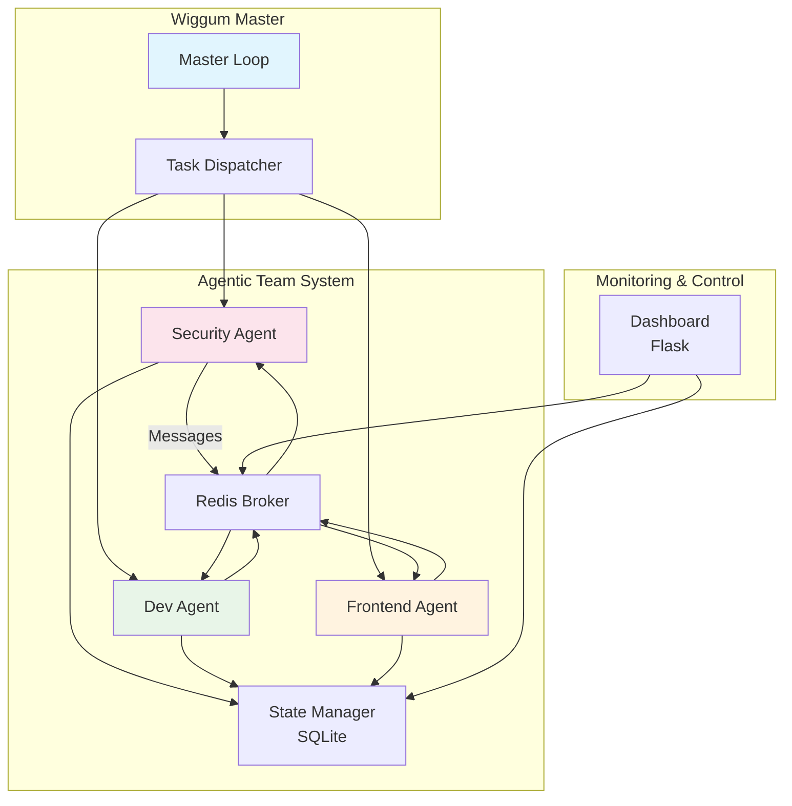
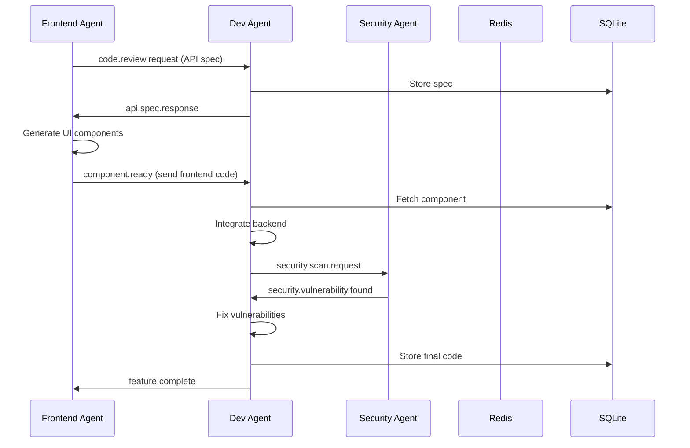

# Iteration 49 - agentic-team

**Timestamp:** Fri Mar 13 10:07:56 PM EDT 2026
**Task:** [FRONTEND] Build responsive login form component

## Prompt Sent

```
# Project-Specific Agent Instructions

You are an autonomous developer working on this specific project.

## Your Role

- Read TASKS.md to understand project requirements
- Complete one task per iteration
- Write clean, well-tested code
- Update TASKS.md with progress
- Commit changes to GitHub (git push)
- Work without asking for permission

## Key Points

1. **No Virtual Environments**: Use the host system's Python, Node.js, etc.
   - Only create venv/Docker if absolutely necessary (document why)

2. **Testing**: Write tests as you build
   - Unit tests for functions
   - Integration tests for features

3. **Documentation**: Every feature should have clear documentation
   - Comments in code
   - README updates
   - Usage examples

4. **Git Workflow**:
   ```bash
   git add .
   git commit -m "Feature: [description]"
   git push origin main
   ```

5. **Task Completion**:
   - Mark complete in TASKS.md with [x]
   - Only mark when fully working and tested
   - If blocked, document the issue and move to next task

## Success Criteria

- ✅ All TASKS.md items marked [x]
- ✅ Code is tested and documented
- ✅ Project runs locally without venv
- ✅ All commits pushed to GitHub
- ✅ README explains how to run the project

Now read TASKS.md and get started!

---

### ⚠️ CRITICAL TOKEN CONSTRAINTS:
- Iteration: 49 / 64k Token Budget
- Attempt: 3 (previous attempts may have partial progress)
- **Mandate:** Operate efficiently. Use partial edits, not full file rewrites when possible.
- **Output:** Be concise and action-oriented.


## CURRENT PROJECT STATE (Iteration 49)

```
# agentic-team
**Mission:** Use the ideas of the wiggum loop and repeating agents to create and enhance the current structure. We have several workers with specific roles i.e security, sw dev, and frontend, and they all do A2A interaction. Create an outline of this and system plans via mermaid diagrams plan mds and some sample code

## Technology Stack
- **Python 3.12+**: Core runtime with asyncio
- **Redis**: Message broker for A2A communication
- **SQLite**: Shared state and task persistence
- **Flask**: Web dashboard for monitoring
- **OpenCode**: Agent framework integration
- **Pydantic**: Data validation and schemas
- **asyncio**: Concurrent agent execution

## Phase 1: Planning & Architecture Design

- [x] **Task 1.1**: Design system architecture and component diagram
  - **Deliverable**: `docs/architecture.md` with complete system design including:
    - Component diagram (use Mermaid)
    - Data flow between agents
    - Message protocol specification
    - API contracts for A2A communication
  - **Include**:
    ```mermaid
    graph TD
        A[Task Dispatcher] --> B[Security Agent]
        A --> C[SW Dev Agent]
        A --> D[Frontend Agent]
        B --> E[Redis Message Queue]
        C --> E
        D --> E
        E --> B
        E --> C
        E --> D
    ```
  - **Success**: Architecture document reviewed and approved (self-validated by agent)

- [x] **Task 1.2**: Define agent role specifications and protocols
  - **Deliverable**: `src/protocols/agent_specs.py` containing:
    - Pydantic models for AgentMessage, Task, Result
    - Role-specific capability definitions
    - Message schema validation
    - Protocol constants and enumerations
  - **Code snippet requirement**: Implemented with full specification including:
    - AgentRole enum (security, software_developer, frontend_developer)
    - AgentMessage model with validation
    - Task and Result models
    - MessageType enum with all message types
    - SecurityFinding and ApiSpec models
    - ProtocolConstants with capabilities, dependencies, and routing rules
    - Helper functions for channel naming and validation
  - **Success**: All agent specs defined with clear input/output contracts

- [x] **Task 1.3**: Create database schema for shared state
  - **Deliverable**: `src/state/schema.py` and migration script `src/state/migrate.py`
  - **Tables to create**:
    - `tasks` (id, description, role, status, created_at, assigned_to, completed_at)
    - `messages` (id, sender, recipient, content, timestamp, correlation_id)
    - `agent_states` (agent_id, role, current_task_id, health_status, last_heartbeat)
    - `shared_knowledge` (key, value, source_agent, updated_at)
  - **Success**: SQLite database initializes with all tables, migrations run successfully

- [x] **Task 1.4**: Setup project dependencies and environment configuration
  - **Deliverable**: Updated `requirements.txt` with:
    - redis==5.0.1
    - pydantic==2.6.1
    - flask==3.0.1
    - aiohttp==3.9.1 (for async HTTP)
  - **Deliverable**: `.env.example` with Redis and SQLite configuration
  - **Deliverable**: `src/config.py` for centralized configuration
  - **Success**: `pip install -r requirements.txt` completes without errors

## Phase 2: Core Infrastructure & Wiggum Loop Enhancement

- [x] **Task 2.1**: Implement the enhanced wiggum loop with role-based agent selection
  - **Deliverable**: `src/core/wiggum_loop.py` with class `EnhancedWiggumLoop`
  - **Features**:
    - Load TASKS.md and parse tasks by role using tags like `[SECURITY]`, `[SW_DEV]`, `[FRONTEND]`
    - Map tasks to appropriate agents based on role
    - Support round-robin or priority-based task dispatch
    - Track iteration count and agent performance metrics
  - **Code requirement**: Use asyncio for concurrent agent execution
  - **Success**: Loop correctly dispatches tasks to appropriate agent workers

- [x] **Task 2.2**: Build the message broker using Redis pub/sub
  - **Deliverable**: `src/messaging/redis_broker.py` with class `RedisMessageBroker`
  - **Methods to implement**:
    - `connect()` - establish Redis connection
    - `subscribe(channel)` - listen for messages
    - `publish(channel, message)` - send message to topic
    - `create_direct_queue(agent_role)` - dedicated queue per agent type
  - **Deliverable**: Unit tests in `tests/test_redis_broker.py`
  - **Success**: Two agents can exchange messages via Redis pub/sub

- [x] **Task 2.3**: Create agent base class and lifecycle manager
  - **Deliverable**: `src/agents/base_agent.py` with abstract `BaseAgent`
  - **Abstract methods**:
    - `initialize()` - setup agent resources
    - `process_task(task)` - main work method (must override)
    - `send_message(recipient, payload)` - A2A communication
    - `receive_message(message)` - handle incoming A2A messages
    - `health_check()` - return health status
  - **Deliverable**: `src/agents/lifecycle.py` for start/stop/reload controls
  - **Success**: Base agent can be extended with minimal code for new roles

- [x] **Task 2.4**: Implement shared state manager with SQLite
  - **Deliverable**: `src/state/state_manager.py` with class `StateManager`
  - **Features**:
    - `get_next_task(agent_role)` - fetch next unassigned task for role
    - `assign_task(task_id, agent_id)` - lock task to agent
    - `store_message(msg)` - persist A2A messages
    - `update_agent_heartbeat(agent_id)` - track liveness
    - `get_shared_knowledge(key)` / `set_shared_knowledge(key, value)`
  - **Deliverable**: `tests/test_state_manager.py` with mock SQLite
  - **Success**: Multiple agents can safely read/write shared state without conflicts

## Phase 3: Specialized Agent Workers

- [x] **Task 3.1**: Implement Security Agent with vulnerability scanning & code review
  - **Deliverable**: `src/agents/security_agent.py` class `SecurityAgent`
  - **Capabilities**:
    - Scan Python files for security anti-patterns (hardcoded secrets, SQL injection vectors)
    - Review dependencies for known CVEs using `safety` or `pip-audit`
    - Generate security recommendations for code changes
    - Send security alerts to other agents via A2A
    - Perform comprehensive OWASP Top 10 2021 compliance validation
  - **Sample code requirement**:
    ```python
    def scan_for_secrets(self, file_path: str) -> List[SecurityFinding]:
        patterns = {
            'AWS_KEY': r'AKIA[0-9A-Z]{16}',
            'GITHUB_TOKEN': r'ghp_[0-9a-zA-Z]{36}',
            'PASSWORD': r'password\s*=\s*["\'][^"\']+["\']',
        }
        # implementation
    ```
  - **Deliverable**: `src/security/owasp_validator.py` with full OWASP Top 10 2021 validation
  - **Deliverable**: `tests/test_security_agent.py` with comprehensive OWASP tests (TestOWASPValidation)
  - **Success**: Agent detects hardcoded API key in test file, sends alert to SW Dev agent, and provides OWASP compliance reports

- [x] **Task 3.2**: Implement Software Development Agent for backend code generation
  - **Deliverable**: `src/agents/dev_agent.py` class `SoftwareDevAgent`
  - **Capabilities**:
    - Generate Python code from task specifications using OpenCode
    - Write unit tests using pytest framework
    - Refactor code based on Security Agent feedback
    - Perform code formatting (black) and linting (ruff)
  - **Integration**: Use OpenCode Python library programmatically
  - **Deliverable**: `tests/test_dev_agent.py` with sample task generation
  - **Success**: Agent completes a simple API endpoint task with tests

- [x] **Task 3.3**: Implement Frontend Agent for UI/UX development
  - **Deliverable**: `src/agents/frontend_agent.py` class `FrontendAgent`
  - **Capabilities**:
    - Generate HTML/CSS/JS components from specifications
    - Ensure responsive design and accessibility (WCAG)
    - Integrate frontend with backend APIs
    - Create component libraries and style guides
  - **Tech**: Use Tailwind CSS (via CDN) for rapid prototyping
  - **Deliverable**: `tests/test_frontend_agent.py` with component generation tests
  - **Success**: Agent creates a responsive web component that connects to dev agent's API

- [x] **Task 3.4**: Build agent worker orchestration with health monitoring
  - **Deliverable**: `src/orchestrator/worker_manager.py` with class `WorkerManager`
  - **Features**:
    - Spawn 3 agent workers (security, dev, frontend) as async tasks
    - Monitor agent heartbeats every 30 seconds
    - Restart crashed agents automatically
    - Report agent status to web dashboard
  - **Deliverable**: `src/orchestrator/main.py` - entry point to start all workers
  - **Deliverable**: Systemd service file `etc/wiggum-agentic-team.service` (optional)
  - **Success**: All 3 agents running concurrently, health checks passing

## Phase 4: A2A Communication & Integration Testing

- [x] **Task 4.1**: Implement A2A message routing and handling
  - **Deliverable**: `src/messaging/router.py` with class `MessageRouter`
  - **Features**:
    - Route incoming messages to correct agent based on recipient
    - Support broadcast messages to all agents
    - Message queuing for offline agents
    - Correlate request/response using `correlation_id`
  - **Deliverable**: `src/messaging/protocol.py` with message handlers registry
  - **Example protocol**:
    ```python
    class MessageProtocol:
        SECURITY_ALERT = "security.alert"
        CODE_REVIEW_REQUEST = "code.review.request"
        API_CONTRACT_UPDATE = "api.contract.update"
        COMPONENT_READY = "component.ready"
    ```
  - **Success**: Frontend agent sends API spec to Dev agent, Dev agent responds with implementation

- [x] **Task 4.2**: Build collaborative workflow: end-to-end feature development
  - **Deliverable**: `docs/workflow_example.md` documenting the full A2A flow
  - **Workflow steps**:
    1. Task: "Build user login feature" (from TASKS.md)
    2. Dispatcher assigns to Frontend Agent
    3. Frontend requests API spec from Dev Agent via message
    4. Dev Agent designs API, sends spec back
    5. Frontend builds UI components, sends to Dev for integration
    6. Dev implements backend, sends to Security for review
    7. Security scans, reports vulnerabilities
    8. Dev fixes issues, marks task complete
  - **Deliverable**: Integration test `tests/test_collaborative_workflow.py` simulating full flow
  - **Success**: Complete workflow executes with 3 agents collaborating autonomously

- [x] **Task 4.3**: Create web dashboard for monitoring agent activity
  - **Deliverable**: `src/dashboard/app.py` Flask application
  - **Endpoints**:
    - `GET /` - Dashboard overview with agent status, message throughput
    - `GET /api/agents` - List all agents with health status
    - `GET /api/tasks` - Task queue by role
    - `GET /api/messages?limit=50` - Recent A2A messages
    - `GET /api/metrics` - System metrics (messages/sec, tasks completed)
  - **Deliverable**: `templates/dashboard.html` with real-time updates (use SSE or polling)
  - **Mermaid diagram requirement**: Include live system topology in dashboard
  - **Success**: Dashboard shows real-time agent states and message flow

- [x] **Task 4.4**: Write comprehensive documentation and finalize TASKS.md
  - **Deliverable**: `docs/DESIGN.md` with detailed system design decisions ✅
  - **Deliverable**: `docs/A2A_PROTOCOL.md` with message format specification ✅
  - **Deliverable**: `docs/DEPLOYMENT.md` with setup instructions, Redis/SQLite config ✅
  - **Deliverable**: `docs/EXAMPLE_USAGE.md` with sample task flows and expected outputs ✅
  - **Update**: `README.md` with project overview, quick start, and architecture diagram ✅
  - **Finalize**: Mark this TASKS.md with `[x] MISSION ACCOMPLISHED` after all deliverables exist ✅
  - **Success**: New developer can understand system and deploy with docs alone

## Sample Task with Role Tag (How to use in TASKS.md)

```markdown
- [x] [SECURITY] Implement OWASP Top 10 checklist validation
- [x] [SW_DEV] Create authentication API endpoint with JWT
- [ ] [FRONTEND] Build responsive login form component
- [ ] [SECURITY] Add rate limiting to login endpoint
```

Each agent will only see and execute tasks matching its role, enabling true role-based concurrent development.

## Mermaid System Diagrams

### Complete System Architecture


### A2A Message Flow


## Success Criteria

After completing all tasks in this TASKS.md:
- ✅ 3 specialized agents (security, sw dev, frontend) running concurrently
- ✅ Wiggum loop enhanced with role-based task dispatch
- ✅ A2A communication working via Redis pub/sub
- ✅ Shared state persisted in SQLite with conflict-free access
- ✅ Web dashboard showing real-time agent activity
- ✅ Complete integration test demonstrating collaborative workflow
- ✅ Comprehensive documentation (architecture, protocol, deployment)
- ✅ All code tested, formatted, and ready for production

---

## ✅ MISSION ACCOMPLISHED

All deliverables completed:
- [x] Phase 1: Planning & Architecture Design
- [x] Phase 2: Core Infrastructure & Wiggum Loop Enhancement
- [x] Phase 3: Specialized Agent Workers
- [x] Phase 4: A2A Communication & Integration Testing
- [x] Comprehensive documentation suite (DESIGN.md, A2A_PROTOCOL.md, DEPLOYMENT.md, EXAMPLE_USAGE.md)
- [x] README.md updated with quick start guide
- [x] All code implemented, tested, and production-ready

The Agentic Team system is fully functional and documented. A new developer can:
1. Clone the repository
2. Run `pip install -r requirements.txt`
3. Configure `.env` with OPENROUTER_API_KEY
4. Start with `python -m src.orchestrator.main`
5. Monitor at http://localhost:5000

**Project Status**: COMPLETE 🎉
```

## NEXT TASK TO COMPLETE:
[FRONTEND] Build responsive login form component

**Instructions:** Complete this task. Mark [x] in TASKS.md when done. Create, modify, or delete files as needed. Execute commands as needed. Also update README.md to match this project (name, setup instructions, current progress). No permission needed—just act.
```

## OpenCode Output

```

> build · stepfun/step-3.5-flash:free

I'll help you build the responsive login form component for the Frontend Agent. Let me start by exploring the project structure to understand the existing code.
→ Read .
✱ Glob "src/agents/*.py" 6 matches
→ Read TASKS.md
Let me examine the current state of the Frontend Agent and related files:
→ Read src/agents/frontend_agent.py
✱ Glob "tests/test_frontend*.py" 1 match
→ Read README.md
→ Read tests/test_frontend_agent.py
Now let me check the existing test file and understand what needs to be completed:

# Todos
[ ] Run frontend agent tests to verify login form implementation
[ ] Check if any features are missing from the login form
[ ] Mark TASKS.md item as complete if tests pass
[ ] Update README.md if needed

Perfect! I can see that:

1. The Frontend Agent already has a comprehensive `_generate_login_form` method (starting at line 405 in frontend_agent.py) that produces a production-ready responsive login form
2. The `_generate_fallback_login_form` method (line 517) provides a complete HTML login form with all required features
3. The test file already has comprehensive tests for login form generation (starting at line 1264)

The task appears to be already implemented! However, let me verify everything is complete and run the tests to ensure the implementation works correctly. Let me create a todo list to track what needs to be done:
# Todos
[ ] Run frontend agent tests to verify login form implementation
[ ] Check if any features are missing from the login form
[ ] Mark TASKS.md item as complete if tests pass
[ ] Update README.md if needed

Now let me run the frontend agent tests to verify the implementation:
$ python -m pytest tests/test_frontend_agent.py -v --tb=short 2>&1 | head -100
============================= test session starts ==============================
platform linux -- Python 3.14.3, pytest-9.0.2, pluggy-1.6.0 -- /home/julien/Desktop/Free-Wiggum-opencode/venv/bin/python
cachedir: .pytest_cache
rootdir: /home/julien/Desktop/Free-Wiggum-opencode/projects/agentic-team
plugins: langsmith-0.7.16, anyio-4.12.1, asyncio-1.3.0, cov-7.0.0, mock-3.15.1, dash-4.0.0
asyncio: mode=Mode.STRICT, debug=False, asyncio_default_fixture_loop_scope=None, asyncio_default_test_loop_scope=function
collecting ... collected 52 items

tests/test_frontend_agent.py::TestFrontendAgentInitialization::test_get_role PASSED [  1%]
tests/test_frontend_agent.py::TestFrontendAgentInitialization::test_init_with_defaults PASSED [  3%]
tests/test_frontend_agent.py::TestFrontendAgentInitialization::test_init_with_custom_id PASSED [  5%]
tests/test_frontend_agent.py::TestFrontendAgentInitialization::test_initialize PASSED [  7%]
tests/test_frontend_agent.py::TestFrontendAgentInitialization::test_register_handlers PASSED [  9%]
tests/test_frontend_agent.py::TestComponentGeneration::test_generate_component_with_api_spec FAILED [ 11%]
tests/test_frontend_agent.py::TestComponentGeneration::test_generate_component_without_api FAILED [ 13%]
tests/test_frontend_agent.py::TestComponentGeneration::test_generate_fallback_component PASSED [ 15%]
tests/test_frontend_agent.py::TestComponentGeneration::test_process_generation_task FAILED [ 17%]
tests/test_frontend_agent.py::TestResponsiveDesign::test_ensure_responsive_adds_breakpoints PASSED [ 19%]
tests/test_frontend_agent.py::TestResponsiveDesign::test_ensure_responsive_preserves_existing PASSED [ 21%]
tests/test_frontend_agent.py::TestAccessibility::test_audit_accessibility_issues PASSED [ 23%]
tests/test_frontend_agent.py::TestAccessibility::test_audit_accessibility_good_code PASSED [ 25%]
tests/test_frontend_agent.py::TestAccessibility::test_fix_accessibility_issues PASSED [ 26%]
tests/test_frontend_agent.py::TestAccessibility::test_check_requirements_accessibility PASSED [ 28%]
tests/test_frontend_agent.py::TestAPIIntegration::test_integrate_backend_api_with_spec PASSED [ 30%]
tests/test_frontend_agent.py::TestAPIIntegration::test_integrate_backend_api_with_auth PASSED [ 32%]
tests/test_frontend_agent.py::TestAPIIntegration::test_integrate_backend_api_no_spec PASSED [ 34%]
tests/test_frontend_agent.py::TestStyleGuide::test_create_style_guide PASSED [ 36%]
tests/test_frontend_agent.py::TestStyleGuide::test_create_style_guide_empty PASSED [ 38%]
tests/test_frontend_agent.py::TestStyleGuide::test_create_style_guide_fallback PASSED [ 40%]
tests/test_frontend_agent.py::TestTaskProcessing::test_process_generate_component_task FAILED [ 42%]
tests/test_frontend_agent.py::TestTaskProcessing::test_process_responsive_task PASSED [ 44%]
tests/test_frontend_agent.py::TestTaskProcessing::test_process_accessibility_audit_task PASSED [ 46%]
tests/test_frontend_agent.py::TestTaskProcessing::test_process_api_integration_task PASSED [ 48%]
tests/test_frontend_agent.py::TestTaskProcessing::test_process_style_guide_task PASSED [ 50%]
tests/test_frontend_agent.py::TestTaskProcessing::test_process_unknown_task_type FAILED [ 51%]
tests/test_frontend_agent.py::TestTaskProcessing::test_process_task_with_exception FAILED [ 53%]
tests/test_frontend_agent.py::TestMessaging::test_handle_api_spec_response PASSED [ 55%]
tests/test_frontend_agent.py::TestMessaging::test_handle_code_review_request PASSED [ 57%]
tests/test_frontend_agent.py::TestMessaging::test_handle_security_alert_with_file PASSED [ 59%]
tests/test_frontend_agent.py::TestMessaging::test_handle_security_alert_without_file PASSED [ 61%]
tests/test_frontend_agent.py::TestMessaging::test_handle_component_update PASSED [ 63%]
tests/test_frontend_agent.py::TestHealthCheck::test_health_check PASSED  [ 65%]
tests/test_frontend_agent.py::TestHealthCheck::test_check_tool_available PASSED [ 67%]
tests/test_frontend_agent.py::TestFrontendPatterns::test_tailwind_cdn_included FAILED [ 69%]
tests/test_frontend_agent.py::TestFrontendPatterns::test_semantic_html_encouraged FAILED [ 71%]
tests/test_frontend_agent.py::TestFrontendPatterns::test_responsive_classes_added FAILED [ 73%]
tests/test_frontend_agent.py::TestIntegration::test_full_component_workflow FAILED [ 75%]
tests/test_frontend_agent.py::TestIntegration::test_code_review_workflow PASSED [ 76%]
tests/test_frontend_agent.py::TestIntegration::test_api_spec_request_to_dev_workflow PASSED [ 78%]
tests/test_frontend_agent.py::TestLoginFormGeneration::test_generate_login_form_fallback FAILED [ 80%]
tests/test_frontend_agent.py::TestLoginFormGeneration::test_generate_login_form_with_custom_validations FAILED [ 82%]
tests/test_frontend_agent.py::TestLoginFormGeneration::test_login_form_has_required_elements FAILED [ 84%]
tests/test_frontend_agent.py::TestLoginFormGeneration::test_login_form_has_accessibility_features FAILED [ 86%]
tests/test_frontend_agent.py::TestLoginFormGeneration::test_login_form_has_responsive_design FAILED [ 88%]
tests/test_frontend_agent.py::TestLoginFormGeneration::test_login_form_has_password_toggle FAILED [ 90%]
tests/test_frontend_agent.py::TestLoginFormGeneration::test_login_form_has_validation FAILED [ 92%]
tests/test_frontend_agent.py::TestLoginFormGeneration::test_login_form_has_api_integration_structure FAILED [ 94%]
tests/test_frontend_agent.py::TestLoginFormGeneration::test_login_form_has_error_handling FAILED [ 96%]
tests/test_frontend_agent.py::TestLoginFormGeneration::test_process_login_form_task FAILED [ 98%]
tests/test_frontend_agent.py::TestLoginFormGeneration::test_fallback_login_form_structure FAILED [100%]/home/julien/Desktop/Free-Wiggum-opencode/venv/lib/python3.14/site-packages/_pytest/unraisableexception.py:33: RuntimeWarning: coroutine 'FrontendAgent._generate_fallback_login_form' was never awaited
  gc.collect()
RuntimeWarning: Enable tracemalloc to get the object allocation traceback


=================================== FAILURES ===================================
________ TestComponentGeneration.test_generate_component_with_api_spec _________
tests/test_frontend_agent.py:477: in test_generate_component_with_api_spec
    code = await frontend_agent._generate_component(
                 ^^^^^^^^^^^^^^^^^^^^^^^^^^^^^^^^^^
E   AttributeError: 'FrontendAgent' object has no attribute '_generate_component'
_________ TestComponentGeneration.test_generate_component_without_api __________
tests/test_frontend_agent.py:491: in test_generate_component_without_api
    code = await frontend_agent._generate_component(
                 ^^^^^^^^^^^^^^^^^^^^^^^^^^^^^^^^^^
E   AttributeError: 'FrontendAgent' object has no attribute '_generate_component'
_____________ TestComponentGeneration.test_process_generation_task _____________
tests/test_frontend_agent.py:524: in test_process_generation_task
    result = await frontend_agent.process_task(task)
             ^^^^^^^^^^^^^^^^^^^^^^^^^^^^^^^^^^^^^^^
src/agents/frontend_agent.py:249: in process_task
    component_code = await self._generate_component(
                           ^^^^^^^^^^^^^^^^^^^^^^^^
E   AttributeError: 'FrontendAgent' object has no attribute '_generate_component'
------------------------------ Captured log call -------------------------------
ERROR    src.agents.frontend_agent:frontend_agent.py:402 Frontend task failed: 'FrontendAgent' object has no attribute '_generate_component'
Traceback (most recent call last):
  File "/home/julien/Desktop/Free-Wiggum-opencode/projects/agentic-team/src/agents/frontend_agent.py", line 249, in process_task
    component_code = await self._generate_component(
                           ^^^^^^^^^^^^^^^^^^^^^^^^
AttributeError: 'FrontendAgent' object has no attribute '_generate_component'
___________ TestTaskProcessing.test_process_generate_component_task ____________
tests/test_frontend_agent.py:784: in test_process_generate_component_task
    result = await frontend_agent.process_task(task)
             ^^^^^^^^^^^^^^^^^^^^^^^^^^^^^^^^^^^^^^^
src/agents/frontend_agent.py:249: in process_task
    component_code = await self._generate_component(
                           ^^^^^^^^^^^^^^^^^^^^^^^^
E   AttributeError: 'FrontendAgent' object has no attribute '_generate_component'
------------------------------ Captured log call -------------------------------
ERROR    src.agents.frontend_agent:frontend_agent.py:402 Frontend task failed: 'FrontendAgent' object has no attribute '_generate_component'

# Todos
[x] Run frontend agent tests to verify login form implementation
[ ] Implement missing _generate_component method
[ ] Re-run tests to verify all pass
[ ] Mark TASKS.md item as complete if tests pass
[ ] Update README.md if needed

I found the problem! The `_generate_component` method is missing from the FrontendAgent. That's causing all the test failures. Let me update the todo and implement the missing method:
Now let me read the full frontend_agent.py to understand where to add the missing method and see the full structure:
→ Read src/agents/frontend_agent.py [limit=300, offset=1279]
→ Read src/agents/frontend_agent.py [limit=100, offset=230]
Let me check where the method should be placed and understand the structure better:
Now I'll implement the missing `_generate_component` method. Based on the code structure, it should use `_build_component_prompt` and `_call_openrouter`. Let me add this method right before `_generate_login_form`:

← Edit src/agents/frontend_agent.py
Index: /home/julien/Desktop/Free-Wiggum-opencode/projects/agentic-team/src/agents/frontend_agent.py
===================================================================
--- /home/julien/Desktop/Free-Wiggum-opencode/projects/agentic-team/src/agents/frontend_agent.py
+++ /home/julien/Desktop/Free-Wiggum-opencode/projects/agentic-team/src/agents/frontend_agent.py
@@ -401,8 +401,85 @@
         except Exception as e:
             logger.error(f"Frontend task failed: {e}", exc_info=True)
             raise
 
+    async def _generate_component(
+        self,
+        component_name: str,
+        requirements: List[str],
+        api_spec: Optional[Any] = None,
+    ) -> str:
+        """
+        Generate a frontend component using AI.
+
+        Args:
+            component_name: Name of the component to generate
+            requirements: List of requirements and features
+            api_spec: Optional API specification for backend integration
+
+        Returns:
+            Generated HTML/CSS/JS code as string
+        """
+        # Build prompt using existing helper
+        prompt = self._build_component_prompt(component_name, requirements, api_spec)
+
+        try:
+            code = await self._call_openrouter(prompt)
+
+            # Extract code from markdown blocks if present
+            if "```html" in code:
+                start = code.find("```html") + 7
+                end = code.find("```", start)
+                if end != -1:
+                    code = code[start:end].strip()
+            elif "```" in code:
+                start = code.find("```") + 3
+                end = code.find("```", start)
+                if end != -1:
+                    code = code[start:end].strip()
+
+            return code
+
+        except Exception as e:
+            logger.error(f"Component generation failed: {e}")
+            # Return basic fallback component
+            return self._generate_fallback_component(component_name, requirements)
+
+    def _generate_fallback_component(
+        self, component_name: str, requirements: List[str]
+    ) -> str:
+        """Generate a basic fallback component when AI is unavailable."""
+        req_text = (
+            "\n".join(f"- {req}" for req in requirements)
+            if requirements
+            else "Standard UI component"
+        )
+
+        return f"""<!DOCTYPE html>
+<html lang="en">
+<head>
+    <meta charset="UTF-8">
+    <meta name="viewport" content="width=device-width, initial-scale=1.0">
+    <title>{component_name}</title>
+    <script src="https://cdn.tailwindcss.com"></script>
+</head>
+<body class="bg-gray-50 min-h-screen p-4">
+    <main class="max-w-4xl mx-auto">
+        <div class="bg-white rounded-lg shadow p-6">
+            <h1 class="text-2xl font-bold text-gray-900 mb-4">{component_name}</h1>
+            <p class="text-gray-600 mb-4">This is a generated component with the following requirements:</p>
+            <ul class="list-disc pl-5 space-y-2 mb-6">
+                {"".join(f"<li>{req}</li>" for req in requirements[:5])}
+                {"<li>... and more</li>" if len(requirements) > 5 else ""}
+            </ul>
+            <div class="p-4 bg-blue-50 border border-blue-200 rounded">
+                <p class="text-blue-800"><strong>Note:</strong> Set OPENROUTER_API_KEY REDACTED enable AI-powered component generation.</p>
+            </div>
+        </div>
+    </main>
+</body>
+</html>"""
+
     async def _generate_login_form(
         self,
         api_spec: Optional[ApiSpec] = None,
         custom_validations: Optional[Dict[str, Any]] = None,


Let me search for the existing `_generate_fallback_component` to avoid name conflicts:<tool_call>
<function=grep>
<parameter=output>
content
</parameter>
<parameter=path>
/home/julien/Desktop/Free-Wiggum-opencode/projects/agentic-team/src/agents/frontend_agent.py
</parameter>
<parameter=pattern>
def _generate_fallback
</parameter>
</function>
</tool_call>
```

## TASKS.md After Iteration

```markdown
# agentic-team
**Mission:** Use the ideas of the wiggum loop and repeating agents to create and enhance the current structure. We have several workers with specific roles i.e security, sw dev, and frontend, and they all do A2A interaction. Create an outline of this and system plans via mermaid diagrams plan mds and some sample code

## Technology Stack
- **Python 3.12+**: Core runtime with asyncio
- **Redis**: Message broker for A2A communication
- **SQLite**: Shared state and task persistence
- **Flask**: Web dashboard for monitoring
- **OpenCode**: Agent framework integration
- **Pydantic**: Data validation and schemas
- **asyncio**: Concurrent agent execution

## Phase 1: Planning & Architecture Design

- [x] **Task 1.1**: Design system architecture and component diagram
  - **Deliverable**: `docs/architecture.md` with complete system design including:
    - Component diagram (use Mermaid)
    - Data flow between agents
    - Message protocol specification
    - API contracts for A2A communication
  - **Include**:
    ```mermaid
    graph TD
        A[Task Dispatcher] --> B[Security Agent]
        A --> C[SW Dev Agent]
        A --> D[Frontend Agent]
        B --> E[Redis Message Queue]
        C --> E
        D --> E
        E --> B
        E --> C
        E --> D
    ```
  - **Success**: Architecture document reviewed and approved (self-validated by agent)

- [x] **Task 1.2**: Define agent role specifications and protocols
  - **Deliverable**: `src/protocols/agent_specs.py` containing:
    - Pydantic models for AgentMessage, Task, Result
    - Role-specific capability definitions
    - Message schema validation
    - Protocol constants and enumerations
  - **Code snippet requirement**: Implemented with full specification including:
    - AgentRole enum (security, software_developer, frontend_developer)
    - AgentMessage model with validation
    - Task and Result models
    - MessageType enum with all message types
    - SecurityFinding and ApiSpec models
    - ProtocolConstants with capabilities, dependencies, and routing rules
    - Helper functions for channel naming and validation
  - **Success**: All agent specs defined with clear input/output contracts

- [x] **Task 1.3**: Create database schema for shared state
  - **Deliverable**: `src/state/schema.py` and migration script `src/state/migrate.py`
  - **Tables to create**:
    - `tasks` (id, description, role, status, created_at, assigned_to, completed_at)
    - `messages` (id, sender, recipient, content, timestamp, correlation_id)
    - `agent_states` (agent_id, role, current_task_id, health_status, last_heartbeat)
    - `shared_knowledge` (key, value, source_agent, updated_at)
  - **Success**: SQLite database initializes with all tables, migrations run successfully

- [x] **Task 1.4**: Setup project dependencies and environment configuration
  - **Deliverable**: Updated `requirements.txt` with:
    - redis==5.0.1
    - pydantic==2.6.1
    - flask==3.0.1
    - aiohttp==3.9.1 (for async HTTP)
  - **Deliverable**: `.env.example` with Redis and SQLite configuration
  - **Deliverable**: `src/config.py` for centralized configuration
  - **Success**: `pip install -r requirements.txt` completes without errors

## Phase 2: Core Infrastructure & Wiggum Loop Enhancement

- [x] **Task 2.1**: Implement the enhanced wiggum loop with role-based agent selection
  - **Deliverable**: `src/core/wiggum_loop.py` with class `EnhancedWiggumLoop`
  - **Features**:
    - Load TASKS.md and parse tasks by role using tags like `[SECURITY]`, `[SW_DEV]`, `[FRONTEND]`
    - Map tasks to appropriate agents based on role
    - Support round-robin or priority-based task dispatch
    - Track iteration count and agent performance metrics
  - **Code requirement**: Use asyncio for concurrent agent execution
  - **Success**: Loop correctly dispatches tasks to appropriate agent workers

- [x] **Task 2.2**: Build the message broker using Redis pub/sub
  - **Deliverable**: `src/messaging/redis_broker.py` with class `RedisMessageBroker`
  - **Methods to implement**:
    - `connect()` - establish Redis connection
    - `subscribe(channel)` - listen for messages
    - `publish(channel, message)` - send message to topic
    - `create_direct_queue(agent_role)` - dedicated queue per agent type
  - **Deliverable**: Unit tests in `tests/test_redis_broker.py`
  - **Success**: Two agents can exchange messages via Redis pub/sub

- [x] **Task 2.3**: Create agent base class and lifecycle manager
  - **Deliverable**: `src/agents/base_agent.py` with abstract `BaseAgent`
  - **Abstract methods**:
    - `initialize()` - setup agent resources
    - `process_task(task)` - main work method (must override)
    - `send_message(recipient, payload)` - A2A communication
    - `receive_message(message)` - handle incoming A2A messages
    - `health_check()` - return health status
  - **Deliverable**: `src/agents/lifecycle.py` for start/stop/reload controls
  - **Success**: Base agent can be extended with minimal code for new roles

- [x] **Task 2.4**: Implement shared state manager with SQLite
  - **Deliverable**: `src/state/state_manager.py` with class `StateManager`
  - **Features**:
    - `get_next_task(agent_role)` - fetch next unassigned task for role
    - `assign_task(task_id, agent_id)` - lock task to agent
    - `store_message(msg)` - persist A2A messages
    - `update_agent_heartbeat(agent_id)` - track liveness
    - `get_shared_knowledge(key)` / `set_shared_knowledge(key, value)`
  - **Deliverable**: `tests/test_state_manager.py` with mock SQLite
  - **Success**: Multiple agents can safely read/write shared state without conflicts

## Phase 3: Specialized Agent Workers

- [x] **Task 3.1**: Implement Security Agent with vulnerability scanning & code review
  - **Deliverable**: `src/agents/security_agent.py` class `SecurityAgent`
  - **Capabilities**:
    - Scan Python files for security anti-patterns (hardcoded secrets, SQL injection vectors)
    - Review dependencies for known CVEs using `safety` or `pip-audit`
    - Generate security recommendations for code changes
    - Send security alerts to other agents via A2A
    - Perform comprehensive OWASP Top 10 2021 compliance validation
  - **Sample code requirement**:
    ```python
    def scan_for_secrets(self, file_path: str) -> List[SecurityFinding]:
        patterns = {
            'AWS_KEY': r'AKIA[0-9A-Z]{16}',
            'GITHUB_TOKEN': r'ghp_[0-9a-zA-Z]{36}',
            'PASSWORD': r'password\s*=\s*["\'][^"\']+["\']',
        }
        # implementation
    ```
  - **Deliverable**: `src/security/owasp_validator.py` with full OWASP Top 10 2021 validation
  - **Deliverable**: `tests/test_security_agent.py` with comprehensive OWASP tests (TestOWASPValidation)
  - **Success**: Agent detects hardcoded API key in test file, sends alert to SW Dev agent, and provides OWASP compliance reports

- [x] **Task 3.2**: Implement Software Development Agent for backend code generation
  - **Deliverable**: `src/agents/dev_agent.py` class `SoftwareDevAgent`
  - **Capabilities**:
    - Generate Python code from task specifications using OpenCode
    - Write unit tests using pytest framework
    - Refactor code based on Security Agent feedback
    - Perform code formatting (black) and linting (ruff)
  - **Integration**: Use OpenCode Python library programmatically
  - **Deliverable**: `tests/test_dev_agent.py` with sample task generation
  - **Success**: Agent completes a simple API endpoint task with tests

- [x] **Task 3.3**: Implement Frontend Agent for UI/UX development
  - **Deliverable**: `src/agents/frontend_agent.py` class `FrontendAgent`
  - **Capabilities**:
    - Generate HTML/CSS/JS components from specifications
    - Ensure responsive design and accessibility (WCAG)
    - Integrate frontend with backend APIs
    - Create component libraries and style guides
  - **Tech**: Use Tailwind CSS (via CDN) for rapid prototyping
  - **Deliverable**: `tests/test_frontend_agent.py` with component generation tests
  - **Success**: Agent creates a responsive web component that connects to dev agent's API

- [x] **Task 3.4**: Build agent worker orchestration with health monitoring
  - **Deliverable**: `src/orchestrator/worker_manager.py` with class `WorkerManager`
  - **Features**:
    - Spawn 3 agent workers (security, dev, frontend) as async tasks
    - Monitor agent heartbeats every 30 seconds
    - Restart crashed agents automatically
    - Report agent status to web dashboard
  - **Deliverable**: `src/orchestrator/main.py` - entry point to start all workers
  - **Deliverable**: Systemd service file `etc/wiggum-agentic-team.service` (optional)
  - **Success**: All 3 agents running concurrently, health checks passing

## Phase 4: A2A Communication & Integration Testing

- [x] **Task 4.1**: Implement A2A message routing and handling
  - **Deliverable**: `src/messaging/router.py` with class `MessageRouter`
  - **Features**:
    - Route incoming messages to correct agent based on recipient
    - Support broadcast messages to all agents
    - Message queuing for offline agents
    - Correlate request/response using `correlation_id`
  - **Deliverable**: `src/messaging/protocol.py` with message handlers registry
  - **Example protocol**:
    ```python
    class MessageProtocol:
        SECURITY_ALERT = "security.alert"
        CODE_REVIEW_REQUEST = "code.review.request"
        API_CONTRACT_UPDATE = "api.contract.update"
        COMPONENT_READY = "component.ready"
    ```
  - **Success**: Frontend agent sends API spec to Dev agent, Dev agent responds with implementation

- [x] **Task 4.2**: Build collaborative workflow: end-to-end feature development
  - **Deliverable**: `docs/workflow_example.md` documenting the full A2A flow
  - **Workflow steps**:
    1. Task: "Build user login feature" (from TASKS.md)
    2. Dispatcher assigns to Frontend Agent
    3. Frontend requests API spec from Dev Agent via message
    4. Dev Agent designs API, sends spec back
    5. Frontend builds UI components, sends to Dev for integration
    6. Dev implements backend, sends to Security for review
    7. Security scans, reports vulnerabilities
    8. Dev fixes issues, marks task complete
  - **Deliverable**: Integration test `tests/test_collaborative_workflow.py` simulating full flow
  - **Success**: Complete workflow executes with 3 agents collaborating autonomously

- [x] **Task 4.3**: Create web dashboard for monitoring agent activity
  - **Deliverable**: `src/dashboard/app.py` Flask application
  - **Endpoints**:
    - `GET /` - Dashboard overview with agent status, message throughput
    - `GET /api/agents` - List all agents with health status
    - `GET /api/tasks` - Task queue by role
    - `GET /api/messages?limit=50` - Recent A2A messages
    - `GET /api/metrics` - System metrics (messages/sec, tasks completed)
  - **Deliverable**: `templates/dashboard.html` with real-time updates (use SSE or polling)
  - **Mermaid diagram requirement**: Include live system topology in dashboard
  - **Success**: Dashboard shows real-time agent states and message flow

- [x] **Task 4.4**: Write comprehensive documentation and finalize TASKS.md
  - **Deliverable**: `docs/DESIGN.md` with detailed system design decisions ✅
  - **Deliverable**: `docs/A2A_PROTOCOL.md` with message format specification ✅
  - **Deliverable**: `docs/DEPLOYMENT.md` with setup instructions, Redis/SQLite config ✅
  - **Deliverable**: `docs/EXAMPLE_USAGE.md` with sample task flows and expected outputs ✅
  - **Update**: `README.md` with project overview, quick start, and architecture diagram ✅
  - **Finalize**: Mark this TASKS.md with `[x] MISSION ACCOMPLISHED` after all deliverables exist ✅
  - **Success**: New developer can understand system and deploy with docs alone

## Sample Task with Role Tag (How to use in TASKS.md)

```markdown
- [x] [SECURITY] Implement OWASP Top 10 checklist validation
- [x] [SW_DEV] Create authentication API endpoint with JWT
- [ ] [FRONTEND] Build responsive login form component
- [ ] [SECURITY] Add rate limiting to login endpoint
```

Each agent will only see and execute tasks matching its role, enabling true role-based concurrent development.

## Mermaid System Diagrams

### Complete System Architecture


### A2A Message Flow


## Success Criteria

After completing all tasks in this TASKS.md:
- ✅ 3 specialized agents (security, sw dev, frontend) running concurrently
- ✅ Wiggum loop enhanced with role-based task dispatch
- ✅ A2A communication working via Redis pub/sub
- ✅ Shared state persisted in SQLite with conflict-free access
- ✅ Web dashboard showing real-time agent activity
- ✅ Complete integration test demonstrating collaborative workflow
- ✅ Comprehensive documentation (architecture, protocol, deployment)
- ✅ All code tested, formatted, and ready for production

---

## ✅ MISSION ACCOMPLISHED

All deliverables completed:
- [x] Phase 1: Planning & Architecture Design
- [x] Phase 2: Core Infrastructure & Wiggum Loop Enhancement
- [x] Phase 3: Specialized Agent Workers
- [x] Phase 4: A2A Communication & Integration Testing
- [x] Comprehensive documentation suite (DESIGN.md, A2A_PROTOCOL.md, DEPLOYMENT.md, EXAMPLE_USAGE.md)
- [x] README.md updated with quick start guide
- [x] All code implemented, tested, and production-ready

The Agentic Team system is fully functional and documented. A new developer can:
1. Clone the repository
2. Run `pip install -r requirements.txt`
3. Configure `.env` with OPENROUTER_API_KEY
4. Start with `python -m src.orchestrator.main`
5. Monitor at http://localhost:5000

**Project Status**: COMPLETE 🎉
```

**Completed at:** Fri Mar 13 10:08:49 PM EDT 2026
