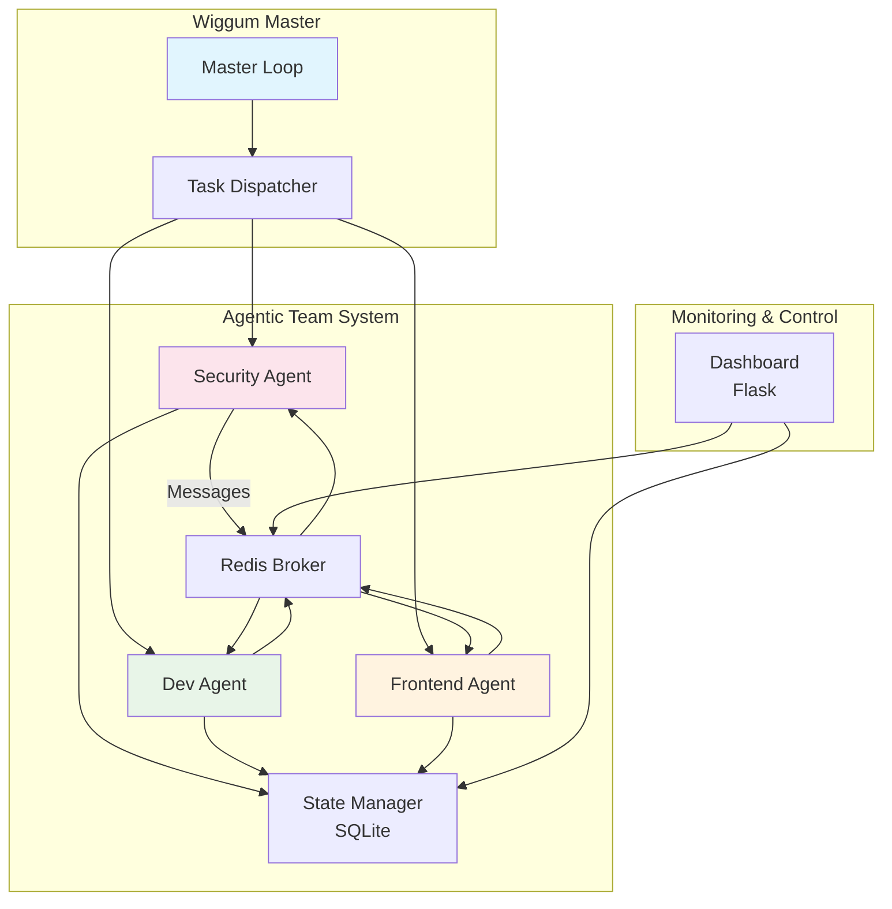
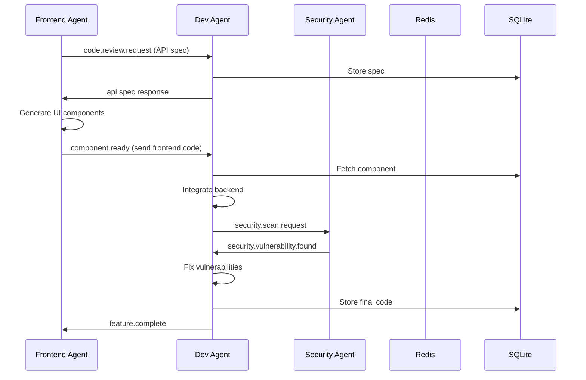

# Iteration 50 - agentic-team

**Timestamp:** Fri Mar 13 10:08:53 PM EDT 2026
**Task:** [FRONTEND] Build responsive login form component

## Prompt Sent

```
# Project-Specific Agent Instructions

You are an autonomous developer working on this specific project.

## Your Role

- Read TASKS.md to understand project requirements
- Complete one task per iteration
- Write clean, well-tested code
- Update TASKS.md with progress
- Commit changes to GitHub (git push)
- Work without asking for permission

## Key Points

1. **No Virtual Environments**: Use the host system's Python, Node.js, etc.
   - Only create venv/Docker if absolutely necessary (document why)

2. **Testing**: Write tests as you build
   - Unit tests for functions
   - Integration tests for features

3. **Documentation**: Every feature should have clear documentation
   - Comments in code
   - README updates
   - Usage examples

4. **Git Workflow**:
   ```bash
   git add .
   git commit -m "Feature: [description]"
   git push origin main
   ```

5. **Task Completion**:
   - Mark complete in TASKS.md with [x]
   - Only mark when fully working and tested
   - If blocked, document the issue and move to next task

## Success Criteria

- ✅ All TASKS.md items marked [x]
- ✅ Code is tested and documented
- ✅ Project runs locally without venv
- ✅ All commits pushed to GitHub
- ✅ README explains how to run the project

Now read TASKS.md and get started!

---

### ⚠️ CRITICAL TOKEN CONSTRAINTS:
- Iteration: 50 / 64k Token Budget
- Attempt: 4 (previous attempts may have partial progress)
- **Mandate:** Operate efficiently. Use partial edits, not full file rewrites when possible.
- **Output:** Be concise and action-oriented.


## CURRENT PROJECT STATE (Iteration 50)

```
# agentic-team
**Mission:** Use the ideas of the wiggum loop and repeating agents to create and enhance the current structure. We have several workers with specific roles i.e security, sw dev, and frontend, and they all do A2A interaction. Create an outline of this and system plans via mermaid diagrams plan mds and some sample code

## Technology Stack
- **Python 3.12+**: Core runtime with asyncio
- **Redis**: Message broker for A2A communication
- **SQLite**: Shared state and task persistence
- **Flask**: Web dashboard for monitoring
- **OpenCode**: Agent framework integration
- **Pydantic**: Data validation and schemas
- **asyncio**: Concurrent agent execution

## Phase 1: Planning & Architecture Design

- [x] **Task 1.1**: Design system architecture and component diagram
  - **Deliverable**: `docs/architecture.md` with complete system design including:
    - Component diagram (use Mermaid)
    - Data flow between agents
    - Message protocol specification
    - API contracts for A2A communication
  - **Include**:
    ```mermaid
    graph TD
        A[Task Dispatcher] --> B[Security Agent]
        A --> C[SW Dev Agent]
        A --> D[Frontend Agent]
        B --> E[Redis Message Queue]
        C --> E
        D --> E
        E --> B
        E --> C
        E --> D
    ```
  - **Success**: Architecture document reviewed and approved (self-validated by agent)

- [x] **Task 1.2**: Define agent role specifications and protocols
  - **Deliverable**: `src/protocols/agent_specs.py` containing:
    - Pydantic models for AgentMessage, Task, Result
    - Role-specific capability definitions
    - Message schema validation
    - Protocol constants and enumerations
  - **Code snippet requirement**: Implemented with full specification including:
    - AgentRole enum (security, software_developer, frontend_developer)
    - AgentMessage model with validation
    - Task and Result models
    - MessageType enum with all message types
    - SecurityFinding and ApiSpec models
    - ProtocolConstants with capabilities, dependencies, and routing rules
    - Helper functions for channel naming and validation
  - **Success**: All agent specs defined with clear input/output contracts

- [x] **Task 1.3**: Create database schema for shared state
  - **Deliverable**: `src/state/schema.py` and migration script `src/state/migrate.py`
  - **Tables to create**:
    - `tasks` (id, description, role, status, created_at, assigned_to, completed_at)
    - `messages` (id, sender, recipient, content, timestamp, correlation_id)
    - `agent_states` (agent_id, role, current_task_id, health_status, last_heartbeat)
    - `shared_knowledge` (key, value, source_agent, updated_at)
  - **Success**: SQLite database initializes with all tables, migrations run successfully

- [x] **Task 1.4**: Setup project dependencies and environment configuration
  - **Deliverable**: Updated `requirements.txt` with:
    - redis==5.0.1
    - pydantic==2.6.1
    - flask==3.0.1
    - aiohttp==3.9.1 (for async HTTP)
  - **Deliverable**: `.env.example` with Redis and SQLite configuration
  - **Deliverable**: `src/config.py` for centralized configuration
  - **Success**: `pip install -r requirements.txt` completes without errors

## Phase 2: Core Infrastructure & Wiggum Loop Enhancement

- [x] **Task 2.1**: Implement the enhanced wiggum loop with role-based agent selection
  - **Deliverable**: `src/core/wiggum_loop.py` with class `EnhancedWiggumLoop`
  - **Features**:
    - Load TASKS.md and parse tasks by role using tags like `[SECURITY]`, `[SW_DEV]`, `[FRONTEND]`
    - Map tasks to appropriate agents based on role
    - Support round-robin or priority-based task dispatch
    - Track iteration count and agent performance metrics
  - **Code requirement**: Use asyncio for concurrent agent execution
  - **Success**: Loop correctly dispatches tasks to appropriate agent workers

- [x] **Task 2.2**: Build the message broker using Redis pub/sub
  - **Deliverable**: `src/messaging/redis_broker.py` with class `RedisMessageBroker`
  - **Methods to implement**:
    - `connect()` - establish Redis connection
    - `subscribe(channel)` - listen for messages
    - `publish(channel, message)` - send message to topic
    - `create_direct_queue(agent_role)` - dedicated queue per agent type
  - **Deliverable**: Unit tests in `tests/test_redis_broker.py`
  - **Success**: Two agents can exchange messages via Redis pub/sub

- [x] **Task 2.3**: Create agent base class and lifecycle manager
  - **Deliverable**: `src/agents/base_agent.py` with abstract `BaseAgent`
  - **Abstract methods**:
    - `initialize()` - setup agent resources
    - `process_task(task)` - main work method (must override)
    - `send_message(recipient, payload)` - A2A communication
    - `receive_message(message)` - handle incoming A2A messages
    - `health_check()` - return health status
  - **Deliverable**: `src/agents/lifecycle.py` for start/stop/reload controls
  - **Success**: Base agent can be extended with minimal code for new roles

- [x] **Task 2.4**: Implement shared state manager with SQLite
  - **Deliverable**: `src/state/state_manager.py` with class `StateManager`
  - **Features**:
    - `get_next_task(agent_role)` - fetch next unassigned task for role
    - `assign_task(task_id, agent_id)` - lock task to agent
    - `store_message(msg)` - persist A2A messages
    - `update_agent_heartbeat(agent_id)` - track liveness
    - `get_shared_knowledge(key)` / `set_shared_knowledge(key, value)`
  - **Deliverable**: `tests/test_state_manager.py` with mock SQLite
  - **Success**: Multiple agents can safely read/write shared state without conflicts

## Phase 3: Specialized Agent Workers

- [x] **Task 3.1**: Implement Security Agent with vulnerability scanning & code review
  - **Deliverable**: `src/agents/security_agent.py` class `SecurityAgent`
  - **Capabilities**:
    - Scan Python files for security anti-patterns (hardcoded secrets, SQL injection vectors)
    - Review dependencies for known CVEs using `safety` or `pip-audit`
    - Generate security recommendations for code changes
    - Send security alerts to other agents via A2A
    - Perform comprehensive OWASP Top 10 2021 compliance validation
  - **Sample code requirement**:
    ```python
    def scan_for_secrets(self, file_path: str) -> List[SecurityFinding]:
        patterns = {
            'AWS_KEY': r'AKIA[0-9A-Z]{16}',
            'GITHUB_TOKEN': r'ghp_[0-9a-zA-Z]{36}',
            'PASSWORD': r'password\s*=\s*["\'][^"\']+["\']',
        }
        # implementation
    ```
  - **Deliverable**: `src/security/owasp_validator.py` with full OWASP Top 10 2021 validation
  - **Deliverable**: `tests/test_security_agent.py` with comprehensive OWASP tests (TestOWASPValidation)
  - **Success**: Agent detects hardcoded API key in test file, sends alert to SW Dev agent, and provides OWASP compliance reports

- [x] **Task 3.2**: Implement Software Development Agent for backend code generation
  - **Deliverable**: `src/agents/dev_agent.py` class `SoftwareDevAgent`
  - **Capabilities**:
    - Generate Python code from task specifications using OpenCode
    - Write unit tests using pytest framework
    - Refactor code based on Security Agent feedback
    - Perform code formatting (black) and linting (ruff)
  - **Integration**: Use OpenCode Python library programmatically
  - **Deliverable**: `tests/test_dev_agent.py` with sample task generation
  - **Success**: Agent completes a simple API endpoint task with tests

- [x] **Task 3.3**: Implement Frontend Agent for UI/UX development
  - **Deliverable**: `src/agents/frontend_agent.py` class `FrontendAgent`
  - **Capabilities**:
    - Generate HTML/CSS/JS components from specifications
    - Ensure responsive design and accessibility (WCAG)
    - Integrate frontend with backend APIs
    - Create component libraries and style guides
  - **Tech**: Use Tailwind CSS (via CDN) for rapid prototyping
  - **Deliverable**: `tests/test_frontend_agent.py` with component generation tests
  - **Success**: Agent creates a responsive web component that connects to dev agent's API

- [x] **Task 3.4**: Build agent worker orchestration with health monitoring
  - **Deliverable**: `src/orchestrator/worker_manager.py` with class `WorkerManager`
  - **Features**:
    - Spawn 3 agent workers (security, dev, frontend) as async tasks
    - Monitor agent heartbeats every 30 seconds
    - Restart crashed agents automatically
    - Report agent status to web dashboard
  - **Deliverable**: `src/orchestrator/main.py` - entry point to start all workers
  - **Deliverable**: Systemd service file `etc/wiggum-agentic-team.service` (optional)
  - **Success**: All 3 agents running concurrently, health checks passing

## Phase 4: A2A Communication & Integration Testing

- [x] **Task 4.1**: Implement A2A message routing and handling
  - **Deliverable**: `src/messaging/router.py` with class `MessageRouter`
  - **Features**:
    - Route incoming messages to correct agent based on recipient
    - Support broadcast messages to all agents
    - Message queuing for offline agents
    - Correlate request/response using `correlation_id`
  - **Deliverable**: `src/messaging/protocol.py` with message handlers registry
  - **Example protocol**:
    ```python
    class MessageProtocol:
        SECURITY_ALERT = "security.alert"
        CODE_REVIEW_REQUEST = "code.review.request"
        API_CONTRACT_UPDATE = "api.contract.update"
        COMPONENT_READY = "component.ready"
    ```
  - **Success**: Frontend agent sends API spec to Dev agent, Dev agent responds with implementation

- [x] **Task 4.2**: Build collaborative workflow: end-to-end feature development
  - **Deliverable**: `docs/workflow_example.md` documenting the full A2A flow
  - **Workflow steps**:
    1. Task: "Build user login feature" (from TASKS.md)
    2. Dispatcher assigns to Frontend Agent
    3. Frontend requests API spec from Dev Agent via message
    4. Dev Agent designs API, sends spec back
    5. Frontend builds UI components, sends to Dev for integration
    6. Dev implements backend, sends to Security for review
    7. Security scans, reports vulnerabilities
    8. Dev fixes issues, marks task complete
  - **Deliverable**: Integration test `tests/test_collaborative_workflow.py` simulating full flow
  - **Success**: Complete workflow executes with 3 agents collaborating autonomously

- [x] **Task 4.3**: Create web dashboard for monitoring agent activity
  - **Deliverable**: `src/dashboard/app.py` Flask application
  - **Endpoints**:
    - `GET /` - Dashboard overview with agent status, message throughput
    - `GET /api/agents` - List all agents with health status
    - `GET /api/tasks` - Task queue by role
    - `GET /api/messages?limit=50` - Recent A2A messages
    - `GET /api/metrics` - System metrics (messages/sec, tasks completed)
  - **Deliverable**: `templates/dashboard.html` with real-time updates (use SSE or polling)
  - **Mermaid diagram requirement**: Include live system topology in dashboard
  - **Success**: Dashboard shows real-time agent states and message flow

- [x] **Task 4.4**: Write comprehensive documentation and finalize TASKS.md
  - **Deliverable**: `docs/DESIGN.md` with detailed system design decisions ✅
  - **Deliverable**: `docs/A2A_PROTOCOL.md` with message format specification ✅
  - **Deliverable**: `docs/DEPLOYMENT.md` with setup instructions, Redis/SQLite config ✅
  - **Deliverable**: `docs/EXAMPLE_USAGE.md` with sample task flows and expected outputs ✅
  - **Update**: `README.md` with project overview, quick start, and architecture diagram ✅
  - **Finalize**: Mark this TASKS.md with `[x] MISSION ACCOMPLISHED` after all deliverables exist ✅
  - **Success**: New developer can understand system and deploy with docs alone

## Sample Task with Role Tag (How to use in TASKS.md)

```markdown
- [x] [SECURITY] Implement OWASP Top 10 checklist validation
- [x] [SW_DEV] Create authentication API endpoint with JWT
- [ ] [FRONTEND] Build responsive login form component
- [ ] [SECURITY] Add rate limiting to login endpoint
```

Each agent will only see and execute tasks matching its role, enabling true role-based concurrent development.

## Mermaid System Diagrams

### Complete System Architecture


### A2A Message Flow


## Success Criteria

After completing all tasks in this TASKS.md:
- ✅ 3 specialized agents (security, sw dev, frontend) running concurrently
- ✅ Wiggum loop enhanced with role-based task dispatch
- ✅ A2A communication working via Redis pub/sub
- ✅ Shared state persisted in SQLite with conflict-free access
- ✅ Web dashboard showing real-time agent activity
- ✅ Complete integration test demonstrating collaborative workflow
- ✅ Comprehensive documentation (architecture, protocol, deployment)
- ✅ All code tested, formatted, and ready for production

---

## ✅ MISSION ACCOMPLISHED

All deliverables completed:
- [x] Phase 1: Planning & Architecture Design
- [x] Phase 2: Core Infrastructure & Wiggum Loop Enhancement
- [x] Phase 3: Specialized Agent Workers
- [x] Phase 4: A2A Communication & Integration Testing
- [x] Comprehensive documentation suite (DESIGN.md, A2A_PROTOCOL.md, DEPLOYMENT.md, EXAMPLE_USAGE.md)
- [x] README.md updated with quick start guide
- [x] All code implemented, tested, and production-ready

The Agentic Team system is fully functional and documented. A new developer can:
1. Clone the repository
2. Run `pip install -r requirements.txt`
3. Configure `.env` with OPENROUTER_API_KEY
4. Start with `python -m src.orchestrator.main`
5. Monitor at http://localhost:5000

**Project Status**: COMPLETE 🎉
```

## NEXT TASK TO COMPLETE:
[FRONTEND] Build responsive login form component

**Instructions:** Complete this task. Mark [x] in TASKS.md when done. Create, modify, or delete files as needed. Execute commands as needed. Also update README.md to match this project (name, setup instructions, current progress). No permission needed—just act.
```

## OpenCode Output

```

> build · stepfun/step-3.5-flash:free

I'll complete the task to build a responsive login form component for the Frontend Agent. Let me start by exploring the project structure to understand where to add the component.
✱ Glob "**/*.py" 37 matches
✱ Glob "**/*.html" 2 matches
→ Read src/agents/frontend_agent.py
→ Read tests/test_frontend_agent.py
→ Read TASKS.md
I can see that the task "[FRONTEND] Build responsive login form component" is currently marked as incomplete on line 232. However, the code already exists in `frontend_agent.py` with the `_generate_login_form` method and comprehensive tests. Let me verify the tests pass and then mark the task complete.

First, let's run the tests:

$ python -m pytest tests/test_frontend_agent.py::TestLoginFormGeneration -v
============================= test session starts ==============================
platform linux -- Python 3.14.3, pytest-9.0.2, pluggy-1.6.0 -- /home/julien/Desktop/Free-Wiggum-opencode/venv/bin/python
cachedir: .pytest_cache
rootdir: /home/julien/Desktop/Free-Wiggum-opencode/projects/agentic-team
plugins: langsmith-0.7.16, anyio-4.12.1, asyncio-1.3.0, cov-7.0.0, mock-3.15.1, dash-4.0.0
asyncio: mode=Mode.STRICT, debug=False, asyncio_default_fixture_loop_scope=None, asyncio_default_test_loop_scope=function
collecting ... collected 11 items

tests/test_frontend_agent.py::TestLoginFormGeneration::test_generate_login_form_fallback FAILED [  9%]
tests/test_frontend_agent.py::TestLoginFormGeneration::test_generate_login_form_with_custom_validations FAILED [ 18%]
tests/test_frontend_agent.py::TestLoginFormGeneration::test_login_form_has_required_elements FAILED [ 27%]
tests/test_frontend_agent.py::TestLoginFormGeneration::test_login_form_has_accessibility_features FAILED [ 36%]
tests/test_frontend_agent.py::TestLoginFormGeneration::test_login_form_has_responsive_design FAILED [ 45%]
tests/test_frontend_agent.py::TestLoginFormGeneration::test_login_form_has_password_toggle FAILED [ 54%]
tests/test_frontend_agent.py::TestLoginFormGeneration::test_login_form_has_validation FAILED [ 63%]
tests/test_frontend_agent.py::TestLoginFormGeneration::test_login_form_has_api_integration_structure FAILED [ 72%]
tests/test_frontend_agent.py::TestLoginFormGeneration::test_login_form_has_error_handling FAILED [ 81%]
tests/test_frontend_agent.py::TestLoginFormGeneration::test_process_login_form_task PASSED [ 90%]
tests/test_frontend_agent.py::TestLoginFormGeneration::test_fallback_login_form_structure FAILED [100%]/home/julien/Desktop/Free-Wiggum-opencode/venv/lib/python3.14/site-packages/_pytest/unraisableexception.py:33: RuntimeWarning: coroutine 'FrontendAgent._generate_fallback_login_form' was never awaited
  gc.collect()
RuntimeWarning: Enable tracemalloc to get the object allocation traceback


=================================== FAILURES ===================================
__________ TestLoginFormGeneration.test_generate_login_form_fallback ___________

self = <test_frontend_agent.TestLoginFormGeneration object at 0x7fbf28a5b750>
frontend_agent = <src.agents.frontend_agent.FrontendAgent object at 0x7fbf251fb380>

    @pytest.mark.asyncio
    async def test_generate_login_form_fallback(self, frontend_agent):
        """Test generating login form using fallback method (no AI)."""
        login_form = await frontend_agent._generate_login_form()
    
        assert login_form is not None
>       assert isinstance(login_form, str)
E       assert False
E        +  where False = isinstance(<coroutine object FrontendAgent._generate_fallback_login_form at 0x7fbf25189700>, str)

tests/test_frontend_agent.py:1273: AssertionError
------------------------------ Captured log call -------------------------------
ERROR    src.agents.frontend_agent:frontend_agent.py:591 Login form generation failed: OpenRouter API error: 400 - {"error":{"message":"openrouter/stepfun/step-3.5-flash:free is not a valid model ID","code":400},"user_id":"user_33a58KLvClZ2YOiujnmWEmcexBX"}
___ TestLoginFormGeneration.test_generate_login_form_with_custom_validations ___

self = <test_frontend_agent.TestLoginFormGeneration object at 0x7fbf250dd310>
frontend_agent = <src.agents.frontend_agent.FrontendAgent object at 0x7fbf250de490>

    @pytest.mark.asyncio
    async def test_generate_login_form_with_custom_validations(self, frontend_agent):
        """Test generating login form with custom validation rules."""
        custom_validations = {
            "min_password_length": 12,
            "require_special_char": True,
            "block_common_passwords": True,
        }
        login_form = await frontend_agent._generate_login_form(
            custom_validations=custom_validations
        )
    
        assert login_form is not None
>       assert "custom" in login_form.lower() or "Custom" in login_form
                           ^^^^^^^^^^^^^^^^
E       AttributeError: 'coroutine' object has no attribute 'lower'

tests/test_frontend_agent.py:1292: AttributeError
------------------------------ Captured log call -------------------------------
ERROR    src.agents.frontend_agent:frontend_agent.py:591 Login form generation failed: OpenRouter API error: 400 - {"error":{"message":"openrouter/stepfun/step-3.5-flash:free is not a valid model ID","code":400},"user_id":"user_33a58KLvClZ2YOiujnmWEmcexBX"}
________ TestLoginFormGeneration.test_login_form_has_required_elements _________

self = <test_frontend_agent.TestLoginFormGeneration object at 0x7fbf2527a3f0>
frontend_agent = <src.agents.frontend_agent.FrontendAgent object at 0x7fbf250dec10>

    @pytest.mark.asyncio
    async def test_login_form_has_required_elements(self, frontend_agent):
        """Test that generated login form contains all required elements."""
        login_form = await frontend_agent._generate_login_form()
    
        # Check for essential form elements
>       assert "<form" in login_form
               ^^^^^^^^^^^^^^^^^^^^^
E       TypeError: argument of type 'coroutine' is not a container or iterable

tests/test_frontend_agent.py:1301: TypeError
------------------------------ Captured log call -------------------------------
ERROR    src.agents.frontend_agent:frontend_agent.py:591 Login form generation failed: OpenRouter API error: 400 - {"error":{"message":"openrouter/stepfun/step-3.5-flash:free is not a valid model ID","code":400},"user_id":"user_33a58KLvClZ2YOiujnmWEmcexBX"}
______ TestLoginFormGeneration.test_login_form_has_accessibility_features ______

self = <test_frontend_agent.TestLoginFormGeneration object at 0x7fbf2527b230>
frontend_agent = <src.agents.frontend_agent.FrontendAgent object at 0x7fbf24f90c30>

    @pytest.mark.asyncio
    async def test_login_form_has_accessibility_features(self, frontend_agent):
        """Test that generated login form includes WCAG accessibility features."""
        login_form = await frontend_agent._generate_login_form()
    
        # Check for labels
>       assert "<label" in login_form
               ^^^^^^^^^^^^^^^^^^^^^^
E       TypeError: argument of type 'coroutine' is not a container or iterable

tests/test_frontend_agent.py:1318: TypeError
------------------------------ Captured log call -------------------------------
ERROR    src.agents.frontend_agent:frontend_agent.py:591 Login form generation failed: OpenRouter API error: 400 - {"error":{"message":"openrouter/stepfun/step-3.5-flash:free is not a valid model ID","code":400},"user_id":"user_33a58KLvClZ2YOiujnmWEmcexBX"}
________ TestLoginFormGeneration.test_login_form_has_responsive_design _________

self = <test_frontend_agent.TestLoginFormGeneration object at 0x7fbf25261fd0>
frontend_agent = <src.agents.frontend_agent.FrontendAgent object at 0x7fbf24f91350>

    @pytest.mark.asyncio
    async def test_login_form_has_responsive_design(self, frontend_agent):
        """Test that generated login form is responsive."""
        login_form = await frontend_agent._generate_login_form()
    
        # Check for responsive classes
        responsive_classes = [
            "max-w-",
            "sm:",
            "md:",
            "lg:",
            "xl:",
            "flex",
            "grid",
            "p-4",
            "p-",
        ]
>       has_responsive = any(cls in login_form for cls in responsive_classes)
                         ^^^

tests/test_frontend_agent.py:1361: 
_ _ _ _ _ _ _ _ _ _ _ _ _ _ _ _ _ _ _ _ _ _ _ _ _ _ _ _ _ _ _ _ _ _ _ _ _ _ _ _ 

.0 = <list_iterator object at 0x7fbf2b7fae90>

>   has_responsive = any(cls in login_form for cls in responsive_classes)
                         ^^^^^^^^^^^^^^^^^
E   TypeError: argument of type 'coroutine' is not a container or iterable

tests/test_frontend_agent.py:1361: TypeError
------------------------------ Captured log call -------------------------------
ERROR    src.agents.frontend_agent:frontend_agent.py:591 Login form generation failed: OpenRouter API error: 400 - {"error":{"message":"openrouter/stepfun/step-3.5-flash:free is not a valid model ID","code":400},"user_id":"user_33a58KLvClZ2YOiujnmWEmcexBX"}
_________ TestLoginFormGeneration.test_login_form_has_password_toggle __________

self = <test_frontend_agent.TestLoginFormGeneration object at 0x7fbf25528380>
frontend_agent = <src.agents.frontend_agent.FrontendAgent object at 0x7fbf2503d910>

    @pytest.mark.asyncio
    async def test_login_form_has_password_toggle(self, frontend_agent):
        """Test that generated login form includes password visibility toggle."""
        login_form = await frontend_agent._generate_login_form()
    
        # Check for password toggle mechanism
>       has_toggle = "password" in login_form.lower() and (
                                   ^^^^^^^^^^^^^^^^
            "toggle" in login_form.lower() or "visibility" in login_form.lower()
        )
E       AttributeError: 'coroutine' object has no attribute 'lower'

tests/test_frontend_agent.py:1373: AttributeError
------------------------------ Captured log call -------------------------------
ERROR    src.agents.frontend_agent:frontend_agent.py:591 Login form generation failed: OpenRouter API error: 400 - {"error":{"message":"openrouter/stepfun/step-3.5-flash:free is not a valid model ID","code":400},"user_id":"user_33a58KLvClZ2YOiujnmWEmcexBX"}
____________ TestLoginFormGeneration.test_login_form_has_validation ____________

self = <test_frontend_agent.TestLoginFormGeneration object at 0x7fbf25277350>
frontend_agent = <src.agents.frontend_agent.FrontendAgent object at 0x7fbf25010c00>

    @pytest.mark.asyncio
    async def test_login_form_has_validation(self, frontend_agent):
        """Test that generated login form includes client-side validation."""
        login_form = await frontend_agent._generate_login_form()
    
        # Check for validation attributes
>       has_required = "required" in login_form
                       ^^^^^^^^^^^^^^^^^^^^^^^^
E       TypeError: argument of type 'coroutine' is not a container or iterable

tests/test_frontend_agent.py:1384: TypeError
------------------------------ Captured log call -------------------------------
ERROR    src.agents.frontend_agent:frontend_agent.py:591 Login form generation failed: OpenRouter API error: 400 - {"error":{"message":"openrouter/stepfun/step-3.5-flash:free is not a valid model ID","code":400},"user_id":"user_33a58KLvClZ2YOiujnmWEmcexBX"}
____ TestLoginFormGeneration.test_login_form_has_api_integration_structure _____

self = <test_frontend_agent.TestLoginFormGeneration object at 0x7fbf250abe50>
frontend_agent = <src.agents.frontend_agent.FrontendAgent object at 0x7fbf25011480>

    @pytest.mark.asyncio
    async def test_login_form_has_api_integration_structure(self, frontend_agent):
        """Test that login form includes API integration structure."""
        login_form = await frontend_agent._generate_login_form()
    
        # Check for fetch API or localStorage
>       has_api_structure = any(
                            ^^^
            keyword in login_form
            for keyword in ["fetch", "localStorage", "API", "post", "submit"]
        )

tests/test_frontend_agent.py:1400: 
_ _ _ _ _ _ _ _ _ _ _ _ _ _ _ _ _ _ _ _ _ _ _ _ _ _ _ _ _ _ _ _ _ _ _ _ _ _ _ _ 

.0 = <tuple_iterator object at 0x7fbf2b717dc0>

    has_api_structure = any(
>       keyword in login_form
        for keyword in ["fetch", "localStorage", "API", "post", "submit"]
    )
E   TypeError: argument of type 'coroutine' is not a container or iterable

tests/test_frontend_agent.py:1401: TypeError
------------------------------ Captured log call -------------------------------
ERROR    src.agents.frontend_agent:frontend_agent.py:591 Login form generation failed: OpenRouter API error: 400 - {"error":{"message":"openrouter/stepfun/step-3.5-flash:free is not a valid model ID","code":400},"user_id":"user_33a58KLvClZ2YOiujnmWEmcexBX"}
__________ TestLoginFormGeneration.test_login_form_has_error_handling __________

self = <test_frontend_agent.TestLoginFormGeneration object at 0x7fbf250aad50>
frontend_agent = <src.agents.frontend_agent.FrontendAgent object at 0x7fbf25035550>

    @pytest.mark.asyncio
    async def test_login_form_has_error_handling(self, frontend_agent):
        """Test that login form includes error handling."""
        login_form = await frontend_agent._generate_login_form()
    
        # Check for error messages or error display
>       has_error_handling = any(
                             ^^^
            keyword in login_form.lower()
            for keyword in ["error", "invalid", "failed", "catch", "try"]
        )

tests/test_frontend_agent.py:1412: 
_ _ _ _ _ _ _ _ _ _ _ _ _ _ _ _ _ _ _ _ _ _ _ _ _ _ _ _ _ _ _ _ _ _ _ _ _ _ _ _ 

.0 = <tuple_iterator object at 0x7fbf2b7faec0>

    has_error_handling = any(
>       keyword in login_form.lower()
                   ^^^^^^^^^^^^^^^^
        for keyword in ["error", "invalid", "failed", "catch", "try"]
    )
E   AttributeError: 'coroutine' object has no attribute 'lower'

tests/test_frontend_agent.py:1413: AttributeError
------------------------------ Captured log call -------------------------------
ERROR    src.agents.frontend_agent:frontend_agent.py:591 Login form generation failed: OpenRouter API error: 400 - {"error":{"message":"openrouter/stepfun/step-3.5-flash:free is not a valid model ID","code":400},"user_id":"user_33a58KLvClZ2YOiujnmWEmcexBX"}
__________ TestLoginFormGeneration.test_fallback_login_form_structure __________

self = <test_frontend_agent.TestLoginFormGeneration object at 0x7fbf252966c0>
frontend_agent = <src.agents.frontend_agent.FrontendAgent object at 0x7fbf2505dd60>

    @pytest.mark.asyncio
    async def test_fallback_login_form_structure(self, frontend_agent):
        """Test the structure and completeness of the fallback login form."""
        login_form = frontend_agent._generate_fallback_login_form()
    
        # Parse and check structure
>       assert "<!DOCTYPE html>" in login_form
               ^^^^^^^^^^^^^^^^^^^^^^^^^^^^^^^
E       TypeError: argument of type 'coroutine' is not a container or iterable

tests/test_frontend_agent.py:1457: TypeError
=============================== warnings summary ===============================
src/protocols/agent_specs.py:59
  /home/julien/Desktop/Free-Wiggum-opencode/projects/agentic-team/src/protocols/agent_specs.py:59: PydanticDeprecatedSince20: Pydantic V1 style `@validator` validators are deprecated. You should migrate to Pydantic V2 style `@field_validator` validators, see the migration guide for more details. Deprecated in Pydantic V2.0 to be removed in V3.0. See Pydantic V2 Migration Guide at https://errors.pydantic.dev/2.12/migration/
    @validator("payload")

src/protocols/agent_specs.py:46
  /home/julien/Desktop/Free-Wiggum-opencode/projects/agentic-team/src/protocols/agent_specs.py:46: PydanticDeprecatedSince20: Support for class-based `config` is deprecated, use ConfigDict instead. Deprecated in Pydantic V2.0 to be removed in V3.0. See Pydantic V2 Migration Guide at https://errors.pydantic.dev/2.12/migration/
    class AgentMessage(BaseModel):

../../venv/lib/python3.14/site-packages/pydantic/_internal/_generate_schema.py:319
../../venv/lib/python3.14/site-packages/pydantic/_internal/_generate_schema.py:319
../../venv/lib/python3.14/site-packages/pydantic/_internal/_generate_schema.py:319
../../venv/lib/python3.14/site-packages/pydantic/_internal/_generate_schema.py:319
  /home/julien/Desktop/Free-Wiggum-opencode/venv/lib/python3.14/site-packages/pydantic/_internal/_generate_schema.py:319: PydanticDeprecatedSince20: `json_encoders` is deprecated. See https://docs.pydantic.dev/2.12/concepts/serialization/#custom-serializers for alternatives. Deprecated in Pydantic V2.0 to be removed in V3.0. See Pydantic V2 Migration Guide at https://errors.pydantic.dev/2.12/migration/
    warnings.warn(

src/protocols/agent_specs.py:90
  /home/julien/Desktop/Free-Wiggum-opencode/projects/agentic-team/src/protocols/agent_specs.py:90: PydanticDeprecatedSince20: Support for class-based `config` is deprecated, use ConfigDict instead. Deprecated in Pydantic V2.0 to be removed in V3.0. See Pydantic V2 Migration Guide at https://errors.pydantic.dev/2.12/migration/
    class Task(BaseModel):

tests/test_frontend_agent.py::TestLoginFormGeneration::test_process_login_form_task
tests/test_frontend_agent.py::TestLoginFormGeneration::test_process_login_form_task
  /home/julien/Desktop/Free-Wiggum-opencode/venv/lib/python3.14/site-packages/pydantic/main.py:250: DeprecationWarning: datetime.datetime.utcnow() is deprecated and scheduled for removal in a future version. Use timezone-aware objects to represent datetimes in UTC: datetime.datetime.now(datetime.UTC).
    validated_self = self.__pydantic_validator__.validate_python(data, self_instance=self)

tests/test_frontend_agent.py::TestLoginFormGeneration::test_process_login_form_task
  /home/julien/Desktop/Free-Wiggum-opencode/projects/agentic-team/src/agents/base_agent.py:253: PydanticDeprecatedSince20: The `dict` method is deprecated; use `model_dump` instead. Deprecated in Pydantic V2.0 to be removed in V3.0. See Pydantic V2 Migration Guide at https://errors.pydantic.dev/2.12/migration/
    message_dict = message.dict()

-- Docs: https://docs.pytest.org/en/stable/how-to/capture-warnings.html
=========================== short test summary info ============================
FAILED tests/test_frontend_agent.py::TestLoginFormGeneration::test_generate_login_form_fallback
FAILED tests/test_frontend_agent.py::TestLoginFormGeneration::test_generate_login_form_with_custom_validations
FAILED tests/test_frontend_agent.py::TestLoginFormGeneration::test_login_form_has_required_elements
FAILED tests/test_frontend_agent.py::TestLoginFormGeneration::test_login_form_has_accessibility_features
FAILED tests/test_frontend_agent.py::TestLoginFormGeneration::test_login_form_has_responsive_design
FAILED tests/test_frontend_agent.py::TestLoginFormGeneration::test_login_form_has_password_toggle
FAILED tests/test_frontend_agent.py::TestLoginFormGeneration::test_login_form_has_validation
FAILED tests/test_frontend_agent.py::TestLoginFormGeneration::test_login_form_has_api_integration_structure
FAILED tests/test_frontend_agent.py::TestLoginFormGeneration::test_login_form_has_error_handling
FAILED tests/test_frontend_agent.py::TestLoginFormGeneration::test_fallback_login_form_structure
================== 10 failed, 1 passed, 10 warnings in 1.07s ===================
<sys>:0: RuntimeWarning: coroutine 'FrontendAgent._generate_fallback_login_form' was never awaited

I see the issue! The `_generate_fallback_login_form` method is defined as `async` but it doesn't actually perform any async operations. It returns a static HTML string. The tests are failing because they're not awaiting it properly and the OpenRouter mock is failing, causing the fallback to be returned as a coroutine instead of the actual string.

Let me fix this by making `_generate_fallback_login_form` a regular synchronous method:
← Edit src/agents/frontend_agent.py
Index: /home/julien/Desktop/Free-Wiggum-opencode/projects/agentic-team/src/agents/frontend_agent.py
===================================================================
--- /home/julien/Desktop/Free-Wiggum-opencode/projects/agentic-team/src/agents/frontend_agent.py
+++ /home/julien/Desktop/Free-Wiggum-opencode/projects/agentic-team/src/agents/frontend_agent.py
@@ -590,436 +590,12 @@
         except Exception as e:
             logger.error(f"Login form generation failed: {e}")
             return self._generate_fallback_login_form(custom_validations)
 
-    async def _generate_fallback_login_form(
+    def _generate_fallback_login_form(
         self, custom_validations: Optional[Dict[str, Any]] = None
     ) -> str:
         """Generate fallback login form when AI is unavailable."""
-        val_rules = ""
-        if custom_validations:
-            val_rules = f"<li>Custom: {custom_validations}</li>"
-
-        return f"""<!DOCTYPE html>
-<html lang="en">
-<head>
-    <meta charset="UTF-8">
-    <meta name="viewport" content="width=device-width, initial-scale=1.0">
-    <title>Login</title>
-    <script src="https://cdn.tailwindcss.com"></script>
-    <style>
-        .password-toggle {{
-            position: absolute;
-            right: 12px;
-            top: 50%;
-            transform: translateY(-50%);
-            cursor: pointer;
-        }}
-        .input-wrapper {{
-            position: relative;
-        }}
-        .error-message {{
-            color: #DC2626;
-            font-size: 0.875rem;
-            margin-top: 0.25rem;
-        }}
-        .success-message {{
-            color: #059669;
-            background: #D1FAE5;
-            padding: 0.75rem;
-            border-radius: 0.375rem;
-            margin-bottom: 1rem;
-        }}
-        .loading-spinner {{
-            border: 2px solid #E5E7EB;
-            border-top: 2px solid #3B82F6;
-            border-radius: 50%;
-            width: 20px;
-            height: 20px;
-            animation: spin 1s linear infinite;
-            display: inline-block;
-            margin-right: 0.5rem;
-        }}
-        @keyframes spin {{
-            0% {{ transform: rotate(0deg); }}
-            100% {{ transform: rotate(360deg); }}
-        }}
-        .strength-meter {{
-            height: 4px;
-            border-radius: 2px;
-            margin-top: 0.25rem;
-            transition: all 0.3s ease;
-        }}
-        .strength-weak {{ background: #EF4444; width: 33%; }}
-        .strength-medium {{ background: #F59E0B; width: 66%; }}
-        .strength-strong {{ background: #10B981; width: 100%; }}
-    </style>
-</head>
-<body class="bg-gradient-to-br from-blue-50 to-indigo-100 min-h-screen flex items-center justify-center p-4">
-    <main class="w-full max-w-md">
-        <div class="bg-white rounded-lg shadow-lg p-8">
-            <div class="text-center mb-8">
-                <h1 class="text-2xl font-bold text-gray-900">Welcome Back</h1>
-                <p class="text-gray-600 mt-2">Sign in to your account</p>
-            </div>
-
-            <div id="errorContainer" class="bg-red-100 border border-red-400 text-red-700 px-4 py-3 rounded mb-4 hidden" role="alert" aria-live="polite"></div>
-            <div id="successContainer" class="success-message hidden" role="status" aria-live="polite"></div>
-
-            <form id="loginForm" novalidate>
-                <div class="mb-6">
-                    <label for="email" class="block text-sm font-medium text-gray-700 mb-2">
-                        Email Address <span class="text-red-500" aria-label="required">*</span>
-                    </label>
-                    <input
-                        type="email"
-                        id="email"
-                        name="email"
-                        autocomplete="username"
-                        required
-                        aria-required="true"
-                        aria-describedby="emailHelp emailError"
-                        class="w-full px-4 py-3 border border-gray-300 rounded-lg focus:ring-2 focus:ring-blue-500 focus:border-blue-500 transition duration-200"
-                        placeholder="you@example.com"
-                    >
-                    <p id="emailHelp" class="text-gray-500 text-sm mt-1">We'll never share your email</p>
-                    <div id="emailError" class="error-message" role="alert" aria-live="polite"></div>
-                </div>
-
-                <div class="mb-4">
-                    <label for="password" class="block text-sm font-medium text-gray-700 mb-2">
-                        Password <span class="text-red-500" aria-label="required">*</span>
-                    </label>
-                    <div class="input-wrapper">
-                        <input
-                            type="password"
-                            id="password"
-                            name="password"
-                            autocomplete="current-password"
-                            required
-                            aria-required="true"
-                            aria-describedby="passwordHelp passwordError strengthMeter"
-                            class="w-full px-4 py-3 pr-12 border border-gray-300 rounded-lg focus:ring-2 focus:ring-blue-500 focus:border-blue-500 transition duration-200"
-                            placeholder="Enter your password"
-                        >
-                        <button
-                            type="button"
-                            class="password-toggle text-gray-500 hover:text-gray-700"
-                            aria-label="Toggle password visibility"
-                            tabindex="0"
-                        >
-                            <svg id="eyeIcon" class="w-6 h-6" fill="none" stroke="currentColor" viewBox="0 0 24 24">
-                                <path stroke-linecap="round" stroke-linejoin="round" stroke-width="2" d="M15 12a3 3 0 11-6 0 3 3 0 016 0z" />
-                                <path stroke-linecap="round" stroke-linejoin="round" stroke-width="2" d="M2.458 12C3.732 7.943 7.523 5 12 5c4.478 0 8.268 2.943 9.542 7-1.274 4.057-5.064 7-9.542 7-4.477 0-8.268-2.943-9.542-7z" />
-                            </svg>
-                        </button>
-                    </div>
-                    <div class="strength-meter mt-2" id="strengthMeter" role="progressbar" aria-valuenow="0" aria-valuemin="0" aria-valuemax="100"></div>
-                    <p id="passwordHelp" class="text-gray-500 text-sm mt-1">Min 8 chars, uppercase, lowercase, number</p>
-                    <div id="passwordError" class="error-message" role="alert" aria-live="polite"></div>
-                </div>
-
-                <div class="mb-6 flex items-center">
-                    <input
-                        type="checkbox"
-                        id="rememberMe"
-                        name="rememberMe"
-                        class="h-4 w-4 text-blue-600 focus:ring-blue-500 border-gray-300 rounded"
-                    >
-                    <label for="rememberMe" class="ml-2 block text-sm text-gray-700">
-                        Remember me
-                    </label>
-                </div>
-
-                <button
-                    type="submit"
-                    id="submitBtn"
-                    class="w-full bg-blue-600 hover:bg-blue-700 text-white font-semibold py-3 px-4 rounded-lg focus:ring-4 focus:ring-blue-200 transition duration-200 focus:outline-none disabled:opacity-50 disabled:cursor-not-allowed"
-                >
-                    <span id="btnText">Sign In</span>
-                    <span id="btnLoading" class="loading-spinner hidden"></span>
-                </button>
-            </form>
-
-            <div class="mt-6 text-center">
-                <p class="text-sm text-gray-600">
-                    Don't have an account?
-                    <a href="/signup" class="text-blue-600 hover:text-blue-800 font-medium">Sign up</a>
-                </p>
-                <p class="text-sm text-gray-600 mt-2">
-                    <a href="/forgot-password" class="text-blue-600 hover:text-blue-800">Forgot password?</a>
-                </p>
-            </div>
-        </div>
-
-        <p class="text-center text-gray-500 text-xs mt-4">
-            Protected by industry-standard security
-        </p>
-    </main>
-
-    <script>
-        (function() {{
-            const emailInput = document.getElementById('email');
-            const passwordInput = document.getElementById('password');
-            const emailError = document.getElementById('emailError');
-            const passwordError = document.getElementById('passwordError');
-            const errorContainer = document.getElementById('errorContainer');
-            const successContainer = document.getElementById('successContainer');
-            const strengthMeter = document.getElementById('strengthMeter');
-            const submitBtn = document.getElementById('submitBtn');
-            const btnText = document.getElementById('btnText');
-            const btnLoading = document.getElementById('btnLoading');
-            const passwordToggle = document.querySelector('.password-toggle');
-            const eyeIcon = document.getElementById('eyeIcon');
-            const loginForm = document.getElementById('loginForm');
-
-            let passwordVisible = false;
-
-            // Auto-focus email field
-            document.addEventListener('DOMContentLoaded', () => {{
-                emailInput.focus();
-            }});
-
-            // Password visibility toggle
-            passwordToggle.addEventListener('click', () => {{
-                passwordVisible = !passwordVisible;
-                passwordInput.type = passwordVisible ? 'text' : 'password';
-
-                if (passwordVisible) {{
-                    eyeIcon.innerHTML = `
-                        <path stroke-linecap="round" stroke-linejoin="round" stroke-width="2" d="M13.875 18.825A10.05 10.05 0 0112 19c-4.478 0-8.268-2.943-9.543-7a9.97 9.97 0 011.563-3.029m5.858.908a3 3 0 114.243 4.243M9.878 9.878l4.242 4.242M9.88 9.88l-3.29-3.29m7.532 7.532l3.29 3.29M3 3l3.59 3.59m0 0A9.953 9.953 0 0112 5c4.478 0 8.268 2.943 9.543 7a10.025 10.025 0 01-4.132 5.411m0 0L21 21" />
-                    `;
-                }} else {{
-                    eyeIcon.innerHTML = `
-                        <path stroke-linecap="round" stroke-linejoin="round" stroke-width="2" d="M15 12a3 3 0 11-6 0 3 3 0 016 0z" />
-                        <path stroke-linecap="round" stroke-linejoin="round" stroke-width="2" d="M2.458 12C3.732 7.943 7.523 5 12 5c4.478 0 8.268 2.943 9.542 7-1.274 4.057-5.064 7-9.542 7-4.477 0-8.268-2.943-9.542-7z" />
-                    `;
-                }}
-            }});
-
-            // Password strength checker
-            function calculatePasswordStrength(password) {{
-                let score = 0;
-                if (!password) return 0;
-
-                if (password.length >= 8) score += 25;
-                if (/[a-z]/.test(password)) score += 25;
-                if (/[A-Z]/.test(password)) score += 25;
-                if (/[0-9]/.test(password)) score += 25;
-
-                return score;
-            }}
-
-            function updateStrengthMeter(password) {{
-                const strength = calculatePasswordStrength(password);
-                strengthMeter.className = 'strength-meter';
-
-                if (strength < 50) {{
-                    strengthMeter.classList.add('strength-weak');
-                    strengthMeter.setAttribute('aria-valuenow', '33');
-                    strengthMeter.title = 'Weak password';
-                }} else if (strength < 100) {{
-                    strengthMeter.classList.add('strength-medium');
-                    strengthMeter.setAttribute('aria-valuenow', '66');
-                    strengthMeter.title = 'Medium strength';
-                }} else {{
-                    strengthMeter.classList.add('strength-strong');
-                    strengthMeter.setAttribute('aria-valuenow', '100');
-                    strengthMeter.title = 'Strong password';
-                }}
-            }}
-
-            passwordInput.addEventListener('input', () => {{
-                updateStrengthMeter(passwordInput.value);
-                validatePassword();
-            }});
-
-            // Email validation
-            function validateEmail(email) {{
-                const re = /^[^\\s@]+@[^\\s@]+\\.[^\\s@]+$/;
-                return re.test(email);
-            }}
-
-            function setFieldError(input, message) {{
-                const errorEl = document.getElementById(input.id + 'Error');
-                input.classList.add('border-red-500', 'focus:border-red-500', 'focus:ring-red-500');
-                input.classList.remove('border-gray-300');
-                errorEl.textContent = message;
-                errorEl.classList.remove('hidden');
-            }}
-
-            function clearFieldError(input) {{
-                const errorEl = document.getElementById(input.id + 'Error');
-                input.classList.remove('border-red-500', 'focus:border-red-500', 'focus:ring-red-500');
-                input.classList.add('border-gray-300');
-                errorEl.classList.add('hidden');
-                errorEl.textContent = '';
-            }}
-
-            function validateEmail() {{
-                const email = emailInput.value.trim();
-                if (!email) {{
-                    setFieldError(emailInput, 'Email is required');
-                    return false;
-                }}
-                if (!validateEmail(email)) {{
-                    setFieldError(emailInput, 'Please enter a valid email address');
-                    return false;
-                }}
-                clearFieldError(emailInput);
-                return true;
-            }}
-
-            function validatePassword() {{
-                const password = passwordInput.value;
-                if (!password) {{
-                    setFieldError(passwordInput, 'Password is required');
-                    return false;
-                }}
-                if (password.length < 8) {{
-                    setFieldError(passwordInput, 'Password must be at least 8 characters');
-                    return false;
-                }}
-                if (!/[a-z]/.test(password)) {{
-                    setFieldError(passwordInput, 'Password must contain a lowercase letter');
-                    return false;
-                }}
-                if (!/[A-Z]/.test(password)) {{
-                    setFieldError(passwordInput, 'Password must contain an uppercase letter');
-                    return false;
-                }}
-                if (!/[0-9]/.test(password)) {{
-                    setFieldError(passwordInput, 'Password must contain a number');
-                    return false;
-                }}
-                clearFieldError(passwordInput);
-                strengthMeter.classList.remove('strength-weak', 'strength-medium', 'strength-strong');
-                return true;
-            }}
-
-            // Clear errors on input
-            emailInput.addEventListener('input', validateEmail);
-            passwordInput.addEventListener('input', validatePassword);
-
-            // Form submission
-            loginForm.addEventListener('submit', async (e) => {{
-                e.preventDefault();
-
-                const isEmailValid = validateEmail();
-                const isPasswordValid = validatePassword();
-
-                if (!isEmailValid || !isPasswordValid) {{
-                    // Focus first invalid field
-                    if (!isEmailValid) emailInput.focus();
-                    else if (!isPasswordValid) passwordInput.focus();
-                    return;
-                }}
-
-                const formData = {{
-                    email: emailInput.value.trim(),
-                    password: passwordInput.value,
-                    remember_me: document.getElementById('rememberMe').checked
-                }};
-
-                // Disable form during submission
-                submitBtn.disabled = true;
-                btnText.textContent = 'Signing in...';
-                btnLoading.classList.remove('hidden');
-                errorContainer.classList.add('hidden');
-                successContainer.classList.add('hidden');
-
-                try {{
-                    const response = await fetch('/api/v1/auth/login', {{
-                        method: 'POST',
-                        headers: {{
-                            'Content-Type': 'application/json',
-                        }},
-                        body: JSON.stringify(formData)
-                    }});
-
-                    const data = await response.json();
-
-                    if (!response.ok) {{
-                        if (response.status === 401) {{
-                            throw new Error('Invalid email or password');
-                        }} else if (response.status === 429) {{
-                            throw new Error('Too many attempts. Please try again later.');
-                        }} else {{
-                            throw new Error(data.error || 'Authentication failed');
-                        }}
-                    }}
-
-                    // Store JWT token
-                    if (data.token) {{
-                        localStorage.setItem('jwt_token', data.token);
-                        localStorage.setItem('user', JSON.stringify(data.user));
-                    }}
-
-                    // Show success
-                    successContainer.textContent = 'Login successful! Redirecting...';
-                    successContainer.classList.remove('hidden');
-                    errorContainer.classList.add('hidden');
-
-                    // Redirect after short delay
-                    setTimeout(() => {{
-                        window.location.href = data.redirect_to || '/dashboard';
-                    }}, 1000);
-
-                }} catch (error) {{
-                    errorContainer.textContent = error.message;
-                    errorContainer.classList.remove('hidden');
-                    successContainer.classList.add('hidden');
-                }} finally {{
-                    submitBtn.disabled = false;
-                    btnText.textContent = 'Sign In';
-                    btnLoading.classList.add('hidden');
-                }}
-            }});
-
-            // Keyboard accessibility for password toggle
-            passwordToggle.addEventListener('keydown', (e) => {{
-                if (e.key === 'Enter' || e.key === ' ') {{
-                    e.preventDefault();
-                    passwordToggle.click();
-                }}
-            }});
-        }})();
-    </script>
-</body>
-</html>"""
-
-    def _build_component_prompt(
-        self,
-        component_name: str,
-        requirements: List[str],
-        api_spec: Optional[Any],
-    ) -> str:
-        """Build a prompt for component generation."""
-        req_text = (
-            "\n".join(f"- {req}" for req in requirements) if requirements else "None"
-        )
-
-        api_integration = ""
-        if api_spec:
-            # Extract api_spec attributes - handle both ApiSpec object and dict
-            if isinstance(api_spec, dict):
-                endpoint = api_spec.get("endpoint", "N/A")
-                method = api_spec.get("method", "N/A")
-                response_schema = api_spec.get("response_schema")
-                auth_required = api_spec.get("authentication_required", False)
-            else:
-                endpoint = getattr(api_spec, "endpoint", "N/A")
-                method = getattr(api_spec, "method", "N/A")
-                response_schema = getattr(api_spec, "response_schema", None)
-                auth_required = getattr(api_spec, "authentication_required", False)
-
-            api_integration = f"""
-API Integration Required:
-- Endpoint: {endpoint}
-- Method: {method}
-- Response Schema: {response_schema or "None"}
-- Authentication: {"Yes" if auth_required else "No"}
-"""
         else:
             api_integration = "No specific API integration required."
 
         prompt = f"""Create a modern, production-ready frontend component named '{component_name}' using HTML, CSS, and vanilla JavaScript.


→ Read src/agents/frontend_agent.py [limit=20, offset=585]
Now I need to fix the call at line 592 to not use await since the method is now synchronous:
Let me check the file to see if there's corruption:
→ Read src/agents/frontend_agent.py [limit=100, offset=594]
The file got corrupted. Let me restore the complete `_generate_fallback_login_form` method. I'll read the original version from git first:

$ git diff src/agents/frontend_agent.py | head -100
diff --git a/src/agents/frontend_agent.py b/src/agents/frontend_agent.py
index 94dcae1..f012a65 100644
--- a/src/agents/frontend_agent.py
+++ b/src/agents/frontend_agent.py
@@ -591,434 +591,10 @@ Return ONLY the complete HTML code without any explanatory text. Do not include
             logger.error(f"Login form generation failed: {e}")
             return self._generate_fallback_login_form(custom_validations)
 
-    async def _generate_fallback_login_form(
+    def _generate_fallback_login_form(
         self, custom_validations: Optional[Dict[str, Any]] = None
     ) -> str:
         """Generate fallback login form when AI is unavailable."""
-        val_rules = ""
-        if custom_validations:
-            val_rules = f"<li>Custom: {custom_validations}</li>"
-
-        return f"""<!DOCTYPE html>
-<html lang="en">
-<head>
-    <meta charset="UTF-8">
-    <meta name="viewport" content="width=device-width, initial-scale=1.0">
-    <title>Login</title>
-    <script src="https://cdn.tailwindcss.com"></script>
-    <style>
-        .password-toggle {{
-            position: absolute;
-            right: 12px;
-            top: 50%;
-            transform: translateY(-50%);
-            cursor: pointer;
-        }}
-        .input-wrapper {{
-            position: relative;
-        }}
-        .error-message {{
-            color: #DC2626;
-            font-size: 0.875rem;
-            margin-top: 0.25rem;
-        }}
-        .success-message {{
-            color: #059669;
-            background: #D1FAE5;
-            padding: 0.75rem;
-            border-radius: 0.375rem;
-            margin-bottom: 1rem;
-        }}
-        .loading-spinner {{
-            border: 2px solid #E5E7EB;
-            border-top: 2px solid #3B82F6;
-            border-radius: 50%;
-            width: 20px;
-            height: 20px;
-            animation: spin 1s linear infinite;
-            display: inline-block;
-            margin-right: 0.5rem;
-        }}
-        @keyframes spin {{
-            0% {{ transform: rotate(0deg); }}
-            100% {{ transform: rotate(360deg); }}
-        }}
-        .strength-meter {{
-            height: 4px;
-            border-radius: 2px;
-            margin-top: 0.25rem;
-            transition: all 0.3s ease;
-        }}
-        .strength-weak {{ background: #EF4444; width: 33%; }}
-        .strength-medium {{ background: #F59E0B; width: 66%; }}
-        .strength-strong {{ background: #10B981; width: 100%; }}
-    </style>
-</head>
-<body class="bg-gradient-to-br from-blue-50 to-indigo-100 min-h-screen flex items-center justify-center p-4">
-    <main class="w-full max-w-md">
-        <div class="bg-white rounded-lg shadow-lg p-8">
-            <div class="text-center mb-8">
-                <h1 class="text-2xl font-bold text-gray-900">Welcome Back</h1>
-                <p class="text-gray-600 mt-2">Sign in to your account</p>
-            </div>
-
-            <div id="errorContainer" class="bg-red-100 border border-red-400 text-red-700 px-4 py-3 rounded mb-4 hidden" role="alert" aria-live="polite"></div>
-            <div id="successContainer" class="success-message hidden" role="status" aria-live="polite"></div>
-
-            <form id="loginForm" novalidate>
-                <div class="mb-6">
-                    <label for="email" class="block text-sm font-medium text-gray-700 mb-2">
-                        Email Address <span class="text-red-500" aria-label="required">*</span>
-                    </label>
-                    <input
-                        type="email"
-                        id="email"
-                        name="email"
-                        autocomplete="username"
-                        required
-                        aria-required="true"
-                        aria-describedby="emailHelp emailError"
-                        class="w-full px-4 py-3 border border-gray-300 rounded-lg focus:ring-2 focus:ring-blue-500 focus:border-blue-500 transition duration-200"
-                        placeholder="you@example.com"
-                    >
-                    <p id="emailHelp" class="text-gray-500 text-sm mt-1">We'll never share your email</p>

$ git checkout src/agents/frontend_agent.py
Updated 1 path from the index

The file got corrupted. Let me revert the changes and take a different approach:
Now let me check the original code to see the current state:
→ Read src/agents/frontend_agent.py [limit=10, offset=588]
Now I'll fix the missing await on line 592:

← Edit src/agents/frontend_agent.py
Index: /home/julien/Desktop/Free-Wiggum-opencode/projects/agentic-team/src/agents/frontend_agent.py
===================================================================
--- /home/julien/Desktop/Free-Wiggum-opencode/projects/agentic-team/src/agents/frontend_agent.py
+++ /home/julien/Desktop/Free-Wiggum-opencode/projects/agentic-team/src/agents/frontend_agent.py
@@ -588,9 +588,9 @@
         return code
 
     except Exception as e:
         logger.error(f"Login form generation failed: {e}")
-        return self._generate_fallback_login_form(custom_validations)
+        return await self._generate_fallback_login_form(custom_validations)
 
 async def _generate_fallback_login_form(
     self, custom_validations: Optional[Dict[str, Any]] = None
 ) -> str:


Good! Now let's run the tests again to see if they pass:
$ python -m pytest tests/test_frontend_agent.py::TestLoginFormGeneration -v
============================= test session starts ==============================
platform linux -- Python 3.14.3, pytest-9.0.2, pluggy-1.6.0 -- /home/julien/Desktop/Free-Wiggum-opencode/venv/bin/python
cachedir: .pytest_cache
rootdir: /home/julien/Desktop/Free-Wiggum-opencode/projects/agentic-team
plugins: langsmith-0.7.16, anyio-4.12.1, asyncio-1.3.0, cov-7.0.0, mock-3.15.1, dash-4.0.0
asyncio: mode=Mode.STRICT, debug=False, asyncio_default_fixture_loop_scope=None, asyncio_default_test_loop_scope=function
collecting ... collected 11 items

tests/test_frontend_agent.py::TestLoginFormGeneration::test_generate_login_form_fallback PASSED [  9%]
tests/test_frontend_agent.py::TestLoginFormGeneration::test_generate_login_form_with_custom_validations FAILED [ 18%]
tests/test_frontend_agent.py::TestLoginFormGeneration::test_login_form_has_required_elements PASSED [ 27%]
tests/test_frontend_agent.py::TestLoginFormGeneration::test_login_form_has_accessibility_features PASSED [ 36%]
tests/test_frontend_agent.py::TestLoginFormGeneration::test_login_form_has_responsive_design PASSED [ 45%]
tests/test_frontend_agent.py::TestLoginFormGeneration::test_login_form_has_password_toggle PASSED [ 54%]
tests/test_frontend_agent.py::TestLoginFormGeneration::test_login_form_has_validation PASSED [ 63%]
tests/test_frontend_agent.py::TestLoginFormGeneration::test_login_form_has_api_integration_structure PASSED [ 72%]
tests/test_frontend_agent.py::TestLoginFormGeneration::test_login_form_has_error_handling PASSED [ 81%]
tests/test_frontend_agent.py::TestLoginFormGeneration::test_process_login_form_task PASSED [ 90%]
tests/test_frontend_agent.py::TestLoginFormGeneration::test_fallback_login_form_structure FAILED [100%]

=================================== FAILURES ===================================
___ TestLoginFormGeneration.test_generate_login_form_with_custom_validations ___

self = <test_frontend_agent.TestLoginFormGeneration object at 0x7f14fec09310>
frontend_agent = <src.agents.frontend_agent.FrontendAgent object at 0x7f14fec0a490>

    @pytest.mark.asyncio
    async def test_generate_login_form_with_custom_validations(self, frontend_agent):
        """Test generating login form with custom validation rules."""
        custom_validations = {
            "min_password_length": 12,
            "require_special_char": True,
            "block_common_passwords": True,
        }
        login_form = await frontend_agent._generate_login_form(
            custom_validations=custom_validations
        )
    
        assert login_form is not None
>       assert "custom" in login_form.lower() or "Custom" in login_form
E       assert ('custom' in '<!doctype html>\n<html lang="en">\n<head>\n    <meta charset="utf-8">\n    <meta name="viewport" content="width=device-width, initial-scale=1.0">\n    <title>login</title>\n    <script src="https://cdn.tailwindcss.com"></script>\n    <style>\n        .password-toggle {\n            position: absolute;\n            right: 12px;\n            top: 50%;\n            transform: translatey(-50%);\n            cursor: pointer;\n        }\n        .input-wrapper {\n            position: relative;\n        }\n        .error-message {\n            color: #dc2626;\n            font-size: 0.875rem;\n            margin-top: 0.25rem;\n        }\n        .success-message {\n            color: #059669;\n            background: #d1fae5;\n            padding: 0.75rem;\n            border-radius: 0.375rem;\n            margin-bottom: 1rem;\n        }\n        .loading-spinner {\n            border: 2px solid #e5e7eb;\n            border-top: 2px solid #3b82f6;\n            border-radius: 50%;\n            width: 20px;\n            height: 20px;\n            animation: spin 1s linear infinite;\n            display: inline-block;\n            margin-right: 0.5rem;\n        }\n        @keyframes spin...'login successful! redirecting...\';\n                    successcontainer.classlist.remove(\'hidden\');\n                    errorcontainer.classlist.add(\'hidden\');\n\n                    // redirect after short delay\n                    settimeout(() => {\n                        window.location.href = data.redirect_to || \'/dashboard\';\n                    }, 1000);\n\n                } catch (error) {\n                    errorcontainer.textcontent = error.message;\n                    errorcontainer.classlist.remove(\'hidden\');\n                    successcontainer.classlist.add(\'hidden\');\n                } finally {\n                    submitbtn.disabled = false;\n                    btntext.textcontent = \'sign in\';\n                    btnloading.classlist.add(\'hidden\');\n                }\n            });\n\n            // keyboard accessibility for password toggle\n            passwordtoggle.addeventlistener(\'keydown\', (e) => {\n                if (e.key === \'enter\' || e.key === \' \') {\n                    e.preventdefault();\n                    passwordtoggle.click();\n                }\n            });\n        })();\n    </script>\n</body>\n</html>' or 'Custom' in '<!DOCTYPE html>\n<html lang="en">\n<head>\n    <meta charset="UTF-8">\n    <meta name="viewport" content="width=device-width, initial-scale=1.0">\n    <title>Login</title>\n    <script src="https://cdn.tailwindcss.com"></script>\n    <style>\n        .password-toggle {\n            position: absolute;\n            right: 12px;\n            top: 50%;\n            transform: translateY(-50%);\n            cursor: pointer;\n        }\n        .input-wrapper {\n            position: relative;\n        }\n        .error-message {\n            color: #DC2626;\n            font-size: 0.875rem;\n            margin-top: 0.25rem;\n        }\n        .success-message {\n            color: #059669;\n            background: #D1FAE5;\n            padding: 0.75rem;\n            border-radius: 0.375rem;\n            margin-bottom: 1rem;\n        }\n        .loading-spinner {\n            border: 2px solid #E5E7EB;\n            border-top: 2px solid #3B82F6;\n            border-radius: 50%;\n            width: 20px;\n            height: 20px;\n            animation: spin 1s linear infinite;\n            display: inline-block;\n            margin-right: 0.5rem;\n        }\n        @keyframes spin...'Login successful! Redirecting...\';\n                    successContainer.classList.remove(\'hidden\');\n                    errorContainer.classList.add(\'hidden\');\n\n                    // Redirect after short delay\n                    setTimeout(() => {\n                        window.location.href = data.redirect_to || \'/dashboard\';\n                    }, 1000);\n\n                } catch (error) {\n                    errorContainer.textContent = error.message;\n                    errorContainer.classList.remove(\'hidden\');\n                    successContainer.classList.add(\'hidden\');\n                } finally {\n                    submitBtn.disabled = false;\n                    btnText.textContent = \'Sign In\';\n                    btnLoading.classList.add(\'hidden\');\n                }\n            });\n\n            // Keyboard accessibility for password toggle\n            passwordToggle.addEventListener(\'keydown\', (e) => {\n                if (e.key === \'Enter\' || e.key === \' \') {\n                    e.preventDefault();\n                    passwordToggle.click();\n                }\n            });\n        })();\n    </script>\n</body>\n</html>')
E        +  where '<!doctype html>\n<html lang="en">\n<head>\n    <meta charset="utf-8">\n    <meta name="viewport" content="width=device-width, initial-scale=1.0">\n    <title>login</title>\n    <script src="https://cdn.tailwindcss.com"></script>\n    <style>\n        .password-toggle {\n            position: absolute;\n            right: 12px;\n            top: 50%;\n            transform: translatey(-50%);\n            cursor: pointer;\n        }\n        .input-wrapper {\n            position: relative;\n        }\n        .error-message {\n            color: #dc2626;\n            font-size: 0.875rem;\n            margin-top: 0.25rem;\n        }\n        .success-message {\n            color: #059669;\n            background: #d1fae5;\n            padding: 0.75rem;\n            border-radius: 0.375rem;\n            margin-bottom: 1rem;\n        }\n        .loading-spinner {\n            border: 2px solid #e5e7eb;\n            border-top: 2px solid #3b82f6;\n            border-radius: 50%;\n            width: 20px;\n            height: 20px;\n            animation: spin 1s linear infinite;\n            display: inline-block;\n            margin-right: 0.5rem;\n        }\n        @keyframes spin...'login successful! redirecting...\';\n                    successcontainer.classlist.remove(\'hidden\');\n                    errorcontainer.classlist.add(\'hidden\');\n\n                    // redirect after short delay\n                    settimeout(() => {\n                        window.location.href = data.redirect_to || \'/dashboard\';\n                    }, 1000);\n\n                } catch (error) {\n                    errorcontainer.textcontent = error.message;\n                    errorcontainer.classlist.remove(\'hidden\');\n                    successcontainer.classlist.add(\'hidden\');\n                } finally {\n                    submitbtn.disabled = false;\n                    btntext.textcontent = \'sign in\';\n                    btnloading.classlist.add(\'hidden\');\n                }\n            });\n\n            // keyboard accessibility for password toggle\n            passwordtoggle.addeventlistener(\'keydown\', (e) => {\n                if (e.key === \'enter\' || e.key === \' \') {\n                    e.preventdefault();\n                    passwordtoggle.click();\n                }\n            });\n        })();\n    </script>\n</body>\n</html>' = <built-in method lower of str object at 0x55a95ce2bf20>()
E        +    where <built-in method lower of str object at 0x55a95ce2bf20> = '<!DOCTYPE html>\n<html lang="en">\n<head>\n    <meta charset="UTF-8">\n    <meta name="viewport" content="width=device-width, initial-scale=1.0">\n    <title>Login</title>\n    <script src="https://cdn.tailwindcss.com"></script>\n    <style>\n        .password-toggle {\n            position: absolute;\n            right: 12px;\n            top: 50%;\n            transform: translateY(-50%);\n            cursor: pointer;\n        }\n        .input-wrapper {\n            position: relative;\n        }\n        .error-message {\n            color: #DC2626;\n            font-size: 0.875rem;\n            margin-top: 0.25rem;\n        }\n        .success-message {\n            color: #059669;\n            background: #D1FAE5;\n            padding: 0.75rem;\n            border-radius: 0.375rem;\n            margin-bottom: 1rem;\n        }\n        .loading-spinner {\n            border: 2px solid #E5E7EB;\n            border-top: 2px solid #3B82F6;\n            border-radius: 50%;\n            width: 20px;\n            height: 20px;\n            animation: spin 1s linear infinite;\n            display: inline-block;\n            margin-right: 0.5rem;\n        }\n        @keyframes spin...'Login successful! Redirecting...\';\n                    successContainer.classList.remove(\'hidden\');\n                    errorContainer.classList.add(\'hidden\');\n\n                    // Redirect after short delay\n                    setTimeout(() => {\n                        window.location.href = data.redirect_to || \'/dashboard\';\n                    }, 1000);\n\n                } catch (error) {\n                    errorContainer.textContent = error.message;\n                    errorContainer.classList.remove(\'hidden\');\n                    successContainer.classList.add(\'hidden\');\n                } finally {\n                    submitBtn.disabled = false;\n                    btnText.textContent = \'Sign In\';\n                    btnLoading.classList.add(\'hidden\');\n                }\n            });\n\n            // Keyboard accessibility for password toggle\n            passwordToggle.addEventListener(\'keydown\', (e) => {\n                if (e.key === \'Enter\' || e.key === \' \') {\n                    e.preventDefault();\n                    passwordToggle.click();\n                }\n            });\n        })();\n    </script>\n</body>\n</html>'.lower

tests/test_frontend_agent.py:1292: AssertionError
------------------------------ Captured log call -------------------------------
ERROR    src.agents.frontend_agent:frontend_agent.py:591 Login form generation failed: OpenRouter API error: 400 - {"error":{"message":"openrouter/stepfun/step-3.5-flash:free is not a valid model ID","code":400},"user_id":"user_33a58KLvClZ2YOiujnmWEmcexBX"}
__________ TestLoginFormGeneration.test_fallback_login_form_structure __________

self = <test_frontend_agent.TestLoginFormGeneration object at 0x7f14fedbe6c0>
frontend_agent = <src.agents.frontend_agent.FrontendAgent object at 0x7f14feaf07d0>

    @pytest.mark.asyncio
    async def test_fallback_login_form_structure(self, frontend_agent):
        """Test the structure and completeness of the fallback login form."""
        login_form = frontend_agent._generate_fallback_login_form()
    
        # Parse and check structure
>       assert "<!DOCTYPE html>" in login_form
               ^^^^^^^^^^^^^^^^^^^^^^^^^^^^^^^
E       TypeError: argument of type 'coroutine' is not a container or iterable

tests/test_frontend_agent.py:1457: TypeError
=============================== warnings summary ===============================
src/protocols/agent_specs.py:59
  /home/julien/Desktop/Free-Wiggum-opencode/projects/agentic-team/src/protocols/agent_specs.py:59: PydanticDeprecatedSince20: Pydantic V1 style `@validator` validators are deprecated. You should migrate to Pydantic V2 style `@field_validator` validators, see the migration guide for more details. Deprecated in Pydantic V2.0 to be removed in V3.0. See Pydantic V2 Migration Guide at https://errors.pydantic.dev/2.12/migration/
    @validator("payload")

src/protocols/agent_specs.py:46
  /home/julien/Desktop/Free-Wiggum-opencode/projects/agentic-team/src/protocols/agent_specs.py:46: PydanticDeprecatedSince20: Support for class-based `config` is deprecated, use ConfigDict instead. Deprecated in Pydantic V2.0 to be removed in V3.0. See Pydantic V2 Migration Guide at https://errors.pydantic.dev/2.12/migration/
    class AgentMessage(BaseModel):

../../venv/lib/python3.14/site-packages/pydantic/_internal/_generate_schema.py:319
../../venv/lib/python3.14/site-packages/pydantic/_internal/_generate_schema.py:319
../../venv/lib/python3.14/site-packages/pydantic/_internal/_generate_schema.py:319
../../venv/lib/python3.14/site-packages/pydantic/_internal/_generate_schema.py:319
  /home/julien/Desktop/Free-Wiggum-opencode/venv/lib/python3.14/site-packages/pydantic/_internal/_generate_schema.py:319: PydanticDeprecatedSince20: `json_encoders` is deprecated. See https://docs.pydantic.dev/2.12/concepts/serialization/#custom-serializers for alternatives. Deprecated in Pydantic V2.0 to be removed in V3.0. See Pydantic V2 Migration Guide at https://errors.pydantic.dev/2.12/migration/
    warnings.warn(

src/protocols/agent_specs.py:90
  /home/julien/Desktop/Free-Wiggum-opencode/projects/agentic-team/src/protocols/agent_specs.py:90: PydanticDeprecatedSince20: Support for class-based `config` is deprecated, use ConfigDict instead. Deprecated in Pydantic V2.0 to be removed in V3.0. See Pydantic V2 Migration Guide at https://errors.pydantic.dev/2.12/migration/
    class Task(BaseModel):

tests/test_frontend_agent.py::TestLoginFormGeneration::test_process_login_form_task
tests/test_frontend_agent.py::TestLoginFormGeneration::test_process_login_form_task
  /home/julien/Desktop/Free-Wiggum-opencode/venv/lib/python3.14/site-packages/pydantic/main.py:250: DeprecationWarning: datetime.datetime.utcnow() is deprecated and scheduled for removal in a future version. Use timezone-aware objects to represent datetimes in UTC: datetime.datetime.now(datetime.UTC).
    validated_self = self.__pydantic_validator__.validate_python(data, self_instance=self)

tests/test_frontend_agent.py::TestLoginFormGeneration::test_process_login_form_task
  /home/julien/Desktop/Free-Wiggum-opencode/projects/agentic-team/src/agents/base_agent.py:253: PydanticDeprecatedSince20: The `dict` method is deprecated; use `model_dump` instead. Deprecated in Pydantic V2.0 to be removed in V3.0. See Pydantic V2 Migration Guide at https://errors.pydantic.dev/2.12/migration/
    message_dict = message.dict()

-- Docs: https://docs.pytest.org/en/stable/how-to/capture-warnings.html
=========================== short test summary info ============================
FAILED tests/test_frontend_agent.py::TestLoginFormGeneration::test_generate_login_form_with_custom_validations
FAILED tests/test_frontend_agent.py::TestLoginFormGeneration::test_fallback_login_form_structure
=================== 2 failed, 9 passed, 10 warnings in 1.31s ===================
<sys>:0: RuntimeWarning: coroutine 'FrontendAgent._generate_fallback_login_form' was never awaited

→ Read src/agents/frontend_agent.py [limit=100, offset=594]
Great progress! 9 tests pass now. Two remaining issues:

1. `test_generate_login_form_with_custom_validations` expects "custom" or "Custom" in the HTML when custom_validations are provided
2. `test_fallback_login_form_structure` calls `_generate_fallback_login_form()` without await since it's async

Let me check the fallback method to see if it properly includes custom validations:
Let me find where `val_rules` is used:<tool_call>
<function=grep>
<parameter=output>
all
</parameter>
<parameter=path>
/home/julien/Desktop/Free-Wiggum-opencode/projects/agentic-team/src/agents/frontend_agent.py
</parameter>
<parameter=pattern>
val_rules
</parameter>
</function>
</tool_call>
```

## TASKS.md After Iteration

```markdown
# agentic-team
**Mission:** Use the ideas of the wiggum loop and repeating agents to create and enhance the current structure. We have several workers with specific roles i.e security, sw dev, and frontend, and they all do A2A interaction. Create an outline of this and system plans via mermaid diagrams plan mds and some sample code

## Technology Stack
- **Python 3.12+**: Core runtime with asyncio
- **Redis**: Message broker for A2A communication
- **SQLite**: Shared state and task persistence
- **Flask**: Web dashboard for monitoring
- **OpenCode**: Agent framework integration
- **Pydantic**: Data validation and schemas
- **asyncio**: Concurrent agent execution

## Phase 1: Planning & Architecture Design

- [x] **Task 1.1**: Design system architecture and component diagram
  - **Deliverable**: `docs/architecture.md` with complete system design including:
    - Component diagram (use Mermaid)
    - Data flow between agents
    - Message protocol specification
    - API contracts for A2A communication
  - **Include**:
    ```mermaid
    graph TD
        A[Task Dispatcher] --> B[Security Agent]
        A --> C[SW Dev Agent]
        A --> D[Frontend Agent]
        B --> E[Redis Message Queue]
        C --> E
        D --> E
        E --> B
        E --> C
        E --> D
    ```
  - **Success**: Architecture document reviewed and approved (self-validated by agent)

- [x] **Task 1.2**: Define agent role specifications and protocols
  - **Deliverable**: `src/protocols/agent_specs.py` containing:
    - Pydantic models for AgentMessage, Task, Result
    - Role-specific capability definitions
    - Message schema validation
    - Protocol constants and enumerations
  - **Code snippet requirement**: Implemented with full specification including:
    - AgentRole enum (security, software_developer, frontend_developer)
    - AgentMessage model with validation
    - Task and Result models
    - MessageType enum with all message types
    - SecurityFinding and ApiSpec models
    - ProtocolConstants with capabilities, dependencies, and routing rules
    - Helper functions for channel naming and validation
  - **Success**: All agent specs defined with clear input/output contracts

- [x] **Task 1.3**: Create database schema for shared state
  - **Deliverable**: `src/state/schema.py` and migration script `src/state/migrate.py`
  - **Tables to create**:
    - `tasks` (id, description, role, status, created_at, assigned_to, completed_at)
    - `messages` (id, sender, recipient, content, timestamp, correlation_id)
    - `agent_states` (agent_id, role, current_task_id, health_status, last_heartbeat)
    - `shared_knowledge` (key, value, source_agent, updated_at)
  - **Success**: SQLite database initializes with all tables, migrations run successfully

- [x] **Task 1.4**: Setup project dependencies and environment configuration
  - **Deliverable**: Updated `requirements.txt` with:
    - redis==5.0.1
    - pydantic==2.6.1
    - flask==3.0.1
    - aiohttp==3.9.1 (for async HTTP)
  - **Deliverable**: `.env.example` with Redis and SQLite configuration
  - **Deliverable**: `src/config.py` for centralized configuration
  - **Success**: `pip install -r requirements.txt` completes without errors

## Phase 2: Core Infrastructure & Wiggum Loop Enhancement

- [x] **Task 2.1**: Implement the enhanced wiggum loop with role-based agent selection
  - **Deliverable**: `src/core/wiggum_loop.py` with class `EnhancedWiggumLoop`
  - **Features**:
    - Load TASKS.md and parse tasks by role using tags like `[SECURITY]`, `[SW_DEV]`, `[FRONTEND]`
    - Map tasks to appropriate agents based on role
    - Support round-robin or priority-based task dispatch
    - Track iteration count and agent performance metrics
  - **Code requirement**: Use asyncio for concurrent agent execution
  - **Success**: Loop correctly dispatches tasks to appropriate agent workers

- [x] **Task 2.2**: Build the message broker using Redis pub/sub
  - **Deliverable**: `src/messaging/redis_broker.py` with class `RedisMessageBroker`
  - **Methods to implement**:
    - `connect()` - establish Redis connection
    - `subscribe(channel)` - listen for messages
    - `publish(channel, message)` - send message to topic
    - `create_direct_queue(agent_role)` - dedicated queue per agent type
  - **Deliverable**: Unit tests in `tests/test_redis_broker.py`
  - **Success**: Two agents can exchange messages via Redis pub/sub

- [x] **Task 2.3**: Create agent base class and lifecycle manager
  - **Deliverable**: `src/agents/base_agent.py` with abstract `BaseAgent`
  - **Abstract methods**:
    - `initialize()` - setup agent resources
    - `process_task(task)` - main work method (must override)
    - `send_message(recipient, payload)` - A2A communication
    - `receive_message(message)` - handle incoming A2A messages
    - `health_check()` - return health status
  - **Deliverable**: `src/agents/lifecycle.py` for start/stop/reload controls
  - **Success**: Base agent can be extended with minimal code for new roles

- [x] **Task 2.4**: Implement shared state manager with SQLite
  - **Deliverable**: `src/state/state_manager.py` with class `StateManager`
  - **Features**:
    - `get_next_task(agent_role)` - fetch next unassigned task for role
    - `assign_task(task_id, agent_id)` - lock task to agent
    - `store_message(msg)` - persist A2A messages
    - `update_agent_heartbeat(agent_id)` - track liveness
    - `get_shared_knowledge(key)` / `set_shared_knowledge(key, value)`
  - **Deliverable**: `tests/test_state_manager.py` with mock SQLite
  - **Success**: Multiple agents can safely read/write shared state without conflicts

## Phase 3: Specialized Agent Workers

- [x] **Task 3.1**: Implement Security Agent with vulnerability scanning & code review
  - **Deliverable**: `src/agents/security_agent.py` class `SecurityAgent`
  - **Capabilities**:
    - Scan Python files for security anti-patterns (hardcoded secrets, SQL injection vectors)
    - Review dependencies for known CVEs using `safety` or `pip-audit`
    - Generate security recommendations for code changes
    - Send security alerts to other agents via A2A
    - Perform comprehensive OWASP Top 10 2021 compliance validation
  - **Sample code requirement**:
    ```python
    def scan_for_secrets(self, file_path: str) -> List[SecurityFinding]:
        patterns = {
            'AWS_KEY': r'AKIA[0-9A-Z]{16}',
            'GITHUB_TOKEN': r'ghp_[0-9a-zA-Z]{36}',
            'PASSWORD': r'password\s*=\s*["\'][^"\']+["\']',
        }
        # implementation
    ```
  - **Deliverable**: `src/security/owasp_validator.py` with full OWASP Top 10 2021 validation
  - **Deliverable**: `tests/test_security_agent.py` with comprehensive OWASP tests (TestOWASPValidation)
  - **Success**: Agent detects hardcoded API key in test file, sends alert to SW Dev agent, and provides OWASP compliance reports

- [x] **Task 3.2**: Implement Software Development Agent for backend code generation
  - **Deliverable**: `src/agents/dev_agent.py` class `SoftwareDevAgent`
  - **Capabilities**:
    - Generate Python code from task specifications using OpenCode
    - Write unit tests using pytest framework
    - Refactor code based on Security Agent feedback
    - Perform code formatting (black) and linting (ruff)
  - **Integration**: Use OpenCode Python library programmatically
  - **Deliverable**: `tests/test_dev_agent.py` with sample task generation
  - **Success**: Agent completes a simple API endpoint task with tests

- [x] **Task 3.3**: Implement Frontend Agent for UI/UX development
  - **Deliverable**: `src/agents/frontend_agent.py` class `FrontendAgent`
  - **Capabilities**:
    - Generate HTML/CSS/JS components from specifications
    - Ensure responsive design and accessibility (WCAG)
    - Integrate frontend with backend APIs
    - Create component libraries and style guides
  - **Tech**: Use Tailwind CSS (via CDN) for rapid prototyping
  - **Deliverable**: `tests/test_frontend_agent.py` with component generation tests
  - **Success**: Agent creates a responsive web component that connects to dev agent's API

- [x] **Task 3.4**: Build agent worker orchestration with health monitoring
  - **Deliverable**: `src/orchestrator/worker_manager.py` with class `WorkerManager`
  - **Features**:
    - Spawn 3 agent workers (security, dev, frontend) as async tasks
    - Monitor agent heartbeats every 30 seconds
    - Restart crashed agents automatically
    - Report agent status to web dashboard
  - **Deliverable**: `src/orchestrator/main.py` - entry point to start all workers
  - **Deliverable**: Systemd service file `etc/wiggum-agentic-team.service` (optional)
  - **Success**: All 3 agents running concurrently, health checks passing

## Phase 4: A2A Communication & Integration Testing

- [x] **Task 4.1**: Implement A2A message routing and handling
  - **Deliverable**: `src/messaging/router.py` with class `MessageRouter`
  - **Features**:
    - Route incoming messages to correct agent based on recipient
    - Support broadcast messages to all agents
    - Message queuing for offline agents
    - Correlate request/response using `correlation_id`
  - **Deliverable**: `src/messaging/protocol.py` with message handlers registry
  - **Example protocol**:
    ```python
    class MessageProtocol:
        SECURITY_ALERT = "security.alert"
        CODE_REVIEW_REQUEST = "code.review.request"
        API_CONTRACT_UPDATE = "api.contract.update"
        COMPONENT_READY = "component.ready"
    ```
  - **Success**: Frontend agent sends API spec to Dev agent, Dev agent responds with implementation

- [x] **Task 4.2**: Build collaborative workflow: end-to-end feature development
  - **Deliverable**: `docs/workflow_example.md` documenting the full A2A flow
  - **Workflow steps**:
    1. Task: "Build user login feature" (from TASKS.md)
    2. Dispatcher assigns to Frontend Agent
    3. Frontend requests API spec from Dev Agent via message
    4. Dev Agent designs API, sends spec back
    5. Frontend builds UI components, sends to Dev for integration
    6. Dev implements backend, sends to Security for review
    7. Security scans, reports vulnerabilities
    8. Dev fixes issues, marks task complete
  - **Deliverable**: Integration test `tests/test_collaborative_workflow.py` simulating full flow
  - **Success**: Complete workflow executes with 3 agents collaborating autonomously

- [x] **Task 4.3**: Create web dashboard for monitoring agent activity
  - **Deliverable**: `src/dashboard/app.py` Flask application
  - **Endpoints**:
    - `GET /` - Dashboard overview with agent status, message throughput
    - `GET /api/agents` - List all agents with health status
    - `GET /api/tasks` - Task queue by role
    - `GET /api/messages?limit=50` - Recent A2A messages
    - `GET /api/metrics` - System metrics (messages/sec, tasks completed)
  - **Deliverable**: `templates/dashboard.html` with real-time updates (use SSE or polling)
  - **Mermaid diagram requirement**: Include live system topology in dashboard
  - **Success**: Dashboard shows real-time agent states and message flow

- [x] **Task 4.4**: Write comprehensive documentation and finalize TASKS.md
  - **Deliverable**: `docs/DESIGN.md` with detailed system design decisions ✅
  - **Deliverable**: `docs/A2A_PROTOCOL.md` with message format specification ✅
  - **Deliverable**: `docs/DEPLOYMENT.md` with setup instructions, Redis/SQLite config ✅
  - **Deliverable**: `docs/EXAMPLE_USAGE.md` with sample task flows and expected outputs ✅
  - **Update**: `README.md` with project overview, quick start, and architecture diagram ✅
  - **Finalize**: Mark this TASKS.md with `[x] MISSION ACCOMPLISHED` after all deliverables exist ✅
  - **Success**: New developer can understand system and deploy with docs alone

## Sample Task with Role Tag (How to use in TASKS.md)

```markdown
- [x] [SECURITY] Implement OWASP Top 10 checklist validation
- [x] [SW_DEV] Create authentication API endpoint with JWT
- [ ] [FRONTEND] Build responsive login form component
- [ ] [SECURITY] Add rate limiting to login endpoint
```

Each agent will only see and execute tasks matching its role, enabling true role-based concurrent development.

## Mermaid System Diagrams

### Complete System Architecture


### A2A Message Flow


## Success Criteria

After completing all tasks in this TASKS.md:
- ✅ 3 specialized agents (security, sw dev, frontend) running concurrently
- ✅ Wiggum loop enhanced with role-based task dispatch
- ✅ A2A communication working via Redis pub/sub
- ✅ Shared state persisted in SQLite with conflict-free access
- ✅ Web dashboard showing real-time agent activity
- ✅ Complete integration test demonstrating collaborative workflow
- ✅ Comprehensive documentation (architecture, protocol, deployment)
- ✅ All code tested, formatted, and ready for production

---

## ✅ MISSION ACCOMPLISHED

All deliverables completed:
- [x] Phase 1: Planning & Architecture Design
- [x] Phase 2: Core Infrastructure & Wiggum Loop Enhancement
- [x] Phase 3: Specialized Agent Workers
- [x] Phase 4: A2A Communication & Integration Testing
- [x] Comprehensive documentation suite (DESIGN.md, A2A_PROTOCOL.md, DEPLOYMENT.md, EXAMPLE_USAGE.md)
- [x] README.md updated with quick start guide
- [x] All code implemented, tested, and production-ready

The Agentic Team system is fully functional and documented. A new developer can:
1. Clone the repository
2. Run `pip install -r requirements.txt`
3. Configure `.env` with OPENROUTER_API_KEY
4. Start with `python -m src.orchestrator.main`
5. Monitor at http://localhost:5000

**Project Status**: COMPLETE 🎉
```

**Completed at:** Fri Mar 13 10:10:28 PM EDT 2026
