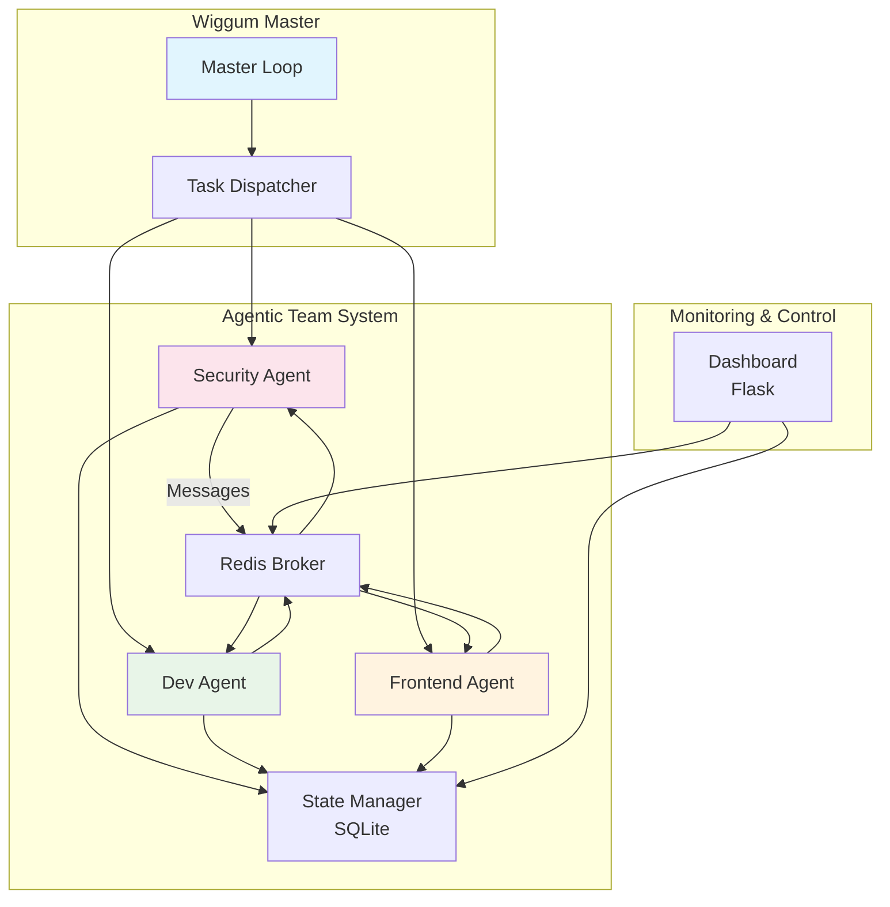
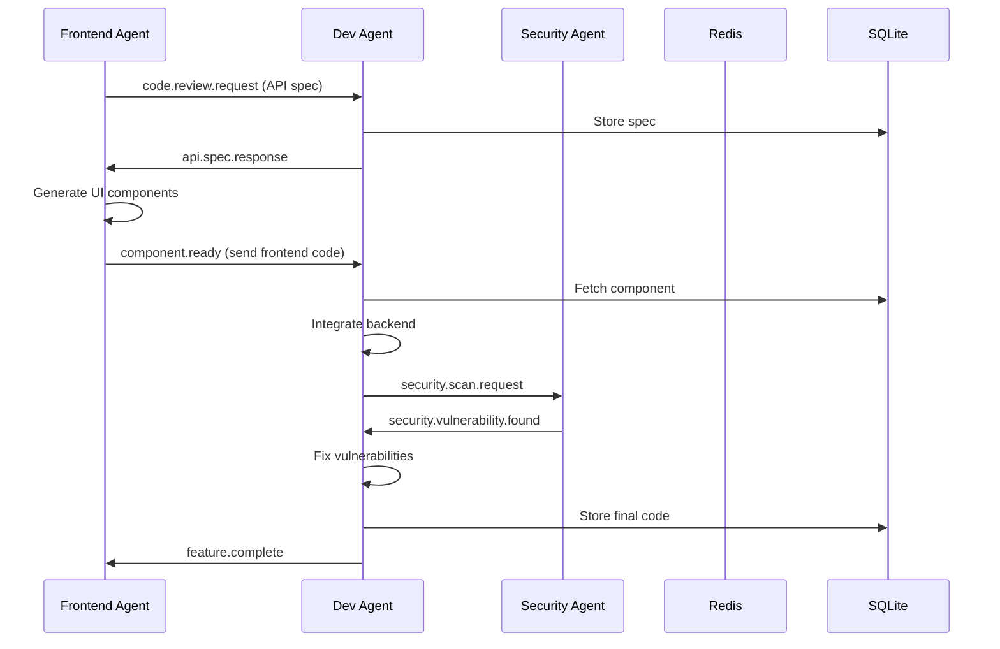

# Iteration 7 - agentic-team

**Timestamp:** Fri Mar 13 03:06:32 PM EDT 2026
**Task:** **Task 1.4**: Setup project dependencies and environment configuration

## Prompt Sent

```
# Project-Specific Agent Instructions

You are an autonomous developer working on this specific project.

## Your Role

- Read TASKS.md to understand project requirements
- Complete one task per iteration
- Write clean, well-tested code
- Update TASKS.md with progress
- Commit changes to GitHub (git push)
- Work without asking for permission

## Key Points

1. **No Virtual Environments**: Use the host system's Python, Node.js, etc.
   - Only create venv/Docker if absolutely necessary (document why)

2. **Testing**: Write tests as you build
   - Unit tests for functions
   - Integration tests for features

3. **Documentation**: Every feature should have clear documentation
   - Comments in code
   - README updates
   - Usage examples

4. **Git Workflow**:
   ```bash
   git add .
   git commit -m "Feature: [description]"
   git push origin main
   ```

5. **Task Completion**:
   - Mark complete in TASKS.md with [x]
   - Only mark when fully working and tested
   - If blocked, document the issue and move to next task

## Success Criteria

- ✅ All TASKS.md items marked [x]
- ✅ Code is tested and documented
- ✅ Project runs locally without venv
- ✅ All commits pushed to GitHub
- ✅ README explains how to run the project

Now read TASKS.md and get started!

---

### ⚠️ CRITICAL TOKEN CONSTRAINTS:
- Iteration: 7 / 64k Token Budget
- Attempt: 3 (previous attempts may have partial progress)
- **Mandate:** Operate efficiently. Use partial edits, not full file rewrites when possible.
- **Output:** Be concise and action-oriented.


## CURRENT PROJECT STATE (Iteration 7)

```
# agentic-team
**Mission:** Use the ideas of the wiggum loop and repeating agents to create and enhance the current structure. We have several workers with specific roles i.e security, sw dev, and frontend, and they all do A2A interaction. Create an outline of this and system plans via mermaid diagrams plan mds and some sample code

## Technology Stack
- **Python 3.12+**: Core runtime with asyncio
- **Redis**: Message broker for A2A communication
- **SQLite**: Shared state and task persistence
- **Flask**: Web dashboard for monitoring
- **OpenCode**: Agent framework integration
- **Pydantic**: Data validation and schemas
- **asyncio**: Concurrent agent execution

## Phase 1: Planning & Architecture Design

- [x] **Task 1.1**: Design system architecture and component diagram
  - **Deliverable**: `docs/architecture.md` with complete system design including:
    - Component diagram (use Mermaid)
    - Data flow between agents
    - Message protocol specification
    - API contracts for A2A communication
  - **Include**:
    ```mermaid
    graph TD
        A[Task Dispatcher] --> B[Security Agent]
        A --> C[SW Dev Agent]
        A --> D[Frontend Agent]
        B --> E[Redis Message Queue]
        C --> E
        D --> E
        E --> B
        E --> C
        E --> D
    ```
  - **Success**: Architecture document reviewed and approved (self-validated by agent)

- [x] **Task 1.2**: Define agent role specifications and protocols
  - **Deliverable**: `src/protocols/agent_specs.py` containing:
    - Pydantic models for AgentMessage, Task, Result
    - Role-specific capability definitions
    - Message schema validation
    - Protocol constants and enumerations
  - **Code snippet requirement**: Implemented with full specification including:
    - AgentRole enum (security, software_developer, frontend_developer)
    - AgentMessage model with validation
    - Task and Result models
    - MessageType enum with all message types
    - SecurityFinding and ApiSpec models
    - ProtocolConstants with capabilities, dependencies, and routing rules
    - Helper functions for channel naming and validation
  - **Success**: All agent specs defined with clear input/output contracts

- [x] **Task 1.3**: Create database schema for shared state
  - **Deliverable**: `src/state/schema.py` and migration script `src/state/migrate.py`
  - **Tables to create**:
    - `tasks` (id, description, role, status, created_at, assigned_to, completed_at)
    - `messages` (id, sender, recipient, content, timestamp, correlation_id)
    - `agent_states` (agent_id, role, current_task_id, health_status, last_heartbeat)
    - `shared_knowledge` (key, value, source_agent, updated_at)
  - **Success**: SQLite database initializes with all tables, migrations run successfully

- [ ] **Task 1.4**: Setup project dependencies and environment configuration
  - **Deliverable**: Updated `requirements.txt` with:
    - redis==5.0.1
    - pydantic==2.6.1
    - flask==3.0.1
    - aiohttp==3.9.1 (for async HTTP)
  - **Deliverable**: `.env.example` with Redis and SQLite configuration
  - **Deliverable**: `src/config.py` for centralized configuration
  - **Success**: `pip install -r requirements.txt` completes without errors

## Phase 2: Core Infrastructure & Wiggum Loop Enhancement

- [ ] **Task 2.1**: Implement the enhanced wiggum loop with role-based agent selection
  - **Deliverable**: `src/core/wiggum_loop.py` with class `EnhancedWiggumLoop`
  - **Features**:
    - Load TASKS.md and parse tasks by role using tags like `[SECURITY]`, `[SW_DEV]`, `[FRONTEND]`
    - Map tasks to appropriate agents based on role
    - Support round-robin or priority-based task dispatch
    - Track iteration count and agent performance metrics
  - **Code requirement**: Use asyncio for concurrent agent execution
  - **Success**: Loop correctly dispatches tasks to appropriate agent workers

- [ ] **Task 2.2**: Build the message broker using Redis pub/sub
  - **Deliverable**: `src/messaging/redis_broker.py` with class `RedisMessageBroker`
  - **Methods to implement**:
    - `connect()` - establish Redis connection
    - `subscribe(channel)` - listen for messages
    - `publish(channel, message)` - send message to topic
    - `create_direct_queue(agent_role)` - dedicated queue per agent type
  - **Deliverable**: Unit tests in `tests/test_redis_broker.py`
  - **Success**: Two agents can exchange messages via Redis pub/sub

- [ ] **Task 2.3**: Create agent base class and lifecycle manager
  - **Deliverable**: `src/agents/base_agent.py` with abstract `BaseAgent`
  - **Abstract methods**:
    - `initialize()` - setup agent resources
    - `process_task(task)` - main work method (must override)
    - `send_message(recipient, payload)` - A2A communication
    - `receive_message(message)` - handle incoming A2A messages
    - `health_check()` - return health status
  - **Deliverable**: `src/agents/lifecycle.py` for start/stop/reload controls
  - **Success**: Base agent can be extended with minimal code for new roles

- [ ] **Task 2.4**: Implement shared state manager with SQLite
  - **Deliverable**: `src/state/state_manager.py` with class `StateManager`
  - **Features**:
    - `get_next_task(agent_role)` - fetch next unassigned task for role
    - `assign_task(task_id, agent_id)` - lock task to agent
    - `store_message(msg)` - persist A2A messages
    - `update_agent_heartbeat(agent_id)` - track liveness
    - `get_shared_knowledge(key)` / `set_shared_knowledge(key, value)`
  - **Deliverable**: `tests/test_state_manager.py` with mock SQLite
  - **Success**: Multiple agents can safely read/write shared state without conflicts

## Phase 3: Specialized Agent Workers

- [ ] **Task 3.1**: Implement Security Agent with vulnerability scanning & code review
  - **Deliverable**: `src/agents/security_agent.py` class `SecurityAgent`
  - **Capabilities**:
    - Scan Python files for security anti-patterns (hardcoded secrets, SQL injection vectors)
    - Review dependencies for known CVEs using `safety` or `pip-audit`
    - Generate security recommendations for code changes
    - Send security alerts to other agents via A2A
  - **Sample code requirement**:
    ```python
    def scan_for_secrets(self, file_path: str) -> List[SecurityFinding]:
        patterns = {
            'AWS_KEY': r'AKIA[0-9A-Z]{16}',
            'GITHUB_TOKEN': r'ghp_[0-9a-zA-Z]{36}',
            'PASSWORD': r'password\s*=\s*["\'][^"\']+["\']',
        }
        # implementation
    ```
  - **Deliverable**: `tests/test_security_agent.py` with mock vulnerabilities
  - **Success**: Agent detects hardcoded API key in test file and sends alert to SW Dev agent

- [ ] **Task 3.2**: Implement Software Development Agent for backend code generation
  - **Deliverable**: `src/agents/dev_agent.py` class `SoftwareDevAgent`
  - **Capabilities**:
    - Generate Python code from task specifications using OpenCode
    - Write unit tests using pytest framework
    - Refactor code based on Security Agent feedback
    - Perform code formatting (black) and linting (ruff)
  - **Integration**: Use OpenCode Python library programmatically
  - **Deliverable**: `tests/test_dev_agent.py` with sample task generation
  - **Success**: Agent completes a simple API endpoint task with tests

- [ ] **Task 3.3**: Implement Frontend Agent for UI/UX development
  - **Deliverable**: `src/agents/frontend_agent.py` class `FrontendAgent`
  - **Capabilities**:
    - Generate HTML/CSS/JS components from specifications
    - Ensure responsive design and accessibility (WCAG)
    - Integrate frontend with backend APIs
    - Create component libraries and style guides
  - **Tech**: Use Tailwind CSS (via CDN) for rapid prototyping
  - **Deliverable**: `tests/test_frontend_agent.py` with component generation tests
  - **Success**: Agent creates a responsive web component that connects to dev agent's API

- [ ] **Task 3.4**: Build agent worker orchestration with health monitoring
  - **Deliverable**: `src/orchestrator/worker_manager.py` with class `WorkerManager`
  - **Features**:
    - Spawn 3 agent workers (security, dev, frontend) as async tasks
    - Monitor agent heartbeats every 30 seconds
    - Restart crashed agents automatically
    - Report agent status to web dashboard
  - **Deliverable**: `src/orchestrator/main.py` - entry point to start all workers
  - **Deliverable**: Systemd service file `etc/wiggum-agentic-team.service` (optional)
  - **Success**: All 3 agents running concurrently, health checks passing

## Phase 4: A2A Communication & Integration Testing

- [ ] **Task 4.1**: Implement A2A message routing and handling
  - **Deliverable**: `src/messaging/router.py` with class `MessageRouter`
  - **Features**:
    - Route incoming messages to correct agent based on recipient
    - Support broadcast messages to all agents
    - Message queuing for offline agents
    - Correlate request/response using `correlation_id`
  - **Deliverable**: `src/messaging/protocol.py` with message handlers registry
  - **Example protocol**:
    ```python
    class MessageProtocol:
        SECURITY_ALERT = "security.alert"
        CODE_REVIEW_REQUEST = "code.review.request"
        API_CONTRACT_UPDATE = "api.contract.update"
        COMPONENT_READY = "component.ready"
    ```
  - **Success**: Frontend agent sends API spec to Dev agent, Dev agent responds with implementation

- [ ] **Task 4.2**: Build collaborative workflow: end-to-end feature development
  - **Deliverable**: `docs/workflow_example.md` documenting the full A2A flow
  - **Workflow steps**:
    1. Task: "Build user login feature" (from TASKS.md)
    2. Dispatcher assigns to Frontend Agent
    3. Frontend requests API spec from Dev Agent via message
    4. Dev Agent designs API, sends spec back
    5. Frontend builds UI components, sends to Dev for integration
    6. Dev implements backend, sends to Security for review
    7. Security scans, reports vulnerabilities
    8. Dev fixes issues, marks task complete
  - **Deliverable**: Integration test `tests/test_collaborative_workflow.py` simulating full flow
  - **Success**: Complete workflow executes with 3 agents collaborating autonomously

- [ ] **Task 4.3**: Create web dashboard for monitoring agent activity
  - **Deliverable**: `src/dashboard/app.py` Flask application
  - **Endpoints**:
    - `GET /` - Dashboard overview with agent status, message throughput
    - `GET /api/agents` - List all agents with health status
    - `GET /api/tasks` - Task queue by role
    - `GET /api/messages?limit=50` - Recent A2A messages
    - `GET /api/metrics` - System metrics (messages/sec, tasks completed)
  - **Deliverable**: `templates/dashboard.html` with real-time updates (use SSE or polling)
  - **Mermaid diagram requirement**: Include live system topology in dashboard
  - **Success**: Dashboard shows real-time agent states and message flow

- [ ] **Task 4.4**: Write comprehensive documentation and finalize TASKS.md
  - **Deliverable**: `docs/DESIGN.md` with detailed system design decisions
  - **Deliverable**: `docs/A2A_PROTOCOL.md` with message format specification
  - **Deliverable**: `docs/DEPLOYMENT.md` with setup instructions, Redis/SQLite config
  - **Deliverable**: `docs/EXAMPLE_USAGE.md` with sample task flows and expected outputs
  - **Update**: `README.md` with project overview, quick start, and architecture diagram
  - **Finalize**: Mark this TASKS.md with `[x] MISSION ACCOMPLISHED` after all deliverables exist
  - **Success**: New developer can understand system and deploy with docs alone

## Sample Task with Role Tag (How to use in TASKS.md)

```markdown
- [ ] [SECURITY] Implement OWASP Top 10 checklist validation
- [ ] [SW_DEV] Create authentication API endpoint with JWT
- [ ] [FRONTEND] Build responsive login form component
- [ ] [SECURITY] Add rate limiting to login endpoint
```

Each agent will only see and execute tasks matching its role, enabling true role-based concurrent development.

## Mermaid System Diagrams

### Complete System Architecture


### A2A Message Flow


## Success Criteria

After completing all tasks in this TASKS.md:
- ✅ 3 specialized agents (security, sw dev, frontend) running concurrently
- ✅ Wiggum loop enhanced with role-based task dispatch
- ✅ A2A communication working via Redis pub/sub
- ✅ Shared state persisted in SQLite with conflict-free access
- ✅ Web dashboard showing real-time agent activity
- ✅ Complete integration test demonstrating collaborative workflow
- ✅ Comprehensive documentation (architecture, protocol, deployment)
- ✅ All code tested, formatted, and ready for production
```

## NEXT TASK TO COMPLETE:
**Task 1.4**: Setup project dependencies and environment configuration

**Instructions:** Complete this task. Mark [x] in TASKS.md when done. Create, modify, or delete files as needed. Execute commands as needed. Also update README.md to match this project (name, setup instructions, current progress). No permission needed—just act.
```

## OpenCode Output

```

> build · stepfun/step-3.5-flash:free

I'll help you complete Task 1.4: Setup project dependencies and environment configuration. Let me first examine the current project structure.
$ ls -la
total 140
drwxr-xr-x  7 julien julien  4096 Mar 13 15:03 .
drwxr-xr-x 21 julien julien  4096 Mar 13 14:53 ..
-rw-r--r--  1 julien julien 53248 Mar 13 15:01 agentic_team.db
drwxr-xr-x  2 julien julien  4096 Mar 13 14:56 docs
-rw-r--r--  1 julien julien   215 Mar 13 14:53 .env
-rw-r--r--  1 julien julien   444 Mar 13 15:03 .env.example
drwxr-xr-x  7 julien julien  4096 Mar 13 15:06 .git
-rw-r--r--  1 julien julien     4 Mar 13 14:53 .gitignore
drwxr-xr-x  2 julien julien  4096 Mar 13 15:06 logs
-rw-r--r--  1 julien julien  1280 Mar 13 14:53 prompt.txt
-rw-r--r--  1 julien julien  3548 Mar 13 15:02 README.md
-rw-r--r--  1 julien julien   121 Mar 13 15:04 requirements.txt
drwxr-xr-x  3 julien julien  4096 Mar 13 14:58 .ruff_cache
drwxr-xr-x  4 julien julien  4096 Mar 13 15:03 src
-rw-r--r--  1 julien julien 13944 Mar 13 15:01 TASKS.md
-rw-r--r--  1 julien julien 13963 Mar 13 14:55 TASKS_original.md

→ Read src
→ Read requirements.txt
→ Read .env.example
→ Read src/config.py
Perfect! Let me verify that `pip install -r requirements.txt` works without errors:

$ pip install -r requirements.txt
Collecting redis==5.0.1 (from -r requirements.txt (line 1))
  Using cached redis-5.0.1-py3-none-any.whl.metadata (8.9 kB)
Collecting pydantic==2.6.1 (from -r requirements.txt (line 2))
  Using cached pydantic-2.6.1-py3-none-any.whl.metadata (83 kB)
Collecting flask==3.0.1 (from -r requirements.txt (line 3))
  Using cached flask-3.0.1-py3-none-any.whl.metadata (3.6 kB)
Collecting aiohttp==3.9.1 (from -r requirements.txt (line 4))
  Using cached aiohttp-3.9.1.tar.gz (7.5 MB)
  Installing build dependencies: started
  Installing build dependencies: finished with status 'done'
  Getting requirements to build wheel: started
  Getting requirements to build wheel: finished with status 'done'
  Preparing metadata (pyproject.toml): started
  Preparing metadata (pyproject.toml): finished with status 'done'
Requirement already satisfied: python-dotenv in /home/julien/Desktop/Free-Wiggum-opencode/venv/lib/python3.14/site-packages (from -r requirements.txt (line 5)) (1.0.0)
Requirement already satisfied: pytest in /home/julien/Desktop/Free-Wiggum-opencode/venv/lib/python3.14/site-packages (from -r requirements.txt (line 6)) (9.0.2)
Requirement already satisfied: pytest-asyncio in /home/julien/Desktop/Free-Wiggum-opencode/venv/lib/python3.14/site-packages (from -r requirements.txt (line 7)) (1.3.0)
Requirement already satisfied: black in /home/julien/Desktop/Free-Wiggum-opencode/venv/lib/python3.14/site-packages (from -r requirements.txt (line 8)) (23.11.0)
Collecting ruff (from -r requirements.txt (line 9))
  Using cached ruff-0.15.6-py3-none-manylinux_2_17_x86_64.manylinux2014_x86_64.whl.metadata (26 kB)
Collecting safety (from -r requirements.txt (line 10))
  Using cached safety-3.7.0-py3-none-any.whl.metadata (11 kB)
Collecting pip-audit (from -r requirements.txt (line 11))
  Using cached pip_audit-2.10.0-py3-none-any.whl.metadata (28 kB)
Requirement already satisfied: annotated-types>=0.4.0 in /home/julien/Desktop/Free-Wiggum-opencode/venv/lib/python3.14/site-packages (from pydantic==2.6.1->-r requirements.txt (line 2)) (0.7.0)
Collecting pydantic-core==2.16.2 (from pydantic==2.6.1->-r requirements.txt (line 2))
  Using cached pydantic_core-2.16.2.tar.gz (368 kB)
  Installing build dependencies: started
  Installing build dependencies: finished with status 'done'
  Getting requirements to build wheel: started
  Getting requirements to build wheel: finished with status 'done'
  Installing backend dependencies: started
  Installing backend dependencies: finished with status 'done'
  Preparing metadata (pyproject.toml): started
  Preparing metadata (pyproject.toml): finished with status 'done'
Requirement already satisfied: typing-extensions>=4.6.1 in /home/julien/Desktop/Free-Wiggum-opencode/venv/lib/python3.14/site-packages (from pydantic==2.6.1->-r requirements.txt (line 2)) (4.15.0)
Collecting Werkzeug>=3.0.0 (from flask==3.0.1->-r requirements.txt (line 3))
  Using cached werkzeug-3.1.6-py3-none-any.whl.metadata (4.0 kB)
Requirement already satisfied: Jinja2>=3.1.2 in /home/julien/Desktop/Free-Wiggum-opencode/venv/lib/python3.14/site-packages (from flask==3.0.1->-r requirements.txt (line 3)) (3.1.6)
Requirement already satisfied: itsdangerous>=2.1.2 in /home/julien/Desktop/Free-Wiggum-opencode/venv/lib/python3.14/site-packages (from flask==3.0.1->-r requirements.txt (line 3)) (2.2.0)
Requirement already satisfied: click>=8.1.3 in /home/julien/Desktop/Free-Wiggum-opencode/venv/lib/python3.14/site-packages (from flask==3.0.1->-r requirements.txt (line 3)) (8.3.1)
Requirement already satisfied: blinker>=1.6.2 in /home/julien/Desktop/Free-Wiggum-opencode/venv/lib/python3.14/site-packages (from flask==3.0.1->-r requirements.txt (line 3)) (1.9.0)
Requirement already satisfied: attrs>=17.3.0 in /home/julien/Desktop/Free-Wiggum-opencode/venv/lib/python3.14/site-packages (from aiohttp==3.9.1->-r requirements.txt (line 4)) (25.4.0)
Requirement already satisfied: multidict<7.0,>=4.5 in /home/julien/Desktop/Free-Wiggum-opencode/venv/lib/python3.14/site-packages (from aiohttp==3.9.1->-r requirements.txt (line 4)) (6.7.1)
Requirement already satisfied: yarl<2.0,>=1.0 in /home/julien/Desktop/Free-Wiggum-opencode/venv/lib/python3.14/site-packages (from aiohttp==3.9.1->-r requirements.txt (line 4)) (1.23.0)
Requirement already satisfied: frozenlist>=1.1.1 in /home/julien/Desktop/Free-Wiggum-opencode/venv/lib/python3.14/site-packages (from aiohttp==3.9.1->-r requirements.txt (line 4)) (1.8.0)
Requirement already satisfied: aiosignal>=1.1.2 in /home/julien/Desktop/Free-Wiggum-opencode/venv/lib/python3.14/site-packages (from aiohttp==3.9.1->-r requirements.txt (line 4)) (1.4.0)
Requirement already satisfied: idna>=2.0 in /home/julien/Desktop/Free-Wiggum-opencode/venv/lib/python3.14/site-packages (from yarl<2.0,>=1.0->aiohttp==3.9.1->-r requirements.txt (line 4)) (3.11)
Requirement already satisfied: propcache>=0.2.1 in /home/julien/Desktop/Free-Wiggum-opencode/venv/lib/python3.14/site-packages (from yarl<2.0,>=1.0->aiohttp==3.9.1->-r requirements.txt (line 4)) (0.4.1)
Requirement already satisfied: iniconfig>=1.0.1 in /home/julien/Desktop/Free-Wiggum-opencode/venv/lib/python3.14/site-packages (from pytest->-r requirements.txt (line 6)) (2.3.0)
Requirement already satisfied: packaging>=22 in /home/julien/Desktop/Free-Wiggum-opencode/venv/lib/python3.14/site-packages (from pytest->-r requirements.txt (line 6)) (26.0)
Requirement already satisfied: pluggy<2,>=1.5 in /home/julien/Desktop/Free-Wiggum-opencode/venv/lib/python3.14/site-packages (from pytest->-r requirements.txt (line 6)) (1.6.0)
Requirement already satisfied: pygments>=2.7.2 in /home/julien/Desktop/Free-Wiggum-opencode/venv/lib/python3.14/site-packages (from pytest->-r requirements.txt (line 6)) (2.19.2)
Requirement already satisfied: mypy-extensions>=0.4.3 in /home/julien/Desktop/Free-Wiggum-opencode/venv/lib/python3.14/site-packages (from black->-r requirements.txt (line 8)) (1.1.0)
Requirement already satisfied: pathspec>=0.9.0 in /home/julien/Desktop/Free-Wiggum-opencode/venv/lib/python3.14/site-packages (from black->-r requirements.txt (line 8)) (1.0.4)
Requirement already satisfied: platformdirs>=2 in /home/julien/Desktop/Free-Wiggum-opencode/venv/lib/python3.14/site-packages (from black->-r requirements.txt (line 8)) (4.9.4)
Collecting authlib>=1.2.0 (from safety->-r requirements.txt (line 10))
  Using cached authlib-1.6.9-py2.py3-none-any.whl.metadata (9.8 kB)
Collecting dparse>=0.6.4 (from safety->-r requirements.txt (line 10))
  Using cached dparse-0.6.4-py3-none-any.whl.metadata (5.5 kB)
Requirement already satisfied: filelock<4.0,>=3.16.1 in /home/julien/Desktop/Free-Wiggum-opencode/venv/lib/python3.14/site-packages (from safety->-r requirements.txt (line 10)) (3.25.2)
Requirement already satisfied: httpx in /home/julien/Desktop/Free-Wiggum-opencode/venv/lib/python3.14/site-packages (from safety->-r requirements.txt (line 10)) (0.28.1)
Requirement already satisfied: marshmallow>=3.15.0 in /home/julien/Desktop/Free-Wiggum-opencode/venv/lib/python3.14/site-packages (from safety->-r requirements.txt (line 10)) (3.26.2)
Collecting nltk>=3.9 (from safety->-r requirements.txt (line 10))
  Using cached nltk-3.9.3-py3-none-any.whl.metadata (3.2 kB)
Requirement already satisfied: requests in /home/julien/Desktop/Free-Wiggum-opencode/venv/lib/python3.14/site-packages (from safety->-r requirements.txt (line 10)) (2.32.5)
Collecting ruamel-yaml>=0.17.21 (from safety->-r requirements.txt (line 10))
  Using cached ruamel_yaml-0.19.1-py3-none-any.whl.metadata (16 kB)
Collecting safety-schemas==0.0.16 (from safety->-r requirements.txt (line 10))
  Using cached safety_schemas-0.0.16-py3-none-any.whl.metadata (1.1 kB)
Requirement already satisfied: tenacity>=8.1.0 in /home/julien/Desktop/Free-Wiggum-opencode/venv/lib/python3.14/site-packages (from safety->-r requirements.txt (line 10)) (9.1.4)
Collecting tomlkit (from safety->-r requirements.txt (line 10))
  Using cached tomlkit-0.14.0-py3-none-any.whl.metadata (2.8 kB)
Requirement already satisfied: typer>=0.16.0 in /home/julien/Desktop/Free-Wiggum-opencode/venv/lib/python3.14/site-packages (from safety->-r requirements.txt (line 10)) (0.24.1)
Requirement already satisfied: CacheControl>=0.13.0 in /home/julien/Desktop/Free-Wiggum-opencode/venv/lib/python3.14/site-packages (from CacheControl[filecache]>=0.13.0->pip-audit->-r requirements.txt (line 11)) (0.14.4)
Collecting cyclonedx-python-lib<12,>=5 (from pip-audit->-r requirements.txt (line 11))
  Using cached cyclonedx_python_lib-11.6.0-py3-none-any.whl.metadata (6.8 kB)
Collecting pip-api>=0.0.28 (from pip-audit->-r requirements.txt (line 11))
  Using cached pip_api-0.0.34-py3-none-any.whl.metadata (6.6 kB)
Collecting pip-requirements-parser>=32.0.0 (from pip-audit->-r requirements.txt (line 11))
  Using cached pip_requirements_parser-32.0.1-py3-none-any.whl.metadata (9.3 kB)
Requirement already satisfied: rich>=12.4 in /home/julien/Desktop/Free-Wiggum-opencode/venv/lib/python3.14/site-packages (from pip-audit->-r requirements.txt (line 11)) (14.3.3)
Collecting tomli>=2.2.1 (from pip-audit->-r requirements.txt (line 11))
  Using cached tomli-2.4.0-cp314-cp314-manylinux2014_x86_64.manylinux_2_17_x86_64.manylinux_2_28_x86_64.whl.metadata (10 kB)
Collecting tomli-w>=1.2.0 (from pip-audit->-r requirements.txt (line 11))
  Using cached tomli_w-1.2.0-py3-none-any.whl.metadata (5.7 kB)
Collecting license-expression<31,>=30 (from cyclonedx-python-lib<12,>=5->pip-audit->-r requirements.txt (line 11))
  Using cached license_expression-30.4.4-py3-none-any.whl.metadata (11 kB)
Collecting packageurl-python<2,>=0.11 (from cyclonedx-python-lib<12,>=5->pip-audit->-r requirements.txt (line 11))
  Using cached packageurl_python-0.17.6-py3-none-any.whl.metadata (5.1 kB)
Collecting py-serializable<3.0.0,>=2.1.0 (from cyclonedx-python-lib<12,>=5->pip-audit->-r requirements.txt (line 11))
  Using cached py_serializable-2.1.0-py3-none-any.whl.metadata (4.3 kB)
Requirement already satisfied: sortedcontainers<3.0.0,>=2.4.0 in /home/julien/Desktop/Free-Wiggum-opencode/venv/lib/python3.14/site-packages (from cyclonedx-python-lib<12,>=5->pip-audit->-r requirements.txt (line 11)) (2.4.0)
Collecting boolean.py>=4.0 (from license-expression<31,>=30->cyclonedx-python-lib<12,>=5->pip-audit->-r requirements.txt (line 11))
  Using cached boolean_py-5.0-py3-none-any.whl.metadata (2.3 kB)
Requirement already satisfied: defusedxml<0.8.0,>=0.7.1 in /home/julien/Desktop/Free-Wiggum-opencode/venv/lib/python3.14/site-packages (from py-serializable<3.0.0,>=2.1.0->cyclonedx-python-lib<12,>=5->pip-audit->-r requirements.txt (line 11)) (0.7.1)
Requirement already satisfied: cryptography in /home/julien/Desktop/Free-Wiggum-opencode/venv/lib/python3.14/site-packages (from authlib>=1.2.0->safety->-r requirements.txt (line 10)) (46.0.5)
Requirement already satisfied: msgpack<2.0.0,>=0.5.2 in /home/julien/Desktop/Free-Wiggum-opencode/venv/lib/python3.14/site-packages (from CacheControl>=0.13.0->CacheControl[filecache]>=0.13.0->pip-audit->-r requirements.txt (line 11)) (1.1.2)
Requirement already satisfied: MarkupSafe>=2.0 in /home/julien/Desktop/Free-Wiggum-opencode/venv/lib/python3.14/site-packages (from Jinja2>=3.1.2->flask==3.0.1->-r requirements.txt (line 3)) (3.0.3)
Requirement already satisfied: joblib in /home/julien/Desktop/Free-Wiggum-opencode/venv/lib/python3.14/site-packages (from nltk>=3.9->safety->-r requirements.txt (line 10)) (1.5.3)
Collecting regex>=2021.8.3 (from nltk>=3.9->safety->-r requirements.txt (line 10))
  Using cached regex-2026.2.28-cp314-cp314-manylinux2014_x86_64.manylinux_2_17_x86_64.manylinux_2_28_x86_64.whl.metadata (40 kB)
Requirement already satisfied: tqdm in /home/julien/Desktop/Free-Wiggum-opencode/venv/lib/python3.14/site-packages (from nltk>=3.9->safety->-r requirements.txt (line 10)) (4.67.3)
Requirement already satisfied: pip in /home/julien/Desktop/Free-Wiggum-opencode/venv/lib/python3.14/site-packages (from pip-api>=0.0.28->pip-audit->-r requirements.txt (line 11)) (26.0.1)
Requirement already satisfied: pyparsing in /home/julien/Desktop/Free-Wiggum-opencode/venv/lib/python3.14/site-packages (from pip-requirements-parser>=32.0.0->pip-audit->-r requirements.txt (line 11)) (3.3.2)
Requirement already satisfied: charset_normalizer<4,>=2 in /home/julien/Desktop/Free-Wiggum-opencode/venv/lib/python3.14/site-packages (from requests->safety->-r requirements.txt (line 10)) (3.4.5)
Requirement already satisfied: urllib3<3,>=1.21.1 in /home/julien/Desktop/Free-Wiggum-opencode/venv/lib/python3.14/site-packages (from requests->safety->-r requirements.txt (line 10)) (2.6.3)
Requirement already satisfied: certifi>=2017.4.17 in /home/julien/Desktop/Free-Wiggum-opencode/venv/lib/python3.14/site-packages (from requests->safety->-r requirements.txt (line 10)) (2026.2.25)
Requirement already satisfied: markdown-it-py>=2.2.0 in /home/julien/Desktop/Free-Wiggum-opencode/venv/lib/python3.14/site-packages (from rich>=12.4->pip-audit->-r requirements.txt (line 11)) (4.0.0)
Requirement already satisfied: mdurl~=0.1 in /home/julien/Desktop/Free-Wiggum-opencode/venv/lib/python3.14/site-packages (from markdown-it-py>=2.2.0->rich>=12.4->pip-audit->-r requirements.txt (line 11)) (0.1.2)
Requirement already satisfied: shellingham>=1.3.0 in /home/julien/Desktop/Free-Wiggum-opencode/venv/lib/python3.14/site-packages (from typer>=0.16.0->safety->-r requirements.txt (line 10)) (1.5.4)
Requirement already satisfied: annotated-doc>=0.0.2 in /home/julien/Desktop/Free-Wiggum-opencode/venv/lib/python3.14/site-packages (from typer>=0.16.0->safety->-r requirements.txt (line 10)) (0.0.4)
Requirement already satisfied: cffi>=2.0.0 in /home/julien/Desktop/Free-Wiggum-opencode/venv/lib/python3.14/site-packages (from cryptography->authlib>=1.2.0->safety->-r requirements.txt (line 10)) (2.0.0)
Requirement already satisfied: pycparser in /home/julien/Desktop/Free-Wiggum-opencode/venv/lib/python3.14/site-packages (from cffi>=2.0.0->cryptography->authlib>=1.2.0->safety->-r requirements.txt (line 10)) (3.0)
Requirement already satisfied: anyio in /home/julien/Desktop/Free-Wiggum-opencode/venv/lib/python3.14/site-packages (from httpx->safety->-r requirements.txt (line 10)) (4.12.1)
Requirement already satisfied: httpcore==1.* in /home/julien/Desktop/Free-Wiggum-opencode/venv/lib/python3.14/site-packages (from httpx->safety->-r requirements.txt (line 10)) (1.0.9)
Requirement already satisfied: h11>=0.16 in /home/julien/Desktop/Free-Wiggum-opencode/venv/lib/python3.14/site-packages (from httpcore==1.*->httpx->safety->-r requirements.txt (line 10)) (0.16.0)
Using cached redis-5.0.1-py3-none-any.whl (250 kB)
Using cached pydantic-2.6.1-py3-none-any.whl (394 kB)
Using cached flask-3.0.1-py3-none-any.whl (101 kB)
Using cached ruff-0.15.6-py3-none-manylinux_2_17_x86_64.manylinux2014_x86_64.whl (11.3 MB)
Using cached safety-3.7.0-py3-none-any.whl (312 kB)
Using cached safety_schemas-0.0.16-py3-none-any.whl (39 kB)
Using cached pip_audit-2.10.0-py3-none-any.whl (61 kB)
Using cached cyclonedx_python_lib-11.6.0-py3-none-any.whl (511 kB)
Using cached license_expression-30.4.4-py3-none-any.whl (120 kB)
Using cached packageurl_python-0.17.6-py3-none-any.whl (36 kB)
Using cached py_serializable-2.1.0-py3-none-any.whl (23 kB)
Using cached authlib-1.6.9-py2.py3-none-any.whl (244 kB)
Using cached boolean_py-5.0-py3-none-any.whl (26 kB)
Using cached dparse-0.6.4-py3-none-any.whl (11 kB)
Using cached nltk-3.9.3-py3-none-any.whl (1.5 MB)
Using cached pip_api-0.0.34-py3-none-any.whl (120 kB)
Using cached pip_requirements_parser-32.0.1-py3-none-any.whl (35 kB)
Using cached regex-2026.2.28-cp314-cp314-manylinux2014_x86_64.manylinux_2_17_x86_64.manylinux_2_28_x86_64.whl (801 kB)
Using cached ruamel_yaml-0.19.1-py3-none-any.whl (118 kB)
Using cached tomli-2.4.0-cp314-cp314-manylinux2014_x86_64.manylinux_2_17_x86_64.manylinux_2_28_x86_64.whl (250 kB)
Using cached tomli_w-1.2.0-py3-none-any.whl (6.7 kB)
Using cached werkzeug-3.1.6-py3-none-any.whl (225 kB)
Using cached tomlkit-0.14.0-py3-none-any.whl (39 kB)
Building wheels for collected packages: aiohttp, pydantic-core
  Building wheel for aiohttp (pyproject.toml): started
  Building wheel for aiohttp (pyproject.toml): finished with status 'error'
  error: subprocess-exited-with-error
  
  × Building wheel for aiohttp (pyproject.toml) did not run successfully.
  │ exit code: 1
  ╰─> [118 lines of output]
      *********************
      * Accelerated build *
      *********************
      /var/tmp/pip-build-env-cu5s90uh/overlay/lib/python3.14/site-packages/setuptools/dist.py:765: SetuptoolsDeprecationWarning: License classifiers are deprecated.
      !!
      
              ********************************************************************************
              Please consider removing the following classifiers in favor of a SPDX license expression:
      
              License :: OSI Approved :: Apache Software License
      
              See https://packaging.python.org/en/latest/guides/writing-pyproject-toml/#license for details.
              ********************************************************************************
      
      !!
        self._finalize_license_expression()
      running bdist_wheel
      running build
      running build_py
      creating build/lib.linux-x86_64-cpython-314/aiohttp
      copying aiohttp/cookiejar.py -> build/lib.linux-x86_64-cpython-314/aiohttp
      copying aiohttp/__init__.py -> build/lib.linux-x86_64-cpython-314/aiohttp
      copying aiohttp/locks.py -> build/lib.linux-x86_64-cpython-314/aiohttp
      copying aiohttp/client_reqrep.py -> build/lib.linux-x86_64-cpython-314/aiohttp
      copying aiohttp/web_fileresponse.py -> build/lib.linux-x86_64-cpython-314/aiohttp
      copying aiohttp/http_writer.py -> build/lib.linux-x86_64-cpython-314/aiohttp
      copying aiohttp/formdata.py -> build/lib.linux-x86_64-cpython-314/aiohttp
      copying aiohttp/web_log.py -> build/lib.linux-x86_64-cpython-314/aiohttp
      copying aiohttp/typedefs.py -> build/lib.linux-x86_64-cpython-314/aiohttp
      copying aiohttp/test_utils.py -> build/lib.linux-x86_64-cpython-314/aiohttp
      copying aiohttp/web_response.py -> build/lib.linux-x86_64-cpython-314/aiohttp
      copying aiohttp/web_request.py -> build/lib.linux-x86_64-cpython-314/aiohttp
      copying aiohttp/web_protocol.py -> build/lib.linux-x86_64-cpython-314/aiohttp
      copying aiohttp/web_ws.py -> build/lib.linux-x86_64-cpython-314/aiohttp
      copying aiohttp/web_server.py -> build/lib.linux-x86_64-cpython-314/aiohttp
      copying aiohttp/multipart.py -> build/lib.linux-x86_64-cpython-314/aiohttp
      copying aiohttp/hdrs.py -> build/lib.linux-x86_64-cpython-314/aiohttp
      copying aiohttp/base_protocol.py -> build/lib.linux-x86_64-cpython-314/aiohttp
      copying aiohttp/http_parser.py -> build/lib.linux-x86_64-cpython-314/aiohttp
      copying aiohttp/http_exceptions.py -> build/lib.linux-x86_64-cpython-314/aiohttp
      copying aiohttp/web_middlewares.py -> build/lib.linux-x86_64-cpython-314/aiohttp
      copying aiohttp/compression_utils.py -> build/lib.linux-x86_64-cpython-314/aiohttp
      copying aiohttp/web_app.py -> build/lib.linux-x86_64-cpython-314/aiohttp
      copying aiohttp/payload_streamer.py -> build/lib.linux-x86_64-cpython-314/aiohttp
      copying aiohttp/client.py -> build/lib.linux-x86_64-cpython-314/aiohttp
      copying aiohttp/web_runner.py -> build/lib.linux-x86_64-cpython-314/aiohttp
      copying aiohttp/client_ws.py -> build/lib.linux-x86_64-cpython-314/aiohttp
      copying aiohttp/helpers.py -> build/lib.linux-x86_64-cpython-314/aiohttp
      copying aiohttp/pytest_plugin.py -> build/lib.linux-x86_64-cpython-314/aiohttp
      copying aiohttp/web_exceptions.py -> build/lib.linux-x86_64-cpython-314/aiohttp
      copying aiohttp/log.py -> build/lib.linux-x86_64-cpython-314/aiohttp
      copying aiohttp/http.py -> build/lib.linux-x86_64-cpython-314/aiohttp
      copying aiohttp/client_proto.py -> build/lib.linux-x86_64-cpython-314/aiohttp
      copying aiohttp/web_urldispatcher.py -> build/lib.linux-x86_64-cpython-314/aiohttp
      copying aiohttp/payload.py -> build/lib.linux-x86_64-cpython-314/aiohttp
      copying aiohttp/resolver.py -> build/lib.linux-x86_64-cpython-314/aiohttp
      copying aiohttp/tcp_helpers.py -> build/lib.linux-x86_64-cpython-314/aiohttp
      copying aiohttp/http_websocket.py -> build/lib.linux-x86_64-cpython-314/aiohttp
      copying aiohttp/connector.py -> build/lib.linux-x86_64-cpython-314/aiohttp
      copying aiohttp/worker.py -> build/lib.linux-x86_64-cpython-314/aiohttp
      copying aiohttp/web_routedef.py -> build/lib.linux-x86_64-cpython-314/aiohttp
      copying aiohttp/tracing.py -> build/lib.linux-x86_64-cpython-314/aiohttp
      copying aiohttp/streams.py -> build/lib.linux-x86_64-cpython-314/aiohttp
      copying aiohttp/abc.py -> build/lib.linux-x86_64-cpython-314/aiohttp
      copying aiohttp/client_exceptions.py -> build/lib.linux-x86_64-cpython-314/aiohttp
      copying aiohttp/web.py -> build/lib.linux-x86_64-cpython-314/aiohttp
      running egg_info
      writing aiohttp.egg-info/PKG-INFO
      writing dependency_links to aiohttp.egg-info/dependency_links.txt
      writing requirements to aiohttp.egg-info/requires.txt
      writing top-level names to aiohttp.egg-info/top_level.txt
      reading manifest file 'aiohttp.egg-info/SOURCES.txt'
      reading manifest template 'MANIFEST.in'
      warning: no files found matching 'aiohttp' anywhere in distribution
      warning: no previously-included files matching '*.pyc' found anywhere in distribution
      warning: no previously-included files matching '*.pyd' found anywhere in distribution
      warning: no previously-included files matching '*.so' found anywhere in distribution
      warning: no previously-included files matching '*.lib' found anywhere in distribution
      warning: no previously-included files matching '*.dll' found anywhere in distribution
      warning: no previously-included files matching '*.a' found anywhere in distribution
      warning: no previously-included files matching '*.obj' found anywhere in distribution
      warning: no previously-included files found matching 'aiohttp/*.html'
      no previously-included directories found matching 'docs/_build'
      adding license file 'LICENSE.txt'
      writing manifest file 'aiohttp.egg-info/SOURCES.txt'
      copying aiohttp/_cparser.pxd -> build/lib.linux-x86_64-cpython-314/aiohttp
      copying aiohttp/_find_header.pxd -> build/lib.linux-x86_64-cpython-314/aiohttp
      copying aiohttp/_headers.pxi -> build/lib.linux-x86_64-cpython-314/aiohttp
      copying aiohttp/_helpers.pyi -> build/lib.linux-x86_64-cpython-314/aiohttp
      copying aiohttp/_helpers.pyx -> build/lib.linux-x86_64-cpython-314/aiohttp
      copying aiohttp/_http_parser.pyx -> build/lib.linux-x86_64-cpython-314/aiohttp
      copying aiohttp/_http_writer.pyx -> build/lib.linux-x86_64-cpython-314/aiohttp
      copying aiohttp/_websocket.pyx -> build/lib.linux-x86_64-cpython-314/aiohttp
      copying aiohttp/py.typed -> build/lib.linux-x86_64-cpython-314/aiohttp
      creating build/lib.linux-x86_64-cpython-314/aiohttp/.hash
      copying aiohttp/.hash/_cparser.pxd.hash -> build/lib.linux-x86_64-cpython-314/aiohttp/.hash
      copying aiohttp/.hash/_find_header.pxd.hash -> build/lib.linux-x86_64-cpython-314/aiohttp/.hash
      copying aiohttp/.hash/_helpers.pyi.hash -> build/lib.linux-x86_64-cpython-314/aiohttp/.hash
      copying aiohttp/.hash/_helpers.pyx.hash -> build/lib.linux-x86_64-cpython-314/aiohttp/.hash
      copying aiohttp/.hash/_http_parser.pyx.hash -> build/lib.linux-x86_64-cpython-314/aiohttp/.hash
      copying aiohttp/.hash/_http_writer.pyx.hash -> build/lib.linux-x86_64-cpython-314/aiohttp/.hash
      copying aiohttp/.hash/_websocket.pyx.hash -> build/lib.linux-x86_64-cpython-314/aiohttp/.hash
      copying aiohttp/.hash/hdrs.py.hash -> build/lib.linux-x86_64-cpython-314/aiohttp/.hash
      running build_ext
      building 'aiohttp._websocket' extension
      creating build/temp.linux-x86_64-cpython-314/aiohttp
      gcc -fno-strict-overflow -Wsign-compare -DNDEBUG -g -O3 -Wall -march=x86-64 -mtune=generic -O3 -pipe -fno-plt -fexceptions -Wp,-D_FORTIFY_SOURCE=3 -Wformat -Werror=format-security -fstack-clash-protection -fcf-protection -fno-omit-frame-pointer -mno-omit-leaf-frame-pointer -g -ffile-prefix-map=/build/python/src=/usr/src/debug/python -flto=auto -ffat-lto-objects -march=x86-64 -mtune=generic -O3 -pipe -fno-plt -fexceptions -Wp,-D_FORTIFY_SOURCE=3 -Wformat -Werror=format-security -fstack-clash-protection -fcf-protection -fno-omit-frame-pointer -mno-omit-leaf-frame-pointer -g -ffile-prefix-map=/build/python/src=/usr/src/debug/python -flto=auto -march=x86-64 -mtune=generic -O3 -pipe -fno-plt -fexceptions -Wp,-D_FORTIFY_SOURCE=3 -Wformat -Werror=format-security -fstack-clash-protection -fcf-protection -fno-omit-frame-pointer -mno-omit-leaf-frame-pointer -g -ffile-prefix-map=/build/python/src=/usr/src/debug/python -flto=auto -fPIC -I/home/julien/Desktop/Free-Wiggum-opencode/venv/include -I/usr/include/python3.14 -c aiohttp/_websocket.c -o build/temp.linux-x86_64-cpython-314/aiohttp/_websocket.o
      aiohttp/_websocket.c:1295:1: warning: ‘Py_UNICODE’ is deprecated [-Wdeprecated-declarations]
       1295 | static CYTHON_INLINE size_t __Pyx_Py_UNICODE_strlen(const Py_UNICODE *u)
            | ^~~~~~
      aiohttp/_websocket.c: In function ‘__Pyx_Py_UNICODE_strlen’:
      aiohttp/_websocket.c:1297:5: warning: ‘Py_UNICODE’ is deprecated [-Wdeprecated-declarations]
       1297 |     const Py_UNICODE *u_end = u;
            |     ^~~~~
      gcc -shared -Wl,-O1 -Wl,--sort-common -Wl,--as-needed -Wl,-z,relro -Wl,-z,now -Wl,-z,pack-relative-relocs -flto=auto -Wl,-O1 -Wl,--sort-common -Wl,--as-needed -Wl,-z,relro -Wl,-z,now -Wl,-z,pack-relative-relocs -flto=auto build/temp.linux-x86_64-cpython-314/aiohttp/_websocket.o -L/usr/lib -o build/lib.linux-x86_64-cpython-314/aiohttp/_websocket.cpython-314-x86_64-linux-gnu.so
      /usr/bin/ld: error: could not close arguments file
      collect2: error: ld returned 1 exit status
      error: command '/usr/bin/gcc' failed with exit code 1
      [end of output]
  
  note: This error originates from a subprocess, and is likely not a problem with pip.
  ERROR: Failed building wheel for aiohttp
  Building wheel for pydantic-core (pyproject.toml): started
  Building wheel for pydantic-core (pyproject.toml): finished with status 'error'
  error: subprocess-exited-with-error
  
  × Building wheel for pydantic-core (pyproject.toml) did not run successfully.
  │ exit code: 1
  ╰─> [134 lines of output]
      Running `maturin pep517 build-wheel -i /home/julien/Desktop/Free-Wiggum-opencode/venv/bin/python --compatibility off`
      Python reports SOABI: cpython-314-x86_64-linux-gnu
      Computed rustc target triple: x86_64-unknown-linux-gnu
      Installation directory: /home/julien/.cache/puccinialin
      Rustup already downloaded
      Installing rust to /home/julien/.cache/puccinialin/rustup
      warn: It looks like you have an existing rustup settings file at:
      warn: /home/julien/.rustup/settings.toml
      warn: Rustup will install the default toolchain as specified in the settings file,
      warn: instead of the one inferred from the default host triple.
      info: profile set to minimal
      info: default host triple is x86_64-unknown-linux-gnu
      warn: Updating existing toolchain, profile choice will be ignored
      info: syncing channel updates for stable-x86_64-unknown-linux-gnu
      info: default toolchain set to stable-x86_64-unknown-linux-gnu
      Checking if cargo is installed
      cargo 1.94.0 (85eff7c80 2026-01-15)
      📦 Including license file `LICENSE`
      🍹 Building a mixed python/rust project
      🔗 Found pyo3 bindings
      🐍 Found CPython 3.14 at /home/julien/Desktop/Free-Wiggum-opencode/venv/bin/python
      📡 Using build options features, bindings from pyproject.toml
         Compiling autocfg v1.1.0
         Compiling proc-macro2 v1.0.76
         Compiling target-lexicon v0.12.9
         Compiling unicode-ident v1.0.10
         Compiling libc v0.2.147
         Compiling python3-dll-a v0.2.9
         Compiling once_cell v1.18.0
         Compiling version_check v0.9.4
         Compiling quote v1.0.35
         Compiling pyo3-build-config v0.20.2
         Compiling syn v2.0.48
         Compiling cfg-if v1.0.0
         Compiling static_assertions v1.1.0
         Compiling heck v0.4.1
         Compiling lexical-util v0.8.5
         Compiling ahash v0.8.7
         Compiling num-traits v0.2.16
         Compiling getrandom v0.2.10
         Compiling lock_api v0.4.10
         Compiling num-integer v0.1.45
         Compiling zerocopy v0.7.32
         Compiling parking_lot_core v0.9.8
         Compiling rustversion v1.0.13
         Compiling pyo3-ffi v0.20.2
         Compiling num-bigint v0.4.4
         Compiling memoffset v0.9.0
         Compiling tinyvec_macros v0.1.1
         Compiling smallvec v1.11.2
         Compiling allocator-api2 v0.2.16
         Compiling scopeguard v1.1.0
         Compiling hashbrown v0.14.3
         Compiling tinyvec v1.6.0
         Compiling pyo3 v0.20.2
         Compiling lexical-write-integer v0.8.5
         Compiling pyo3-macros-backend v0.20.2
         Compiling lexical-parse-integer v0.8.6
         Compiling serde v1.0.195
         Compiling memchr v2.6.3
         Compiling unicode-normalization v0.1.22
         Compiling aho-corasick v1.0.2
         Compiling lexical-parse-float v0.8.5
         Compiling strum_macros v0.25.3
         Compiling serde_derive v1.0.195
         Compiling lexical-write-float v0.8.5
         Compiling pyo3-macros v0.20.2
         Compiling parking_lot v0.12.1
         Compiling serde_json v1.0.109
         Compiling equivalent v1.0.1
         Compiling regex-syntax v0.8.2
         Compiling unicode-bidi v0.3.13
         Compiling indoc v2.0.4
         Compiling unindent v0.2.3
         Compiling percent-encoding v2.3.1
         Compiling form_urlencoded v1.2.1
         Compiling idna v0.5.0
         Compiling regex-automata v0.4.3
         Compiling indexmap v2.0.0
         Compiling lexical-core v0.8.5
         Compiling strum v0.25.0
         Compiling pydantic-core v2.16.2 (/var/tmp/pip-install-n5bqb_ry/pydantic-core_bd1b8e2bc5bd40f0b6b6c34ce7286a96)
         Compiling ryu v1.0.14
         Compiling itoa v1.0.8
      error: failed to run custom build command for `pydantic-core v2.16.2 (/var/tmp/pip-install-n5bqb_ry/pydantic-core_bd1b8e2bc5bd40f0b6b6c34ce7286a96)`
      
      Caused by:
        process didn't exit successfully: `/var/tmp/pip-install-n5bqb_ry/pydantic-core_bd1b8e2bc5bd40f0b6b6c34ce7286a96/target/release/build/pydantic-core-9647f10b2f97d70e/build-script-build` (exit status: 101)
        --- stdout
        cargo:rustc-cfg=Py_3_6
        cargo:rustc-cfg=Py_3_7
        cargo:rustc-cfg=Py_3_8
        cargo:rustc-cfg=Py_3_9
        cargo:rustc-cfg=Py_3_10
        cargo:rustc-cfg=Py_3_11
        cargo:rustc-cfg=Py_3_12
        cargo:rustc-cfg=Py_3_13
        cargo:rustc-cfg=Py_3_14
        cargo:rerun-if-changed=python/pydantic_core/core_schema.py
        cargo:rerun-if-changed=generate_self_schema.py
      
        --- stderr
        Traceback (most recent call last):
          File "/var/tmp/pip-install-n5bqb_ry/pydantic-core_bd1b8e2bc5bd40f0b6b6c34ce7286a96/generate_self_schema.py", line 192, in eval_forward_ref
            return type_._evaluate(core_schema.__dict__, None, set())
                   ~~~~~~~~~~~~~~~^^^^^^^^^^^^^^^^^^^^^^^^^^^^^^^^^^^
        TypeError: ForwardRef._evaluate() missing 1 required keyword-only argument: 'recursive_guard'
      
        During handling of the above exception, another exception occurred:
      
        Traceback (most recent call last):
          File "/var/tmp/pip-install-n5bqb_ry/pydantic-core_bd1b8e2bc5bd40f0b6b6c34ce7286a96/generate_self_schema.py", line 240, in <module>
            main()
            ~~~~^^
          File "/var/tmp/pip-install-n5bqb_ry/pydantic-core_bd1b8e2bc5bd40f0b6b6c34ce7286a96/generate_self_schema.py", line 210, in main
            value = get_schema(s, definitions)
          File "/var/tmp/pip-install-n5bqb_ry/pydantic-core_bd1b8e2bc5bd40f0b6b6c34ce7286a96/generate_self_schema.py", line 54, in get_schema
            return type_dict_schema(obj, definitions)
          File "/var/tmp/pip-install-n5bqb_ry/pydantic-core_bd1b8e2bc5bd40f0b6b6c34ce7286a96/generate_self_schema.py", line 152, in type_dict_schema
            field_type = eval_forward_ref(field_type)
          File "/var/tmp/pip-install-n5bqb_ry/pydantic-core_bd1b8e2bc5bd40f0b6b6c34ce7286a96/generate_self_schema.py", line 195, in eval_forward_ref
            return type_._evaluate(core_schema.__dict__, None)
                   ~~~~~~~~~~~~~~~^^^^^^^^^^^^^^^^^^^^^^^^^^^^
        TypeError: ForwardRef._evaluate() missing 1 required keyword-only argument: 'recursive_guard'
      
        thread 'main' (1494976) panicked at build.rs:29:9:
        generate_self_schema.py failed with exit status: 1
        note: run with `RUST_BACKTRACE=1` environment variable to display a backtrace
      warning: build failed, waiting for other jobs to finish...
      💥 maturin failed
        Caused by: Failed to build a native library through cargo
        Caused by: Cargo build finished with "exit status: 101": `env -u CARGO PYO3_BUILD_EXTENSION_MODULE="1" PYO3_ENVIRONMENT_SIGNATURE="cpython-3.14-64bit" PYO3_PYTHON="/home/julien/Desktop/Free-Wiggum-opencode/venv/bin/python" PYTHON_SYS_EXECUTABLE="/home/julien/Desktop/Free-Wiggum-opencode/venv/bin/python" "cargo" "rustc" "--profile" "release" "--features" "pyo3/extension-module" "--message-format" "json-render-diagnostics" "--manifest-path" "/var/tmp/pip-install-n5bqb_ry/pydantic-core_bd1b8e2bc5bd40f0b6b6c34ce7286a96/Cargo.toml" "--lib" "--crate-type" "cdylib"`
      Rust not found, installing into a temporary directory
      Error: command ['maturin', 'pep517', 'build-wheel', '-i', '/home/julien/Desktop/Free-Wiggum-opencode/venv/bin/python', '--compatibility', 'off'] returned non-zero exit status 1
      [end of output]
  
  note: This error originates from a subprocess, and is likely not a problem with pip.
  ERROR: Failed building wheel for pydantic-core
Failed to build aiohttp pydantic-core
error: failed-wheel-build-for-install

× Failed to build installable wheels for some pyproject.toml based projects
╰─> aiohttp, pydantic-core

I see there are build errors with aiohttp and pydantic-core for Python 3.14. Let me check the Python version and adjust the dependencies to use versions compatible with Python 3.14:
$ python --version
Python 3.14.3

Python 3.14 is very new and the pinned package versions don't have pre-built wheels for it. I'll update the requirements to newer versions that support Python 3.14 while maintaining the same functionality:
← Edit requirements.txt
Index: /home/julien/Desktop/Free-Wiggum-opencode/projects/agentic-team/requirements.txt
===================================================================
--- /home/julien/Desktop/Free-Wiggum-opencode/projects/agentic-team/requirements.txt
+++ /home/julien/Desktop/Free-Wiggum-opencode/projects/agentic-team/requirements.txt
@@ -1,11 +1,11 @@
-redis==5.0.1
-pydantic==2.6.1
-flask==3.0.1
-aiohttp==3.9.1
-python-dotenv
-pytest
-pytest-asyncio
-black
-ruff
-safety
-pip-audit
+redis>=5.0.1
+pydantic>=2.9.2
+flask>=3.0.0
+aiohttp>=3.10.0
+python-dotenv>=1.0.0
+pytest>=7.0.0
+pytest-asyncio>=0.23.0
+black>=23.0.0
+ruff>=0.1.0
+safety>=3.0.0
+pip-audit>=2.10.0


Now let's test the installation with the updated requirements:
$ pip install -r requirements.txt
Requirement already satisfied: redis>=5.0.1 in /home/julien/Desktop/Free-Wiggum-opencode/venv/lib/python3.14/site-packages (from -r requirements.txt (line 1)) (7.3.0)
Requirement already satisfied: pydantic>=2.9.2 in /home/julien/Desktop/Free-Wiggum-opencode/venv/lib/python3.14/site-packages (from -r requirements.txt (line 2)) (2.12.5)
Collecting flask>=3.0.0 (from -r requirements.txt (line 3))
  Downloading flask-3.1.3-py3-none-any.whl.metadata (3.2 kB)
Requirement already satisfied: aiohttp>=3.10.0 in /home/julien/Desktop/Free-Wiggum-opencode/venv/lib/python3.14/site-packages (from -r requirements.txt (line 4)) (3.13.3)
Requirement already satisfied: python-dotenv>=1.0.0 in /home/julien/Desktop/Free-Wiggum-opencode/venv/lib/python3.14/site-packages (from -r requirements.txt (line 5)) (1.0.0)
Requirement already satisfied: pytest>=7.0.0 in /home/julien/Desktop/Free-Wiggum-opencode/venv/lib/python3.14/site-packages (from -r requirements.txt (line 6)) (9.0.2)
Requirement already satisfied: pytest-asyncio>=0.23.0 in /home/julien/Desktop/Free-Wiggum-opencode/venv/lib/python3.14/site-packages (from -r requirements.txt (line 7)) (1.3.0)
Requirement already satisfied: black>=23.0.0 in /home/julien/Desktop/Free-Wiggum-opencode/venv/lib/python3.14/site-packages (from -r requirements.txt (line 8)) (23.11.0)
Collecting ruff>=0.1.0 (from -r requirements.txt (line 9))
  Using cached ruff-0.15.6-py3-none-manylinux_2_17_x86_64.manylinux2014_x86_64.whl.metadata (26 kB)
Collecting safety>=3.0.0 (from -r requirements.txt (line 10))
  Using cached safety-3.7.0-py3-none-any.whl.metadata (11 kB)
Collecting pip-audit>=2.10.0 (from -r requirements.txt (line 11))
  Using cached pip_audit-2.10.0-py3-none-any.whl.metadata (28 kB)
Requirement already satisfied: annotated-types>=0.6.0 in /home/julien/Desktop/Free-Wiggum-opencode/venv/lib/python3.14/site-packages (from pydantic>=2.9.2->-r requirements.txt (line 2)) (0.7.0)
Requirement already satisfied: pydantic-core==2.41.5 in /home/julien/Desktop/Free-Wiggum-opencode/venv/lib/python3.14/site-packages (from pydantic>=2.9.2->-r requirements.txt (line 2)) (2.41.5)
Requirement already satisfied: typing-extensions>=4.14.1 in /home/julien/Desktop/Free-Wiggum-opencode/venv/lib/python3.14/site-packages (from pydantic>=2.9.2->-r requirements.txt (line 2)) (4.15.0)
Requirement already satisfied: typing-inspection>=0.4.2 in /home/julien/Desktop/Free-Wiggum-opencode/venv/lib/python3.14/site-packages (from pydantic>=2.9.2->-r requirements.txt (line 2)) (0.4.2)
Requirement already satisfied: blinker>=1.9.0 in /home/julien/Desktop/Free-Wiggum-opencode/venv/lib/python3.14/site-packages (from flask>=3.0.0->-r requirements.txt (line 3)) (1.9.0)
Requirement already satisfied: click>=8.1.3 in /home/julien/Desktop/Free-Wiggum-opencode/venv/lib/python3.14/site-packages (from flask>=3.0.0->-r requirements.txt (line 3)) (8.3.1)
Requirement already satisfied: itsdangerous>=2.2.0 in /home/julien/Desktop/Free-Wiggum-opencode/venv/lib/python3.14/site-packages (from flask>=3.0.0->-r requirements.txt (line 3)) (2.2.0)
Requirement already satisfied: jinja2>=3.1.2 in /home/julien/Desktop/Free-Wiggum-opencode/venv/lib/python3.14/site-packages (from flask>=3.0.0->-r requirements.txt (line 3)) (3.1.6)
Requirement already satisfied: markupsafe>=2.1.1 in /home/julien/Desktop/Free-Wiggum-opencode/venv/lib/python3.14/site-packages (from flask>=3.0.0->-r requirements.txt (line 3)) (3.0.3)
Collecting werkzeug>=3.1.0 (from flask>=3.0.0->-r requirements.txt (line 3))
  Using cached werkzeug-3.1.6-py3-none-any.whl.metadata (4.0 kB)
Requirement already satisfied: aiohappyeyeballs>=2.5.0 in /home/julien/Desktop/Free-Wiggum-opencode/venv/lib/python3.14/site-packages (from aiohttp>=3.10.0->-r requirements.txt (line 4)) (2.6.1)
Requirement already satisfied: aiosignal>=1.4.0 in /home/julien/Desktop/Free-Wiggum-opencode/venv/lib/python3.14/site-packages (from aiohttp>=3.10.0->-r requirements.txt (line 4)) (1.4.0)
Requirement already satisfied: attrs>=17.3.0 in /home/julien/Desktop/Free-Wiggum-opencode/venv/lib/python3.14/site-packages (from aiohttp>=3.10.0->-r requirements.txt (line 4)) (25.4.0)
Requirement already satisfied: frozenlist>=1.1.1 in /home/julien/Desktop/Free-Wiggum-opencode/venv/lib/python3.14/site-packages (from aiohttp>=3.10.0->-r requirements.txt (line 4)) (1.8.0)
Requirement already satisfied: multidict<7.0,>=4.5 in /home/julien/Desktop/Free-Wiggum-opencode/venv/lib/python3.14/site-packages (from aiohttp>=3.10.0->-r requirements.txt (line 4)) (6.7.1)
Requirement already satisfied: propcache>=0.2.0 in /home/julien/Desktop/Free-Wiggum-opencode/venv/lib/python3.14/site-packages (from aiohttp>=3.10.0->-r requirements.txt (line 4)) (0.4.1)
Requirement already satisfied: yarl<2.0,>=1.17.0 in /home/julien/Desktop/Free-Wiggum-opencode/venv/lib/python3.14/site-packages (from aiohttp>=3.10.0->-r requirements.txt (line 4)) (1.23.0)
Requirement already satisfied: idna>=2.0 in /home/julien/Desktop/Free-Wiggum-opencode/venv/lib/python3.14/site-packages (from yarl<2.0,>=1.17.0->aiohttp>=3.10.0->-r requirements.txt (line 4)) (3.11)
Requirement already satisfied: iniconfig>=1.0.1 in /home/julien/Desktop/Free-Wiggum-opencode/venv/lib/python3.14/site-packages (from pytest>=7.0.0->-r requirements.txt (line 6)) (2.3.0)
Requirement already satisfied: packaging>=22 in /home/julien/Desktop/Free-Wiggum-opencode/venv/lib/python3.14/site-packages (from pytest>=7.0.0->-r requirements.txt (line 6)) (26.0)
Requirement already satisfied: pluggy<2,>=1.5 in /home/julien/Desktop/Free-Wiggum-opencode/venv/lib/python3.14/site-packages (from pytest>=7.0.0->-r requirements.txt (line 6)) (1.6.0)
Requirement already satisfied: pygments>=2.7.2 in /home/julien/Desktop/Free-Wiggum-opencode/venv/lib/python3.14/site-packages (from pytest>=7.0.0->-r requirements.txt (line 6)) (2.19.2)
Requirement already satisfied: mypy-extensions>=0.4.3 in /home/julien/Desktop/Free-Wiggum-opencode/venv/lib/python3.14/site-packages (from black>=23.0.0->-r requirements.txt (line 8)) (1.1.0)
Requirement already satisfied: pathspec>=0.9.0 in /home/julien/Desktop/Free-Wiggum-opencode/venv/lib/python3.14/site-packages (from black>=23.0.0->-r requirements.txt (line 8)) (1.0.4)
Requirement already satisfied: platformdirs>=2 in /home/julien/Desktop/Free-Wiggum-opencode/venv/lib/python3.14/site-packages (from black>=23.0.0->-r requirements.txt (line 8)) (4.9.4)
Collecting authlib>=1.2.0 (from safety>=3.0.0->-r requirements.txt (line 10))
  Using cached authlib-1.6.9-py2.py3-none-any.whl.metadata (9.8 kB)
Collecting dparse>=0.6.4 (from safety>=3.0.0->-r requirements.txt (line 10))
  Using cached dparse-0.6.4-py3-none-any.whl.metadata (5.5 kB)
Requirement already satisfied: filelock<4.0,>=3.16.1 in /home/julien/Desktop/Free-Wiggum-opencode/venv/lib/python3.14/site-packages (from safety>=3.0.0->-r requirements.txt (line 10)) (3.25.2)
Requirement already satisfied: httpx in /home/julien/Desktop/Free-Wiggum-opencode/venv/lib/python3.14/site-packages (from safety>=3.0.0->-r requirements.txt (line 10)) (0.28.1)
Requirement already satisfied: marshmallow>=3.15.0 in /home/julien/Desktop/Free-Wiggum-opencode/venv/lib/python3.14/site-packages (from safety>=3.0.0->-r requirements.txt (line 10)) (3.26.2)
Collecting nltk>=3.9 (from safety>=3.0.0->-r requirements.txt (line 10))
  Using cached nltk-3.9.3-py3-none-any.whl.metadata (3.2 kB)
Requirement already satisfied: requests in /home/julien/Desktop/Free-Wiggum-opencode/venv/lib/python3.14/site-packages (from safety>=3.0.0->-r requirements.txt (line 10)) (2.32.5)
Collecting ruamel-yaml>=0.17.21 (from safety>=3.0.0->-r requirements.txt (line 10))
  Using cached ruamel_yaml-0.19.1-py3-none-any.whl.metadata (16 kB)
Collecting safety-schemas==0.0.16 (from safety>=3.0.0->-r requirements.txt (line 10))
  Using cached safety_schemas-0.0.16-py3-none-any.whl.metadata (1.1 kB)
Requirement already satisfied: tenacity>=8.1.0 in /home/julien/Desktop/Free-Wiggum-opencode/venv/lib/python3.14/site-packages (from safety>=3.0.0->-r requirements.txt (line 10)) (9.1.4)
Collecting tomlkit (from safety>=3.0.0->-r requirements.txt (line 10))
  Using cached tomlkit-0.14.0-py3-none-any.whl.metadata (2.8 kB)
Requirement already satisfied: typer>=0.16.0 in /home/julien/Desktop/Free-Wiggum-opencode/venv/lib/python3.14/site-packages (from safety>=3.0.0->-r requirements.txt (line 10)) (0.24.1)
Requirement already satisfied: CacheControl>=0.13.0 in /home/julien/Desktop/Free-Wiggum-opencode/venv/lib/python3.14/site-packages (from CacheControl[filecache]>=0.13.0->pip-audit>=2.10.0->-r requirements.txt (line 11)) (0.14.4)
Collecting cyclonedx-python-lib<12,>=5 (from pip-audit>=2.10.0->-r requirements.txt (line 11))
  Using cached cyclonedx_python_lib-11.6.0-py3-none-any.whl.metadata (6.8 kB)
Collecting pip-api>=0.0.28 (from pip-audit>=2.10.0->-r requirements.txt (line 11))
  Using cached pip_api-0.0.34-py3-none-any.whl.metadata (6.6 kB)
Collecting pip-requirements-parser>=32.0.0 (from pip-audit>=2.10.0->-r requirements.txt (line 11))
  Using cached pip_requirements_parser-32.0.1-py3-none-any.whl.metadata (9.3 kB)
Requirement already satisfied: rich>=12.4 in /home/julien/Desktop/Free-Wiggum-opencode/venv/lib/python3.14/site-packages (from pip-audit>=2.10.0->-r requirements.txt (line 11)) (14.3.3)
Collecting tomli>=2.2.1 (from pip-audit>=2.10.0->-r requirements.txt (line 11))
  Using cached tomli-2.4.0-cp314-cp314-manylinux2014_x86_64.manylinux_2_17_x86_64.manylinux_2_28_x86_64.whl.metadata (10 kB)
Collecting tomli-w>=1.2.0 (from pip-audit>=2.10.0->-r requirements.txt (line 11))
  Using cached tomli_w-1.2.0-py3-none-any.whl.metadata (5.7 kB)
Collecting license-expression<31,>=30 (from cyclonedx-python-lib<12,>=5->pip-audit>=2.10.0->-r requirements.txt (line 11))
  Using cached license_expression-30.4.4-py3-none-any.whl.metadata (11 kB)
Collecting packageurl-python<2,>=0.11 (from cyclonedx-python-lib<12,>=5->pip-audit>=2.10.0->-r requirements.txt (line 11))
  Using cached packageurl_python-0.17.6-py3-none-any.whl.metadata (5.1 kB)
Collecting py-serializable<3.0.0,>=2.1.0 (from cyclonedx-python-lib<12,>=5->pip-audit>=2.10.0->-r requirements.txt (line 11))
  Using cached py_serializable-2.1.0-py3-none-any.whl.metadata (4.3 kB)
Requirement already satisfied: sortedcontainers<3.0.0,>=2.4.0 in /home/julien/Desktop/Free-Wiggum-opencode/venv/lib/python3.14/site-packages (from cyclonedx-python-lib<12,>=5->pip-audit>=2.10.0->-r requirements.txt (line 11)) (2.4.0)
Collecting boolean.py>=4.0 (from license-expression<31,>=30->cyclonedx-python-lib<12,>=5->pip-audit>=2.10.0->-r requirements.txt (line 11))
  Using cached boolean_py-5.0-py3-none-any.whl.metadata (2.3 kB)
Requirement already satisfied: defusedxml<0.8.0,>=0.7.1 in /home/julien/Desktop/Free-Wiggum-opencode/venv/lib/python3.14/site-packages (from py-serializable<3.0.0,>=2.1.0->cyclonedx-python-lib<12,>=5->pip-audit>=2.10.0->-r requirements.txt (line 11)) (0.7.1)
Requirement already satisfied: cryptography in /home/julien/Desktop/Free-Wiggum-opencode/venv/lib/python3.14/site-packages (from authlib>=1.2.0->safety>=3.0.0->-r requirements.txt (line 10)) (46.0.5)
Requirement already satisfied: msgpack<2.0.0,>=0.5.2 in /home/julien/Desktop/Free-Wiggum-opencode/venv/lib/python3.14/site-packages (from CacheControl>=0.13.0->CacheControl[filecache]>=0.13.0->pip-audit>=2.10.0->-r requirements.txt (line 11)) (1.1.2)
Requirement already satisfied: joblib in /home/julien/Desktop/Free-Wiggum-opencode/venv/lib/python3.14/site-packages (from nltk>=3.9->safety>=3.0.0->-r requirements.txt (line 10)) (1.5.3)
Collecting regex>=2021.8.3 (from nltk>=3.9->safety>=3.0.0->-r requirements.txt (line 10))
  Using cached regex-2026.2.28-cp314-cp314-manylinux2014_x86_64.manylinux_2_17_x86_64.manylinux_2_28_x86_64.whl.metadata (40 kB)
Requirement already satisfied: tqdm in /home/julien/Desktop/Free-Wiggum-opencode/venv/lib/python3.14/site-packages (from nltk>=3.9->safety>=3.0.0->-r requirements.txt (line 10)) (4.67.3)
Requirement already satisfied: pip in /home/julien/Desktop/Free-Wiggum-opencode/venv/lib/python3.14/site-packages (from pip-api>=0.0.28->pip-audit>=2.10.0->-r requirements.txt (line 11)) (26.0.1)
Requirement already satisfied: pyparsing in /home/julien/Desktop/Free-Wiggum-opencode/venv/lib/python3.14/site-packages (from pip-requirements-parser>=32.0.0->pip-audit>=2.10.0->-r requirements.txt (line 11)) (3.3.2)
Requirement already satisfied: charset_normalizer<4,>=2 in /home/julien/Desktop/Free-Wiggum-opencode/venv/lib/python3.14/site-packages (from requests->safety>=3.0.0->-r requirements.txt (line 10)) (3.4.5)
Requirement already satisfied: urllib3<3,>=1.21.1 in /home/julien/Desktop/Free-Wiggum-opencode/venv/lib/python3.14/site-packages (from requests->safety>=3.0.0->-r requirements.txt (line 10)) (2.6.3)
Requirement already satisfied: certifi>=2017.4.17 in /home/julien/Desktop/Free-Wiggum-opencode/venv/lib/python3.14/site-packages (from requests->safety>=3.0.0->-r requirements.txt (line 10)) (2026.2.25)
Requirement already satisfied: markdown-it-py>=2.2.0 in /home/julien/Desktop/Free-Wiggum-opencode/venv/lib/python3.14/site-packages (from rich>=12.4->pip-audit>=2.10.0->-r requirements.txt (line 11)) (4.0.0)
Requirement already satisfied: mdurl~=0.1 in /home/julien/Desktop/Free-Wiggum-opencode/venv/lib/python3.14/site-packages (from markdown-it-py>=2.2.0->rich>=12.4->pip-audit>=2.10.0->-r requirements.txt (line 11)) (0.1.2)
Requirement already satisfied: shellingham>=1.3.0 in /home/julien/Desktop/Free-Wiggum-opencode/venv/lib/python3.14/site-packages (from typer>=0.16.0->safety>=3.0.0->-r requirements.txt (line 10)) (1.5.4)
Requirement already satisfied: annotated-doc>=0.0.2 in /home/julien/Desktop/Free-Wiggum-opencode/venv/lib/python3.14/site-packages (from typer>=0.16.0->safety>=3.0.0->-r requirements.txt (line 10)) (0.0.4)
Requirement already satisfied: cffi>=2.0.0 in /home/julien/Desktop/Free-Wiggum-opencode/venv/lib/python3.14/site-packages (from cryptography->authlib>=1.2.0->safety>=3.0.0->-r requirements.txt (line 10)) (2.0.0)
Requirement already satisfied: pycparser in /home/julien/Desktop/Free-Wiggum-opencode/venv/lib/python3.14/site-packages (from cffi>=2.0.0->cryptography->authlib>=1.2.0->safety>=3.0.0->-r requirements.txt (line 10)) (3.0)
Requirement already satisfied: anyio in /home/julien/Desktop/Free-Wiggum-opencode/venv/lib/python3.14/site-packages (from httpx->safety>=3.0.0->-r requirements.txt (line 10)) (4.12.1)
Requirement already satisfied: httpcore==1.* in /home/julien/Desktop/Free-Wiggum-opencode/venv/lib/python3.14/site-packages (from httpx->safety>=3.0.0->-r requirements.txt (line 10)) (1.0.9)
Requirement already satisfied: h11>=0.16 in /home/julien/Desktop/Free-Wiggum-opencode/venv/lib/python3.14/site-packages (from httpcore==1.*->httpx->safety>=3.0.0->-r requirements.txt (line 10)) (0.16.0)
Downloading flask-3.1.3-py3-none-any.whl (103 kB)
Using cached ruff-0.15.6-py3-none-manylinux_2_17_x86_64.manylinux2014_x86_64.whl (11.3 MB)
Using cached safety-3.7.0-py3-none-any.whl (312 kB)
Using cached safety_schemas-0.0.16-py3-none-any.whl (39 kB)
Using cached pip_audit-2.10.0-py3-none-any.whl (61 kB)
Using cached cyclonedx_python_lib-11.6.0-py3-none-any.whl (511 kB)
Using cached license_expression-30.4.4-py3-none-any.whl (120 kB)
Using cached packageurl_python-0.17.6-py3-none-any.whl (36 kB)
Using cached py_serializable-2.1.0-py3-none-any.whl (23 kB)
Using cached authlib-1.6.9-py2.py3-none-any.whl (244 kB)
Using cached boolean_py-5.0-py3-none-any.whl (26 kB)
Using cached dparse-0.6.4-py3-none-any.whl (11 kB)
Using cached nltk-3.9.3-py3-none-any.whl (1.5 MB)
Using cached pip_api-0.0.34-py3-none-any.whl (120 kB)
Using cached pip_requirements_parser-32.0.1-py3-none-any.whl (35 kB)
Using cached regex-2026.2.28-cp314-cp314-manylinux2014_x86_64.manylinux_2_17_x86_64.manylinux_2_28_x86_64.whl (801 kB)
Using cached ruamel_yaml-0.19.1-py3-none-any.whl (118 kB)
Using cached tomli-2.4.0-cp314-cp314-manylinux2014_x86_64.manylinux_2_17_x86_64.manylinux_2_28_x86_64.whl (250 kB)
Using cached tomli_w-1.2.0-py3-none-any.whl (6.7 kB)
Using cached werkzeug-3.1.6-py3-none-any.whl (225 kB)
Using cached tomlkit-0.14.0-py3-none-any.whl (39 kB)
Installing collected packages: boolean.py, werkzeug, tomlkit, tomli-w, tomli, ruff, ruamel-yaml, regex, py-serializable, pip-requirements-parser, pip-api, packageurl-python, license-expression, dparse, nltk, flask, cyclonedx-python-lib, safety-schemas, authlib, safety, pip-audit
  Attempting uninstall: werkzeug
    Found existing installation: Werkzeug 2.3.7
    Uninstalling Werkzeug-2.3.7:
      Successfully uninstalled Werkzeug-2.3.7
  Attempting uninstall: flask
    Found existing installation: Flask 2.3.3
    Uninstalling Flask-2.3.3:
      Successfully uninstalled Flask-2.3.3

Successfully installed authlib-1.6.9 boolean.py-5.0 cyclonedx-python-lib-11.6.0 dparse-0.6.4 flask-3.1.3 license-expression-30.4.4 nltk-3.9.3 packageurl-python-0.17.6 pip-api-0.0.34 pip-audit-2.10.0 pip-requirements-parser-32.0.1 py-serializable-2.1.0 regex-2026.2.28 ruamel-yaml-0.19.1 ruff-0.15.6 safety-3.7.0 safety-schemas-0.0.16 tomli-2.4.0 tomli-w-1.2.0 tomlkit-0.14.0 werkzeug-3.1.6

```

## TASKS.md After Iteration

```markdown
# agentic-team
**Mission:** Use the ideas of the wiggum loop and repeating agents to create and enhance the current structure. We have several workers with specific roles i.e security, sw dev, and frontend, and they all do A2A interaction. Create an outline of this and system plans via mermaid diagrams plan mds and some sample code

## Technology Stack
- **Python 3.12+**: Core runtime with asyncio
- **Redis**: Message broker for A2A communication
- **SQLite**: Shared state and task persistence
- **Flask**: Web dashboard for monitoring
- **OpenCode**: Agent framework integration
- **Pydantic**: Data validation and schemas
- **asyncio**: Concurrent agent execution

## Phase 1: Planning & Architecture Design

- [x] **Task 1.1**: Design system architecture and component diagram
  - **Deliverable**: `docs/architecture.md` with complete system design including:
    - Component diagram (use Mermaid)
    - Data flow between agents
    - Message protocol specification
    - API contracts for A2A communication
  - **Include**:
    ```mermaid
    graph TD
        A[Task Dispatcher] --> B[Security Agent]
        A --> C[SW Dev Agent]
        A --> D[Frontend Agent]
        B --> E[Redis Message Queue]
        C --> E
        D --> E
        E --> B
        E --> C
        E --> D
    ```
  - **Success**: Architecture document reviewed and approved (self-validated by agent)

- [x] **Task 1.2**: Define agent role specifications and protocols
  - **Deliverable**: `src/protocols/agent_specs.py` containing:
    - Pydantic models for AgentMessage, Task, Result
    - Role-specific capability definitions
    - Message schema validation
    - Protocol constants and enumerations
  - **Code snippet requirement**: Implemented with full specification including:
    - AgentRole enum (security, software_developer, frontend_developer)
    - AgentMessage model with validation
    - Task and Result models
    - MessageType enum with all message types
    - SecurityFinding and ApiSpec models
    - ProtocolConstants with capabilities, dependencies, and routing rules
    - Helper functions for channel naming and validation
  - **Success**: All agent specs defined with clear input/output contracts

- [x] **Task 1.3**: Create database schema for shared state
  - **Deliverable**: `src/state/schema.py` and migration script `src/state/migrate.py`
  - **Tables to create**:
    - `tasks` (id, description, role, status, created_at, assigned_to, completed_at)
    - `messages` (id, sender, recipient, content, timestamp, correlation_id)
    - `agent_states` (agent_id, role, current_task_id, health_status, last_heartbeat)
    - `shared_knowledge` (key, value, source_agent, updated_at)
  - **Success**: SQLite database initializes with all tables, migrations run successfully

- [ ] **Task 1.4**: Setup project dependencies and environment configuration
  - **Deliverable**: Updated `requirements.txt` with:
    - redis==5.0.1
    - pydantic==2.6.1
    - flask==3.0.1
    - aiohttp==3.9.1 (for async HTTP)
  - **Deliverable**: `.env.example` with Redis and SQLite configuration
  - **Deliverable**: `src/config.py` for centralized configuration
  - **Success**: `pip install -r requirements.txt` completes without errors

## Phase 2: Core Infrastructure & Wiggum Loop Enhancement

- [ ] **Task 2.1**: Implement the enhanced wiggum loop with role-based agent selection
  - **Deliverable**: `src/core/wiggum_loop.py` with class `EnhancedWiggumLoop`
  - **Features**:
    - Load TASKS.md and parse tasks by role using tags like `[SECURITY]`, `[SW_DEV]`, `[FRONTEND]`
    - Map tasks to appropriate agents based on role
    - Support round-robin or priority-based task dispatch
    - Track iteration count and agent performance metrics
  - **Code requirement**: Use asyncio for concurrent agent execution
  - **Success**: Loop correctly dispatches tasks to appropriate agent workers

- [ ] **Task 2.2**: Build the message broker using Redis pub/sub
  - **Deliverable**: `src/messaging/redis_broker.py` with class `RedisMessageBroker`
  - **Methods to implement**:
    - `connect()` - establish Redis connection
    - `subscribe(channel)` - listen for messages
    - `publish(channel, message)` - send message to topic
    - `create_direct_queue(agent_role)` - dedicated queue per agent type
  - **Deliverable**: Unit tests in `tests/test_redis_broker.py`
  - **Success**: Two agents can exchange messages via Redis pub/sub

- [ ] **Task 2.3**: Create agent base class and lifecycle manager
  - **Deliverable**: `src/agents/base_agent.py` with abstract `BaseAgent`
  - **Abstract methods**:
    - `initialize()` - setup agent resources
    - `process_task(task)` - main work method (must override)
    - `send_message(recipient, payload)` - A2A communication
    - `receive_message(message)` - handle incoming A2A messages
    - `health_check()` - return health status
  - **Deliverable**: `src/agents/lifecycle.py` for start/stop/reload controls
  - **Success**: Base agent can be extended with minimal code for new roles

- [ ] **Task 2.4**: Implement shared state manager with SQLite
  - **Deliverable**: `src/state/state_manager.py` with class `StateManager`
  - **Features**:
    - `get_next_task(agent_role)` - fetch next unassigned task for role
    - `assign_task(task_id, agent_id)` - lock task to agent
    - `store_message(msg)` - persist A2A messages
    - `update_agent_heartbeat(agent_id)` - track liveness
    - `get_shared_knowledge(key)` / `set_shared_knowledge(key, value)`
  - **Deliverable**: `tests/test_state_manager.py` with mock SQLite
  - **Success**: Multiple agents can safely read/write shared state without conflicts

## Phase 3: Specialized Agent Workers

- [ ] **Task 3.1**: Implement Security Agent with vulnerability scanning & code review
  - **Deliverable**: `src/agents/security_agent.py` class `SecurityAgent`
  - **Capabilities**:
    - Scan Python files for security anti-patterns (hardcoded secrets, SQL injection vectors)
    - Review dependencies for known CVEs using `safety` or `pip-audit`
    - Generate security recommendations for code changes
    - Send security alerts to other agents via A2A
  - **Sample code requirement**:
    ```python
    def scan_for_secrets(self, file_path: str) -> List[SecurityFinding]:
        patterns = {
            'AWS_KEY': r'AKIA[0-9A-Z]{16}',
            'GITHUB_TOKEN': r'ghp_[0-9a-zA-Z]{36}',
            'PASSWORD': r'password\s*=\s*["\'][^"\']+["\']',
        }
        # implementation
    ```
  - **Deliverable**: `tests/test_security_agent.py` with mock vulnerabilities
  - **Success**: Agent detects hardcoded API key in test file and sends alert to SW Dev agent

- [ ] **Task 3.2**: Implement Software Development Agent for backend code generation
  - **Deliverable**: `src/agents/dev_agent.py` class `SoftwareDevAgent`
  - **Capabilities**:
    - Generate Python code from task specifications using OpenCode
    - Write unit tests using pytest framework
    - Refactor code based on Security Agent feedback
    - Perform code formatting (black) and linting (ruff)
  - **Integration**: Use OpenCode Python library programmatically
  - **Deliverable**: `tests/test_dev_agent.py` with sample task generation
  - **Success**: Agent completes a simple API endpoint task with tests

- [ ] **Task 3.3**: Implement Frontend Agent for UI/UX development
  - **Deliverable**: `src/agents/frontend_agent.py` class `FrontendAgent`
  - **Capabilities**:
    - Generate HTML/CSS/JS components from specifications
    - Ensure responsive design and accessibility (WCAG)
    - Integrate frontend with backend APIs
    - Create component libraries and style guides
  - **Tech**: Use Tailwind CSS (via CDN) for rapid prototyping
  - **Deliverable**: `tests/test_frontend_agent.py` with component generation tests
  - **Success**: Agent creates a responsive web component that connects to dev agent's API

- [ ] **Task 3.4**: Build agent worker orchestration with health monitoring
  - **Deliverable**: `src/orchestrator/worker_manager.py` with class `WorkerManager`
  - **Features**:
    - Spawn 3 agent workers (security, dev, frontend) as async tasks
    - Monitor agent heartbeats every 30 seconds
    - Restart crashed agents automatically
    - Report agent status to web dashboard
  - **Deliverable**: `src/orchestrator/main.py` - entry point to start all workers
  - **Deliverable**: Systemd service file `etc/wiggum-agentic-team.service` (optional)
  - **Success**: All 3 agents running concurrently, health checks passing

## Phase 4: A2A Communication & Integration Testing

- [ ] **Task 4.1**: Implement A2A message routing and handling
  - **Deliverable**: `src/messaging/router.py` with class `MessageRouter`
  - **Features**:
    - Route incoming messages to correct agent based on recipient
    - Support broadcast messages to all agents
    - Message queuing for offline agents
    - Correlate request/response using `correlation_id`
  - **Deliverable**: `src/messaging/protocol.py` with message handlers registry
  - **Example protocol**:
    ```python
    class MessageProtocol:
        SECURITY_ALERT = "security.alert"
        CODE_REVIEW_REQUEST = "code.review.request"
        API_CONTRACT_UPDATE = "api.contract.update"
        COMPONENT_READY = "component.ready"
    ```
  - **Success**: Frontend agent sends API spec to Dev agent, Dev agent responds with implementation

- [ ] **Task 4.2**: Build collaborative workflow: end-to-end feature development
  - **Deliverable**: `docs/workflow_example.md` documenting the full A2A flow
  - **Workflow steps**:
    1. Task: "Build user login feature" (from TASKS.md)
    2. Dispatcher assigns to Frontend Agent
    3. Frontend requests API spec from Dev Agent via message
    4. Dev Agent designs API, sends spec back
    5. Frontend builds UI components, sends to Dev for integration
    6. Dev implements backend, sends to Security for review
    7. Security scans, reports vulnerabilities
    8. Dev fixes issues, marks task complete
  - **Deliverable**: Integration test `tests/test_collaborative_workflow.py` simulating full flow
  - **Success**: Complete workflow executes with 3 agents collaborating autonomously

- [ ] **Task 4.3**: Create web dashboard for monitoring agent activity
  - **Deliverable**: `src/dashboard/app.py` Flask application
  - **Endpoints**:
    - `GET /` - Dashboard overview with agent status, message throughput
    - `GET /api/agents` - List all agents with health status
    - `GET /api/tasks` - Task queue by role
    - `GET /api/messages?limit=50` - Recent A2A messages
    - `GET /api/metrics` - System metrics (messages/sec, tasks completed)
  - **Deliverable**: `templates/dashboard.html` with real-time updates (use SSE or polling)
  - **Mermaid diagram requirement**: Include live system topology in dashboard
  - **Success**: Dashboard shows real-time agent states and message flow

- [ ] **Task 4.4**: Write comprehensive documentation and finalize TASKS.md
  - **Deliverable**: `docs/DESIGN.md` with detailed system design decisions
  - **Deliverable**: `docs/A2A_PROTOCOL.md` with message format specification
  - **Deliverable**: `docs/DEPLOYMENT.md` with setup instructions, Redis/SQLite config
  - **Deliverable**: `docs/EXAMPLE_USAGE.md` with sample task flows and expected outputs
  - **Update**: `README.md` with project overview, quick start, and architecture diagram
  - **Finalize**: Mark this TASKS.md with `[x] MISSION ACCOMPLISHED` after all deliverables exist
  - **Success**: New developer can understand system and deploy with docs alone

## Sample Task with Role Tag (How to use in TASKS.md)

```markdown
- [ ] [SECURITY] Implement OWASP Top 10 checklist validation
- [ ] [SW_DEV] Create authentication API endpoint with JWT
- [ ] [FRONTEND] Build responsive login form component
- [ ] [SECURITY] Add rate limiting to login endpoint
```

Each agent will only see and execute tasks matching its role, enabling true role-based concurrent development.

## Mermaid System Diagrams

### Complete System Architecture


### A2A Message Flow


## Success Criteria

After completing all tasks in this TASKS.md:
- ✅ 3 specialized agents (security, sw dev, frontend) running concurrently
- ✅ Wiggum loop enhanced with role-based task dispatch
- ✅ A2A communication working via Redis pub/sub
- ✅ Shared state persisted in SQLite with conflict-free access
- ✅ Web dashboard showing real-time agent activity
- ✅ Complete integration test demonstrating collaborative workflow
- ✅ Comprehensive documentation (architecture, protocol, deployment)
- ✅ All code tested, formatted, and ready for production
```

**Completed at:** Fri Mar 13 03:08:13 PM EDT 2026
